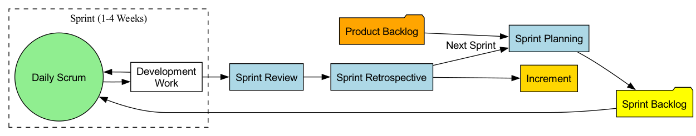

# スクラム

アジャイル開発の広大な世界において、アジャイルが変化を受け入れるための「価値観」であるとすれば、**スクラム**はそれらの価値観を実践するための、もっとも人気があり、広く適用されている**軽量フレームワーク**です。スクラムは詳細なプロセスやメソッドではなく、複雑な製品を開発する際にチームが効率的に協働し、継続的に価値を提供するためのゲームの**「ルールブック」**です。スクラムは、一連の明確な**役割、イベント、アーティファクト**を定義することによって、チームにシンプルかつ明確で強力な反復的な作業リズムを提供します。

スクラムという名前は、ラグビーにおける「スクラム」というプレーに由来し、チーム全体が結束したユニットとして共通の目標に向かって前進することを強調しています。複雑な問題に直面する際、最初からすべての答えを持っていることはできないことを認識しています。したがって、スクラムの核となる考えは、大きな不確実な問題を短期間の固定時間の反復（つまり**「スプリント」**）を通じて、一連の小さな管理可能な実験に分解することです。各スプリントの終わりに、チームは利用可能な製品の増分を提供し、振り返りと調整を行うことで、経験から学びながら変化の中で前進します。

## スクラムフレームワークの3本の柱

スクラム全体のフレームワークは、次の3つの経験主義の柱に基づいて構築されています：

1.  **透明性（Transparency）**: 結果に影響を与えるすべての重要な側面は、その結果に責任を持つすべての人に（顧客を含む）見える化されていなければなりません。これは、作業の進捗、障害、バックログなどがオープンで透明である必要があるということです。
2.  **検査（Inspection）**: スクラムのアーティファクトおよび目標達成に向けた進捗は、頻繁かつ丁寧に検査され、不都合な偏差や問題をタイムリーに検出する必要があります。
3.  **適応（Adaptation）**: 検査の結果、現在の作業が許容範囲から逸脱しており、得られる製品が受け入れがたいものになると判断された場合、プロセスまたは処理中の素材をできるだけ早く調整する必要があります。

## スクラムの「3-5-3」構造

スクラムの「ゲームのルール」は、3つの役割、5つのイベント、3つのアーティファクトという「**3-5-3**」の構造として簡潔にまとめられます。

### 3つの役割

*   **プロダクトオーナー（Product Owner）**: 製品の「価値」に唯一責任を持つ人。主な役割は**プロダクトバックログ**を管理・最適化し、開発チームが常に顧客とビジネスにとって最も高い価値を生み出す作業に取り組むようにすることです。彼らは「何をするか」を決定します。
*   **スクラムマスター（Scrum Master）**: スクラムフレームワークにおける「奉仕するリーダー」および「コーチ」です。チームを管理するのではなく、チームを支援し、障害を取り除き、イベントを促進し、チームがスクラムのルールと価値観を正しく理解し、遵守するように保証する責任があります。
*   **開発者（Developers）**: 多機能で自己組織化された専門チームであり、各スプリント内でバックログの項目を高品質で提供可能な製品の増分へと変換する責任を共有します。彼らは「どのようにやるか」を決定します。

### 5つのイベント

*   **スプリント（Sprint）**: スクラムの中心となる部分で、固定された期間（通常1〜4週間）があります。スプリント中、チームは価値ある「スプリントゴール」の達成に集中します。
*   **スプリントプランニング（Sprint Planning）**: 各スプリントのはじめに開催されます。プロダクトオーナーがプロダクトバックログの中で最も優先度が高い項目を開発チームに説明します。チームは共同で、スプリント中に完了できる作業を選定し、コミットし、初期の実行計画を作成して**スプリントバックログ**を形成します。
*   **デイリースクラム（Daily Scrum）**: 毎日開催される15分を超えない同期ミーティングです。開発チームの各メンバーが順番に次の3つの質問に答えます。「昨日何をしたか」「今日何をするか」「遭遇した障害は何か」。目的は進捗の迅速な同期と障害の特定であり、管理層への報告ではありません。
*   **スプリントレビュー（Sprint Review）**: スプリント終了時に開催されます。開発チームがプロダクトオーナー、顧客、その他の関係者に対して完成した動作する**インクリメント**を**デモ**し、フィードバックを収集します。これは「製品」に関するカジュアルなミーティングです。
*   **スプリントレトロスペクティブ（Sprint Retrospective）**: スプリントレビューの後に開催され、次のスプリントが始まる前に実施されます。スクラムチーム（PO、SM、開発者）が直前に終了したスプリントにおける**人、関係性、プロセス、ツール**の面で何がうまくいったか、何が改善できるかを**振り返り**、次スプリントに向けて具体的な改善計画を作成します。

### 3つのアーティファクト

*   **プロダクトバックログ（Product Backlog）**: すべての既知の製品要件、機能、修正、改善を含む動的で優先順位付けられた包括的な**リスト**です。これはプロダクトオーナーによってのみ管理されます。
*   **スプリントバックログ（Sprint Backlog）**: 開発チームが現在のスプリントで完了することにコミットしたタスクのリストと、「スプリントゴール」を達成するための計画です。これは開発チームによってのみ所有され、管理されます。
*   **インクリメント（Increment）**: 各スプリント終了時に完成したプロダクトバックログ項目の総和です。これは**利用可能で、「完了の定義（Definition of Done）」に合致していなければなりません**。これはチームの作業成果の直接的な現れです。

## 適用事例

**事例1：オンラインフードオーダーアプリの開発**

*   **プロダクトバックログ**: 「ユーザー登録」、「メニュー閲覧」、「オンライン決済」、「注文追跡」など数百のユーザーストーリーを含みます。
*   **スプリント1（2週間）**:
    *   **スプリントゴール**: 「ユーザーが正常に登録およびログインできるようになること」
    *   **スプリントバックログ**: チームは登録とログインに関連する5つのユーザーストーリーを選定しました。
    *   **デイリースクラム**: チームは毎日進捗を同期し、「SMS認証コードインターフェースの不安定さ」が障害であることを発見しました。スクラムマスターが直ちに調整して解決しました。
    *   **スプリントレビュー**: チームは動作する完全な登録およびログインプロセスをデモしました。
    *   **スプリントレトロスペクティブ**: チームはタスク見積もりが楽観的すぎたと振り返り、次スプリントではより慎重な見積もり方法を採用することを決定しました。

**事例2：マーケティングチームによる製品発表イベントの企画**

*   スクラムはソフトウェア開発に限らず適用可能です。
*   **プロダクトオーナー**: マーケティングディレクター。
*   **プロダクトバックログ**: 「発表イベントのテーマ決定」、「メインビジュアルのデザイン」、「メディアおよびKOLの招待」、「プレスリリースの作成」、「会場予約」などすべての作業項目を含みます。
*   **スプリント1（1週間）**:
    *   **スプリントゴール**: 「発表イベントのコアテーマと初期メインビジュアルデザインの確定」
    *   チームは1週間のスプリントを通じて迅速に成果を出し、レビュー会議で上層部にデモしてタイムリーなフィードバックを受け取り、間違った方向に多くのデザインリソースを投入するのを回避しました。

**事例3：学生グループによる学期プロジェクトの遂行**

*   **プロダクトオーナー**: 1人の学生がPOとして、教授との連携およびプロジェクト要件の明確化を担当。
*   **プロダクトバックログ**: 「文献レビュー」、「データ収集」、「データ分析」、「レポート作成」、「PPT作成」などのプロジェクト全体を構成する要素。
*   **スプリント**: 残りの8週間を4つの2週間スプリントに分割。各スプリントには明確な目標があり、例えば最初のスプリントの目標は「文献レビューおよび研究デザインの完了」でした。このアプローチにより、学期末の追い込みを効果的に回避しました。

## スクラムの利点と課題

**主な利点**

*   **生産性とスピードの向上**: 短周期の反復と集中により、チームはより早く価値を提供できます。
*   **柔軟性と適応性の向上**: 要件の変化に冷静に対応し、フィードバックに基づいて方向を適切に調整できます。
*   **透明性とコミュニケーションの向上**: 明確な役割、イベント、アーティファクトはチーム内外のコミュニケーションと情報同期を大幅に促進します。
*   **チームの自律性向上と士気の高まり**: 自己組織化された開発チームはより高い自律性と所有感を持ちます。

**潜在的な課題**

*   **「理解は容易だが習得は困難」**: スクラムのルールはシンプルですが、その背後にあるアジャイル精神を真に理解し、特定の組織文化の中で成功裏に実践することは非常に困難です。
*   **プロダクトオーナーへの極めて高い要求**: プロダクトオーナーはビジネス、市場、顧客を深く理解し、優れたコミュニケーション能力と意思決定能力を備えていなければなりません。
*   **「スコープクリープ（要求の膨張）」の可能性**: プロダクトオーナーがバックログや関係者の期待を適切に管理しなければ、スプリントゴールが頻繁に変更される可能性があります。
*   **チームの成熟度の要求**: 自己組織化されたチームでは、メンバーが高い責任感、協調性、多機能スキルを備えている必要があります。

## 拡張と関連

*   **アジャイル開発**: スクラムはアジャイルの価値観と原則を実現するための具体的で主流な**フレームワーク**です。
*   **カンバン**: もう一つの人気のあるアジャイル手法。スクラムが「時間枠（スプリント）」に基づくリズムを持つ一方で、カンバンは「継続的なフロー」に重点を置きます。実際には多くのチームが両者を組み合わせています。たとえば、スクラムのスプリント内でカンバンを使用してタスクの流れを可視化・管理する「スクラムバン」といった形で活用されます。
*   **エクストリームプログラミング（XP）**: スクラムは「管理フレームワーク」を提供し、XPは優れた「エンジニアリング実践」を提供します。XPの実践（テスト駆動開発、ペアプログラミングなど）をスクラムフレームワークに統合することで、製品の増分の技術的品質を大幅に向上させることができます。

---
*参考：スクラムフレームワークは1990年代初頭にJeff SutherlandとKen Schwaberによって共同で提案されました。彼らの共著『The Scrum Guide』はスクラムフレームワークの唯一の公式定義であり、実践の進化を反映して定期的に更新されています。*