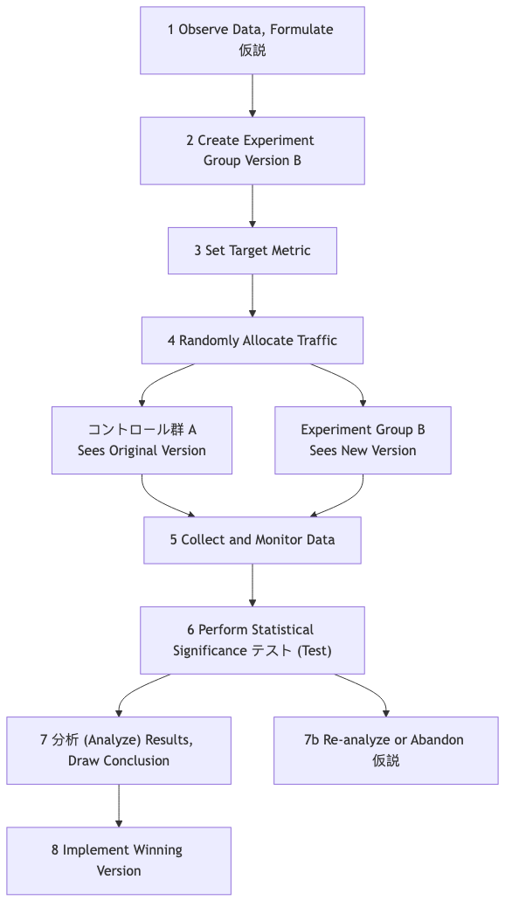

# A/Bテスト

プロダクト設計やマーケティングにおいて、私たちはしばしば主観的な選択を迫られます。「赤いボタンと緑のボタン、どちらが魅力的か？」「『今すぐ購入』と『カートに入れる』、どちらのコピーがコンバージョン率が高いか？」などです。直感や会議室での無限に続く議論に頼る代わりに、実際のユーザーのデータを使って答えを教えてもらうのが最善です。**A/Bテスト**（**分割テスト**とも呼ばれる）は、厳密で強力な、データ駆動型の**オンライン制御実験手法**です。その核となる考え方は、ユーザーのトラフィックをランダムに2つ以上のグループに分割し、それぞれに同じページの異なるバージョン（バージョンAとバージョンB）を表示して、どちらのバージョンがクリック率やコンバージョン率などの特定の目標達成においてより優れているかを比較・判断することです。

A/Bテストの本質は、プロダクトやマーケティングの意思決定に科学実験のロジックを適用することです。**ランダム性**という重要な要素を導入することで、ユーザーの属性やアクセス時間などの他の潜在的な混同因子を排除し、観測された効果の違いが私たちが行った単一の変更によるものであると高い信頼性を持って帰因できるようにします。「このデザインの方が良いと思う」といった主観的な仮定を、「データではバージョンBはバージョンAよりコンバージョン率が15%高く、統計的に有意である」といった客観的な結論に変えることができるので、A/Bテストは現代のデータ駆動型成長文化において不可欠なコアツールとなっています。

## A/Bテストの主要構成要素

標準的なA/Bテストには以下の主要な要素があります：

*   **仮説**：テストを始める前に明確で検証可能な仮説が必要です。例えば、「登録ボタンの色を青からオレンジに変えることで（変更）、オレンジの方がページ上で目立つため（理由）、新規ユーザーの登録コンバージョン率が向上すると予想する（期待される結果）」といったものです。
*   **コントロールグループ（バージョンA）**：現在オンラインで稼働しているオリジナルのバージョンで、変更は加えられていません。すべての比較のベースラインとなります。
*   **バリアントグループ（バージョンB）**：1つの変更を施した新しいバージョンで、より良い結果が得られることを期待しています。
*   **単一変数の原則**：標準的なA/Bテストでは1つの変数のみをテストする必要があります。ボタンの色とコピーを同時に変更した場合、バージョンBが勝ったとしても、どちらの変更が決定打となったのか判別できません。
*   **ランダムなトラフィック配分**：ユーザーのトラフィックはバージョンAとバージョンBにランダムかつ均等に配分される必要があります。これは、偏りのない信頼性のあるテスト結果を保証するための科学的前提です。
*   **ターゲット指標**：テストの成功を測定するための明確で定量的な指標が必要です。この指標は仮説と直接的に関連している必要があります。例えば、「クリック率」、「コンバージョン率」、「ページ滞在時間の平均」などがあります。

### A/Bテストのワークフロー

## A/Bテストの実施方法

1.  **ステップ1：リサーチと仮説の立案**
    データ分析（例：ユーザー行動ヒートマップ）、ユーザーのフィードバック、またはヒューリスティック評価に基づき、現行のプロダクトやプロセスに問題がある可能性のある箇所を特定し、具体的で検証可能な改善の仮説を提案します。

2.  **ステップ2：バージョンの作成**
    仮説に基づき、実験グループ（バージョンB）を設計・開発します。バージョンBとバージョンAの違いが、テストしたい変数のみであることを保証してください。

3.  **ステップ3：目標とサンプルサイズの決定**
    *   成功を測定するために使用する主要な指標を明確に定義します。
    *   テストを始める前に、**サンプルサイズ計算機**を使用して、結果に十分な**統計的検出力**があるために必要な参加ユーザー数を推定する必要があります。サンプルサイズが小さすぎると、実際に存在する差を検出できない可能性があります。

4.  **ステップ4：テストの実装**
    専門のA/Bテストツール（例：Google Optimize、Optimizelyなど）を使用してテストを設定します。トラフィック配分比率（通常は50/50）を設定し、テストを開始します。

5.  **ステップ5：結果の監視と分析**
    事前に設定されたサンプルサイズまたは統計的有意性のレベルに達するまでテストを実行し続けます。その後、テスト結果を分析します。以下の2つの主要な統計概念に注意する必要があります：
    *   **コンバージョン率の差**：バージョンBがバージョンAに対してどの程度改善されたかのパーセンテージ。
    *   **統計的有意性**：通常は**P値**で表されます。P値とは、「観測された差が偶然によるものである可能性」を示します。通常、P値が0.05未満（つまり95%の信頼水準）の場合、結果は統計的に有意で信頼できるとみなされます。

6.  **ステップ6：結論の導出と行動**
    *   バージョンBが有意に勝った場合、おめでとうございます。あなたの仮説は検証されました。次に、バージョンBをすべてのユーザーに全面展開します。
    *   バージョンAが勝った場合、あるいは両者に有意な差がない場合でも、それは貴重な学びになります。これはあなたの初期の仮説が誤っていたことを示しており、再分析して次のテストラウンドのための新しい仮説を提案する必要があります。

## 実際の適用事例

**事例1：オバマ大統領選挙チームの寄付ページ最適化**

*   **シナリオ**：2008年の米国大統領選挙において、オバマ陣営は公式サイトの寄付ページを最適化し、登録および寄付のコンバージョン率を向上させたいと考えました。
*   **A/Bテストの適用**：ヒーロー画像とボタンのコピーについて広範なA/Bテスト（厳密には多変量テスト）を実施しました。有名なテストの1つでは、ヒーロー画像をオバマ1人の写真から家族写真に変更し、ボタンのコピーを「登録する」から「詳しく見る」に変更したところ、ページの登録コンバージョン率が驚くべき**40.6%**向上しました。このテストにより、選挙チームは数千万ドルの追加寄付を獲得しました。

**事例2：Booking.comの継続的テスト文化**

*   **シナリオ**：世界最大のオンラインホテル予約プラットフォームであるBooking.comは、極端なA/Bテスト文化で知られています。
*   **適用**：報道によると、Booking.comのウェブサイトでは常に数千のA/Bテストが同時に実施されています。検索結果の並び替え方法からホテル画像のサイズ、「残りわずか！」というコピーに至るまで、あらゆる変更は厳格なA/Bテストを経る必要があります。この極端なデータ駆動型意思決定への追求により、ユーザー体験を継続的かつ段階的に最適化し、強力な競争優位を築いています。

**事例3：ニュースウェブサイトのペイウォールテスト**

*   **シナリオ**：あるニュースウェブサイトは有料サブスクリプションモデルを試したいと考えましたが、どのペイウォール戦略がユーザーの課金コンバージョンとリテンションに最も効果的か判断に迷いました。
*   **A/Bテストの適用**：
    *   **バージョンA（メータード）**：すべてのユーザーが毎月5記事まで無料で読め、それを超えると課金を促されます。
    *   **バージョンB（フリーミアム）**：一部の記事は無料ですが、「プレミアムコンテンツ」（例：詳細なルポや独占コラム）は有料サブスクリプションで読む必要があります。
    *   数か月にわたる長期テストを通じて、両モデルの課金コンバージョン率、ユーザーの離脱率、総サブスクリプション収益を比較し、自社に最も適したビジネスモデルを選択できます。

## A/Bテストの利点と課題

**主な利点**

*   **客観的かつデータ駆動的**：主観的な推測や議論に代わる、実際のユーザー行動データを使用して意思決定に最強の根拠を提供します。
*   **低リスクなイノベーション**：完全展開する前に、ごく一部のトラフィックを使って変更の効果をテストできるため、誤った意思決定による悪影響のリスクを大幅に軽減します。
*   **継続的最適化のエンジン**：製品やマーケティングを継続的かつ反復的に科学的・厳密に最適化するためのフレームワークを提供します。

**潜在的な課題**

*   **十分なトラフィックが必要**：トラフィックが少ないウェブサイトやアプリでは、統計的に有意な結果を得るまでに非常に長い時間がかかったり、不可能になることもあります。
*   **単一変数の制約**：複数の変更が組み合わさることで予期せぬ相乗効果が生まれる場合がありますが、標準的なA/Bテストではそれを発見できません（より複雑な多変量テストが必要です）。
*   **「局所最適解」の罠**：既存のページで小さなA/Bテストを繰り返すことで、「局所最適解」に陥り、画期的なデザイン変更の機会を見逃す可能性があります。
*   **長期的な影響を無視する傾向**：A/Bテストは通常、短期的な効果（例：クリック率）を測定します。ある変更が短期的には指標を改善しても、長期的にはユーザーの信頼やブランドイメージを損なう可能性があります。

## 拡張と関連手法

*   **多変量テスト（MVT）**：A/Bテストの拡張です。ページ上の複数の要素の**複数**の組み合わせを同時にテストしたい場合（例：3種類の見出し、2種類の画像、2種類のボタン色をテストする場合）、MVTを使用できます。どの要素の組み合わせが最も効果的か、そして各要素が最終結果にどの程度寄与したかを教えてくれます。
*   **ユーザビリティテスト**：定性的なリサーチ手法です。「どちらのバージョンが優れているか」は分かりませんが、「なぜ」ユーザーが特定のバージョンで困難に直面したかを理解するのに役立ちます。通常、A/Bテストの前にユーザビリティテストを実施し、「何をテストすべきか」のインスピレーションを得ることがあります。

---
*出典：A/Bテストの概念は古典的な統計的実験設計に基づいています。インターネット分野では、GoogleやAmazonなどのテック大手がウェブサイトやプロダクトの最適化に初めて広く適用し、デジタルマーケティングやグロースハックのコアスキルとして定着していきました。*