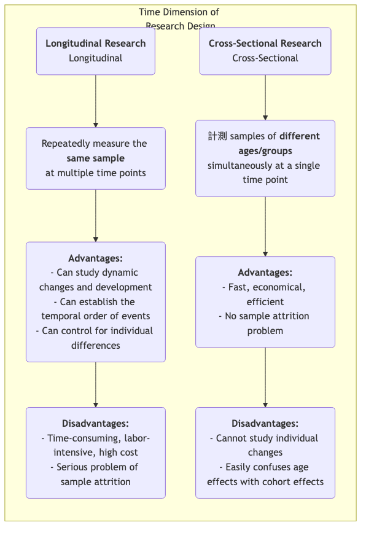

# 縦断的研究

人間の発達、社会変化、病気の進化という長い時間的流れを探るにあたり、「時間」という重要な次元を捉えることができる研究手法が必要です。**縦断的研究**（Longitudinal Research）はまさにそのような「カメラ」であり、長期間にわたり**同一サンプル**を繰り返し継続的に観察・測定します。その中心的な目的は、現象が時間とともにどのように**変化し、発展し、進化するか**を明らかにし、初期の出来事が後続の結果に与える長期的な影響を探ることです。

横断的研究（cross-sectional study）のように単一の時間点での「スナップショット」しか提供しないのとは異なり、縦断的研究は私たちに「ドキュメンタリー」を提供します。これにより、個人の成長軌跡、概念の変化過程、病気の発症から完全な発展に至る全過程を観察することが可能になります。このことは、因果関係を探る際にイベントの時間的順序を明確に確立するのに役立ちます。プロセスや発達に関する動的な質問、例えば「幼少期の読書習慣は成人後の収入水準にどのように影響するのか？」や「ある政策改革が次の10年間にわたって持続的にどのような影響を与えたのか？」といった問いに答えるには、縦断的研究は不可欠かつ強力なツールとなります。

## 縦断的研究の主な特徴と種類

すべての縦断的研究に共通するのは「時間」を追跡するという点ですが、追跡対象の性質によって主に以下の3つのタイプに分類されます：

*   **コホート研究**（Cohort Study）: 最も一般的なタイプです。共通の特性や経験を持つ特定の集団（「コホート」）（例：「2000年に生まれたすべての乳児」や「2010年に特定の企業に採用された従業員」など）を選定し、数十年にわたって継続的に追跡します。
*   **パネル研究**（Panel Study）: コホート研究と似ていますが、**同一の個人**サンプルを追跡します。各調査で同じ人々を訪ねるため、研究者は各個人の変化の軌跡を正確に分析できます。
*   **トレンド研究**（Trend Study）: このタイプの研究は、時間とともに「母集団」の特性の変化に焦点を当てますが、各調査で抽出される個々のサンプルは異なります。例えば、環境問題に関する世論の変化を研究する際、研究機関が5年ごとに全国からランダムに新しいサンプルを抽出して調査するといった方法が考えられます。

### 縦断的研究と横断的研究の比較

## 縦断的研究の実施方法

1.  **長期的な研究目的の設定**
    何の変化や発展を追跡したいのか、またどのような潜在的な影響要因に関心があるのかを明確に定義してください。縦断的研究は長期的な投資であり、明確かつ重要な研究目的によって支えられる必要があります。

2.  **コホートまたはパネルサンプルの定義と選定**
    対象となる母集団を正確に定義し、適切なサンプリング手法を用いて初期サンプルを選定します。初期サンプルの質と代表性は極めて重要です。

3.  **ベースライン調査の実施**
    研究の開始時点で、関心のあるすべての変数の初期状態を測定する最初の包括的なデータ収集（ベースライン調査）を行います。

4.  **その後のフォローアップ調査の設計と実施**
    後続のフォローアップ調査の時間間隔（例：毎年、5年ごとなど）を決定し、一貫した測定ツールを設計します。サンプルとの連絡を維持し、脱落率を減らすことは、長期にわたる研究期間において最大の課題の一つです。

5.  **データ管理と分析**
    縦断的データ構造は複雑であり、専門のデータベースによる管理が必要です。分析においては、成長曲線モデルや生存分析などの高度な統計モデルを用いて、変数の時間的変化の軌跡とその影響要因を分析します。

## 代表的な応用事例

**事例1：ハーバード成人発達研究**

*   **概要**: 歴史上最も長期にわたる縦断的研究の一つで、1938年に開始され、約80年にわたって724人の男性を追跡しました。
*   **応用**: 研究者は定期的にアンケート、インタビュー、医療記録などを通じて、対象者の仕事、家庭、健康などに関するデータを収集しました。この研究で最も有名な結論は、富、名声、遺伝子よりも、良好で温かい人間関係こそが長期的な幸福と健康を予測する最も重要な要因である、というものです。この結論は生涯にわたる追跡によってのみ導き出せたものです。

**事例2：英国ミレニアム・コホート研究**

*   **概要**: 2000年から2002年にかけて英国で生まれた約19,000人の子どもたちを追跡する国家的な出生コホート研究です。
*   **応用**: この研究は複数の年齢（例：9か月、3歳、5歳、7歳、11歳、14歳、17歳）で包括的なデータ収集を行い、健康、認知、行動、家庭環境などあらゆる側面を網羅しています。この研究は政府が児童および家族政策を立案するための膨大で極めて貴重な証拠を提供しました。例えば、貧困が幼児期の発達に与える長期的な悪影響を明らかにしました。

**事例3：製品ユーザーの離脱に関するコホート分析**

*   **概要**: SaaS（ソフトウェア・アズ・ア・サービス）企業が新規ユーザーの維持率を理解したいと考えました。
*   **応用**: 企業は**コホート分析**の手法を採用しました。「毎月登録された新規ユーザー」をコホート（例：「1月コホート」、「2月コホート」）として扱い、それぞれのコホートが登録後1か月目、2か月目、3か月目…での維持率を追跡しました。異なるコホートの維持曲線を比較することで、製品の改善やマーケティング活動が新規ユーザーの長期的な維持にどのような影響を持ったかを評価できます。

## 縦断的研究の利点と課題

**主な利点**

*   **動的プロセスの研究が可能**: 「発達」と「変化」それ自体を研究するのに最も効果的な方法です。
*   **時間的順序の確立**: イベントの時間的順序を明確に確立でき、因果関係を推論するための重要な前提条件となります（ただし、交絡変数には注意が必要です）。
*   **個人差の統制**: 同じ個人を追跡するため、IQや性格など時間とともに変化しない個人固有の差異を結果への干渉要因から除外できます。

**潜在的な課題**

*   **高コスト**: 長期的な資金的支援、安定した研究チーム、そして膨大な管理コストが必要です。
*   **時間のかかりやすさ**: 研究成果の出力サイクルが非常に長く、数年から数十年に及ぶ可能性があります。
*   **サンプルの脱落**: これは縦断的研究における最大の「天敵」です。時間の経過とともに、一部の参加者が引っ越しなどにより連絡が取れなくなったり、関心を失ったり、死亡したりして研究から脱落する可能性があり、最終的なサンプルに偏りが生じる原因となります。
*   **反復測定の影響**: 同じテストやアンケートを繰り返し受けることで参加者の行動や回答に影響を与える可能性があり、これは「練習効果」として知られています。

## 拡張と関連トピック

*   **横断的研究**（Cross-Sectional Research）: 縦断的研究の代わりに低コストで迅速な代替手段としてよく用いられますが、年齢効果とコホート効果を区別できないという限界があることを認識しておく必要があります。
*   **生存分析**（Survival Analysis）: 縦断的研究で一般的に用いられる統計的手法で、イベント（例：回復、離脱、死亡）が発生するまでの期間とその影響要因を分析するために特化されています。

---
*参考: 縦断的研究の設計概念は疫学および社会科学の分野で長い歴史を持っています。グレン・H・エルダー・ジュニアのライフコース理論（Life Course Theory）は、現代の縦断的研究にとって重要な理論的枠組みを提供しています。*