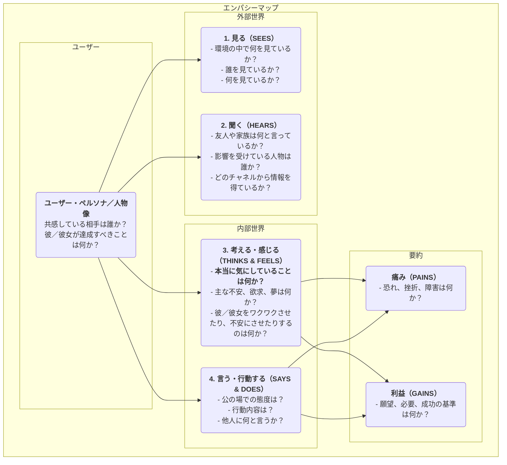

# エンパシーマップ

プロダクトデザインやユーザー調査において、「共感（エンパシー）」は頻繁に語られるコアな品質ですが、実際に達成するのは極めて困難です。では、どうすればユーザーの立場に本当に立って、その世界を体験できるのでしょうか？**エンパシーマップ**は、この目的のために設計されたシンプルで直感的、しかし非常に強力な**協働型共感ツール**です。このツールは、チームがユーザーの行動の表面を越えて、そのより深い世界である**感覚、思考、感情**に踏み入れることを支援し、ユーザーに対する包括的で多面的な理解を形成することを目的としています。

エンパシーマップの核は、ユーザーに関する散在的で定性的な観察やインタビュー資料を体系的に整理し、視覚的なフレームワークに集約することにあります。このフレームワークは一般的に4つの主要な象限に分かれており、**「見る（Sees）」「聞く（Hears）」「考える・感じる（Thinks & Feels）」「言う・行動する（Says & Does）**です。このマップを共同で埋めることで、チームメンバーはユーザーの視点に立つことを強いられ、ユーザーの内面と外的環境についての共通理解を構築します。これはユーザーの現状を明確に映し出す鏡であり、チーム全体の共感能力を育てる触媒でもあります。

## エンパシーマップの構成要素

エンパシーマップはユーザー中心であり、外的経験と内的経験の4つのコア象限を中心に展開されます。

<!--

*   **見る（Sees）**: ユーザーが環境で目にしていることを記述します。例えば、周囲の人は何をしているのか？毎日どんな市場情報を目にしているのか？
*   **聞く（Hears）**: ユーザーが外部から聞く情報について記述します。友人、家族、同僚は何と言っているか？どの意見リーダーやメディアチャネルが影響を与えているか？
*   **考える・感じる（Thinks & Feels）**: マップの核となる部分で、ユーザーの内面を探ります。本当に大切にしていること（口には出さないかもしれない）は何か？どんな不安、心配、希望、夢を持っているか？
*   **言う・行動する（Says & Does）**: ユーザーが公に話すことや行動を記述します。インタビューで何と言ったか？製品使用時の実際の行動は？ここでは「言うこと」と「考えること」の間に潜在的な矛盾に特に注意する必要があります。
*   **痛み（Pains）** と **利益（Gains）**: 上記4つの象限を分析した後、ユーザーの内面的な葛藤や願望を要約します。Painsは直面している障害やネガティブな感情を表し、Gainsは本当に達成したい目標や願望を表します。

## エンパシーマップの使い方

エンパシーマップは、チームでのワークショップ形式で使用するのが最適です。

1.  **ステップ1：スコープと目標の定義**
    *   **ユーザーの選定**: このエンパシーマップが対象とする特定のユーザー・ペルソナまたは人物像を明確に定義してください。名前と基本的な背景を与えると効果的です。
    *   **目標の明確化**: この活動を通じて達成したい目標を定義してください。既存ユーザーの理解を深めるためか、新製品の潜在ユーザーを探るためか？

2.  **ステップ2：リサーチ資料の収集**
    エンパシーマップはフィクションではなく、実際のリサーチに基づく必要があります。関連するユーザー調査資料を準備してください。例えば、インタビュー録音とその文字起こし、ユーザビリティテストの動画、アンケートの自由記述回答、ユーザーの写真などです。

3.  **ステップ3：マップを共同で埋める**
    *   白板に大きなエンパシーマップのテンプレートを描くか、オンラインの協働ツールを使用してください。
    *   チームメンバーがリサーチ資料から得た知見をポストイットに1つずつ書き出し、対応する象限に貼り付けていきます。例えば、インタビュー録音を聴いているとき、あるメンバーが「ユーザーは毎週残業していると言っていた（Says）」と書き、別のメンバーが「彼は疲れているように感じられ、仕事への情熱を失っているように思える（Feels）」と書くといった具合です。
    *   チームメンバーがポストイットの内容を読み上げ、なぜその象限に貼ったのか説明するように促してください。

4.  **ステップ4：深掘りと統合**
    全ての情報がボードに集まったら、チームでさらに深い議論を促します。
    *   「どのような矛盾が見受けられるか？例えば、ユーザーの言葉と行動が一致していないか？」
    *   「これらの詳細の背後で、彼／彼女が本当に気にしているが口にしていないことは何か？」
    *   「予想外のことを何か学んだか？」
    *   最後に、ユーザーの最もコアな**痛み（Pains）** と **利益（Gains）** を全員で要約してください。

5.  **ステップ5：共有と活用**
    完成したエンパシーマップを整理・共有し、その後のデザインや意思決定の重要なインプットとして活用してください。

## 実践事例

**事例1：高齢者向けスマートフォンの設計**

*   **ユーザー**: 王おじいさん、70歳、子どもからスマートフォンをもらったばかり。
*   **見る（Sees）**: スマホ画面のアイコンが小さくて多く、見づらい；若者はみんなモバイル決済やチャットを使っている。
*   **聞く（Hears）**: 子どもたちが「すごく簡単だから、すぐ覚えられるよ」と言う；友達が「あの機械は難しすぎて、覚えられない」と言う。
*   **考える・感じる（Thinks & Feels）**: 非常に**不安**を感じ、技術に取り残されるのが**恐い**；でも**孫とビデオ通話をしたい**という願望がある。
*   **言う・行動する（Says & Does）**: 「いらない」と言うが、こっそり何度も画面のロックを解除しようとする。
*   **痛み（Pains）**: 間違えて損失を生じることへの恐れ；技術に置き去にされた感じ。
*   **利益（Gains）**: 家族との**より近い連絡**を維持したい；**日常的なタスク**（例：バスのルート確認）を自分で完結したい。
*   **デザインインスピレーション**: このスマホのコア設計理念は「機能の多さ」ではなく「ストレスフリー」であるべき。**超大文字モード**、**家族リモートサポート機能**などを提供する必要がある。

**事例2：大学生向け求人アプリの設計**

*   **ユーザー**: 李雪（リ・シュエ）、22歳、大学4年生。
*   **見る（Sees）**: 求人サイトの情報がごちゃごちゃしていて、真実と虚偽の区別がつきにくい；周囲のクラスメートは複数の内定をもらしている。
*   **聞く（Hears）**: 先輩が「第一志望の仕事はとても重要だ」と言う；親が「安定した仕事を見つけるのが一番大切だ」と言う。
*   **考える・感じる（Thinks & Feels）**: 未来に対して非常に**混乱と不安**を感じる；自分に合った仕事が分からない；**面接で失敗するのが恐い**。
*   **言う・行動する（Says & Does）**: 数百通の履歴書を送った；何度も履歴書を修正した。
*   **痛み（Pains）**: 就職活動の方向性の欠如；情報の非対称性；自信の欠如。
*   **利益（Gains）**: **本当に興味がある仕事**を見つけたい；**プロのアドバイスや指導**を受けたい。
*   **デザインインスピレーション**: アプリのコア機能は単なる求人掲載ではなく、「**キャリア性格診断**」、「**業界メンターのオンライン相談**」、「**模擬面接練習**」などのモジュールを追加するべき。

**事例3：コンテンツクリエイター向け執筆ツールの設計**

*   **ユーザー**: 張偉（チャン・ウェイ）、フリーブロガー。
*   **見る（Sees）**: 他のブロガーは毎日高品質な記事を更新している；自分の記事の閲覧数は停滞している。
*   **聞く（Hears）**: 読者が「よく書けています、更新を楽しみにしています」とコメントする；友人が「ブロガーは儲からない」と言う。
*   **考える・感じる（Thinks & Feels）**: **インスピレーションが枯れる**ことに非常に**痛み**を感じる；**読者の共感と反響**を求める；理想と現実の収入の間で**葛藤**する。
*   **言う・行動する（Says & Does）**: 多くの時間を資料収集とコンテンツ構成に費やす；よく夜遅くまで執筆する。
*   **痛み（Pains）**: 执筆プロセスが中断され、効率が低い；継続的な創作へのモチベーションの欠如。
*   **利益（Gains）**: **アイデアを整理し、インスピレーションを刺激する**ツールが欲しい；**読者との深いつながり**を築きたい。
*   **デザインインスピレーション**: 基本的な編集機能に加えて、**インスピレーションカード集**、「**マインドマップモード**」、「**読者とのやり取りデータ分析**」などの特別機能を提供するべき。

## エンパシーマップの利点と課題

**コアな利点**

*   **迅速かつ効率的**: チームの共感能力を迅速に構築する効果的な方法（通常60分以内）。
*   **チーム協働を促進**: 協働性により部署間の壁を打ち破り、チーム全体でユーザーに対する統一された深い理解を促進。
*   **隠れたニーズの発見**: ユーザーの内面に焦点を当てることで、ユーザー自身が明確に表現していない潜在的なニーズや課題を発見するのを支援。

**潜在的な課題**

*   **ユーザー・ペルソナの代替ではない**: エンパシーマップは通常、特定のシナリオにおけるユーザーの状態に焦点を当てますが、ユーザー・ペルソナはより包括的で持続的な人物モデルを記述します。エンパシーマップはユーザー・ペルソナ作成のための優れたインプットですが、完全に置き換えることはできません。
*   **実データの支援が必要**: 他のユーザー調査ツールと同様に、実データがなければエンパシーマップはチームメンバーの主観的な仮定に基づく「フィクションの会議」になってしまう可能性があります。

## 拡張と関連性

*   **ユーザー・ペルソナ**: エンパシーマップは、血の通った感情豊かなユーザー・ペルソナを構築するための**キープリ条件ステップ**です。エンパシーマップの分析を通じて、「痛み（Pains）」、「目標（Goals）」などのユーザー・ペルソナのモジュールに非常に生き生きとした素材を提供できます。
*   **ユーザー・ジャーニーマップ**: ジャーニーマップの各段階でミニエンパシーマップを使用し、その段階でのユーザーの思考、感情、行動を深く分析することで、各ステップでの課題をより正確に特定できます。

---
*出典：エンパシーマップは、XPLANE（現デロイト所属）の創設者Dave Gray氏によって最初に提案され、デザイン思考やアジャイル開発の実践で広く活用されています。ユーザー中心設計プロセスにおける基本的かつコアな共感ツールです。*