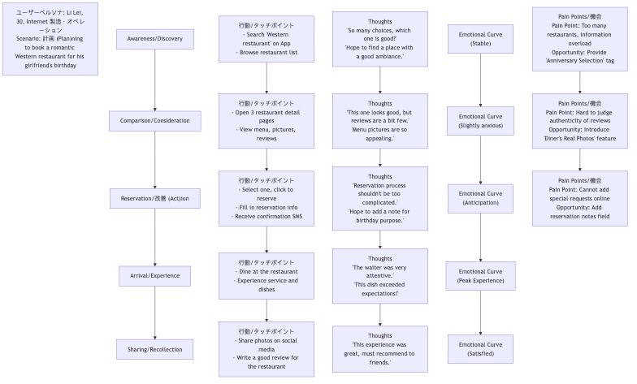

# ユーザージャーニーマップ

製品やサービスを設計する際、個々の機能やインターフェースに焦点を当てすぎて、ユーザーがそれらとどのように相互作用するかという**全体的なエンドツーエンドの体験**を見落としがちです。**ユーザージャーニーマップ**は、こうした「トンネルビジョン」を打破するために生まれた強力な可視化ツールです。これは、特定の**ユーザーのペルソナ**が特定の**目標**を達成するために、製品・サービス・ブランドとどのように相互作用するかという**全体プロセス**を、物語のように体系的に描画するものです。各段階でのユーザーの**行動ステップ**を記録するだけでなく、より重要なのは、そのプロセス全体を通じてユーザーが抱く**考え、感情、課題**を深く明らかにすることです。

ユーザージャーニーマップの本質的な価値は、私たちが提供するサービスを**ユーザーの視点**から検証し、体験することを強制されることにあります。このツールは、もともと断片的で見えなかった体験を、明確で直感的かつ共感性のある視覚マップへと変換します。このマップを通じて、チームは体験の「ハイライト」と「ローライト」を簡単に特定し、ユーザー離脱を引き起こす重要な障害点を発見し、ユーザー満足度とロイヤルティを高めるイノベーションの機会を把握できます。これは、製品とユーザーの真の感情世界をつなぐ架け橋です。

## ユーザージャーニーマップの主な構成要素

標準的なユーザージャーニーマップは、一般的に水平スイムレーン図のような形式を取り、以下の主要な構成要素を含みます：

1.  **ユーザーのペルソナ**: このジャーニーマップの主人公は誰ですか？マップの冒頭で、このマップが対象とするコアなユーザーのペルソナを明確に定義する必要があります。異なるユーザーは、大きく異なるジャーニーを持つ可能性があります。
2.  **シナリオとゴール**: このユーザーはどのような具体的なシナリオに置かれていますか？この旅を通じて達成したい目標は何ですか？例えば、「忙しいオフィスワーカー（ペルソナ）が、地下鉄通勤中にガールフレンドの誕生日を祝うためロマンチックな西洋レストランを予約したい（ゴール）」といった例があります。
3.  **ジャーニーのフェーズ／ステージ**: 全体のエンドツーエンドの旅を、いくつかの主要で論理的に連続するステージに分解します。例えば、ECショッピングの場合、ステージは以下のように分けられます：**認知 → 検討 → 購入 → 待機 → 受取 → 使用／アフターサービス**。
4.  **アクション／タッチポイント**: ユーザーは各ステージで具体的に何をしていますか？どのチャネルやタッチポイント（例：SNS、アプリ、カスタマーサポート電話、実店舗）を通じてあなたとやり取りしていますか？
5.  **考え**: ユーザーがそれらの行動をとっているとき、頭の中で何を考えていますか？どんな疑問、期待、内なる独り言を持っていますか？
6.  **感情／気持ち**: これがジャーニーマップの魂です。感情の変化を曲線で描き、各ステージでのユーザーの感情の起伏を示します——喜び、混乱、不安、イライラなど、どのような感情を抱いていますか？これにより、体験の中の「痛みのポイント（pain points）」と「喜びのポイント（delight points）」を迅速に特定できます。
7.  **課題と機会**: 上記の分析に基づき、各ステージでユーザーのネガティブな感情を引き起こす主な障害（課題）を明確に特定し、それに基づいて改善の機会をブレインストーミングします。

### ユーザージャーニーマップのテンプレート

## ユーザージャーニーマップの作成方法

1.  **ステップ1：目的と範囲の定義**
    まず、なぜこのジャーニーマップを作成するのかを明確にします。解決したい問題は何ですか？次に、このマップが描く**ユーザーのペルソナ**と**特定のシナリオ**を決定します。

2.  **ステップ2：ユーザー情報の収集**
    ジャーニーマップはチームの想像ではなく、実際のユーザー調査に基づく必要があります。データソースには、ユーザーインタビュー、ユーザビリティテスト、アンケート、カスタマーサポート記録、ウェブ解析データ、SNSのコメントなどが含まれます。

3.  **ステップ3：ワークショップの開催とジャーニーマップの共創**
    製品、デザイン、開発、マーケティング、カスタマーサポートなど、多機能なチームを集めてワークショップを開催します。収集したすべてのユーザーインサイト（付箋形式でも可）を持ち込み、チームで協働してジャーニーの各ステージ、および各ステージでのユーザーの行動、考え、感情を物語のように整理・定義します。

4.  **ステップ4：感情曲線の描画とキーモーメントの特定**
    チームでユーザーの感情曲線を共同で描き、ユーザー体験の成功・失敗を決定する**真実の瞬間（Moments of Truth）**を特定します。特に感情の最低点（課題）と最高点（喜び）に注目します。

5.  **ステップ5：機会の発見とアクションプランの策定**
    各キーパインポイントに対して、具体的で実現可能な改善の機会をブレインストーミングします。最終的に、それらの機会を優先順位付け、具体的なプロダクトバックログやアクションプランに変換します。

## 実践事例

**事例1：空港の旅客体験の改善**

*   **シナリオ**: 空港運営会社が全体的な旅客満足度を向上させたい。
*   **活用**: 「初めて国際線を利用する旅客」のジャーニーマップを作成。分析の結果、「セキュリティチェック」や「搭乗口の探索」の段階で旅客が一般的に不安や混乱を感じていることが判明。これに対し、空港はより明確な案内標識の設置、待ち時間を短縮するスマートセキュリティレーンの導入、アプリでの搭乗口ナビゲーション機能を追加することで、旅客体験を大幅に改善しました。

**事例2：オンラインコース修了率の最適化**

*   **シナリオ**: オンライン教育プラットフォームが、コース購入後に学習を途中でやめてしまうユーザーが多いと課題を抱える。
*   **活用**: 「プログラミングコースを学ぶ社会人学生」のジャーニーマップを作成。3週目頃に学生の感情が最も低下する原因が、コース難易度の上昇と仕事の忙しさによる学習リズムの乱れにあることを発見。この課題に対し、プラットフォームは「担任制のサポートサービス」、「学習グループ」、「3週目に励ましバッジをプッシュ通知」などの介入策を導入し、コース修了率を大幅に向上させました。

**事例3：銀行の口座開設プロセスの改善**

*   **シナリオ**: 伝統的な銀行がオンラインでの新規口座開設プロセスを最適化したい。
*   **活用**: ジャーニーマップにより、「本人確認書類のアップロード」や「長い利用規約の読了」の段階でユーザーが非常に不満と不信を感じており、多くのユーザーが離脱していることが判明。これに対し、銀行は規約内容を簡素化し、NFCを利用してIDカード情報を直接読み取る機能を開発。口座開設プロセス全体のスムーズさとコンバージョン率を大幅に改善しました。

## ユーザージャーニーマップの利点と課題

**主な利点**

*   **全体像の理解を促進**: チームが部署間の壁や機能の分断を乗り越え、ユーザー体験を包括的かつ一貫した視点で捉えることを助けます。
*   **共感を促すツール**: 特にエンジニアや管理者が、ユーザーの真の感情や課題を直感的に理解できるようになります。
*   **問題と機会の明確化**: 既存プロセス内の断絶や障害を明らかにし、イノベーションの焦点を明確に提供します。
*   **チームの協働と合意形成の促進**: ジャーニーマップを共創するプロセス自体が優れたチーム活動であり、関係者がユーザー理解を共有し、合意を形成する手段となります。

**潜在的な課題**

*   **代表性の問題**: 単一のジャーニーマップは通常、1人のユーザーのペルソナと1つのシナリオを表すため、より広範なユーザー層を網羅するには複数のマップが必要です。
*   **実際の調査に基づく必要性**: 実際の深掘りされたユーザー調査が基盤にない場合、ジャーニーマップは願望的な「幻想マップ」になってしまう可能性があります。
*   **継続的な更新の必要性**: 製品やサービスが進化するにつれ、ユーザーのジャーニーも変化するため、ジャーニーマップは「生きている文書」として定期的に更新される必要があります。

## 拡張と関連概念

*   **ユーザーのペルソナ**: ユーザージャーニーマップ作成の**前提条件**です。明確なユーザーのペルソナがなければ、ジャーニーマップは主人公を失います。
*   **サービスブループリント**: ユーザージャーニーマップの「裏側のビュー」と見なされます。ジャーニーマップがユーザーの表舞台の体験を描く一方で、サービスブループリントはさらに下層に進み、裏側のスタッフ、システム、プロセスがどのように動作・相互作用して、これらの表舞台の体験を支えているかを詳細に描きます。
*   **エンパシーマップ**: これは、単一のユーザーの内面世界を深く探るためのツールであり、ユーザーのペルソナやジャーニーマップ作成の初期段階で、資料収集や共感の訓練に使われることが多いです。

---
*参考：ユーザージャーニーマップは、ユーザー体験（UX）設計分野におけるコアツールであり、その概念と実践は進化し続けています。Adaptive Pathの共同創設者であるJesse James Garrett氏は、著書『The Elements of User Experience』で理論的基盤を築きました。Nielsen Norman Group（NN/g）などの権威ある組織も、ユーザージャーニーマップの作成と活用に関する豊富な実践ガイドや記事を提供しています。*