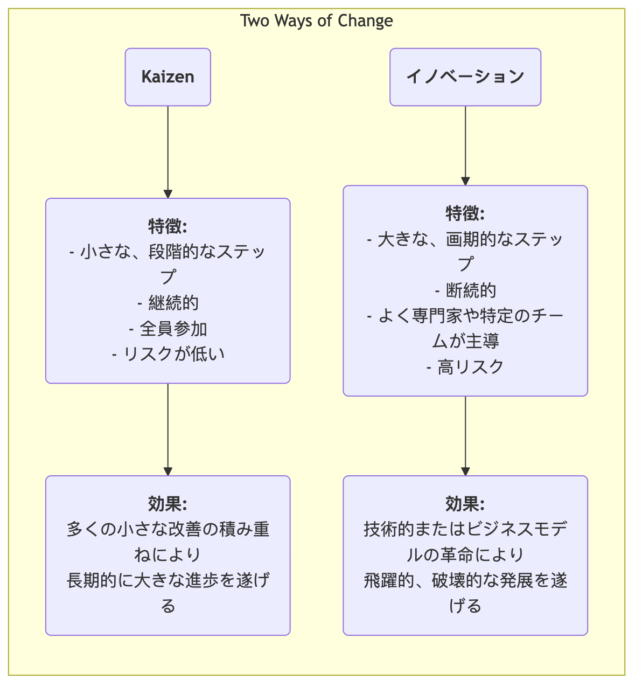

# カイゼン

多くの組織において、「改善」とは、多大な投資を必要とし、専門家が主導し、トップダウンで行われる大きな「プロジェクト」として捉えられることが多いです。しかし、真の、強力で持続可能な進歩は、すべての従業員が毎日行う、一見些細な**小さな継続的改善**から生まれると考える経営哲学があります。それが**カイゼン**です。カイゼンとは日本語で「改善」を意味し、完璧を目指す文化哲学であると同時に、全員参加を促し、ボトムアップの継続的改善を実現する実践的な手法でもあります。

カイゼンの中心的な考え方は、**一夜にして革命的なブレイクスルーを求めるのではなく、無限の積み重ねによる緩やかな最適化を追求する**ことにあります。現場の従業員こそが自分の職務における実情を最もよく理解する専門家であり、無限の知恵と創造性を持っていると信じています。問題解決を奨励し、小さなイノベーションを評価し、失敗を許容する文化を築くことで、組織はすべての人の力を結集し、止められない上昇気流を生み出すことができます。カイゼンは複雑な管理ツールではなく、シンプルで飾らない、しかし非常に効果的な仕事と思考の方法です。

## カイゼンの基本原則

*   **継続性**: カイゼンは一度きりの活動ではなく、終わりがなく積み重なるプロセスです。
*   **全員参加**: CEOから現場の清掃員まで、組織のすべての人が改善活動に参加することが奨励され、期待されています。
*   **低コスト、高知恵**: カイゼンは大規模な資本投資に依存せず、従業員の知恵と創造性を使い、低コストで問題を解決し、無駄を排除することを重視します。
*   **プロセス志向**: カイゼンの焦点は、個人を責めるのではなく、業務プロセスの最適化にあります。
*   **見える化**: 問題、基準、プロセスを「見える化」することで、異常が一目でわかるようにすることを重視します。
*   **現地現物（ゲンバへ行け）**: 管理者はオフィスで想像するのではなく、実際に職場（ゲンバ）へ赴き、現場の状況を観察し、従業員と話す必要があります。

### カイゼン vs イノベーション

<!-- mermaid 源文件：Kaizen-Tutorial-ja-mermaid-live-1.mmd -->

*   **関係性**: カイゼンとイノベーションは排他的なものではなく、むしろ優れた組織が同時に備えるべき2つの能力です。カイゼンは既存のシステムを継続的に最適化・定着させる役割を果たし、イノベーションはまったく新しいシステムを生み出す役割を果たします。

## 組織でカイゼンを実践する方法

カイゼンを実践する鍵は、継続的な改善を奨励する文化と仕組みを作り上げることです。

1.  **カイゼン提案制度の導入**
    簡単で便利なチャネル（例：提案箱、オンラインフォーム）を設け、すべての従業員がいつでも問題点や改善提案を提出できるようにします。すべての提案に返答し、追跡すること、また採用された優れた提案には迅速かつ公開的に評価を与えることが重要です（報酬は物質的でなくてもよく、公開的な称賛や証明書などが、しばしばより効果的な精神的インセンティブとなります）。

2.  **「カイゼンウィーク」や「カイゼンブリッツ」の実施**
    定期的に異業種チームを編成し、特定のプロセスや作業領域に集中して取り組みます（通常3〜5日間）。リーンや品質管理のツール（例：バリューストリームマッピング、5S）を用いて、短期間で高密度な改善活動を行い、即座に解決策を実施します。

3.  **PDCAサイクルの思考ツールとしての推進**
    **PDCA（Plan-Do-Check-Act）サイクル**をすべての従業員が問題解決に用いる標準的な思考フレームワークにします。従業員がこの科学的なサイクルに従うことを奨励します：
    *   **P**lan（計画）: 問題を特定し、原因を分析し、小さな改善計画を立案します。
    *   **D**o（実行）: 計画の実行を試みます。
    *   **C**heck（評価）: 実験の結果が期待通りであったか検証します。
    *   **A**ct（改善）: 成功した場合は、新しいプロセスとして標準化します。失敗した場合は、そこから学び、新たなPDCAサイクルを始めます。

4.  **管理者の役割の転換**
    カイゼン文化において、管理者の役割は「指揮官」や「監督者」から「**コーチ**」や「**サポーター**」へと変わります。主な任務は以下の通りです：従業員が問題を自ら発見するよう励ますこと、改善活動に必要なリソースや支援を提供すること、障害を取り除く手助けをすること。

## 実践事例

**事例1：トヨタの「1cmの改善」**

*   **シチュエーション**: トヨタの生産ラインでは、カイゼンはDNAの一部です。
*   **実践内容**: 生産ラインの作業員が、部品ボックスからネジを取り出すたびに手首をわずかだが不自然にひねる動作をしていることに気づきました。そこで彼は部品ボックスを15度傾けることを提案しました。この一見些細な改善により、彼の1日あたりの作業時間は数秒短縮され、手首の怪我のリスクも軽減されました。この「1cmの改善」が企業全体の何千もの作業場に広がると、累積された時間の節約と安全性の向上は驚くべきものとなりました。

**事例2：病院の看護師ステーション**

*   **問題**: 看護師たちは、毎日多くの時間をガーゼやテープなどのよく使う医療用品を探すことに費やしていると不満を訴えていました。
*   **カイゼンの適用**: 看護主任が小さなカイゼン活動を企画しました。チームメンバーは**5S手法**を用いて、看護師ステーションのキャビネットを徹底的に**整理**（不要なものを廃棄）、**整頓**（頻繁に使うものをすぐに取り出せる場所に配置し、明確にラベル付け）、**清掃**、**標準化**、**継続**しました。この活動はたった半日で行われましたが、看護師たちの探し時間を大幅に短縮し、患者への直接的なケアに注力できるようになりました。

**事例3：個人生活への適用**

*   **問題**: ある人は、外出時に鍵を忘れてしまうことがよくありました。
*   **カイゼンの適用**: 「記憶力が悪い」と自分を責める代わりに、**プロセスを改善する**方法を考えました。彼は翌日に必要なすべての物（鍵、財布、社員証）を前日の夜に玄関のシューズボックスの上に置くことにしました。この小さな習慣の変化は、プロセスの最適化によって根本的に問題を解決する典型的な個人レベルのカイゼンです。

## カイゼンの利点と課題

**主な利点**

*   **低コスト、低リスク**: 多くの改善は現場の従業員の知恵から生まれ、ほとんど追加投資を必要とせず、試行錯誤のコストも非常に低いです。
*   **従業員のエンゲージメントと帰属意識の向上**: 従業員の提案が耳を傾けられ、採用されると、彼らは尊重されていると感じ、「受動的な実行者」から「能動的な思考者」へと変化します。
*   **チームワークの促進**: 多くのカイゼン活動は異業種・異部署間の協力が必要であり、部署間の壁を打ち壊す助けとなります。
*   **強い文化的慣性の形成**: 一度継続的改善の文化が定着すると、組織は自己進化と継続的発展を遂げる強力な内的な原動力を得ます。

**潜在的な課題**

*   **成果が現れるのが遅く、目立ちにくい**: 急激な「イノベーション」に比べ、カイゼンの効果は緩やかで積み重なるものであり、短期的には目立たず、管理者には十分な忍耐力と長期的な視点が求められます。
*   **真の全員参加が必要**: スローガンにとどまったり、ごく一部の人しか参加しなかったりすると、カイゼン活動は継続できません。
*   **「局所最適」に陥る可能性**: 既存プロセスに対する小さな改善に過度に集中すると、破壊的で革命的なイノベーションの大きな機会を見逃すことがあります。

## 拡張と関連概念

*   **リーンオペレーションズ**: カイゼンはリーン思考の中心的柱であり、「完璧を目指す」という原則を実現する基本的な方法です。
*   **トータル・クオリティ・マネジメント（TQM）**: カイゼンはTQMにおける「継続的改善」という原則を最も直接的かつ生き生きと体現するものです。
*   **PDCAサイクル**: カイゼンを実践する際に最も一般的に使われ、基本的な科学的思考と行動のフレームワークです。

---
*参考文献: カイゼンという経営哲学は、日本の文化と経営実践に深く根ざしており、特にトヨタ生産システム（TPS）で広く知られるようになりました。今井正明氏の著書『カイゼン：日本の競争力の源』は、この概念を体系的に西洋世界に紹介した最初の書籍であり、大きな影響を与えました。*