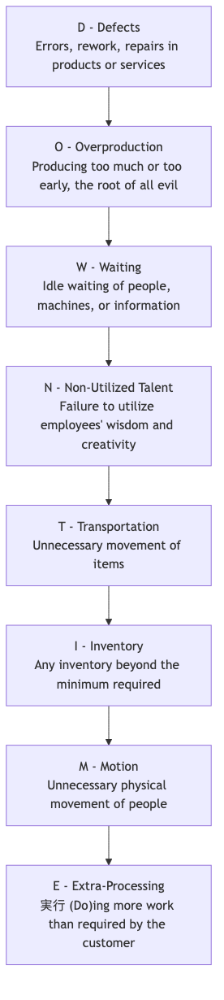

# リーンオペレーションズ

価値の源が最小限の消費と最大の速度で顧客にスムーズに届けられる、障害のない川の流れを想像してみてください。これが**リーンオペレーションズ**が目指す理想状態です。リーンオペレーションズは、しばしば**リーン生産**または**リーン思考**とも呼ばれ、運用管理の強力な手法であると同時に、深い組織文化および管理哲学でもあります。その中心的な目的は、**運用プロセスにおける価値を生まないすべての活動（つまり「ムダ（Muda）」）を体系的に特定し排除すること**を通じて、顧客価値を最大化し、高品質・低コスト・高速な運転効率を実現することにあります。

リーン思考は、トヨタ自動車の「トヨタ生産方式（TPS）」に起源を持ち、伝統的な大量生産的・プッシュ型生産モデルを完全に革新しました。リーンオペレーションズでは、最終顧客が支払う価値を生まないでリソースを消費するあらゆる活動はムダとみなされます。価値ストリームを継続的に検討し、ムダを排除することにより、組織は少ないリソースと時間でより高品質な製品・サービスを提供できるようになり、激しい市場競争において根本的な優位性を獲得することができます。

## リーン思考の5つの核心原則

リーン思考の実践は、密接に関連し、循環する5つの核心原則を中心に展開されます。

1.  **価値の明確化**: すべての活動の出発点は、**最終顧客の視点**から価値を正確に定義することです。私たちが価値があると思うことではなく、顧客が価値があると思うことこそが重要です。
2.  **価値ストリームのマッピング**: 各製品・サービスについて、構想から顧客への納品に至るまでの**完全なエンドツーエンドのプロセスマップ**（いわゆる「価値ストリーム」）を描きます。このプロセスにおいて、どのステップが本当に価値を生み出し、どのステップが非価値提供的だが現状では避けられないのか、またどのステップが排除すべき純粋なムダなのかを明確にします。
3.  **フローの創出**: 部門間の壁や断絶されたロット生産モデルを打破し、プロセスを再編成して、製品・サービスが価値ストリームをできるだけスムーズに、途切れることなく、待つことなく「流れる」ようにします。
4.  **プルの確立**: 下流のニーズに関係なく計画通りに生産する従来の「プッシュ型」生産とは異なり、リーンは**「プル型」システム**を追求します。つまり、顧客（または下流プロセス）が明確な需要信号を送ったときにのみ、上流プロセスが生産またはサービスを開始します。これにより、過剰生産と不要在庫を根本的に排除します。
5.  **完璧を目指す**: リーンは継続改善の終わりのないプロセスです。上記の4つのステップを繰り返すことで、組織はさらに深いレベルのムダを継続的に発見・排除し、「ゼロムダ」という理想状態に限りなく近づくことができます。

## リーンの8つのムダ（DOWNTIME）

リーン思考では、プロセス内のムダを8つのタイプに体系的に分類します。これは一般的に**DOWNTIME**という頭字語で覚えられます。

## リーンオペレーションズの実施方法

リーン変革は、一連の強力なツールや方法に依存する深い文化的・運用上の変化です。

1.  **価値ストリームマッピング（VSM）**: リーン実施の出発点です。現状の価値ストリームをマッピングし、各段階のサイクルタイム、価値付加タイム、ムダを特定します。その後、理想の将来像となる価値ストリームマップを設計し、改善の目標とします。

2.  **5S手法**: 洁く、整然と、効率的な作業環境を作り出すために使われます。5つのステップから成り立っています：整理（Seiri）、整頓（Seiton）、清掃（Seiso）、清潔（Seiketsu）、躾（Shitsuke）。

3.  **カンバン**: 「プル型」生産を実現するための強力な可視化管理ツールです。カンバンカードを通じて需要信号を伝達し、仕掛品の量を正確に制御することで過剰生産を防止します。

4.  **カイゼン**: 「継続的改善」という意味です。すべての従業員が日々の業務プロセスを振り返り、小さな改善提案を継続的に提案する文化を組織に根付かせる必要があります。

5.  **根本原因分析**: 問題が発生した際には、**5Why**や**フィッシュボーン図**などのツールを使い、問題の根本原因を掘り下げて明らかにし、表面的な症状ではなく問題を永久に解決することを確実にします。

## 実践事例

**事例1：トヨタの「1cmの改善」**

*   **シナリオ**: トヨタの生産ラインでは、カイゼンはDNAの一部です。
*   **適用**: 生産ラインの作業員が、部品ボックスからネジを取り出すたびに、わずかではあるが不自然な手首のひねりが必要であることに気づきました。彼は部品ボックスを15度傾けることを提案しました。この一見些細な改善により、彼の1日あたりの作業時間は数秒短縮され、手首の怪我のリスクも軽減されました。この「1cmの改善」が会社全体の何千もの作業場に広がると、累積された時間短縮と安全性の向上は驚くべきものとなりました。

**事例2：病院の看護師ステーション**

*   **問題**: 看護師たちは、毎日多くの時間をガーゼやテープなどのよく使う医療用品を探すことに費やしていると不満を訴えていました。
*   **リーンの適用**: 看護主任が小さなカイゼン活動を組織しました。チームメンバーは**5S手法**を使って看護師ステーションのキャビネットを徹底的に**整理**（不要なものを廃棄）、**整頓**（頻繁に使うものをすぐに取り出せる場所に配置し、明確にラベル付け）、**清掃**、**標準化**、**躾**しました。この活動には半日しかかかりませんでしたが、看護師たちの探し時間を大幅に短縮し、直接患者ケアに集中できるようになりました。

**事例3：ソフトウェア開発におけるアジャイルとカンバン手法**

*   **シナリオ**: 従来のウォーターフォール型ソフトウェア開発モデルはサイクルが長く、多くのムダがありました。
*   **リーンの適用**: アジャイル開発とカンバン手法は、知識労働におけるリーン思考の適用例です。
    *   **ムダの排除**: 小ロット・高頻度のイテレーションを通じて「仕掛品」（未完成コード）の在庫を削減します。継続的インテグレーションにより、待ち時間や不良品のムダを削減します。
    *   **プルシステム**: カンバンボード上の優先順位に応じて開発チームが「バックログ」リストからタスクを「プル」して開発するため、プロジェクトマネージャーがタスクを「プッシュ」するのではありません。
    *   **継続的改善**: 定期的な「振り返りミーティング」は制度化された「カイゼン」活動です。

## リーンオペレーションズの利点と課題

**主な利点**

*   **顕著な効率向上とコスト削減**: ムダを排除することで生産効率が直接向上し、運転コストが削減されます。
*   **高い品質と顧客満足度**: 価値とプロセスに焦点を当てることで、製品・サービスの本質的な品質を保証します。
*   **高い柔軟性と迅速な対応力**: 小ロット・プル型生産モデルにより、顧客の需要変化に迅速に対応できます。
*   **従業員のエンパワーメントと士気の向上**: 一線の従業員の知恵と創造性を尊重し、継続的改善を推進します。

**潜在的な課題**

*   **サプライチェーンへの高い要求**: JIT（ジャストインタイム）は、供給業者が極めて正確かつ高品質に商品を納入することを要求し、サプライチェーンの安定性に非常に高い要求を課します。
*   **すべての環境に適応しないこと**: 需要が極めて不安定で変動の激しい業界では、純粋なプル型システムの導入は非常に困難です。
*   **文化的変化への抵抗**: リーン変革には考え方の深い転換が必要であり、伝統的な業務方法に慣れている従業員や管理者からの抵抗がある可能性があります。

## 拡張と関連概念

*   **シックスシグマ**: リーンは**スピードと効率（ムダの排除）**に焦点を当て、シックスシグマは**品質と一貫性（ばらつきの削減）**に焦点を当てます。実際には、これらはしばしば**リーンシックスシグマ**として統合され、ムダの排除とばらつきの削減の両方を行うより包括的な運転改善手法を形成します。
*   **トータル・クオリティ・マネジメント（TQM）**: 顧客志向、全員参加、継続的改善などの哲学的側面でリーンと非常に一致しています。リーンは「ムダの排除」に焦点を当てた独自の視点とツールセットを提供します。
*   **制約理論（TOC）**: システム内の「ボトルネック」を特定・管理して全体の生産量を向上させることに焦点を当てています。リーン手法と組み合わせることで改善活動の焦点を導くことができます。

---
*出典：リーン思考のルーツは、トヨタ自動車の豊田佐吉（たいち おの）が中心となって構築したトヨタ生産方式（TPS）にあります。ジェームズ・P・ウォメンクとダニエル・T・ジョーンズによる著書『Lean Thinking』は、トヨタの実践を西洋の管理者が理解できる5つの原則に体系的にまとめ、世界中へのリーンの普及に大きく貢献しました。*