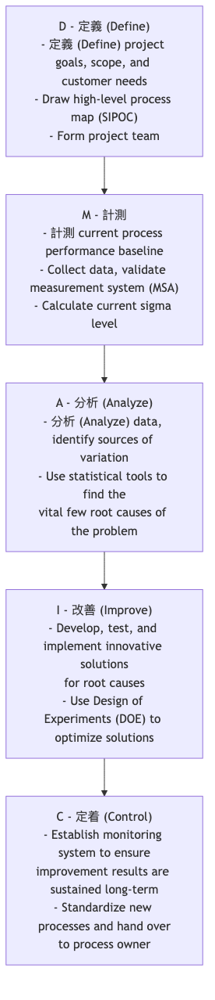

# シックスシグマ

究極の品質と運用工数の効率化を目指す上で、企業はどのようにプロセスにおける欠陥とばらつきをほぼ完璧なレベルまで削減できるのでしょうか？**シックスシグマ（6σ）** とは、この目的のために設計された、厳密でデータ駆動型かつ顧客中心の **品質改善手法と経営哲学** です。その中心的な目的は、プロセスの変動の根本原因を体系的に特定し排除することで、製品やサービスの欠陥率を **100万機会あたりわずか3.4欠陥** という例外的なレベルまで引き下げることです。

"シグマ（σ）" はデータのばらつきを示す統計的な尺度であり、標準偏差を表します。プロセスのシグマレベルが高いほど、平均からの変動が小さく安定しており、欠陥も少なくなります。"シックスシグマ" という名前自体が完璧な品質への極限的な追求を意味しています。これは単なる統計的手法の集まりではなく、**DMAIC**（定義・測定・分析・改善・管理）という構造化されたプロジェクトプロセスを通じて複雑な問題を解決し、画期的なパフォーマンス向上を実現する体系的な考え方です。

## シックスシグマの基本原則

*   **顧客志向**：あらゆる改善の出発点と終着点は、顧客のニーズと品質重要特性（CTQ）でなければなりません。
*   **データ駆動の意思決定**：すべての意思決定と結論は、直感や経験ではなく、客観的なデータの収集と厳密な統計的分析に基づかなければなりません。
*   **プロセス改善**：あらゆる欠陥や問題は不完全なプロセスに起因すると考えます。したがって、改善の焦点はプロセスにあり、個人の責めにあってはなりません。
*   **変動の削減**：シックスシグマでは、プロセスの変動と不一貫性が品質の最大の敵であると認識しています。その中心的な課題は、変動の根本原因を理解し排除することです。
*   **画期的な改善**：わずかな段階的改善ではなく、顕著で数値化可能な財務的リターンとパフォーマンス向上を目指します。

## DMAIC：シックスシグマのプロジェクトロードマップ

シックスシグマの改善プロジェクトは、**DMAIC** と呼ばれる5段階のロードマップに厳密に従います。各段階には明確な目標と使用すべき主要ツールがあります。

## シックスシグマプロジェクトの実施方法

1.  **定義（Define）フェーズ**：解決したいビジネス上の問題とそれが企業に与える影響を明確にし、プロジェクトの範囲、目標、タイムラインを定義し、関係するすべての利害関係者を特定します。

2.  **測定（Measure）フェーズ**：問題の深刻さをデータで数値化します。測定する主要な指標を決定し、データ収集計画を設計し、測定システムが正確かつ信頼できることを確認する必要があります。このフェーズの成果は、現在のプロセス性能に関する信頼できるベースラインデータです。

3.  **分析（Analyze）フェーズ**：これはDMAICの核となる段階です。パレート図、フィッシュボーン図、仮説検定、回帰分析などのさまざまな統計分析ツールを用いて、収集されたデータから **問題の根本原因** を丁寧に抽出し、データで検証します。

4.  **改善（Improve）フェーズ**：根本原因が特定されたら、的を絞った解決策のアイデアを出し、潜在的な解決策を開発・テストします。**実験計画法（Design of Experiments, DOE）** はこの段階で一般的に使用される強力なツールであり、プロセス最適化のための最適なパラメータの組み合わせを見つけるのに役立ちます。

5.  **管理（Control）フェーズ**：解決策を実施し、期待された改善が達成された後、最も重要なのはその成果を維持することです。プロセス管理システム（**統計的プロセス管理図（SPCチャート）** など）を構築し、新しい標準作業手順書を開発し、関係者をトレーニングして、問題の再発を防ぐ必要があります。

## シックスシグマのベルト役割体系

シックスシグマの成功した実施には、柔道の帯のように異なる色の「ベルト」で表される明確な役割と責任の体系があります。

*   **チャンピオン**：通常はシニアマネージャーで、シックスシグマプロジェクトの特定と承認、プロジェクトへのリソースと支援の提供を担当します。
*   **マスターブラックベルト**：社内のシックスシグマ専門家およびコーチで、ブラックベルトやグリーンベルトのトレーニングや指導を行い、組織内でシックスシグマ文化を推進します。
*   **ブラックベルト**：通常はフルタイムのシックスシグマプロジェクト管理者で、複雑で横断的な改善プロジェクトを主導します。
*   **グリーンベルト**：通常業務をこなしながら、小規模な改善プロジェクトをリードまたは参加し、組織内でのシックスシグマの普及と応用の中心的な存在です。

## 適用事例

**事例1：ゼネラル・エレクトリック（GE）**

*   **状況**：ジャック・ウェルチの指導の下、GEはシックスシグマを品質ツールからコアビジネス戦略へと昇華させた最初で最も成功した企業の一つです。
*   **適用**：GEは航空機エンジン製造から金融サービスに至るすべてのビジネス領域にシックスシグマを適用しました。例えば、医療部門はDMAICプロジェクトを通じてCTスキャナーの検査プロセスを分析し、患者一人あたりの平均検査時間を30%削減することに成功し、装置の利用率と患者満足度が大幅に向上しました。シックスシグマにより、初期の数年間でGEは数十億ドルを節約したと報告されています。

**事例2：銀行におけるクレジットカード申込プロセスの最適化**

*   **問題**：顧客がクレジットカードを申込みから受け取るまでの平均時間が長く、顧客満足度が低かった。
*   **DMAICの適用**：
    *   **D**：プロジェクト目標を「申込サイクルを平均15日から6か月以内に7日に短縮すること」と定義。
    *   **M**：過去3か月間の数百件の申込について、各段階（「データ入力」、「信用審査」、「カード製造」、「配送」）に要した時間を測定。
    *   **A**：データ分析の結果、「信用審査」段階が最も時間がかかり、変動も大きく、プロセスの主要なボトルネックであることが判明。
    *   **I**：審査プロセスを再設計し、自動一次審査システムを導入し、審査担当者に権限を付与。
    *   **C**：新しいプロセスのモニタリングダッシュボードを構築し、作業マニュアルを更新。最終的に平均サイクル時間を6.5日まで短縮することに成功。

**事例3：製造工場における製品欠陥率の削減**

*   **問題**：ある生産ラインで製造される部品の寸法が規格を超過する欠陥率が5%と非常に高かった。
*   **DMAICの適用**：フィッシュボーン図と仮説検定を通じて、寸法のずれを引き起こす可能性のあるすべての要因（人、機械、材料、方法、環境）を分析。最終的に実験計画法（DOE）により、機械の「冷却温度」と「切削速度」のパラメータ間の相互作用が寸法変動の最も重要な根本原因であることが判明。新しい最適なパラメータの組み合わせを設定することで、欠陥率を0.1%未満まで削減することに成功。

## シックスシグマの利点と課題

**主な利点**

*   **成果志向で顕著な財務的リターン**：各プロジェクトは明確で数値化可能な財務目標と連携しています。
*   **体系的で明確なロジック**：DMAICフレームワークは複雑な問題解決のための非常に構造化され、繰り返し可能なロードマップを提供します。
*   **データ駆動で高い客観性**：データで物事を語ることを重視し、意思決定における主観性と恣意性を削減します。
*   **問題解決能力の育成**：ビジネス、データに精通し、科学的ツールを活用して問題を解決できる専門家（ブラックベルト、グリーンベルト）を組織内で育成します。

**潜在的な課題**

*   **イノベーションの抑制につながる可能性**：既存プロセスの制御と最適化に過度に焦点を当てると、探索と試行錯誤を伴う破壊的イノベーションと衝突する場合があります。
*   **官僚化のリスク**：不適切に実施されると、複雑な統計ツールと報告書に満ちた官僚的なプロセスとなり、「プロジェクトをやるためにプロジェクトをやる」状態になる可能性があります。
*   **大きな投資を要する**：シックスシグマの成功には、トレーニング、プロジェクトリソース、人的資源への初期の大きな投資が必要です。

## 拡張と関連

*   **リーン製造**：シックスシグマの核は **変動の削減と品質の向上** であり、リーンの核は **無駄の排除とスピードの向上** です。焦点は異なりますが、非常に補完的です。実際には、これらを組み合わせてより強力な **リーンシックスシグマ** として用いられることが多く、高品質、高効率、低コストを同時に実現します。
*   **トータル・クオリティ・マネジメント（TQM）**：TQMは顧客中心で全員参加のマクロな経営哲学を提供し、シックスシグマはTQMの目標達成のための、より具体的でプロジェクトベース、データ駆動のマイクロな運用方法を提供します。

---
*参考文献：シックスシグマは1980年代にモトローラのエンジニアBill Smithによって最初に提唱され、ゼネラル・エレクトリック（GE）やアラインドシグナルなどの企業での成功した実施により有名になりました。Mikel HarryとRichard Schroederによる著書『Six Sigma: The Breakthrough Management Strategy Revolutionizing the World's Top Corporations』は、この分野の古典的なテキストです。*