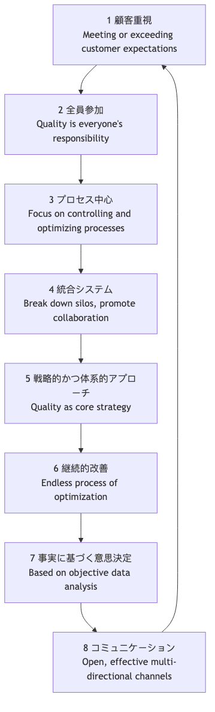

# 全社的品質管理（TQM）

伝統的な生産モデルでは、「品質」はしばしば生産ラインの最終工程で専門の品質管理部門によって行われる検査工程と見なされていました。しかし、このような「事後的対応」のアプローチはコストが高く非効率です。**全社的品質管理（TQM）** は、画期的で明確に異なる経営哲学を提案します。それは、**品質はすべての人の責任であり、組織運営の隅々まで浸透しなければならず、最終的な基準は顧客満足度である** という考え方です。

TQMは特定の手法やツールではなく、**品質、全従業員の参加、継続的改善** に焦点を当てた経営哲学および組織文化です。その目的は、体系的で予防的な品質保証システムを構築することにより、製品・サービス・プロセスの品質を継続的に改善し、激しい市場競争において持続可能な競争優位を獲得することです。また、高品質がコストを増加させるどころか、むしろ廃棄物や再作業、顧客クレームの削減を通じて**総コストを大幅に削減し、収益性を向上させる** ことを強調しています。

## TQMの核心原則

全社的品質管理（TQM）は、相互に関連した一連の核心原則を基盤として構築され、それがTQMの文化的基盤を形成しています。

1.  **顧客志向**：TQMの始まりも終わりも顧客です。組織の存続と発展は、最終的に顧客の期待を満たすか、それを超える能力に依存しています。したがって、製品設計からアフターサービスに至るすべての側面が、顧客のニーズと満足度によって導かれる必要があります。

2.  **全従業員参加**：品質は一つの部署の専売特許ではなく、CEOから現場の従業員に至るすべての人の責任です。TQMは、すべての従業員が品質改善活動に積極的に参加できるよう、権限委譲、教育、動機付けを重視します。

3.  **プロセス中心**：TQMでは、最終的な製品やサービスの品質はそれを生み出すプロセスによって決まると考えます。したがって、管理の焦点は「結果の検査」から「プロセスの管理と最適化」へとシフトする必要があります。

4.  **統合システム**：組織はさまざまな水平・垂直プロセスから構成される複雑なシステムと見なされます。TQMは部署間の壁を打ち壊し、機能横断的な協働を促進することで、組織全体が共通の品質目標に向けて調和して働くことを目指します。

5.  **戦略的かつ体系的なアプローチ**：品質は組織のコア戦略の一つと見なされる必要があります。組織は明確な長期的な品質ビジョンを策定し、それをすべての計画や意思決定に体系的に統合する必要があります。

6.  **継続的改善**：TQMは「一度の適合」を目指すものではなく、終わりのない螺旋状の改善プロセスです。組織が製品・サービス・プロセスにおける小さな継続的な改善の機会を常に探すことを奨励します（いわゆる「カイゼン」）。

7.  **事実に基づく意思決定**：すべての意思決定と改善は、直感や経験ではなく、客観的なデータの収集と分析に基づく必要があります。これには、効果的なデータ測定と分析システムを組織が構築することが必要です。

8.  **コミュニケーション**：組織内にはオープンで効果的かつ双方向のコミュニケーション手段を確立し、戦略、目標、プロセス、フィードバックが適切に伝達され、理解されるようにする必要があります。

## TQMの実施方法

TQMの実施は長期的な文化的変革のプロセスであり、通常はPDCAサイクルの論理に従うことができます。

1.  **第1段階：計画（Plan） - 基盤の構築**
    *   **経営層のコミットメント**：TQMの成功には、経営層からの揺るがない支援とコミットメントを得ることが最優先条件です。
    *   **品質委員会の設置**：全社的なTQM実施の計画と指導を担当する横断的なリーダーシップチームを形成します。
    *   **品質ビジョンと戦略の策定**：組織の品質方針と長期目標を明確に定義します。
    *   **全従業員の教育**：すべての従業員にTQMの基本概念とツールに関する教育を提供します。

2.  **第2段階：実行（Do） - 包括的な展開**
    *   **顧客ニーズの特定**：顧客のニーズと期待を体系的に収集・分析します。
    *   **プロセス分析と標準化**：主要なビジネスプロセスをマッピング・分析し、ボトルネックや無駄を特定し、標準化された作業手順を確立します。
    *   **品質改善チームの形成**：従業員（特に異部門間の）が自発的に「品質サークル」などのグループを形成し、特定の問題を改善するよう奨励します。
    *   **従業員への権限委譲**：現場の従業員が品質問題を発見した際に生産ラインやプロセスを停止する権限と責任を与えます。

3.  **第3段階：確認（Check） - 測定と評価**
    *   **データの収集と分析**：統計的工程管理（SPC）、パレート図、フィッシュボーン図などの品質管理ツールを使用して、プロセスと結果を継続的に監視・測定します。
    *   **成果評価**：TQM実施の進捗と効果を定期的に評価し、事前に定義された目標と比較します。

4.  **第4段階：処置（Act） - 改善と制度化**
    *   **根本原因分析**：特定された品質問題に対して深掘りした根本原因分析を行います。
    *   **改善策の実施**：分析結果に基づき、是正および予防措置を講じます。
    *   **共有と標準化**：成功した改善経験を共有し、新たなプロセスとして標準化し、組織の知識ベースに組み込みます。
    *   **継続的なサイクル**：1回の改善サイクルを完了した後、すぐに次のPDCAサイクルを開始します。

## 適用事例

**事例1：トヨタ自動車株式会社**

*   **シナリオ**：トヨタ生産方式（TPS）は、TQMの最も成功した実践例とされています。
*   **適用**:
    *   **全従業員参加**：「アンドンシステム」により、生産ラインの作業員が品質問題を発見した際にコードを引いて生産ライン全体を停止できるようにしており、現場の従業員に対する高い信頼と権限委譲を反映しています。
    *   **継続的改善**：トヨタの「カイゼン」文化は、すべての従業員が日々の業務プロセスについて小さな継続的な改善提案を行うことを奨励しています。
    *   **プロセス志向**：「ジャストインタイム（JIT）」や「自働化」などのコア原則は、プロセスの最適化を通じて無駄を排除し品質を確保することを目的としています。

**事例2：ザ・リッツ・カールトンホテル**

*   **シナリオ**：トップクラスのラグジュアリーホテルブランドとして、卓越したサービス品質がコア競争優位です。
*   **適用**:
    *   **顧客志向**：有名なスローガンは「紳士淑女が紳士淑女のために奉仕する」です。
    *   **全従業員参加と権限委譲**：会社はすべての従業員に、上司の承認を取ることなく最大2,000ドルを使用して顧客の問題を解決する権限を与えています。これにより、顧客の問題を即座かつ創造的に解決できるようにしています。
    *   **事実に基づく意思決定**：ホテルは詳細な顧客嗜好データベースを使用し、常連客の個別ニーズを記録して、期待を超える正確なサービスを提供しています。

**事例3：ソフトウェア開発会社**

*   **シナリオ**：会社はソフトウェア製品のコード品質と納品速度を向上させたいと考えています。
*   **適用**:
    *   **プロセス志向**：「継続的インテグレーション／継続的デリバリー（CI/CD）」プロセスを導入し、自動テストを通じて各コードコミットの品質を保証しています。
    *   **全従業員参加**：すべてのコードがマージされる前に少なくとも1人の同僚によるレビューを受ける必要がある「コードレビュー」制度を実施し、品質責任をすべての開発者に分散しています。
    *   **継続的改善**：定期的に「技術的負債返済デー」や「ポストモーテムレビュー」を開催し、チームがプロセス上の問題を積極的に特定し解決するよう奨励しています。

## TQMの利点と課題

**主な利点**

*   **顧客満足度とロイヤルティの向上**：組織全体が顧客ニーズを満たすことに集中します。
*   **コスト削減と効率向上**：「最初から正しく行う」ことで、再作業、無駄、顧客クレームに関連するコストを大幅に削減します。
*   **従業員の帰属意識と責任感の強化**：従業員に権限を委譲し、彼らが組織の成功に重要な一員であると感じさせます。
*   **持続可能な競争優位の確立**：高品質そのものが模倣が難しい強力な競争優位となります。

**潜在的な課題**

*   **長期的な文化的変化が必要**：TQMは短期間で成果が出る「プロジェクト」ではなく、数年かけて根付かせる必要がある深い組織文化的変化です。
*   **経営層の継続的なコミットメント**：経営層の支援が揺らぐと、TQMの実施はすぐに形式的なものになってしまいます。
*   **官僚主義化の可能性**：プロセスや文書化が過度に強調されると、新たな官僚主義が生まれ、柔軟性やイノベーションを阻害する可能性があります。

## 拡張と関連分野

*   **シックスシグマ**：TQMの「事実に基づく意思決定」と「継続的改善」の原則をより具体的に、データ駆動型かつプロジェクト志向的に実施する方法論と見なせます。TQMは哲学と文化を提供し、シックスシグマは統計的ツールとプロジェクトのロードマップを提供します。
*   **リーンオペレーションズ**：無駄の排除、プロセス重視、継続的改善といった点でTQMと共通する哲学的基盤を持っています。両者はしばしば組み合わされ、「リーンシックスシグマ」として知られています。
*   **ISO 9000品質マネジメントシステム**：TQMの原則に基づく国際的に標準化された認証可能なフレームワークです。組織はISO 9001認証を取得することで、TQMの原則に準拠した品質マネジメントシステムを構築したことを示すことができます。

---
*出典：全社的品質管理（TQM）の知的起源は、W・エドワーズ・デミングの「管理の14のポイント」、ジョセフ・M・ジュランの「品質三部作」、フィリップ・B・クロスビーの「品質は無料である」といった20世紀中盤の品質管理の大家たちの考え方に遡ることができます。これらの考え方は日本の戦後復興期に大きく発展し、最終的に完全なTQMシステムを形成しました。*