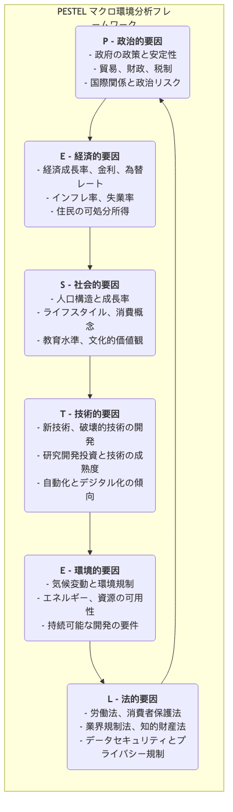

# PESTEL分析

長期的な戦略を立案する際、企業が内部の強みや業界内での競争に焦点を当てながらも、広範なマクロ環境を無視してしまうと、それはまるで荒天の中を航海するのに天気予報を確認しないようなものであり、極めて危険です。**PESTEL分析**（しばしばPEST分析とも呼ばれます）は、組織を取り巻く外部のマクロ環境を体系的にスキャンし、監視するための強力なフレームワークです。現在または将来において、組織に大きな影響を与える可能性のある主要な要因や外部リスクを意思決定者に特定させることを目的としています。

PESTELは6つの要素の頭文字を取ったものであり、環境分析を行う際に重要な視点を見逃さないよう包括的なチェックリストを提供します：

*   **P - 政治的要因（Political）**
*   **E - 経済的要因（Economic）**
*   **S - 社会的要因（Social）**
*   **T - 技術的要因（Technological）**
*   **E - 環境的要因（Environmental）**
*   **L - 法的要因（Legal）**

これらの6つの要素を体系的に分析することにより、企業は機会をより正確に予測し、脅威を回避し、適応的で先を見据えた戦略を立案することが可能になります。

## PESTELの6要素の詳細説明

PESTELの各文字は検討すべき一連の外部要因を表しています。

-->

## PESTEL分析の実施方法

1.  **ブレインストーミング：主要な要因の特定**
    職種の異なるメンバーで構成されたチームを結集し、PESTELの6つの要素にまたがって自由にブレインストーミングを行います。自社、業界、市場に関連する可能性のある外部要因を、各要素ごとにできるだけ多くリストアップします。
    *   例えば、電気自動車メーカーの場合、「政治的要因」には「政府の新エネルギー車補助金政策」、「充電スタンドインフラ整備計画」などが含まれるかもしれません。

2.  **情報収集と根拠の確認**
    初期段階で特定された主要な要因について、さらに深く情報収集と調査を行います。データは政府の報告書、業界分析、ニュースメディア、学術研究などから得ることができ、分析が事実に基づき、憶測に基づかないことを保証します。

3.  **影響の分析：機会と脅威の特定**
    各主要要因が組織に与える可能性のある影響がポジティブ（機会）であるかネガティブ（脅威）であるかを評価します。さらに、この影響の**発生確率**と**深刻度**を分析します。
    *   例えば、「政府が補助金を増やすこと」は高確率で高影響の**機会**です。
    *   「新たなバッテリー回収規制の導入」は高確率で中程度の影響の**脅威**かもしれません。

4.  **戦略的対応策の立案**
    これがPESTEL分析の最終的な目的です。特定された主要な機会および脅威に対して具体的な戦略的アクションを立案します。
    *   **機会に対して**：戦略をどう調整して、その機会を最大限に活用すべきか？
    *   **脅威に対して**：どう行動して、その悪影響を回避または軽減すべきか？

5.  **継続的なモニタリング**
    マクロ環境は常に変化しているため、PESTEL分析は一度きりの作業ではなく、継続的なモニタリングと定期的な更新が必要な動的なプロセスです。

## 適用事例

**事例1：多国籍ファストフードチェーンがインド市場に進出するケース**

*   **政治的要因**：インドの複雑な食品安全規制や地元政府との関係を処理する必要がある。
*   **経済的要因**：インドの中間層の台頭と可処分所得の増加は大きな機会だが、価格感度の高さも考慮する必要がある。
*   **社会的要因**：インドには多くのベジタリアンがおり、ヒンドゥー教では牛が神聖視されている。これは大きな文化的挑戦かつ機会である。そのため、会社はビーフを使わないハンバーガー（例えばマックアローティッキー）や豊富なベジタリアンメニューを特別に開発した。
*   **技術的要因**：モバイル決済やフードデリバリー・プラットフォームの普及により、新たなチャネルを通じて多くの消費者にリーチできるようになった。
*   **環境的要因**：プラスチック包装に関する規制が厳しくなり、環境に優しい代替品が必要とされている。
*   **法的要因**：労働法やフランチャイズ関連の規制を遵守する必要がある。

**事例2：従来の印刷メディアが直面する課題**

*   **政治的要因**：報道検閲や出版規制の変化。
*   **経済的要因**：景気後退により企業の広告予算が削減され、新聞収入に深刻な影響を与えている。
*   **社会的要因**：読者の読書習慣がオンラインおよびモバイルに完全にシフトしており、若い世代は新聞を読む習慣を持っていない。
*   **技術的要因**：インターネット、SNS、ニュース集約アプリの台頭により、ニュースの制作・配信方法が完全に変化し、最も致命的な脅威となっている。
*   **環境的要因**：紙の消費や環境に優しい印刷に関する要求が高まっている。
*   **法的要因**：著作権やデジタルコンテンツの複製に関する法的紛争が増加している。

**事例3：オンライン教育テクノロジー企業の機会**

*   **政治的要因**：教育の情報化推進や「休校期間中の学習継続」政策が大きな成長機会となる。
*   **経済的要因**：家庭の教育支出が継続的に増加している。
*   **社会的要因**：生涯学習やスキルアップへの社会的需要が高まり、パンデミックによってオンライン学習の普及と受容が加速した。
*   **技術的要因**：5G、人工知能、ビッグデータ技術の発展により、パーソナライズされた没入型オンライン学習体験が可能になった。
*   **環境的要因**：オンライン教育は通勤や紙の消費を削減するため、自然環境面での利点がある。
*   **法的要因**：未成年者のオンライン保護や教育データのプライバシーに関する新たな規制を注意深くモニタリングする必要がある。

## PESTEL分析の長所と限界

**主な長所**

*   **包括性**：体系的かつ包括的なフレームワークを提供し、マクロ環境分析の広がりを保証する。
*   **先見性**：企業が日々の業務にとどまらず、長期的なトレンドや変化を考慮するよう促す。
*   **戦略的思考の促進**：機会と脅威を特定し、堅牢な戦略を立案するための重要なインプットとなる。

**潜在的な限界**

*   **情報過多**：あまりにも多くの外部要因が特定されるため、さらに絞り込みを行い、最も重要な少数の要因に焦点を当てる必要がある。
*   **複雑さの単純化**：現実世界では、6つの要素間の相互関係や相互作用が複雑に絡み合っており、PESTEL自身はこの複雑さを十分に反映していない。
*   **動的不足**：分析結果は時点におけるスナップショットに過ぎず、急速に変化する環境に対応するためには継続的な更新が必要である。

## 拡張と関連性

*   **SWOT分析**：PESTEL分析はSWOT分析のための優れた出発点である。PESTEL分析の結果は直接的にSWOTの**機会（Opportunities）**と**脅威（Threats）**のセクションへのインプットとなる。
*   **ポーターのファイブフォースモデル**：PESTELはビジネスエコシステム全体に影響を与える広範なマクロ環境に焦点を当てる一方で、ポーターのファイブフォースモデルは組織が属する特定業界内の「ミクロ」な競争環境に重点を置く。この2つを組み合わせることで、外部環境全体を包括的に把握することができる。

---
*出典：PESTELフレームワークは、1967年にハーバード大学のフランシス・アギラル教授によってETPSの形式で初めて提案された。数十年にわたる進化と拡張を経て、今日広く知られているPESTまたはPESTELモデルへと発展した。戦略的意思決定およびマーケティングにおける最も基本的かつコアな分析ツールの一つである。*