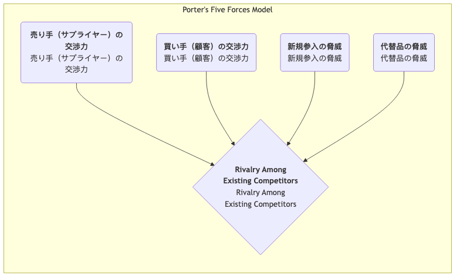

# ポーターのファイブフォースモデル

激しいビジネス競争において、産業の魅力と長期的な収益性は、単一の競合企業によって決まるのではなく、より広範な競争エコシステムによって形作られます。**ポーターのファイブフォースモデル**は、ハーバード・ビジネススクールの戦略経営の大家であるマイケル・E・ポーターによって提唱された革新的なフレームワークです。このモデルは強力な分析ツールであり、あらゆる産業の競争構造を体系的に分析し、その産業における平均的な収益水準を決定する5つの基本的な競争力を理解するのに役立ちます。

このモデルの中心的な考え方は、企業の戦略立案者が直接の競合企業だけに注目するのではなく、より広い競争環境を検討すべきであるという点です。これらの5つの力が相互作用し、産業内での競争の激化具合、および産業チェーン内で価値がどのように創出され分配されるかを決定します。各競争力の強さを理解することで、企業は産業内での最適なポジションを見出し、リスクを回避し、優位性を活かして持続可能な競争優位を獲得する戦略を立案することができます。

## 5つの競争力の分析

ポーターのファイブフォースモデルは、産業競争を5つの明確な側面に分解し、それらが一緒に産業における「ゲームのルール」を決定します。

1.  **既存企業間の競争**
    ファイブフォースモデルの中心となる要素で、産業内に存在する企業間の直接的な対立と競争の激化度合いを指します。産業内での競争が激しい場合、企業は価格競争や広告合戦、製品イノベーション競争に巻き込まれ、産業全体の収益性が低下します。
    *   **激しい競争の兆候**: 産業内に類似した強さを持つ競合企業が多数存在；産業の成長が遅く、「ゼロサムゲーム」状態；製品の均質化が進み差別化が困難；退出障壁が高く、赤字企業が産業から撤退しにくい。

2.  **新規参入の脅威**
    新しい競合企業が産業に参入してくる可能性を指します。ある産業が利益を生み出し、参入障壁が低い場合、それはまるで磁石のように新しいプレイヤーを引き寄せ、新たな生産能力と市場シェア獲得への意欲を持って競争を激化させます。
    *   **脅威の強さを決定する要因**は参入障壁の高さです。一般的な参入障壁には、規模の経済性、強いブランドロイヤルティ、高い顧客切り替えコスト、大規模な資本投資、流通チャネルの支配、政府の政策や規制、コア技術の特許があります。

3.  **代替製品・サービスの脅威**
    **異なる産業**からの代替製品やサービスが、同じ顧客ニーズを満たす可能性があるという脅威を指します。代替品の存在は、産業全体の価格設定に「天井」を設定します。
    *   **重要な区別**: 航空会社にとって別の航空会社は**競合**ですが、新幹線やテレビ会議は**代替品**です。代替品のコストパフォーマンスが高く、顧客が切り替えるコストが低いほど、その脅威は大きくなります。

4.  **サプライヤーの交渉力**
    サプライヤー（原材料、部品、労働力、サービスの提供者など）が産業内の企業にコスト圧力を転嫁する能力を指します。強力なサプライヤーは価格を引き上げたり、品質を低下させたり、供給を制限したりして、産業の利益を削ります。
    *   **強いサプライヤー交渉力の兆候**: サプライヤー業界が少数の大手企業によって支配されている；サプライヤーの製品がユニークまたは差別化されており、代替が難しい；サプライヤーの切り替えコストが非常に高い；サプライヤーにとってあなたの業界が主要な顧客ではない。

5.  **バイヤー（購入者）の交渉力**
    顧客（購入者）が価格を引き下げたり、より高い品質やサービスを求めたりする能力を指します。強力なバイヤーは産業内の企業同士を競争させ、生産者から自分たちへの価値の移転を強制します。
    *   **強いバイヤー交渉力の兆候**: 大口でまとまった購入を行うバイヤーが集中している；業界の製品が標準化され、差別化されていない；サプライヤーの切り替えコストが低い；バイヤーが「後方統合」（自ら必要な製品を製造）できる。

## ファイブフォースモデルの活用方法

1.  **産業の境界を明確にする**
    まず、分析対象とする産業を明確に定義します。産業の定義はあまりにも広範囲であっても、狭すぎてもいけません。

2.  **5つの力の主要プレイヤーを特定する**
    各競争力の次元において、具体的な主要プレイヤーを特定します。たとえば、主要なサプライヤー、バイヤー、競合、潜在的参入者、代替品はそれぞれ何かを明確にします。

3.  **各競争力の潜在的な強さを評価する**
    各競争力を強化または弱体化させる根本的な要因を分析・判断します。最終的に、各競争力の強さ（強い、中程度、弱い）を総合的に評価します。

4.  **産業構造の包括的分析**
    5つの競争力の評価結果を統合し、産業全体の競争構造と長期的な収益可能性を判断します。産業の収益性を決定する鍵となる競争力はどれか、またはどの複数かを特定します。

5.  **ポジショニングを改善する戦略の立案**
    分析結果に基づき、企業が産業内でのポジションを「改善」するためにどのような戦略的行動が取れるかを検討します。たとえば、ブランド構築によってバイヤーの交渉力を低下させることはできるか？技術革新によって参入障壁を築くことはできるか？サプライヤーの囲い込みによってサプライヤーの交渉力を低下させることはできるか？

## 適用事例

**事例1：グローバルソフトドリンク業界（例：コカ・コーラとペプシコ）**

*   **既存企業間の競争**: **激しい**。両大手企業の競争はブランド、流通、広告などさまざまな面で展開されるが、価格破壊的な価格競争は巧妙に回避されている。
*   **新規参入の脅威**: **弱い**。極めて高いブランドロイヤルティ、広範なグローバル流通ネットワーク、大規模な広告投資が新規参入者にとって乗り越えがたい障壁となっている。
*   **代替品の脅威**: **中～強い**。水、ジュース、紅茶、コーヒーなどがすべて代替品であり、消費者には多くの選択肢がある。
*   **サプライヤーの交渉力**: **弱い**。砂糖、水、包装缶などの原材料はコモディティであり、サプライヤーは分散しており交渉力はない。
*   **バイヤーの交渉力**: **中程度**。個々の最終消費者にとっては交渉力はゼロであるが、大手小売業者（ウォルマート、カルフールなど）や外食業界では強い交渉力を持つ。
*   **結論**: この業界の構造は非常に魅力的であり、両大手企業は強力なブランドと流通障壁を築くことで新規参入者とサプライヤーからの圧力を効果的に排除し、持続的な高収益を実現している。

**事例2：パーソナルコンピュータ（PC）業界**

*   **既存企業間の競争**: **非常に激しい**。多数のブランド（レノボ、HP、デルなど）の製品が非常に均質化しており、価格競争が継続している。
*   **新規参入の脅威**: **中程度**。ブランド力や流通チャネルの蓄積は必要だが、コアコンポーネントは調達可能であり、参入障壁は乗り越えられないほどではない。
*   **代替品の脅威**: **強い**。スマートフォンやタブレットがPCの多くの機能を代替している。
*   **サプライヤーの交渉力**: **強い**。コアコンポーネント（CPUやオペレーティングシステム）がインテルやマイクロソフトなどの少数企業に集中しており、PC業界の利益の大部分を支配している。
*   **バイヤーの交渉力**: **強い**。標準化された製品により、個人消費者も法人顧客も多くの選択肢を持ち、価格に敏感である。
*   **結論**: PC業界では5つの競争力のほぼすべてがメーカーにとって不利であり、業界全体が長期にわたって低収益状態にある。

**事例3：中国の高級レストラン業界**

*   **既存企業間の競争**: **激しい**。多数のレストランが存在し、模倣やバンドワゴン効果が顕著。
*   **新規参入の脅威**: **強い**。比較的低い参入障壁；資金とシェフさえあれば誰でもレストランを開業可能。
*   **代替品の脅威**: **強い**。中価格帯レストラン、テイクアウト、プライベートシェフなどがすべて代替選択肢。
*   **サプライヤーの交渉力**: **中程度**。一般的な食材には多くのサプライヤーがいる。しかし、希少で高品質な専門食材については、少数のサプライヤーが強い交渉力を持つ可能性がある。
*   **バイヤーの交渉力**: **強い**。消費者には多くの選択肢があり、切り替えコストはゼロ。
*   **結論**: 高級レストラン業界の競争構造は悪く、収益性は非常に難しい。成功の鍵は、独自のブランド、料理、体験を構築し、バイヤーの交渉力と業界内競争を抑えることにある。

## ファイブフォースモデルの価値と限界

**中心的価値**

*   **直接的な競争相手を超えて**: 競争相手だけに焦点を当てるのではなく、競争をより広い視点で理解する手段を提供する。
*   **収益性のドライバーの解明**: 産業の長期的な収益性を決定する主要な構造的要因を特定するのに役立つ。
*   **戦略的ポジショニングの指針**: 企業が有利な戦略的位置を見出し、自らにとって好都合な産業構造を形成するための明確な道筋を提供する。

**潜在的な限界**

*   **静的な視点**: モデル自体は静的であり、技術的破壊による構造変化など、産業構造の動的な進化を十分に捉えられない可能性がある。
*   **「第6の力」の無視**: 一部の学者は、モデルが**補完財**の役割を無視していると指摘する。例えば、ソフトウェアとハードウェアは補完財であり、共に価値を生み出す。
*   **曖昧な産業境界**: 今日の統合されたビジネスエコシステムにおいて、産業境界を明確に定義することがますます難しくなっている。

## 拡張と関連手法

*   **PESTEL分析**: 5つの競争力を左右するより広範なマクロ環境要因を分析するために活用可能。
*   **バリューチェーン分析**: ファイブフォースモデルが産業の「パイ」の分け方を分析した後、バリューチェーン分析は企業自身の活動内でどのようにより多くの「パイ」を創出するかを考えるのに役立つ。
*   **戦略グループ分析**: 業界内競争を分析する際、戦略的類似性に基づいて業界内の企業を異なる戦略グループに分類し、より精緻な分析を行うことができる。

---
*出典：マイケル・ポーターは、1979年にハーバード・ビジネス・レビューに掲載された古典的論文『How Competitive Forces Shape Strategy』およびその後の著書『Competitive Strategy』でファイブフォースモデルを体系的に詳述しました。このモデルは今日でも戦略経営分野において揺るがない礎となっています。*