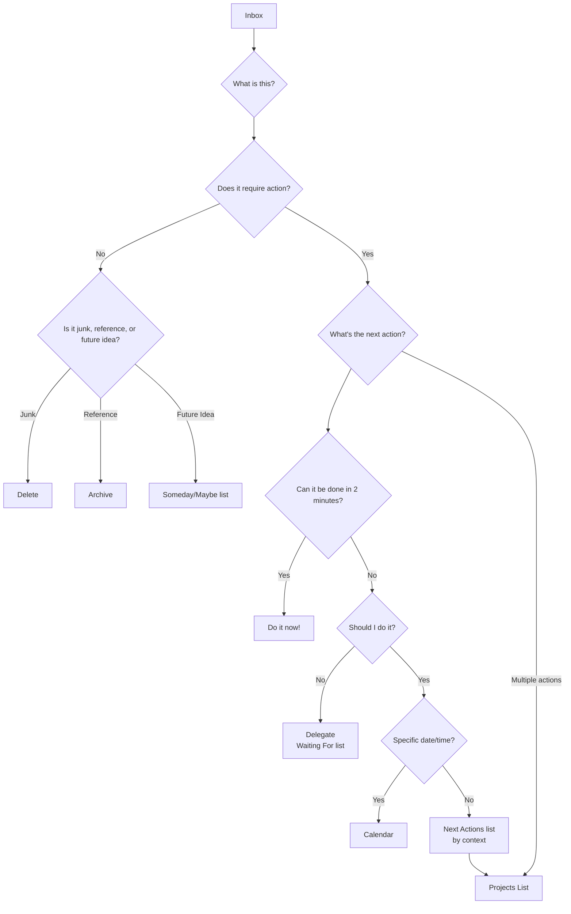

# GTD (Getting Things Done)

우리의 뇌는 **아이디어 생성**에는 훌륭한 "CPU"이지만, **정보 저장**을 위한 "하드디스크"로서는 극히 부적합합니다. 뇌를 사용하여 모든 할 일, 약속, 아이디어, 약속사항 등을 기억하려고 하면, 이러한 "미완료된 일들"로 인해 스트레스와 불안, 정신적 혼잡이 발생하며, 현재 작업에 집중할 수 없게 됩니다. 생산성 전문가 데이비드 앨런(David Allen)이 창안한 **GTD (Getting Things Done)** 은 전 세계적으로 널리 알려진 **개인 생산성 시스템 및 업무 관리 방법**입니다.

GTD의 핵심 철학은 뇌 속에 있는 모든 미완료된 "일거리(stuff)"를 **신뢰할 수 있는 외부 시스템**에 기록하고, 명확하고 엄격한 절차를 통해 **정리하고 처리**함으로써, 스트레스 없이 집중력 높고 효율적인 작업 상태인 **"마음이 물처럼 잔잔한(Mind Like Water)" 상태**를 달성하는 것입니다. 이는 단순한 시간 관리 기술이 아니라, 복잡한 업무와 삶을 침착하게 처리할 수 있도록 뇌를 해방시키기 위한 완전한 운영 시스템입니다.

## GTD의 다섯 가지 핵심 단계

1.  **수집(Capture)**: 업무 과제, 개인적인 일, 갑작스런 영감, 미래의 약속 등 주의를 끄는 모든 것을 뇌에서 꺼내어 "**수신함(Inbox)**"에 즉시 기록합니다. 수신함은 물리적(파일 트레이, 노트북 등)일 수도 있고 디지털(이메일 수신함, 할 일 앱 등)일 수도 있습니다. 핵심은 수신함의 수를 최소화하고 100% 신뢰할 수 있고 비울 수 있어야 한다는 것입니다.

2.  **처리(Process)**: 정기적으로(적어도 하루에 한 번) "**수신함을 비우세요**". **하나씩 처리**하는 원칙을 엄격히 따르며, 수신함에 있는 각각의 "일거리(stuff)"를 하나씩 꺼내어 스스로에게 핵심 질문을 던집니다: "**이건 무엇인가? 행동이 필요한가?**"
    *   만약 **행동이 필요하지 않다면**: 그것은 **쓰레기**(즉시 삭제), **미래에 필요할 수 있는 정보**(참고 파일에 보관), 또는 **아직 실행할 준비가 되지 않은 아이디어**( "**Someday/Maybe**" 목록에 보관)입니다.
    *   만약 **행동이 필요하다면**: 다음 정리 단계로 진행합니다.

3.  **정리(Organize)**: 행동이 필요한 항목은 그 성격에 따라 다른 "버킷(bucket)"에 넣습니다.
    *   **"2분 규칙"**: 해당 행동이 **2분 이내에 완료**될 수 있다면, 추가 정리 없이 **즉시 실행**합니다.
    *   **다른 사람에게 위임**: 다른 사람이 해야 할 일이라면, 즉시 **위임**하고 "**기다리는 항목(Waiting For)**" 목록에 넣어 추적합니다.
    *   **달력**: 특정 날짜나 시간이 있는 행동(예: 회의, 약속)은 **달력**에 기록합니다.
    *   **다음 단계 목록(Next Actions List)**: 본인의 직접적인 주의가 필요하고, 여러 단계로 구성되며 특정 날짜가 없는 행동은 **첫 번째 구체적이고 물리적으로 실행 가능한 단계**로 분해하여 상황(context)에 따라 다른 "**다음 단계 목록**"에 넣습니다. 상황은 "@컴퓨터," "@사무실," "@전화," "@마트" 등이 될 수 있습니다.
    *   **프로젝트 목록(Projects List)**: 하나 이상의 행동이 필요한 결과물은 "**프로젝트**"로 정의하고 "**프로젝트 목록**"에 추가합니다. 이 목록은 프로젝트 이름만 기록하며, 해당 프로젝트의 구체적인 다음 단계는 해당하는 다음 단계 목록에 저장됩니다.

4.  **검토(Reflect)**: 시스템의 신뢰성을 유지하기 위해 **정기적인 검토**를 수행해야 합니다.
    *   **일일 검토**: 매일 달력과 다음 단계 목록을 빠르게 확인하여 하루 업무를 계획합니다.
    *   **주간 검토**: 이는 GTD의 **핵심적인 부분**입니다. 매주(보통 주말에) 1~2시간을 할애하여 전체 시스템을 포괄적이고 철저하게 검토, 업데이트, 정리하여 모든 프로젝트가 통제하에 있고 모든 목록이 최신 상태인지 확인합니다.

5.  **실행(Engage)**: 언제든 "지금 무엇을 해야 할까?"라는 결정을 내려야 할 때, 다음 기준에 따라 현명하고 침착하게 선택할 수 있습니다:
    *   **상황(Context)**: 지금 어디에 있는가? 어떤 도구를 사용할 수 있는가? (예: 사무실에 있다면 "@사무실" 목록을 확인)
    *   **가용 시간**: 지금 얼마나 많은 자유 시간이 있는가? (예: 10분만 있다면 빠르게 완료할 수 있는 작업을 선택)
    *   **에너지 수준**: 현재 에너지 수준은 어떤가? (예: 에너지가 넘친다면 집중력이 필요한 작업을 처리)
    *   **우선순위**: 위 조건들을 고려했을 때, 가장 중요한 작업은 무엇인가?

### GTD 워크플로 처리 다이어그램

## 적용 사례

**사례 1: 바쁜 부서장**

*   **수집**: 그의 수신함에는 이메일 수신함, 위챗 메시지, 회의 중에 받은 메모, 갑작스럽게 떠오른 아이디어 등이 있을 수 있습니다.
*   **처리 및 정리**:
    *   "다음 분기 예산 통보 관련 이메일" -> 행동 필요 없음 -> "회사 재무" 참조 폴더에 **보관**.
    *   "부하 직원 소장에게 주간 보고서 제출을 상기시켜 주자"는 아이디어 -> 2분 이내 완료 가능 -> 소장에게 메시지 **즉시 전송**.
    *   "연간 팀 빌딩 준비"라는 작업 -> 여러 단계 필요 -> "**프로젝트 목록**"에 "팀 빌딩" 추가; 첫 번째 단계 "HR과 협의하여 선택 가능한 장소 목록 확보"를 "**@사무실**" 다음 단계 목록에 추가.
    *   "다음 주 수요일 오후 3시 클라이언트 미팅" -> **달력에 기록**.
*   **실행**: 사무실에 있고, 1시간의 자유 시간이 있으며, 에너지가 충만할 때, "@사무실" 목록을 열어 "HR과 협의" 작업을 선택할 수 있습니다.

**사례 2: 프리랜서의 프로젝트 관리**

*   **프로젝트 목록**: "클라이언트 A의 웹사이트 디자인 프로젝트", "개인 블로그 리디자인", "새로운 프로그래밍 언어 학습" 등이 있을 수 있습니다.
*   **다음 단계 목록**:
    *   **@전화**: 클라이언트 A에게 디자인 초안에 대한 피드백 확인 전화.
    *   **@컴퓨터-디자인**: 피드백에 따라 웹사이트 메인 페이지 디자인 수정.
    *   **@컴퓨터-글쓰기**: "반응형 디자인"에 대한 블로그 글 작성.
    *   **@읽기/학습**: 프로그래밍 강의 3장 시청.
*   **주간 검토**: 금요일 오후에 모든 프로젝트 진행 상황을 점검하고, 각 프로젝트에 최소한 하나의 "다음 단계"가 있는지 확인하며, 다음 주 우선순위를 계획합니다.

**사례 3: 학업과 생활을 관리하는 학생**

*   **수신함**: 강의 위챗 그룹 알림, 선생님이 부여한 과제, 동아리 활동 관련 아이디어, 일상용품 구매 목록 등.
*   **프로젝트 목록**: "역사 논문 작성", "기말고사 준비", "신입생 환영 행사 기획".
*   **다음 단계 목록**:
    *   **@도서관**: 논문 주제 관련 참고서 3권 대여.
    *   **@기숙사**: 수학 수업 노트 정리.
    *   **@마트**: 치약과 샴푸 구매.
*   **GTD 시스템**은 그가 학업 과제와 일상 잡무를 명확히 구분하게 하며, 올바른 일을 올바른 시간과 장소에서 처리할 수 있도록 보장합니다.

## GTD의 장점과 도전 과제

**핵심 장점**

*   **정신적 스트레스 감소, 뇌의 처리 능력 확보**: 모든 "미완료된 일들"을 외부로 빼내어 뇌의 기억 부담과 "잊어버릴까 봐 두려운" 마음에서 오는 지속적인 불안을 크게 줄입니다.
*   **통제감과 침착함 향상**: 신뢰할 수 있는 시스템은 모든 것이 통제하에 있음을 보장해주며, 현재 작업에 더 침착하고 집중적으로 접근할 수 있게 합니다.
*   **"중요한 일"을 놓치지 않음**: 핵심적인 "**주간 검토**"를 통해 모든 중요한 프로젝트와 장기 목표에 지속적인 주의와 진전이 이루어지도록 보장합니다.
*   **높은 적응성과 유연성**: GTD 자체는 우선순위를 미리 설정하지 않지만, 현재 상황에 따라 가장 적절한 행동을 동적으로 유연하게 선택할 수 있는 프레임워크를 제공합니다.

**잠재적 도전 과제**

*   **시스템 구축 초기 비용이 높음**: 처음으로 "수집"하여 완전한 목록 시스템을 구축하는 데 몇 시간에서 하루 정도가 소요될 수 있습니다.
*   **철저한 자기 규율과 습관 형성이 필요함**: GTD의 성공은 **지속적인 수집**과 **정기적 검토**라는 핵심 습관을 형성할 수 있느냐에 크게 좌우됩니다. 시스템이 더 이상 신뢰되지 않거나 업데이트되지 않으면 금방 붕괴됩니다.
*   **도구 선택의 딜레마**: 시장에는 다양한 GTD 소프트웨어와 도구들이 존재하며, 초보자는 "완벽한 도구"를 지나치게 추구하다가 방법 자체를 소홀히 할 수 있습니다.

## 확장 및 연계

*   **아이젠하워 매트릭스**: GTD의 "**실행(Engage)**" 단계에서 "우선순위" 판단을 위한 효과적인 사고 모델로 활용될 수 있습니다.
*   **포모도로 기법**: GTD의 "**다음 단계 목록**"에서 집중력이 필요한 작업을 실행하기 위한 훌륭한 구체적 전략입니다.

---
*참고: 데이비드 앨런의 글로벌 베스트셀러 "Getting Things Done: The Art of Stress-Free Productivity"는 GTD 방법背後의 완전한 철학, 절차, 모범 사례를 이해하기 위한 유일하고 가장 권위 있는 출처입니다.*