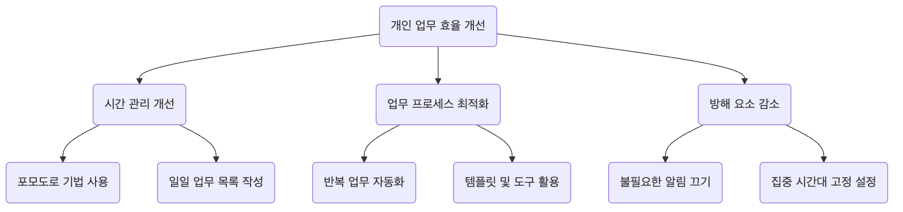

# 논리 트리 분석 튜토리얼

## 1. 논리 트리란?

**논리 트리**(Logic Tree)는 복잡한 문제나 이슈를 체계적으로 더 작은 부분으로 분해하여 분석하는 데 사용되는 강력한 시각적 도구입니다. 그 핵심 원리는 **MECE**(Mutually Exclusive, Collectively Exhaustive)입니다. 즉, 분해된 요소들이 서로 겹치지 않으며(상호 배타적), 누락된 것도 없어야 한다(완전 포괄적)는 것을 의미합니다.

논리 트리는 명확한 사고 체계를 구축하고 분석의 엄밀성과 포괄성을 보장하는 데 도움을 줍니다.

## 2. 논리 트리의 주요 유형

논리 트리는 주로 두 가지 유형으로 나뉘며, 각기 다른 성격의 문제 해결에 사용됩니다:

### a. 문제 트리 (진단 트리)

-   **목적**: 문제 발생의 "**이유(why)**"를 진단하고 탐색하는 데 사용됨.

-   **구조**: 핵심 문제(뿌리)에서 시작하여 문제의 원인이 될 수 있는 요소들을 계속 분해해 나감. 각 단계의 가지들은 이전 단계 문제에 대한 보다 심층적인 설명이 됨.

-   **적용 가능한 상황**: 근본 원인 분석, 성과 저하 진단, 오류 해결 등.

### b. "어떻게" 트리 (해결책 트리)

-   **목적**: 목표 달성이나 문제 해결을 위한 "**방법(how)**"을 개념화하고 계획하는 데 사용됨.
-   **구조**: 전체적인 목표(뿌리)에서 시작하여 구체적이고 실행 가능한 전략이나 행동 계획으로 분해됨.
-   **적용 가능한 상황**: 전략 수립, 목표 설정, 프로젝트 계획, 해결책 탐색 등.

## 3. 논리 트리를 만드는 방법?

### 단계 1: 핵심 문제 또는 목표를 명확히 정의하기

-   **문제 트리**: 분석할 "문제"를 명확히 서술합니다. 예: "왜 우리 웹사이트의 사용자 이탈률이 증가하고 있는가?"
-   **"어떻게" 트리**: 달성할 "목표"를 명확히 정의합니다. 예: "웹사이트의 월간 활성 사용자를 20% 증가시키려면 어떻게 해야 할까?"
-   이 문제 또는 목표를 논리 트리의 출발점(뿌리)으로 삼습니다.

### 단계 2: 1차 분해 수행 (MECE 원칙 적용)

-   **아이디어 발산**: 핵심 문제/목표 주변에서 어떤 주요 구성 요소로 분해할 수 있는지 생각합니다.
-   **MECE 원칙 적용**: 1차 분기점(트리의 첫 번째 가지들)은 서로 겹치지 않고(상호 배타적), 중요한 요소가 누락되지 않도록(완전 포괄적) 구성합니다.
    -   **예시 (문제 트리)**: 사용자 이탈률 증가를 "신규 사용자 이탈"과 "기존 사용자 이탈"로 분해.
    -   **예시 ("어떻게" 트리)**: 월간 활성 사용자 증가를 "신규 사용자 유치", "기존 사용자 활동 증가", "이탈 사용자 복귀"로 분해.

### 단계 3: 계층적으로 분해 계속하기

-   **계속 질문하기**: 각 가지에 대해 "왜 이런 일이 일어나는가?" (문제 트리) 또는 "이것을 구체적으로 어떻게 할 수 있는가?" ("어떻게" 트리)라는 질문을 반복하며 더 깊은 수준으로 분해합니다.
-   **명확한 구조 유지**: 문제나 해결책이 데이터로 검증 가능하거나 직접 조치를 취할 수 있을 만큼 충분히 구체적인 수준에 이를 때까지 각 단계에서 MECE 원칙을 계속 적용합니다.

### 단계 4: 가설 검증 및 우선순위 설정

-   **데이터 검증**: 문제 트리의 경우, 수집된 데이터를 통해 어떤 가지가 진짜 원인인지 검증합니다.
-   **해결책 평가**: "어떻게" 트리의 경우, 각 행동 계획의 실행 가능성, 비용, 예상 효과를 평가합니다.
-   **핵심 경로 결정**: 문제 해결이나 목표 달성에 가장 큰 영향을 미치는 핵심 원인 또는 핵심 조치를 식별하고 우선순위를 정합니다.

## 4. 실제 사례

### 사례 1: 문제 트리 - "레스토랑 수익이 감소하는 이유는 무엇인가?" 분석

<!-- mermaid 源文件：Logic-Tree-Tutorial-ko-mermaid-src-1.mmd -->

**분석**: 이 트리 다이어그램을 통해 관리자는 수익 감소의 주요 원인을 명확히 볼 수 있으며, 각 가지(예: "고객 수 감소")에 대해 데이터를 수집하여 심층 분석을 수행할 수 있습니다.

### 사례 2: "어떻게" 트리 - "개인 업무 효율을 어떻게 개선할 수 있을까?" 계획

<!-- mermaid 源文件：Logic-Tree-Tutorial-ko-mermaid-live-1.mmd -->

**분석**: 이 트리 다이어그램은 추상적인 목표를 구체적이고 실행 가능한 단계로 분해하여 개인이 명확한 개선 계획을 세울 수 있도록 도와줍니다.

논리 트리는 컨설턴트, 제품 기획자, 전략 기획자에게 필수적인 핵심 역량 중 하나로, 사고의 깊이와 폭을 크게 향상시켜 줍니다.