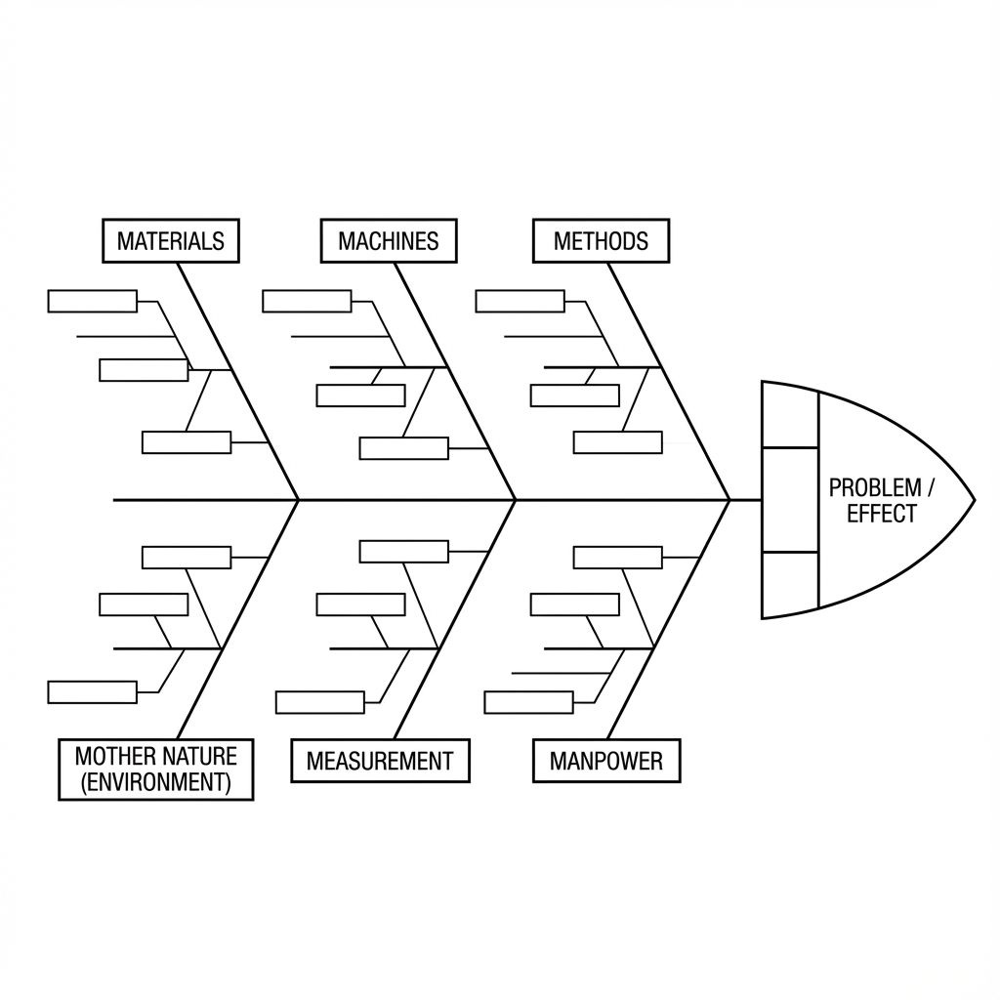

# 피시본 다이어그램(Ishikawa 다이어그램)

복잡한 문제가 발생할 때, 그 근본 원인은 종종 단일 요인이 아니라 서로 연결된 다양한 요인들의 복합적인 결과입니다. 직관에만 의존하면 중요한 잠재적 원인들을 간과하기 쉽습니다. **피시본 다이어그램**(Fishbone Diagram)은 발명자인 이시카와 가오루(Kaoru Ishikawa) 박사의 이름을 따서 **이시카와 다이어그램**(Ishikawa Diagram)이라고도 불리며, 강력한 시각적 **근본 원인 분석**(Root Cause Analysis) 도구입니다. 이 도구의 핵심 목적은 팀이 특정 문제(결과)로 이어지는 모든 잠재적 원인들을 구조화된 틀(물고기 뼈대 모양)을 통해 **체계적이고 포괄적으로** 브레인스토밍하고 정리할 수 있도록 돕는 것입니다.

피시본 다이어그램의 매력은 그 **구조화된 브레인스토밍** 과정에 있습니다. 이 도구는 팀이 미리 정의된 다양한 관점(물고기의 "주요 뼈대")에서 생각하도록 유도하는 고전적인 원인 범주들을 제공하여 사고의 사각지대를 피할 수 있도록 합니다. "인력(Man), 설비(Machine), 자재(Material), 방법(Method), 환경(Environment)"과 같은 가능한 모든 요소들을 한 다이어그램에 제시함으로써, 팀은 문제의 복잡성을 종합적이고 전체적으로 이해할 수 있고, 이를 바탕으로 심층 조사와 검증이 가장 필요한 핵심 원인들을 식별할 수 있습니다. 이는 팀의 산만한 아이디어들을 논리적이고 체계적인 "문제 파노라마"로 정리하는 뛰어난 도구입니다.

## 피시본 다이어그램의 구조

피시본 다이어그램은 다음과 같은 시각적이고 고정된 구성 요소들로 이루어져 있습니다:

*   **물고기 머리**(Fish Head): 다이어그램 오른쪽 끝에 위치하며, 보통 상자에 넣어 표현되며, 분석하고자 하는 **문제 또는 결과**가 들어갑니다. 예를 들어, "이번 달 제품 불량률이 20% 증가함"과 같은 문제입니다.
*   **등뼈**(Spine): 물고기 머리에서 왼쪽으로 뻗은 수평의 주요 선입니다.
*   **주요 뼈**(Main Bones): 등뼈에서 대각선 방향으로 뻗은 가지들로, 문제에 기여하는 주요 **원인 범주**를 나타냅니다. 이러한 범주들은 사고의 구조를 제공합니다.
*   **하위 가지/작은 뼈**(Sub-Branches/Small Bones): 주요 뼈에서 뻗은 더 작은 가지들로, 팀원들이 각 주요 범주 아래에서 브레인스토밍한 보다 구체적인 **잠재적 원인**들을 나타냅니다.

### 고전적인 원인 분류 모델(주요 뼈)

분석 대상 산업에 따라 피시본 다이어그램의 주요 뼈 분류에 적합한 고전적인 모델을 유연하게 선택할 수 있습니다:

*   **제조업에서 흔히 사용되는 "6M" 모델**:

    *   **인력**(Manpower): 작업자의 기술, 경험, 책임감, 피로 등
    *   **설비**(Machine): 생산 장비의 노후화, 정밀도, 유지보수 상태 등
    *   **자재**(Material): 원자재의 품질, 사양, 공급업체의 안정성 등
    *   **방법**(Method): 작업 절차, 운영 지침, 공정 파라미터 설정 등
    *   **측정**(Measurement): 측정 도구의 정확도, 검사 기준, 데이터 기록의 정확성 등
    *   **환경**(Milieu/Mother Nature): 작업장의 온도, 습도, 조명, 조직 문화 등

*   **서비스업에서 흔히 사용되는 "4S" 또는 "8P" 모델**:

    *   **4S**: 공급업체(Suppliers), 시스템(Systems), 주변 환경(Surroundings), 기술(Skills)
    *   **8P**: 제품(Product/서비스), 가격(Price), 유통(Place/채널), 프로모션(Promotion), 인력(People), 프로세스(Process), 물리적 증거(Physical Evidence), 생산성 및 품질(Productivity & Quality)

## 피시본 다이어그램 작성 및 사용 방법

1.  **단계 1: "물고기 머리"(문제) 명확히 정의하기**
    팀과 함께 분석할 문제에 대해 명확하고 구체적이며 모호하지 않은 합의를 이룹니다. 이 문제 진술을 화이트보드 오른쪽 끝의 "물고기 머리" 위치에 기록합니다.

2.  **단계 2: "등뼈"와 "주요 뼈"(원인 범주) 그리기**
    주요 선을 그리고, 산업과 문제 특성에 따라 적절한 분류 모델(예: 6M)을 선택하여 여러 주요 뼈를 그리고 범주 이름을 표기합니다.

3.  **단계 3: "하위 가지/작은 뼈"(구체적 원인) 브레인스토밍 및 기록**
    *   이는 피시본 다이어그램의 핵심 부분입니다. 진행자는 팀을 이끌어 **각** 주요 뼈 범주에 대해 가능한 모든 구체적 원인들을 브레인스토밍합니다.
    *   **핵심 기법**: 각 구체적 원인 아래에서 **5 Why(5단계 Why)** 기법을 활용하여 연속적인 "왜?" 질문을 통해 더 깊은 원인을 찾을 수 있습니다. 예를 들어, "인력" 주요 뼈에서 한 원인으로 "직원의 작업 오류"가 있을 수 있습니다. 여기서 "왜 오류가 발생했나요?"라고 계속 묻다 보면 "교육 부족"이라는 더 깊은 원인을 찾아내고, 이는 작은 뼈로 그려집니다.
    *   모든 원인들을 하위 가지 또는 작은 뼈로 연결하여 해당 주요 뼈에 연결합니다.

4.  **단계 4: 피시본 다이어그램 분석, 핵심 원인 식별**
    피시본 다이어그램이 완성되면 문제의 원인에 대한 전반적인 파노라마를 제공합니다. 이 시점에서 팀은 전체 다이어그램을 함께 검토하고 토론, 투표 또는 간단한 데이터 검증을 통해 문제를 유발할 가능성이 가장 높거나 가장 큰 영향을 미치는 **"핵심 소수 원인**(vital few)을 식별합니다. 이러한 핵심 원인들은 다른 색 펜으로 원을 칠 수 있습니다.

5.  **단계 5: 후속 검증 및 개선 계획 수립**
    피시본 다이어그램 자체는 브레인스토밍 및 분석 도구일 뿐, 문제를 직접 해결할 수는 없습니다. 다음으로 팀은 원을 친 핵심 원인들에 대해 구체적인 검증 계획을 수립해야 합니다(예: 현장에서 데이터를 수집하여 가설이 맞는지 검증). 이를 바탕으로 최종적인 개선 조치를 마련합니다.

## 적용 사례

**사례 1: "앱 크래시 비율 증가" 문제 분석**

*   **물고기 머리**: 최신 버전 출시 후 사용자 앱 크래시 비율이 50% 증가함.
*   **주요 뼈**: 소프트웨어 개발 모델 변형을 사용할 수 있음. 예: 코드, 빌드, 테스트, 환경, 인력.
*   **분석**: 팀의 브레인스토밍을 통해 "코드" 주요 뼈에서 "새로운 서드파티 라이브러리의 메모리 누수"를 발견할 수 있고, "테스트" 주요 뼈에서는 "자동 테스트 케이스가 저사양 안드로이드 기기를 커버하지 못함"을 발견할 수 있습니다. 이후 데이터 검증을 통해 팀은 "메모리 누수"가 크래시의 주요 원인임을 확인했습니다.

**사례 2: "마케팅 캠페인 성과 부진" 분석**

*   **물고기 머리**: 이번 "광군제"(싱글데이) 프로모션의 매출이 목표에 미달함.
*   **주요 뼈**: 마케팅의 4P 모델 사용 가능: 제품(Product), 가격(Price), 유통(Place), 프로모션(Promotion).
*   **분석**: 팀은 "가격" 주요 뼈에서 "쿠폰 규칙이 너무 복잡해서 사용자가 이해하기 어려움"을 발견했고, "유통" 주요 뼈에서는 "소셜 미디어 광고가 타겟 오디언스에게 정확히 전달되지 않음"을 발견했습니다. 이러한 분석을 통해 팀은 다음 캠페인을 위한 명확한 "피해야 할 포인트"를 제시할 수 있었습니다.

**사례 3: "환자 수술 후 감염률 증가" 분석**

*   **물고기 머리**: 이번 분기 정형외과 병동의 수술 후 감염률이 전 분기 대비 5% 증가함.
*   **주요 뼈**: 의료 분야에 맞는 6M 모델 사용.
*   **분석**: 의사, 간호사, 감염 관리 전문가로 구성된 다학제 팀이 공동으로 피시본 다이어그램을 작성했습니다. 결국 "방법" 주요 뼈에서 "수술 전 피부 소독 절차 미준수", "환경" 주요 뼈에서 "병동 환기 시스템 필터 교체 지연"이 가장 의심스러운 핵심 원인임을 발견했습니다. 다음 단계로 이 두 지점에 대한 데이터 수집과 현장 관찰을 집중적으로 수행할 예정입니다.

## 피시본 다이어그램의 장점과 도전 과제

**핵심 장점**

*   **구조화되고 포괄적**: 팀이 여러 차원에서 체계적으로 사고할 수 있도록 명확한 구조를 제공하며, 누락을 효과적으로 방지합니다.
*   **팀 참여와 합의 촉진**: 팀 협업에 탁월한 도구로, 모든 구성원의 지혜를 모으고 문제의 복잡성에 대해 합의를 이끌어냅니다.
*   **시각적**: 복잡한 인과 관계를 직관적이고 명확하게 표현합니다.

**잠재적 도전 과제**

*   **과도하게 복잡해질 수 있음**: 매우 복잡한 문제의 경우 피시본 다이어그램이 너무 커지고 복잡해져 명확한 초점을 잃을 수 있습니다.
*   **원인의 가중치 반영 불가**: 피시본 다이어그램 자체로는 어떤 원인이 더 큰 영향을 미치는지를 보여주지 않습니다. 파레토 분석과 같은 다른 도구와 결합하여 우선순위를 결정해야 합니다.
*   **"가설"의 집합일 뿐임**: 데이터로 검증되기 전까지 피시본 다이어그램의 모든 "원인"은 여전히 "잠재적이고 의심스러운" 원인일 뿐, 사실은 아닙니다.

## 확장 및 연계 도구

*   **5 Why(5단계 Why)**: 피시본 다이어그램의 황금 파트너입니다. 피시본 다이어그램으로 수평적이고 광범위한 원인 브레인스토밍을 할 때, 특정 원인에 대해 5 Why를 사용하여 수직적이고 심층적인 근본 원인 분석을 즉시 수행할 수 있습니다.
*   **브레인스토밍**: 피시본 다이어그램은 브레인스토밍을 위한 구조화된 틀을 제공하여 아이디어 생성을 더 체계적이고 집중적으로 만들 수 있습니다.
*   **파레토 분석**: 피시본 다이어그램으로 모든 잠재적 원인을 식별한 후 데이터를 수집하고 파레토 분석을 사용하여 문제의 80%를 유발하는 "핵심 소수 원인"을 결정할 수 있습니다.

---
*참고 자료: 이시카와 가오루 박사는 일본 전후 품질관리 운동의 선구자 중 한 명입니다. 그가 발명한 "7대 품질관리 도구" 중 하나인 피시본 다이어그램은 전 세계적으로 품질 관리 및 지속적 개선 활동에 널리 사용되며, 전통적 품질관리(TQM)와 식스 시그마(Six Sigma) 실천에서 필수적인 기본 도구입니다.*