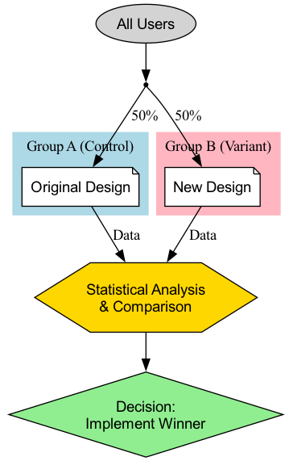

# A/B 테스트

제품 설계 및 마케팅에서 우리는 흔히 주관적인 선택의 갈림길에 마주치게 됩니다. 빨간 버튼이 더 매력적일까요, 아니면 초록색 버튼이 더 나을까요? "지금 구매"라는 문구가 더 효과적일까요, 아니면 "장바구니에 담기"가 더 나을까요? 회의실에서 직관이나 끝없는 토론에 의존하는 대신, 실제 사용자의 데이터를 통해 답을 얻는 것이 더 낫습니다. **A/B 테스트**(A/B Testing), 또는 **스플릿 테스트**(Split Testing)는 엄격하고 강력한 데이터 기반의 **온라인 통제 실험 방법**입니다. 이 방법의 핵심은 사용자 트래픽을 무작위로 두 개 이상의 그룹으로 나누고, 각각 다른 버전의 동일한 페이지(버전 A와 버전 B)를 보여주어 특정 목표(예: 클릭률, 전환율 등)를 달성하는 데 있어 어떤 버전이 더 효과적인지를 비교하고 판단하는 것입니다.

A/B 테스트의 본질은 과학적 실험의 논리를 제품 및 마케팅 결정에 적용하는 데 있습니다. 여기에는 "**무작위성**(randomness)"이라는 핵심 요소가 포함되며, 이는 사용자 출처, 접근 시간 등 다른 모든 잠재적 혼란 요인을 제거하여 우리가 만든 단일 변경 사항이 결과의 차이를 초래했음을 높은 신뢰도로 귀인할 수 있게 합니다. 이는 "이 디자인이 더 나을 것 같다"는 주관적 가정을 "데이터에 따르면 버전 B는 버전 A보다 전환율이 15% 더 높으며 통계적으로 유의미하다"는 객관적 결론으로 바꾸어 주며, 이는 현대의 데이터 기반 성장 문화에서 필수적인 핵심 도구가 되었습니다.

## A/B 테스트의 핵심 구성 요소

표준적인 A/B 테스트는 다음과 같은 핵심 요소로 구성됩니다:

*   **가설**(Hypothesis): 테스트를 시작하기 전에 명확하고 검증 가능한 가설이 필요합니다. 예를 들어, "등록 버튼을 파란색에서 주황색으로 변경하면(변경 사항), 주황색이 페이지에서 더 두드러지기 때문에(이유) 신규 사용자의 등록 전환율이 증가할 것이라고 믿습니다(예상 결과)."
*   **대조군**(Control Group, Version A): 현재 온라인에 배포된 원본 버전으로, 변경 사항이 없는 상태입니다. 모든 비교의 기준선 역할을 합니다.
*   **실험군**(Variation Group, Version B): 단일 변경 사항을 적용한 새로운 버전으로, 더 나은 결과를 가져올 것으로 기대됩니다.
*   **단일 변수 원칙**(Single Variable Principle): 표준적인 A/B 테스트에서는 하나의 변수만 테스트해야 합니다. 버튼 색상과 문구를 동시에 변경했다면, 버전 B가 성공하더라도 어떤 변경 사항이 결정적인 영향을 미쳤는지 파악할 수 없습니다.
*   **무작위 트래픽 할당**(Random Traffic Allocation): 사용자 트래픽은 버전 A와 버전 B에 무작위로 균등하게 분배되어야 합니다. 이는 공정하고 신뢰할 수 있는 테스트 결과를 보장하기 위한 과학적 전제입니다.
*   **목표 지표**(Target Metric): 테스트 성공 여부를 측정할 수 있는 명확하고 수치화 가능한 지표가 필요합니다. 이 지표는 가설과 직접적으로 관련되어야 하며, 예를 들어 "클릭률", "전환율", "페이지 평균 체류 시간" 등이 될 수 있습니다.

### A/B 테스트 워크플로우

## A/B 테스트 수행 방법

1.  **1단계: 조사 및 가설 수립**
    데이터 분석(예: 사용자 행동 히트맵), 사용자 피드백 또는 경험적 평가를 기반으로 현재 제품 또는 프로세스에서 문제가 있을 수 있는 부분을 찾아내고, 구체적이고 검증 가능한 개선 가설을 제시합니다.

2.  **2단계: 변형 버전 생성**
    가설에 따라 실험군(버전 B)을 설계하고 개발합니다. 버전 B와 버전 A의 유일한 차이점이 테스트하려는 변수임을 보장해야 합니다.

3.  **3단계: 목표 및 표본 크기 결정**
    *   성공을 측정할 핵심 지표를 명확히 정의합니다.
    *   테스트 시작 전에 **표본 크기 계산기**(sample size calculator)를 사용하여 결과가 충분한 **통계적 검정력**(statistical power)을 가지기 위해 얼마나 많은 사용자가 테스트에 참여해야 하는지 추정해야 합니다. 표본 크기가 너무 작으면 실제로 존재하는 차이를 감지하지 못할 수 있습니다.

4.  **4단계: 테스트 실행**
    전문적인 A/B 테스트 도구(예: Google Optimize, Optimizely 등)를 사용하여 테스트를 구성합니다. 트래픽 할당 비율(보통 50/50)을 설정하고 테스트를 시작합니다.

5.  **5단계: 결과 모니터링 및 분석**
    사전 설정된 표본 크기 또는 통계적 유의성 수준에 도달할 때까지 테스트를 충분히 실행합니다. 그런 다음 테스트 결과를 분석합니다. 여기서 주목해야 할 두 가지 핵심 통계 개념은 다음과 같습니다:
    *   **전환율 차이**(Conversion Rate Difference): 버전 B가 버전 A 대비 얼마나 향상되었는지를 퍼센트로 나타낸 값입니다.
    *   **통계적 유의성**(Statistical Significance): 일반적으로 **P-값**(P-value)으로 표현됩니다. P-값은 "관찰된 차이가 우연에 의한 것일 확률"을 나타냅니다. 일반적으로 P-값이 0.05 미만일 때(즉, 95% 신뢰 수준), 결과가 통계적으로 유의미하고 신뢰할 수 있다고 판단합니다.

6.  **6단계: 결론 도출 및 실행**
    *   버전 B가 유의미하게 우승했다면 축하할 일입니다. 가설이 검증된 것이며, 다음 단계는 버전 B를 모든 사용자에게 전면 배포하는 것입니다.
    *   버전 A가 우승했거나 두 버전 사이에 유의미한 차이가 없다면, 이 역시 귀중한 학습 기회입니다. 이는 초기 가설이 잘못되었음을 의미하므로, 다시 분석하여 다음 테스트를 위한 새로운 가설을 제시해야 합니다.

## 적용 사례

**사례 1: 오바마 캠프의 기부 페이지 최적화**

*   **상황**: 2008년 미국 대선 당시 오바마 캠프는 공식 웹사이트의 기부 페이지를 최적화하여 등록 및 기부 전환율을 향상시키고자 했습니다.
*   **A/B 테스트 적용**: 이들은 페이지의 히어로 이미지와 버튼 문구에 대해 광범위한 A/B 테스트(엄밀히 말하면 다변량 테스트)를 진행했습니다. 유명한 한 테스트에서 히어로 이미지를 오바마 단독 사진에서 가족 사진으로 변경하고, 버튼 문구를 "등록하기(Sign Up)"에서 "자세히 알아보기(Learn More)"로 바꾸었더니 페이지의 등록 전환율이 놀라운 **40.6%** 증가했습니다. 이 테스트는 캠프에 수천만 달러의 추가 기부금을 가져다주었습니다.

**사례 2: Booking.com의 지속적인 테스트 문화**

*   **상황**: 세계 최대 온라인 호텔 예약 플랫폼인 Booking.com은 극단적인 A/B 테스트 문화로 유명합니다.
*   **적용**: 알려진 바에 따르면 Booking.com은 언제나 수천 개의 A/B 테스트를 동시에 실행하고 있습니다. 검색 결과 정렬 방식부터 호텔 이미지 크기, "남은 객실 X개!"라는 문구에 이르기까지, 모든 변경 사항은 엄격한 A/B 테스트를 거쳐야 합니다. 이러한 극단적인 데이터 기반 의사결정 추구는 사용자 경험을 지속적이고 점진적으로 최적화하여 강력한 경쟁 장벽을 구축할 수 있게 해줍니다.

**사례 3: 뉴스 웹사이트의 유료 구독제 테스트**

*   **상황**: 한 뉴스 웹사이트는 유료 구독 모델을 실험하고 싶었지만, 어떤 페이월 전략이 사용자 결제 전환율과 유지율에 가장 유리할지 확신이 없었습니다.
*   **A/B 테스트 적용**:
    *   **버전 A**(Metered): 모든 사용자가 매달 5개의 기사를 무료로 읽을 수 있고, 그 이상은 결제를 유도합니다.
    *   **버전 B**(Freemium): 일부 기사는 무료이지만, 심층 보도나 독점 칼럼과 같은 "프리미엄 콘텐츠"는 유료 구독자만 볼 수 있습니다.
    *   수개월간의 장기 테스트를 통해 두 모델의 결제 전환율, 사용자 이탈률, 총 구독 수익을 비교하여 자신들에게 가장 적합한 비즈니스 모델을 선택할 수 있었습니다.

## A/B 테스트의 장점과 도전 과제

**핵심 장점**

*   **객관적이고 데이터 기반**: 주관적인 추측과 논쟁을 실제 사용자 행동 데이터로 대체하여 의사결정에 가장 강력한 근거를 제공합니다.
*   **저위험 혁신**: 전체 배포 전 소규모 트래픽으로 변경 사항의 효과를 테스트함으로써 잘못된 결정으로 인한 부정적 영향의 위험을 크게 줄입니다.
*   **지속적 최적화 엔진**: 제품과 마케팅을 지속적이고 반복적으로 최적화할 수 있는 과학적이고 엄격한 사이클 구조를 제공합니다.

**잠재적 도전 과제**

*   **충분한 트래픽 필요**: 트래픽이 적은 웹사이트나 앱의 경우 통계적 유의성을 달성하는 데 매우 오랜 시간이 걸리거나 불가능할 수도 있습니다.
*   **단일 변수 제한**: 때로는 여러 변경 사항의 조합이 예상치 못한 시너지 효과를 낼 수 있지만, 표준 A/B 테스트에서는 이를 발견할 수 없습니다(더 복잡한 다변량 테스트가 필요).
*   **"지역 최적화" 함정**: 기존 페이지에서 지속적으로 소규모 A/B 테스트를 수행하면 "지역 최적화" 함정에 빠져 혁신적인 대규모 리디자인 기회를 놓칠 수 있습니다.
*   **장기적 영향 무시**: A/B 테스트는 일반적으로 단기적 효과(예: 클릭률)를 측정합니다. 어떤 변경 사항은 단기적으로 지표를 개선할 수 있지만, 장기적으로는 사용자 신뢰나 브랜드 이미지에 해를 끼칠 수 있습니다.

## 확장 및 관련 개념

*   **다변량 테스트**(Multivariate Testing, MVT): A/B 테스트의 확장입니다. 페이지의 여러 요소에 대한 **여러 조합**을 동시에 테스트하고자 할 때(예: 3가지 제목, 2가지 이미지, 2가지 버튼 색상 테스트) 사용할 수 있습니다. 이는 어떤 요소 조합이 가장 효과적인지를 알려줄 뿐만 아니라 각 요소가 최종 결과에 기여한 상대적 비중도 파악할 수 있습니다.
*   **사용성 테스트**(Usability Testing): 질적 연구 방법입니다. "어느 버전이 더 좋은지"는 알려줄 수 없지만, 사용자가 특정 버전에서 어려움을 겪은 "**이유**"를 알려줄 수 있습니다. 일반적으로 A/B 테스트 전에 사용성 테스트를 수행하여 "무엇을 테스트할지"에 대한 영감을 얻을 수 있습니다.

---
*출처 참고: A/B 테스트의 개념은 고전적인 통계적 실험 설계에서 비롯되었습니다. 인터넷 분야에서는 처음으로 구글과 아마존 같은 기술 기업들이 웹사이트 및 제품 최적화에 이를 널리 적용했으며, 이후 디지털 마케팅과 성장 해킹의 핵심 역량으로 자리 잡게 되었습니다.*