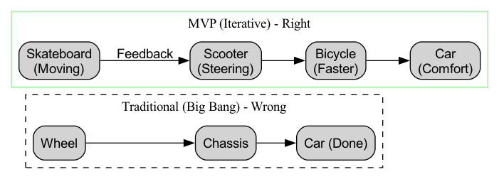

# MVP (최소 기능 제품)

불확실한 스타트업의 세계에서 열정적인 팀들이 수개월 또는 수년간 모든 자원을 쏟아부어 자신들이 마음속으로 완벽하게 설계한 "궁극의 제품"을 만들지만, 정작 제품을 출시했을 때 시장이 전혀 필요로 하지 않는다는 냉혹한 현실에 직면하는 경우가 많습니다. **MVP(Minimum Viable Product, 최소 기능 제품)**은 "진공 상태에서 제품을 만드는(Building in a vacuum)" 이러한 대규모 낭비를 피하기 위해 린 스타트업(Lean Startup) 방법론에서 제안된 핵심 개념입니다.

MVP는 "거칠다(shoddy)"나 "미완성(unfinished)"의 동의어가 아닙니다. 정의하자면, MVP는 시장에 출시하여 제품의 핵심 가치 제안을 최소한의 비용과 가장 짧은 시간 안에 검증할 수 있는 **가장 적은 기능만 포함한 제품 버전**입니다. MVP의 본질적인 목적은 "제품 자체"가 아니라 **학습 프로세스**입니다. 이는 "사용자 문제"와 "해결책"에 대한 핵심 가정을 빠르게 실제 시장에 투입하여, 최소한의 비용으로 "**이 방향이 올바른가?**"라는 가장 귀중한 인사이트를 얻기 위한 과학적 실험 도구입니다.

## MVP의 핵심 개념

*   **최소(Minimum)**: 핵심 가정을 검증하는 데 **필수적인** 기능만 포함합니다. 부가적이고 필요하지 않은 기능들은 과감하게 제거해야 합니다. "더 많이 하기(Doing more)"가 아니라 "**덜 하기(Doing less)**"를 추구합니다.
*   **실행 가능(Viable)**: 기능은 최소화되었지만, 반드시 **사용 가능하고 핵심 사용자 문제를 해결**해야 합니다. 초기 "**얼리 어답터(Early Adopters)**"가 이를 시도할 만한 충분한 가치를 제공해야 합니다.
*   **제품(Product)**: 사용자가 실제로 상호작용할 수 있고, 실제 행동과 피드백을 생성하는 **실제 제품**(혹은 실제처럼 보이는 제품)입니다.

MVP의 본질은 "**빌드 -> 릴리스 -> 학습**"이라는 전통적인 긴 선형 프로세스를 "**빌드-측정-학습**"이라는 빠르고 민첩한 피드백 루프로 전환하는 것입니다.

### MVP와 전통적인 제품 개발 사고 비교

당신의 목표가 자동차를 만드는 것이라고 상상해 보세요.

## 어떻게 MVP를 정의하고 구축할 것인가?

1.  **단계 1: 핵심 문제와 사용자부터 시작**
    "우리가 어떤 기능을 만들 수 있을까?"라는 질문 대신 "**우리가 누구의 어떤 빈번한 고통스러운 문제를 해결하고 있는가?**"라는 질문을 하세요. 타겟 사용자(얼리 어답터)와 그들의 핵심 고통 포인트를 명확히 정의하세요.

2.  **단계 2: 사용자 여정을 매핑하고 핵심 경로 식별**
    사용자가 문제를 해결하기 위해 거쳐야 할 주요 단계를 정리하세요. 그런 다음 사용자가 이 가장 핵심적이고 가치 있는 경로를 완료하는 데 필요한 **필수적인** 기능들을 식별합니다.

3.  **단계 3: 기능 우선순위 과감히 정하기**
    생각 가능한 모든 기능을 나열하세요. 그런 다음 우선순위 매트릭스(예: "중요도-긴급도" 매트릭스)나 다른 방법을 사용하여 기능들에 우선순위를 매깁니다. 스스로에게 물어보세요: "**이 기능을 제거하더라도 사용자가 제품의 핵심 가치를 경험할 수 있는가?**" 대답이 "예"라면, 과감히 "향후 버전" 목록에 넣으세요.

4.  **단계 4: 적절한 MVP 유형 선택**
    MVP는 반드시 코딩이 필요한 소프트웨어일 필요는 없습니다. 당신의 제품 유형과 검증하고자 하는 가정에 따라 다양한 "완성도"의 MVP를 선택할 수 있습니다:
    *   **랜딩 페이지 MVP**: 가치 제안을 명확히 설명하고 "지금 등록하기" 또는 "자세히 알아보기" 버튼을 포함한 간단한 소개 페이지를 만들어 아이디어에 대한 시장 반응을 테스트합니다.
    *   **"오즈의 마법사(Wizard of Oz)" MVP**: 사용자 입장에서는 완전히 자동화된 시스템과 상호작용한다고 느끼지만, 실제로는 모든 작업이 창업자에 의해 **수동으로** 처리됩니다. 이 방식은 복잡한 서비스의 핵심 프로세스와 사용자 니즈를 매우 낮은 비용으로 검증할 수 있습니다.
    *   **"콘시어지(Concierge)" MVP**: "오즈의 마법사"와 유사하지만 시스템인 척하지도 않습니다. 대신 직접 첫 번째 사용자들에게 마치 개인 콘시어지처럼 일대일 수동 서비스를 제공하며, 이 과정에서 그들의 니즈와 행동 패턴을 깊이 있게 파악합니다.
    *   **단일 기능 MVP**: 제품의 가장 핵심적이고 중요한 기능만 개발하여 완성도를 높입니다.

5.  **단계 5: 출시, 측정, 학습**
    가능한 빨리 MVP를 첫 번째 얼리 어답터들에게 전달하세요. 그런 다음 정성적 및 정량적 방법을 통해 사용자의 행동과 피드백을 면밀히 관찰하세요. 핵심 질문에 답해야 합니다: "**우리의 핵심 가정은 검증되었는가?**" "**사용자들이 이 해결책에 대해 비용을 지불할 의향이 있는가?**" "**다음에 무엇을 해야 할까? (계속 최적화, 전환, 중단)**"

## 대표적인 적용 사례

**사례 1: Zappos (미국 최대 온라인 신발 유통업체)**

*   **핵심 가정**: "사람들이 신어보지도 않고 온라인으로 신발을 구매할 의향이 있을까?"
*   **MVP**: 창업자 Nick Swinm은 대규모 창고와 물류 시스템을 처음부터 구축하지 않았습니다. 그는 지역 신발 가게에 가서 신발 사진을 찍어 간단한 웹사이트에 올렸습니다. 사용자가 주문을 하면 그는 **직접 해당 가게에 가서 신발을 구입한 후** 사용자에게 우편으로 보냈습니다. 이 "오즈의 마법사" MVP는 재고 비용이 거의 들지 않으면서도 핵심 비즈니스 가정을 성공적으로 검증했습니다.

**사례 2: Dropbox (클라우드 저장 서비스)**

*   **핵심 가정**: "파일을 배경에서 자동으로 동기화하는 솔루션이 사용자에게 매력적일까?"
*   **MVP**: 당시 기술적으로 매우 복잡하고 시간이 많이 걸리는 크로스 플랫폼 동기화 제품을 실제로 개발하는 대신, 창업자 Drew Houston은 3분짜리 **제품 데모 영상**을 만들었습니다. 이 영상에서 그는 Dropbox가 어떻게 작동하고 사용자의 어떤 고통 포인트를 해결할 수 있는지 생생하게 보여주었습니다. 그는 이 영상을 기술 애호가 커뮤니티에 올리고 간단한 랜딩 페이지에 이메일 등록을 추가했습니다. 단 하루 만에 수만 개의 등록이 몰리며 이 솔루션에 대한 거대한 시장 수요가 입증되었습니다.

**사례 3: Buffer (소셜 미디어 관리 도구)**

*   **핵심 가정**: "사람들이 소셜 미디어 콘텐츠 예약 기능을 제공하는 도구에 비용을 지불할 의향이 있을까?"
*   **MVP**: 창업자 Joel Gascoigne는 극히 단순한 **두 페이지짜리 랜딩 페이지**를 만들었습니다. 첫 번째 페이지에서는 Buffer가 무엇이고 어떻게 작동하는지 설명하며 "요금제 및 가격" 버튼을 배치했습니다. 사용자가 이 버튼을 클릭하면 두 번째 페이지로 이동했는데, 거기엔 "안녕하세요! 저희가 아직 준비되지 않았다는 걸 알고 계셨나요? 출시되면 알려드리겠습니다. 이메일을 입력해 주세요."라고 적혀 있었습니다. "가격" 버튼을 클릭한 사용자 수를 분석함으로써 그는 사람들이 단순히 아이디어에 관심이 있는 것이 아니라 비용 지불 의향도 있다는 것을 검증했습니다.

## MVP의 장점과 도전 과제

**핵심 장점**

*   **최대한의 학습 가치 창출**: 최소한의 비용으로 시장과 사용자에 대한 가장 귀중한 인사이트를 얻을 수 있어 스타트업 리스크를 크게 줄입니다.
*   **학습 사이클 가속화**: "아이디어"에서 "시장 피드백"까지의 시간을 획기적으로 단축합니다.
*   **핵심 가치에 집중**: 팀이 사용자의 가장 핵심적인 문제 해결에 집중하도록 강제하여 불필요한 기능에 자원을 낭비하지 않도록 합니다.
*   **조기에 사용자 관계 구축**: 얼리 어답터와 더 빠르게 연결되어 제품의 공동 창출 파트너로 발전시킬 수 있습니다.

**잠재적 도전 과제**

*   **"최소(Minimum)"에 대한 오해**: 팀 내에서 "최소"의 정의에 대해 쉽게 의견 대립이 발생할 수 있습니다. MVP는 거칠다는 의미가 아니라 "실행 가능(Viable)"해야 하며, 핵심 가치를 제공해야 합니다.
*   **부정적인 사용자 피드백**: 얼리 어답터가 아닌 일반 사용자들은 MVP의 지나치게 단순한 기능으로 인해 나쁜 평가를 내릴 수 있으며, 이는 브랜드에 일정한 부정적 영향을 줄 수 있습니다.
*   **완벽주의 유혹**: 창업자와 엔지니어는 제품을 완벽하게 다듬으려는 충동을 자주 느낍니다. "기능 하나만 더 추가하자"는 유혹을 억누르는 것은 MVP를 구축하는 데 있어 가장 큰 도전 중 하나입니다.

## 확장 및 연계 개념

*   **린 스타트업(Lean Startup)**: MVP는 린 스타트업 방법론의 "**빌드-측정-학습**" 피드백 루프에서 핵심적인 실천 요소입니다.
*   **디자인 씽킹(Design Thinking)**: 디자인 씽킹에서 "**프로토타입(Prototype)**"이라는 개념은 MVP와 매우 밀접합니다. 일반적으로 MVP를 개발하기 전에 내부 및 사용자 테스트를 위해 낮은 완성도의 프로토타입을 먼저 제작합니다.
*   **애자일 개발(Agile Development)**: 애자일의 반복적 개발 모델은 MVP를 지속적이고 점진적으로 구축하고 개선하는 데 완벽한 엔지니어링 실천 지원을 제공합니다.

---
*참고 자료: MVP라는 개념은 처음으로 Frank Robinson이 제안했으며, Steve Blank의 "고객 개발(Customer Development)" 모델에서 발전했습니다. 이후 Eric Ries가 글로벌 베스트셀러인 "린 스타트업(The Lean Startup)"에서 이를 대중화시켜 현대 기술 스타트업 세계의 표준 용어로 자리 잡게 했습니다.*