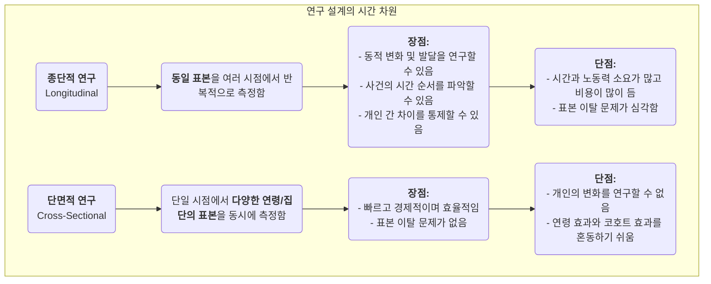

# 종단적 연구

인간 발달, 사회 변화, 질병 진화의 오랜 역사 속에서 우리는 "시간"이라는 중요한 차원을 포착할 수 있는 연구 방법이 필요합니다. **종단적 연구(Longitudinal Research)**는 바로 그러한 "카메라"로서, 확장된 기간 동안 **동일 표본**을 반복적이고 지속적으로 관찰하고 측정함으로써 현상이 **어떻게 변화하고 발전하며 진화하는지**를 드러내는 것이 핵심 목적입니다. 또한 초기 사건이 이후 결과에 미치는 장기적인 영향을 조사할 수도 있습니다.

단면적 연구(cross-sectional study)가 단일 시점에서의 "스냅샷"만 제공하는 반면, 종단적 연구는 우리에게 "다큐멘터리"를 제공합니다. 이를 통해 개인의 성장 궤적, 개념의 변화 과정, 질병의 발병에서 완전한 발현에 이르는 전체 과정을 관찰할 수 있습니다. 이는 인과 관계를 탐색할 때 사건 간의 시간적 순서를 보다 명확히 파악할 수 있게 해줍니다. "아동기 독서 습관이 성인기 소득 수준에 어떤 영향을 미치는가?" 또는 "정책 개혁이 향후 10년 동안 어떤 지속적인 영향을 미쳤는가?"와 같은 동적 과정과 발달에 대한 질문에 답하고자 할 때, 종단적 연구는 필수적이고 강력한 도구가 됩니다.

## 종단적 연구의 핵심 특성과 유형

모든 종단적 연구의 공통점은 "시간" 추적에 있습니다. 하지만 추적 대상의 성격에 따라 주로 세 가지 유형으로 나눌 수 있습니다:

*   **코호트 연구(Cohort Study)**: 가장 일반적인 유형입니다. 연구자들은 공통된 특성이나 경험(예: "2000년에 태어난 모든 아기" 또는 "2010년에 특정 회사에 입사한 직원들")을 공유하는 특정 집단(이를 "코호트"라고 함)을 선정하고 수십 년 동안 이 코호트를 지속적으로 추적합니다.
*   **패널 연구(Panel Study)**: 코호트 연구와 유사하지만, 정확히 동일한 **개별 표본**을 추적합니다. 각 조사는 동일한 사람들에게 다시 조사하여 연구자들이 각 개인의 변화 궤적을 정확하게 분석할 수 있게 합니다.
*   **추세 연구(Trend Study)**: 이 유형의 연구는 시간이 지남에 따라 "모집단(population)"의 특성 변화에 초점을 맞추지만, 각 조사에서 추출되는 개별 표본은 다릅니다. 예를 들어 환경 문제에 대한 대중의 태도 변화를 연구하기 위해 연구 기관이 5년마다 전국적으로 새로운 표본들을 무작위로 선정해 조사할 수 있습니다.

### 종단적 연구와 단면적 연구 비교

## 종단적 연구 수행 방법

1.  **장기 연구 목표 설정**
    어떤 변화나 발달을 추적하고자 하는지, 그리고 관심 있는 잠재적 영향 요인들을 명확히 정의해야 합니다. 종단적 연구는 장기적인 투자이므로 명확하고 중요한 연구 목표에 의해 뒷받침되어야 합니다.

2.  **코호트 또는 패널 표본 정의 및 선정**
    연구 대상 집단을 정확히 정의하고 적절한 표집 방법을 사용해 초기 표본을 선정합니다. 초기 표본의 질과 대표성은 매우 중요합니다.

3.  **기초 조사 수행**
    연구 시작 시점에 모든 관심 변수의 초기 상태를 측정하기 위한 첫 번째 종합적인 자료 수집(기초 조사)을 수행합니다.

4.  **후속 조사 설계 및 실행**
    이후 후속 조사의 시간 간격(예: 매년, 5년마다 등)을 결정하고 일관된 측정 도구를 설계합니다. 표본과의 지속적인 연락 유지와 이탈률 감소는 장기 연구 기간 동안 가장 큰 과제 중 하나입니다.

5.  **자료 관리 및 분석**
    종단적 데이터 구조는 복잡하므로 전문적인 데이터베이스를 통해 관리해야 합니다. 분석을 위해서는 연구자들이 성장 곡선 모델, 생존 분석 등과 같은 고급 통계 모델을 사용하여 시간에 따른 변수 변화의 궤적과 그 영향 요인을 분석합니다.

## 대표적인 적용 사례

**사례 1: 하버드 성인 발달 연구**

*   **상황**: 역사상 가장 오래 지속된 종단적 연구 중 하나로, 1938년에 시작하여 약 80년 동안 724명의 남성을 추적했습니다.
*   **적용**: 연구자들은 설문지, 인터뷰, 의료 기록 등을 통해 이들의 직장, 가족, 건강 등 다양한 데이터를 정기적으로 수집했습니다. 이 연구의 가장 유명한 결론은 부유함, 명성, 유전보다도 "좋고 따뜻한 인간관계"가 장기적인 행복과 건강을 예측하는 가장 중요한 요인이라는 것입니다. 이 결론은 오직 평생 추적을 통해 도출될 수 있었습니다.

**사례 2: 영국 밀레니엄 코호트 연구**

*   **상황**: 2000년부터 2002년 사이에 태어난 약 19,000명의 영국 아동들을 추적하는 국가적 출생 코호트 연구입니다.
*   **적용**: 연구는 여러 연령(예: 9개월, 3세, 5세, 7세, 11세, 14세, 17세)에서 건강, 인지, 행동, 가족 환경 등 다양한 측면에서 자료를 종합적으로 수집했습니다. 이 연구는 정부가 아동 및 가족 정책을 수립하는 데 있어 방대하고 귀중한 증거를 제공했으며, 특히 빈곤이 아동기 초기 발달에 미치는 장기적인 부정적 영향을 밝혀냈습니다.

**사례 3: 제품 사용자 이탈에 대한 코호트 분석**

*   **상황**: SaaS(Software as a Service) 기업이 신규 사용자의 유지율을 이해하고자 합니다.
*   **적용**: 이 회사는 **코호트 분석** 방법을 채택했습니다. "매월 등록한 신규 사용자"를 코호트(예: "1월 코호트", "2월 코호트")로 설정한 후, 등록 후 1개월, 2개월, 3개월... 동안의 유지율을 추적했습니다. 다양한 코호트의 유지 곡선을 비교함으로써 제품 개선 및 마케팅 활동이 신규 사용자의 장기 유지율에 긍정적인 영향을 미쳤는지 평가할 수 있었습니다.

## 종단적 연구의 장점과 도전 과제

**핵심 장점**

*   **동적 과정 연구 가능**: "발달"과 "변화" 자체를 연구하는 데 가장 효과적인 방법입니다.
*   **시간 순서 파악 가능**: 사건의 시간적 순서를 명확히 파악할 수 있어 인과 추론의 중요한 전제 조건이 됩니다(다만 혼란 변수에 주의해야 합니다).
*   **개인 간 차이 통제 가능**: 동일한 개인을 추적하므로 시간이 지나도 변하지 않는 개인 고유의 차이(예: 지능, 성격)가 결과에 간섭하는 것을 제거할 수 있습니다.

**잠재적 도전 과제**

*   **높은 비용**: 장기적인 재정 지원, 안정된 연구팀, 그리고 큰 관리 비용이 필요합니다.
*   **시간 소요**: 연구 결과의 산출 주기가 매우 길어질 수 있으며, 수년 또는 수십 년이 걸릴 수 있습니다.
*   **표본 이탈**: 이는 종단적 연구의 가장 큰 "천적"입니다. 시간이 지남에 따라 일부 참여자들이 이사, 연락 두절, 사망, 흥미 상실 등으로 인해 연구에서 이탈할 수 있으며, 이는 최종 표본에 편향을 초래할 수 있습니다.
*   **반복 측정의 영향**: 동일한 검사나 설문을 반복적으로 받는 것이 참여자의 행동이나 응답에 영향을 미칠 수 있으며, 이를 "연습 효과(practice effect)"라고 합니다.

## 확장 및 연계

*   **단면적 연구**: 종종 종단적 연구의 저비용, 단기 대안으로 사용됩니다. 그러나 연령 효과와 코호트 효과를 구분할 수 없다는 점에 주의해야 합니다.
*   **생존 분석**: 종단적 연구에서 자주 사용되는 통계적 방법으로, 특정 사건(예: 회복, 이탈, 사망)이 발생하기까지의 기간과 그 영향 요인을 분석하는 데 특화되어 있습니다.

---
*참고: 종단적 연구의 설계 개념은 역학과 사회과학에서 오랜 역사적 배경을 가지고 있습니다. 글렌 H. 엘더 주니어(Glen H. Elder Jr.)의 삶의 과정 이론(Life Course Theory)은 현대 종단적 연구에 중요한 이론적 틀을 제공합니다.*