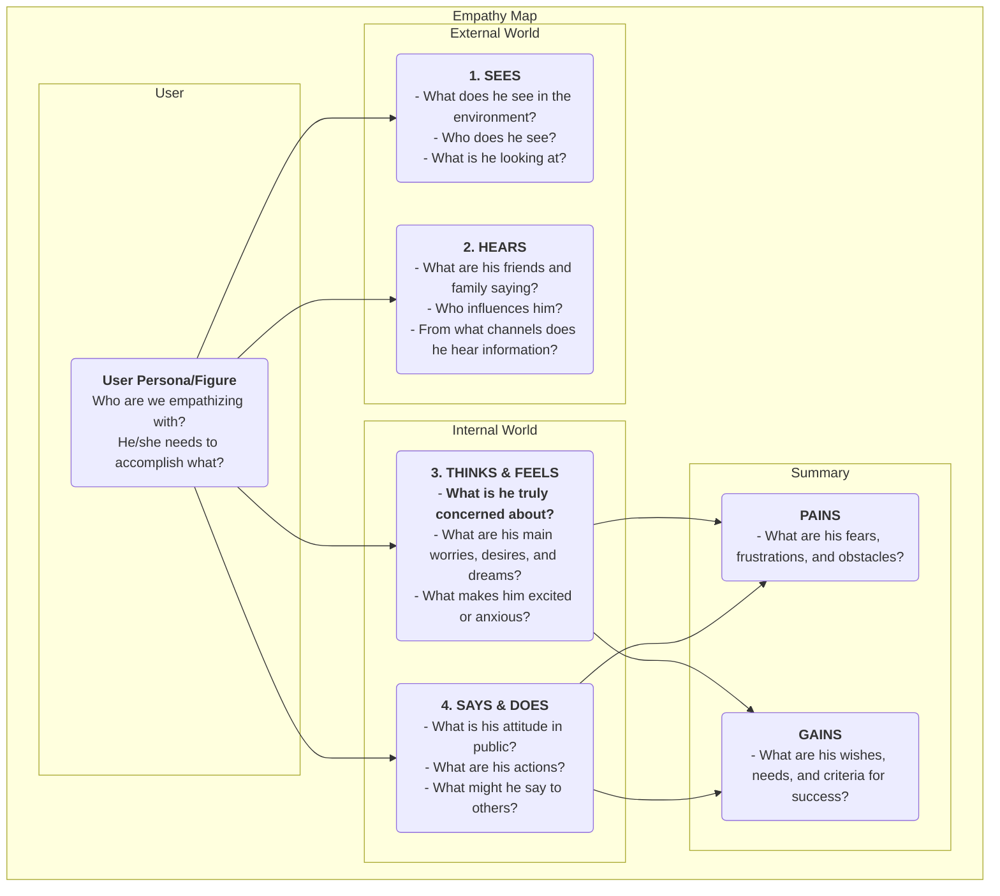

# 공감 맵(Empathy Map)

제품 설계 및 사용자 연구에서 "공감"은 자주 언급되지만 실제로 달성하기는 매우 어려운 핵심적인 자질입니다. 우리는 어떻게 진정으로 사용자의 입장에서 생각하고 그들의 세계를 직접 체험할 수 있을까요? **공감 맵**(Empathy Map)은 바로 이러한 목적을 위해 설계된 간단하고 직관적이지만 매우 강력한 **협업 기반의 공감 도구**입니다. 이 도구는 팀이 사용자의 행동 표면을 넘어 그들의 더 깊은 내면 세계인 **감각, 생각, 감정**을 탐색하여 사용자에 대한 보다 포괄적이고 다차원적인 이해를 형성하는 데 목적이 있습니다.

공감 맵의 핵심은 사용자에 대한 산재된 질적 관찰과 인터뷰 자료를 시각적인 프레임워크에 따라 체계적으로 정리하는 데 있습니다. 이 프레임워크는 일반적으로 다음과 같은 4개의 주요 구역(quadrant)으로 나뉩니다: **보는 것(Sees), 듣는 것(Hears), 생각과 감정(Thinks & Feels), 말과 행동(Says & Does)**. 팀원들이 함께 이 맵을 채우면서 사용자의 관점에서 사고하도록 강제되며, 사용자의 내면 세계와 외부 환경에 대한 공유된 이해를 공동으로 구축하게 됩니다. 이는 사용자의 진정한 상황을 분명히 반영하는 거울이자, 팀 전체의 공감 능력을 키우는 촉매제입니다.

## 공감 맵의 구성 요소

전통적인 공감 맵은 사용자 중심적이며 외부 경험과 내부 경험의 4가지 핵심 구역을 중심으로 전개됩니다.

<!--

*   **보는 것(Sees)**: 사용자가 환경에서 눈으로 보는 것들을 설명합니다. 예를 들어 주변 사람들이 무엇을 하고 있는지, 매일 접하는 시장 정보는 무엇인지 등.
*   **듣는 것(Hears)**: 사용자가 외부 세계로부터 듣는 정보를 설명합니다. 친구, 가족, 동료들이 말하는 내용은 무엇인지, 어떤 의견 리더나 미디어 채널이 영향을 주는지 등.
*   **생각과 감정(Thinks & Feels)**: 맵의 핵심 부분으로, 사용자의 내면 세계를 탐색하려 합니다. 사용자가 실제로 중요하게 여기는 것은 무엇인가(심지어 말로 표현하지 않더라도)? 걱정, 불안, 희망, 꿈은 무엇인가?
*   **말과 행동(Says & Does)**: 사용자가 공개적으로 하는 말과 행동을 설명합니다. 인터뷰에서 무엇을 말했는지, 제품 사용 시 실제 행동은 무엇인지 등. 여기서는 특히 "말한 것(says)"과 "생각(thinks)" 사이의 잠재적 모순에 주의 깊게 다뤄야 합니다.
*   **고통(Pains)**과 **이익(Gains)**: 위의 4개 구역을 분석한 후, 사용자의 내면 갈등과 욕구를 요약합니다. 고통(Pains)은 사용자가 직면하는 장애물과 부정적인 감정을 의미하고, 이익(Gains)은 사용자가 진정으로 달성하고자 하는 목표와 소망을 의미합니다.

## 공감 맵 사용 방법

공감 맵은 팀워크 기반의 워크숍 형식으로 사용하는 것이 가장 효과적입니다.

1.  **1단계: 범위와 목표 정의**
    *   **사용자 선택**: 이 공감 맵이 대상으로 삼는 구체적인 사용자 페르소나나 인물을 명확히 정의합니다. 이름과 기본적인 배경 정보를 부여하는 것이 좋습니다.
    *   **목표 명확화**: 이 연습을 통해 달성하고자 하는 목표를 정의합니다. 기존 사용자에 대한 이해를 더 깊이 하기 위한 것인지, 새로운 제품의 잠재적 사용자를 탐색하기 위한 것인지 등.

2.  **2단계: 연구 자료 수집**
    공감 맵은 허구가 아닌 실제 연구에 기반해야 합니다. 사용자 인터뷰 녹음 및 전사본, 사용성 테스트 영상, 설문조사의 자유 응답형 답변, 사용자 사진 등 관련된 모든 사용자 연구 자료를 준비합니다.

3.  **3단계: 협업하여 맵 채우기**
    *   백보드에 큰 공감 맵 템플릿을 그립니다. 또는 온라인 협업 도구를 사용할 수 있습니다.
    *   팀원들이 연구 자료에서 나온 인사이트를 포스트잇에 적어 각 구역에 배치합니다. 예를 들어, 인터뷰 녹음을 들으면서 한 팀원은 "사용자는 매주 초과 근무를 한다고 말함 (Says)"이라고 적을 수 있고, 다른 팀원은 "그가 피곤해 보이고 직장에 대한 열정을 잃은 것 같음 (Feels)"이라고 적을 수 있습니다.
    *   팀원들이 포스트잇 내용을 읽고, 그 구역에 배치한 이유를 설명하도록 장려합니다.

4.  **4단계: 깊이 있는 분석 및 통합**
    모든 정보가 보드에 정리되면, 팀이 더 깊은 토론을 이어가도록 유도합니다.
    *   "어떤 모순이 보이는가? 예를 들어, 사용자의 말과 행동이 일치하지 않는 경우?"
    *   "모든 세부 정보 뒤에 그가 진정으로 걱정하는 것은 무엇인가, 표현하지 못한 것은 무엇인가?"
    *   "예상치 못한 새로운 사실은 무엇인가?"
    *   마지막으로 팀 전체가 사용자의 가장 핵심적인 **고통(Pains)**과 **이익(Gains)**을 요약합니다.

5.  **5단계: 공유 및 적용**
    완성된 공감 맵을 정리하고 공유하며, 이후 디자인과 의사결정 과정의 중요한 입력 자료로 활용합니다.

## 적용 사례

**사례 1: 노인을 위한 스마트폰 설계**

*   **사용자**: 왕할아버지, 70세, 자녀로부터 스마트폰을 선물 받음.
*   **보는 것(Sees)**: 휴대폰 화면의 아이콘들이 작고 많아 보기 어렵고, 젊은 사람들은 모두 모바일 결제와 채팅을 사용 중.
*   **듣는 것(Hears)**: 자녀들이 "매우 간단하니 금방 배울 수 있을 거야"라고 말하고, 친구들은 "그건 너무 복잡해서 배우기 어려워"라고 말함.
*   **생각과 감정(Thinks & Feels)**: 기술에 뒤처질까봐 매우 **좌절**하며, 동시에 손주들과 영상 통화를 하고 싶어 **배우고자 하는 열망**이 있음.
*   **말과 행동(Says & Does)**: "난 필요 없어"라고 말하지만, 몰래 화면 잠금을 반복해서 시도함.
*   **고통(Pains)**: 실수로 손해를 입을까 두렵고, 기술에 의해 소외된 느낌을 받음.
*   **이익(Gains)**: 가족과 더 가까운 관계를 유지하고 싶으며, 일부 일상 업무(예: 버스 노선 확인)를 독립적으로 수행하고 싶음.
*   **디자인 영감**: 이 스마트폰의 핵심 디자인 원칙은 "강력한 기능"이 아니라 "좌절 없는 사용"이어야 함. "초대형 글꼴 모드", "가족 원격 지원" 등의 기능이 필요함.

**사례 2: 대학생을 위한 구인 앱 설계**

*   **사용자**: 리쉐, 22세, 졸업을 앞둔 대학생.
*   **보는 것(Sees)**: 구직 웹사이트는 정보가 복잡하고 진위를 가리기 어려움; 주변 동료들은 이미 여러 회사에서 오퍼를 받음.
*   **듣는 것(Hears)**: 선배들은 "첫 직장은 매우 중요하다"고 말하고, 부모님은 "안정적인 직장을 찾는 것이 가장 중요하다"고 말함.
*   **생각과 감정(Thinks & Feels)**: 미래에 대해 매우 **혼란스럽고 불안**하며, 자신에게 맞는 직장이 무엇인지 확신이 없고, 면접에서 실수할까 **두려움**이 있음.
*   **말과 행동(Says & Does)**: 수백 통의 이력서를 보냈고, 이력서를 반복적으로 수정함.
*   **고통(Pains)**: 구직 방향성 부족, 정보 비대칭, 자신감 부족.
*   **이익(Gains)**: 자신이 진정으로 관심 있는 일자리와 전망 좋은 직장을 찾고 싶으며, 전문적인 조언과 지도를 받고 싶음.
*   **디자인 영감**: 앱의 핵심 기능은 단순한 채용 공고 제공이 아니라 "직업 성격 검사", "산업 멘토 온라인 상담", "면접 시뮬레이션 연습" 등의 모듈을 추가해야 함.

**사례 3: 콘텐츠 크리에이터를 위한 글쓰기 도구 설계**

*   **사용자**: 장웨이, 프리랜서 블로거.
*   **보는 것(Sees)**: 다른 블로거들은 매일 고품질 글을 업데이트 중; 자신의 글 조회수는 정체됨.
*   **듣는 것(Hears)**: 독자들은 "글이 잘 쓰여서 업데이트를 기대한다"고 말하고, 친구들은 "블로거로 돈을 벌기는 어렵다"고 말함.
*   **생각과 감정(Thinks & Feels)**: **靈感이 떨어질 때 매우 고통스럽고**, 독자의 인정과 공감을 **갈망**하며, 이상과 현실 수익 사이에서 **갈등**함.
*   **말과 행동(Says & Does)**: 자료 수집과 글 구성에 많은 시간을 투자하고, 종종 밤늦게까지 글을 씀.
*   **고통(Pains)**: 글쓰기 과정이 자주 중단되고, 효율이 낮으며, 지속적인 창작 동기가 부족함.
*   **이익(Gains)**: 아이디어를 정리하고 영감을 얻을 수 있는 도구를 갖고 싶으며, 독자들과 깊은 관계를 맺고 싶음.
*   **디자인 영감**: 기본적인 편집 기능 외에도 "영감 카드 모음", "마인드맵 모드", "독자 상호작용 데이터 분석" 등의 특별한 기능을 제공해야 함.

## 공감 맵의 장점과 도전 과제

**핵심 장점**

*   **빠르고 효율적**: 팀의 공감 능력을 빠르게 구축할 수 있는 효과적인 방법(보통 60분 이내).
*   **팀 협업 촉진**: 협업 기반의 특성으로 부서 간 벽을 허물고, 팀 전체가 사용자에 대해 통합적이고 깊은 이해를 공유하도록 유도함.
*   **숨겨진 니즈 발견**: 사용자의 내면 세계에 집중함으로써 사용자 스스로도 명확히 표현하지 못한 잠재적 니즈와 고통 포인트를 발견하는 데 도움을 줌.

**잠재적 도전 과제**

*   **사용자 페르소나 대체 불가**: 공감 맵은 일반적으로 특정 시나리오에서 사용자의 상태에 초점을 맞추는 반면, 사용자 페르소나는 보다 완전하고 지속적인 인물 모델을 설명함. 공감 맵은 사용자 페르소나 생성을 위한 훌륭한 입력 자료이지만, 완전히 대체할 수는 없음.
*   **실제 데이터 지원 필요**: 모든 사용자 연구 도구와 마찬가지로 실제 연구 데이터 없이 진행하면, 팀원들의 주관적 가정에 기반한 "허구의 이야기 세션"이 될 수 있음.

## 확장 및 연계

*   **사용자 페르소나**: 공감 맵은 생생하고 감정이 풍부한 사용자 페르소나를 구축하기 위한 **핵심 사전 단계**입니다. 공감 맵의 분석을 통해 사용자 페르소나의 "고통(Pains)", "목표(Goals)" 등의 모듈에 매우 생생한 자료를 제공할 수 있습니다.
*   **사용자 여정 맵**: 여정 맵의 각 단계에서 소규모 공감 맵을 사용하여 해당 단계에서의 사용자의 생각, 감정, 행동을 깊이 분석함으로써 각 단계에서의 고통 포인트를 보다 정확하게 파악할 수 있습니다.

---
*참고 자료: 공감 맵은 XPLANE(현재 델로이트 소속)의 창립자인 데이브 그레이(Dave Gray)가 최초로 제안했으며, 디자인 씽킹(Design Thinking)과 애자일 개발 방법론에서 널리 활용되고 있습니다. 이는 사용자 중심 설계 프로세스에서 기본적이면서도 핵심적인 공감 도구입니다.*