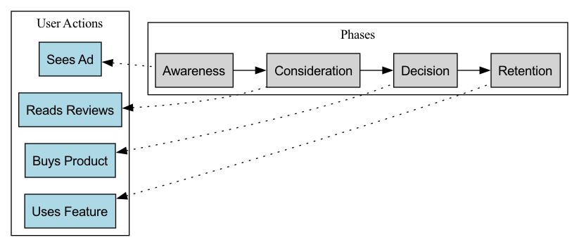

# 사용자 여정 맵

제품이나 서비스를 설계할 때는 개별 기능이나 인터페이스에만 집중하다가, 사용자가 우리와 상호작용하는 전체적인 경험을 간과하기 쉽습니다. **사용자 여정 맵**(User Journey Map)은 이러한 '터널 비전'을 타파하기 위해 탄생한 강력한 시각화 도구입니다. 이는 특정 **사용자 페르소나**(User Persona)가 제품, 서비스, 브랜드와 상호작용하여 **특정 목표**를 달성하는 과정을 스토리텔링 방식으로 체계적으로 묘사합니다. 단순히 각 단계에서 사용자의 **행동 단계**를 기록하는 것을 넘어, 전반적인 과정에서 사용자의 **생각, 감정, 고통점**을 깊이 있게 드러냅니다.

사용자 여정 맵의 핵심 가치는 우리에게 제공하는 서비스를 **사용자의 관점**에서 경험하고 검토하도록 강제한다는 점입니다. 이는 기존에 단편적이고 보이지 않던 경험을 명확하고 직관적이며 공감 능력을 자극하는 시각적 지도로 전환합니다. 이 지도를 통해 팀은 경험의 고점과 저점을 쉽게 식별하고, 사용자 이탈을 유발하는 주요 장애물을 찾아내며, 사용자 만족도와 충성도를 향상시킬 혁신 기회를 발견할 수 있습니다. 이는 제품과 사용자의 진정한 감정 세계를 연결하는 다리입니다.

## 사용자 여정 맵의 핵심 구성 요소

표준 사용자 여정 맵은 일반적으로 수평 스윔레인 다이어그램 형태를 가지며, 다음과 같은 핵심 구성 요소를 포함합니다:

1.  **사용자 페르소나**: 이 여정 맵의 주인공은 누구입니까? 맵의 시작 부분에서는 이 맵이 어떤 핵심 사용자 페르소나에 대한 것인지 명확히 정의해야 합니다. 서로 다른 사용자는 매우 상이한 여정을 가질 수 있습니다.
2.  **시나리오 및 목표**: 이 사용자는 어떤 특정한 상황에 놓여 있으며, 이 여정을 통해 달성하고자 하는 목표는 무엇입니까? 예를 들어, "바쁜 회사원(페르소나)이 애인의 생일을 맞아 로맨틱한 서양식 레스토랑에서 주말 저녁 식사를 예약하고자(목표) 퇴근 지하철 안에서(시나리오) 예약을 시도한다"는 시나리오를 들 수 있습니다.
3.  **여정 단계 / 단계**: 전체적인 끝에서 끝까지의 여정을 몇 가지 주요하고 논리적으로 연속적인 단계로 나누어 표현합니다. 예를 들어, 전자상거래 쇼핑 여정의 경우 단계는 다음과 같을 수 있습니다: **인식 -> 검토 -> 구매 -> 대기 -> 수령 -> 사용/애프터세일즈**.
4.  **행동 / 접점**(Actions / Touchpoints): 각 단계에서 사용자는 구체적으로 어떤 행동을 하나요? 어떤 채널이나 접점을 통해(예: 소셜 미디어, 앱, 고객센터 전화, 오프라인 매장) 우리와 상호작용하나요?
5.  **생각**(Thoughts): 사용자가 이러한 행동을 할 때 머릿속에서는 어떤 생각이 오가는가요? 그들은 어떤 질문, 기대, 내면의 독백을 가지고 있나요?
6.  **감정 / 정서**(Feelings / Emotions): 이것이 여정 맵의 핵심입니다. 감정 곡선을 사용하여 각 단계에서 사용자의 감정 변화를 묘사합니다. 기쁨, 혼란, 불안, 좌절 중 어떤 감정을 느끼고 있나요? 이를 통해 경험 속의 "고통점"(pain points)과 "기쁨의 지점"(delight points)을 빠르게 파악할 수 있습니다.
7.  **고통점 및 기회**(Pain Points & Opportunities): 위 분석을 바탕으로 각 단계에서 사용자에게 부정적인 감정을 유발하는 주요 장애물(고통점)을 명확히 식별하고, 이를 개선할 수 있는 기회를 함께 도출합니다.

### 사용자 여정 맵 템플릿

## 사용자 여정 맵 작성 방법

1.  **단계 1: 목표와 범위 정의**
    먼저, 왜 이 여정 맵을 작성하는지 명확히 해야 합니다. 해결하고자 하는 문제는 무엇인가요? 그런 다음 이 맵이 묘사할 **사용자 페르소나**와 **특정 시나리오**를 결정합니다.

2.  **단계 2: 사용자 데이터 수집**
    여정 맵은 팀의 상상력이 아닌 실제 사용자 연구를 기반으로 해야 합니다. 데이터 출처는 다음과 같습니다: 사용자 인터뷰, 사용성 테스트, 설문조사, 고객 지원 기록, 웹사이트 분석 데이터, 소셜 미디어 댓글 등.

3.  **단계 3: 워크숍 개최, 공동으로 여정 맵 작성**
    제품, 디자인, 개발, 마케팅, 고객 서비스 등 다양한 분야의 팀원들을 모아, 수집한 모든 사용자 인사이트(스티키 노트 형태일 수 있음)를 회의실로 가져옵니다. 팀원들이 협력하여 여정의 각 단계와 각 단계에서의 사용자 행동, 생각, 감정을 스토리텔링 방식으로 정리하고 정의합니다.

4.  **단계 4: 감정 곡선 작성, 핵심 순간 식별**
    사용자의 감정 곡선을 함께 작성하고, 사용자 경험의 성패를 결정하는 **진실의 순간**(Moments of Truth)을 식별합니다. 특히 감정의 최저점(고통점)과 최고점(기쁨의 지점)을 주목합니다.

5.  **단계 5: 기회 발견 및 실행 계획 수립**
    식별된 각 핵심 고통점에 대해 구체적이고 실행 가능한 개선 기회를 도출합니다. 마지막으로 이러한 기회들을 우선순위에 따라 정렬하고, 구체적인 제품 백로그 항목이나 실행 계획으로 전환합니다.

## 적용 사례

**사례 1: 공항 승객 경험 개선**

*   **시나리오**: 공항 운영사가 승객 전반의 만족도를 향상시키고자 함.
*   **적용**: "이 공항에서 국제선으로 처음 출국하는 승객"의 여정 맵을 작성했습니다. 분석 결과, 가장 큰 고통점은 "보안 검색대 통과"와 "탑승 게이트 찾기" 단계였으며, 승객들은 이때 일반적으로 불안과 혼란을 느꼈습니다. 이에 공항은 더 명확한 방향 안내 표지판 설치, 대기 시간을 줄이는 스마트 보안 레인 도입, 앱 내 탑승 게이트 실시간 내비게이션 기능 추가 등의 조치를 취해 승객 경험을 크게 개선했습니다.

**사례 2: 온라인 강의 수료율 개선**

*   **시나리오**: 온라인 교육 플랫폼이 많은 사용자가 강의를 구매했으나 중도 포기하는 문제를 발견함.
*   **적용**: "프로그래밍 강의를 수강하는 직장인"의 여정 맵을 작성한 결과, 3주차에 이르렀을 때 강의 난이도가 높아지고 업무가 바빠짐에 따라 학습 리듬이 무너지면서 감정이 최저점을 기록하는 것을 발견했습니다. 이를 해결하기 위해 플랫폼은 "담당 멘토 관리 서비스", "스터디 그룹", "3주차에 격려 배지 푸시" 등의 개입 조치를 설계하여 수료율을 크게 향상시켰습니다.

**사례 3: 은행 계좌 개설 프로세스 개선**

*   **시나리오**: 전통적인 은행이 온라인 신규 사용자 계좌 개설 프로세스를 최적화하고자 함.
*   **적용**: 여정 맵을 통해 "신분 증명서 업로드"와 "긴 이용 약관 읽기" 단계에서 사용자들이 매우 불편하고 불신감을 느끼며, 이로 인해 많은 사용자가 이탈한다는 것을 발견했습니다. 이에 은행은 이용 약관을 간소화하고 NFC를 통해 신분증 정보를 바로 읽을 수 있는 편리한 기능을 개발하여 계좌 개설 프로세스의 매끄러움과 전환율을 크게 개선했습니다.

## 사용자 여정 맵의 장점과 도전 과제

**핵심 장점**

*   **글로벌 관점 확립**: 팀이 부서 간 벽과 기능적 고립을 넘어, 사용자 경험을 전체적이고 일관된 관점에서 바라보도록 도와줍니다.
*   **강력한 공감 도구**: 특히 엔지니어와 관리자들이 사용자의 진정한 감정과 고통점을 직관적으로 느낄 수 있도록 합니다.
*   **문제와 기회 효과적 식별**: 기존 프로세스의 단절점과 장애물을 명확히 드러내며, 혁신의 초점을 제공합니다.
*   **팀 협업과 합의 촉진**: 여정 맵을 공동으로 작성하는 과정 자체가 훌륭한 팀 활동이 되며, 모든 이해관계자들이 사용자 이해를 공유하고 합의에 도달하도록 합니다.

**잠재적 도전 과제**

*   **대표성 문제**: 하나의 여정 맵은 일반적으로 하나의 사용자 페르소나와 하나의 시나리오만을 대표하므로, 다양한 사용자 그룹을 포괄하기 위해 여러 맵이 필요합니다.
*   **실제 연구 기반 필요성**: 실제 깊이 있는 사용자 연구가 기반이 되지 않으면 여정 맵은 희망적인 "환상 지도"가 될 수 있습니다.
*   **지속적인 업데이트 필요**: 제품과 서비스가 반복적으로 개선됨에 따라 사용자 여정도 변화하며, 여정 맵은 "살아 있는 문서"로 간주되어 정기적으로 업데이트되어야 합니다.

## 확장 및 연계

*   **사용자 페르소나**: 사용자 여정 맵 작성의 **전제 조건**입니다. 명확한 사용자 페르소나가 없다면 여정 맵은 주인공을 잃게 됩니다.
*   **서비스 블루프린트**: 사용자 여정 맵의 "백스테이지 뷰"로 볼 수 있습니다. 여정 맵이 사용자의 프런트스테이지 경험을 묘사한다면, 서비스 블루프린트은 이를 더 아래로 확장하여 백엔드 인력, 시스템, 프로세스가 어떻게 작동하고 상호작용하는지 상세히 설명합니다.
*   **공감 맵**: 단일 사용자의 내면 세계를 깊이 탐구하는 데 초점을 맞춘 도구로, 사용자 페르소나와 여정 맵 작성 초기 단계에서 자료 수집과 공감 훈련에 자주 사용됩니다.

---
*참고: 사용자 경험(UX) 디자인 분야의 핵심 도구인 사용자 여정 맵의 개념과 실천은 끊임없이 발전해 왔습니다. Adaptive Path의 공동 설립자인 제시 제임스 가렛(Jesse James Garrett)은 그의 저서 "The Elements of User Experience"에서 이론적 기반을 닦았습니다. Nielsen Norman 그룹(NN/g)과 같은 권위 있는 기관에서는 사용자 여정 맵을 만들고 활용하는 방법에 대한 폭넓은 실무 가이드와 글을 제공하고 있습니다.*