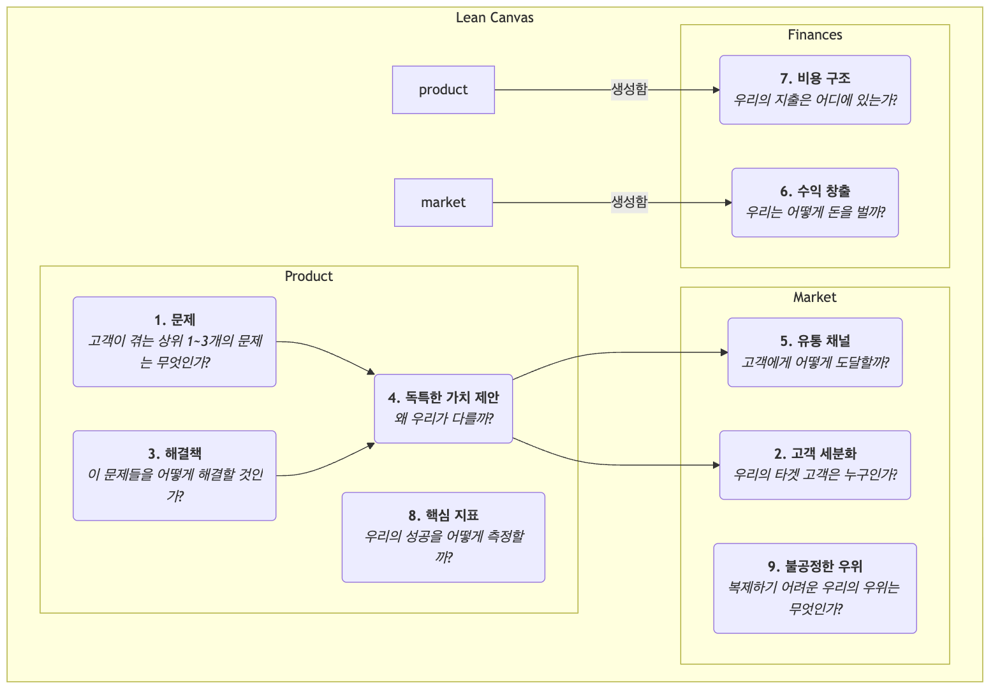

# 리ーン 캔버스

스타트업 초기 단계에서 가장 큰 위험은 "제품을 만들 수 있는가?"가 아니라 "우리가 만든 제품을 원하는 사람이 있을까?"입니다. 전통적인 사업 계획서와 비즈니스 모델 캔버스는 성숙한 기업에 훌륭한 도구이지만, 높은 불확실성 속에서 운영되는 스타트업에는 지나치게 복잡하고 가장 중요한 위험에 충분히 집중하지 못할 수 있습니다. 이러한 문제를 해결하기 위해 고안된 것이 **리ーン 캔버스(Len Canvas)**입니다. 이는 비즈니스 모델 캔버스를 발전시킨 것으로, 특히 **초기 단계의 창업자**들에게 적합하게 설계되었습니다.

애시 마우리아(Ash Maurya)의 저서 *러닝 리ーン(Running Lean)*에서 제안된 리ーン 캔버스는 비즈니스 모델 캔버스의 단순성과 직관성을 계승하면서도, "비즈니스 모델의 완전한 설명"에서 **"가장 높은 위험을 지닌 스타트업 가설을 체계적으로 식별하고 검증하는 것"**으로 초점을 전환합니다. 이는 **문제-해결책**을 중심으로 핵심 지표와 경쟁 우위에 주목하며, 리ーン 스타트업의 "만들기-측정하기-배우기" 사이클을 보다 깊이 반영합니다. 즉, 리스크 중심의 전략 지도로서 안개 속에서 창업자를 안내하는 역할을 합니다.

## 리ーン 캔버스의 9개 블록

리ーン 캔버스는 비즈니스 모델 캔버스의 9개 블록 구조를 유지하지만, 4개의 블록을 교체하여 실행 가능하고 위험 중심으로 재구성하였습니다.

<!-- mermaid 源文件：Lean-Canvas-Tutorial-ko-mermaid-live-1.mmd -->

**비즈니스 모델 캔버스와의 차이점:**

*   **문제**가 "핵심 파트너"를 대체함: 가장 중요한 변화입니다. 창업자들이 먼저 타겟 고객이 시급히 해결해야 할 상위 1~3개의 문제를 명확히 정의하도록 강제합니다.
*   **해결책**이 "핵심 활동"을 대체함: 문제를 정의한 후, 그 문제에 특화된 해결책(보통 제품의 핵심 기능)을 제시합니다.
*   **핵심 지표**가 "핵심 자원"을 대체함: 스타트업에게 중요한 것은 보유한 자원이 아니라, 사업의 건강성과 성장을 어떻게 측정할 것인지입니다. 핵심 지표는 모든 행동을 이끄는 지표입니다.
*   **불공정한 우위**가 "고객 관계"를 대체함: "불공정한 우위" 또는 "모(성) 방어"라고도 하며, 경쟁자가 쉽게 복사하거나 구매할 수 없는 핵심 역량을 의미합니다. 이는 장기적인 비즈니스 모델 생존에 필수적입니다.

## 리ーン 캔버스 사용 방법

리ーン 캔버스 사용 과정은 검증과 반복의 지속적인 사이클입니다.

1.  **"플랜 A" 캔버스 작성**
    고객과 대화하기 전에 초기 아이디어와 가설을 바탕으로 리ーン 캔버스를 신속히 작성합니다. 이 작업은 보통 15~20분 정도 소요됩니다. 이는 검증할 모든 가설을 담은 "플랜 A"입니다.

2.  **가장 높은 위험의 가설 식별**
    작성한 캔버스를 검토하여 가장 높은 위험과 불확실성을 지닌 부분을 식별합니다. 일반적으로 새로운 프로젝트의 경우, 위험 순서는 다음과 같습니다:
    *   **문제-고객 가설**: 이 문제가 실제로 존재하는가? 이 사람들이 진짜 타겟 고객인가?
    *   **문제-해결책 가설**: 제시한 해결책이 실제로 그 문제를 해결할 수 있는가?
    *   **가격-가치 제안 가설**: 고객이 해결책에 대해 비용을 지불할 의향이 있는가?

3.  **체계적인 가설 검증**
    "최소 실행 가능한 실험"을 설계하고 실행하여 높은 위험의 가설을 체계적으로 검증합니다(보통 **문제 인터뷰**와 **해결책 인터뷰**). 예를 들어:
    *   **문제 인터뷰 수행**: 타겟 고객과 대화하면서 제품에 대해 언급하지 말고, 오직 그들의 문제, 기존 행동, 고통 포인트를 깊이 이해하여 캔버스의 "문제"와 "고객 세분화" 블록을 검증합니다.
    *   **해결책 인터뷰 수행**: 문제의 존재를 검증한 후, 고객에게 해결책(프로토타입 또는 데모일 수 있음)을 보여주어 "해결책"과 "가치 제안"을 검증하고, "수익 창출"에 대한 지불 의사를 테스트합니다.

4.  **캔버스 반복 업데이트**
    인터뷰와 실험에서 얻은 통찰을 바탕으로 리ーン 캔버스를 지속적으로 업데이트하고 반복합니다. 일부 가설은 검증되지만 다른 일부는 반증됩니다. 캔버스는 실험 노트처럼 기능하며, 초기 아이디어부터 "제품-시장 적합성"을 찾는 과정까지의 진화 경로를 기록합니다.

## 적용 사례

**사례 1: 드롭박스(Dropbox) 초기 캔버스**

*   **문제**: 여러 기기 간 파일 동기화가 번거롭고, USB 드라이브나 이메일로 큰 파일을 전송하는 것이 어렵다. 백업을 잊어 데이터가 손실된다.
*   **고객 세분화**: 여러 컴퓨터를 사용하는 기술 애호가, 프리랜서.
*   **독특한 가치 제안**: "파일을 '마법 주머니'에 넣으면 어디서든 접근 가능하고 결코 잃지 않는다."
*   **해결책**: 지정된 폴더의 내용을 자동으로 동기화하는 백그라운드에서 실행되는 데스크탑 애플리케이션.
*   **핵심 지표**: 사용자 등록 수, **파일 업로드 성공률**, 활성 사용자 수.
*   **불공정한 우위**: 네트워크 효과 – 더 많은 사람이 사용할수록 공유와 협업이 쉬워진다.
*   **검증**: 창업자 더우 휴스턴(Drew Houston)은 간단한 제품 데모 영상을 제작해 기술 애호가 커뮤니티에 게시했습니다. 하루 밤 사이 대기자 명단이 5,000명에서 75,000명으로 증가하며 "문제-해결책" 적합성이 강력히 검증되었습니다.

**사례 2: "건강한 식사 배달" 서비스 기획 사례**

*   **문제**: 직장인들은 건강하고 균형 잡힌 점심을 먹기 어렵고, 직접 요리하는 것은 시간이 너무 많이 들며, 배달 음식은 대체로 기름지다.
*   **고객 세분화**: 건강에 관심이 많고 운동 습관을 가진 젊은 전문직 종사자.
*   **독특한 가치 제안**: "영양사가 설계한 신선한 운동 식단을 사무실로 정확하게 배달한다."
*   **해결책**: 매주 점심 식사 계획을 제공하며, 메뉴는 매주 갱신되고 칼로리 및 영양 정보를 제공한다.
*   **핵심 지표**: **주간 재구매율**, 고객 생애 가치.
*   **불공정한 우위**: 고품질 재료 공급업체와의 독점 파트너십, 전문 영양사 팀.
*   **검증**: 창업자는 앱 개발을 미루고 WeChat 그룹이나 설문 플랫폼을 통해 주문을 받고, 처음 20명의 사용자에게 직접 점심을 배달하며 전체 프로세스와 사용자 니즈를 검증할 수 있습니다.

**사례 3: 에어비앤비(Airbnb) 초기 캔버스**

*   **문제**: 인기 있는 컨퍼런스 기간 동안 도시 호텔은 비싸고 만실이다.
*   **고객 세분화**: 예산이 제한된 디자인 컨퍼런스 참석 디자이너.
*   **해결책**: 지역 거주자(호스트)가 여분의 에어 매트리스를 이 디자이너들에게 대여할 수 있는 플랫폼 제공.
*   **독특한 가치 제안**: 더 저렴한 가격으로 숙소를 얻고 현지 주민과 교류할 수 있는 기회.
*   **검증**: 창업자들은 직접 집에 에어 매트리스 세 개를 설치해 컨퍼런스 참석 디자이너들에게 성공적으로 대여하며 전체 비즈니스 모델의 실행 가능성을 직접 검증했습니다.

## 리ーン 캔버스의 가치와 한계

**핵심 가치**

*   **위험 중심**: 창업자들이 초기부터 가장 높은 위험의 가설에 직면하도록 강제합니다.
*   **속도와 반복**: 빠르게 비즈니스 모델을 스케치하고 토론하고 반복하는 데 적합하며, 리ーン 스타트업의 리듬에 완벽하게 부합합니다.
*   **문제 중심**: 창업의 출발점이 실제 가치 있는 고객 문제 해결이라는 점을 보장합니다.

**잠재적 한계**

*   **외부 환경 분석 부족**: 비즈니스 모델 캔버스와 마찬가지로 경쟁과 거시적 환경 분석을 내재적으로 포함하지 않습니다.
*   **모든 비즈니스에 적용 불가능**: 높은 불확실성을 가진 스타트업에 가장 적합합니다. 검증된 비즈니스 모델을 가진 성숙한 기업에는 비즈니스 모델 캔버스가 더 포괄적인 도구일 수 있습니다.

## 확장 및 연계

*   **비즈니스 모델 캔버스**: 리ーン 스타트업 맥락에서 리ーン 캔버스의 중요한 변형 및 발전입니다.
*   **고객 개발(Customer Development)**: 스티브 블랭크(Steve Blank)가 제안한 방법론으로, 가설 검증을 위해 "건물 밖으로 나가야 한다"는 점을 강조하며, 리ーン 캔버스의 실천적 원칙이 됩니다.
*   **가치 제안 캔버스(Value Proposition Canvas)**: 리ーン 캔버스의 "문제", "해결책", "독특한 가치 제안" 블록을 심화하는 도구로 활용할 수 있으며, 창업자가 제품-시장 적합성을 보다 정밀하게 조정하는 데 도움을 줍니다.

---
*참고: 애시 마우리아의 "러닝 리ーン(Running Lean)"은 리ーン 캔버스에 대한 가장 권위 있는 자료로, 고객 개발과 함께 단계별로 리ーン 캔버스를 사용하고 반복하는 방법을 상세히 설명합니다. 이 방법론은 에릭 리스(Eric Ries)의 "리ーン 스타트업(The Lean Startup)"과 스티브 블랭크(Steve Blank)의 고객 개발 모델의 깊은 영향을 받았습니다.*