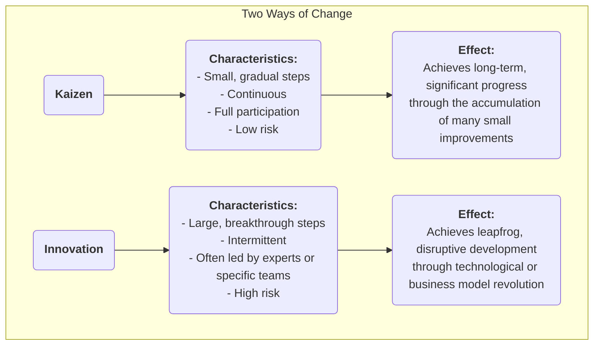

# 가이젠(Kaizen)

많은 조직에서 "개선"은 대규모 투자가 필요하고 전문가가 주도하며 최상위층에서 하달되는 중요한 "프로젝트"로 간주되는 경우가 많습니다. 그러나 반면에, 진정한 강력하고 지속적인 발전은 모든 직원이 매일 이루어내는 눈에 띄지 않는 **작고 지속적인 개선**에서 비롯된다고 믿는 경영 철학이 있습니다. 이것이 **가이젠**(Kaizen)의 핵심입니다. '가이젠'은 일본어로 "더 나은 쪽으로 변화"라는 의미이며, 완벽함을 추구하는 문화적 철학이자 전 직원의 참여를 장려하고 하향식이 아닌 상향식 지속적 개선을 추구하는 실용적인 방법입니다.

가이젠의 핵심 아이디어는 **혁신적인 돌파구를 단번에 이루는 것을 추구하는 것이 아니라 끝없는 점진적 최적화를 추구하는 것**입니다. 이는 현장에서 일하는 직원들이 자신의 업무 상황을 가장 잘 이해하는 전문가이며, 무한한 지혜와 창의성을 가지고 있다고 믿습니다. 문제 해결을 장려하고, 작은 혁신을 포상하며, 실패를 용인하는 문화를 구축함으로써 조직은 모든 구성원의 힘을 모아 멈출 수 없는 지속적인 상승세를 형성할 수 있습니다. 복잡한 경영 도구가 아니라 단순하지만 깊이 있는 효과적인 일하는 방식과 사고방식입니다.

## 가이젠의 핵심 원칙

*   **지속성**: 가이젠은 단발성 활동이 아니라 끝없이 누적되는 과정입니다.
*   **전 직원 참여**: CEO부터 현장 청소원까지 조직 내 모든 구성원이 개선 활동에 참여하고 기대됩니다.
*   **저비용, 고지능**: 가이젠은 대규모 자본 투자에 의존하지 않고, 직원들의 지혜와 창의성을 활용하여 저비용으로 문제를 해결하고 낭비를 제거하는 데 중점을 둡니다.
*   **프로세스 중심**: 가이젠의 초점은 개인을 비난하는 것이 아니라 업무 프로세스를 최적화하는 데 있습니다.
*   **시각적 관리(Visual Management)**: 문제점, 표준, 프로세스를 "시각화"하여 이상 상황을 한눈에 파악할 수 있도록 강조합니다.
*   **"겐바(Gemba)로 가자"**: 관리자들은 사무실에서 상상하는 것이 아니라 실제 작업 현장(겐바)에 가서 상황을 관찰하고 직원들과 대화해야 합니다.

### 가이젠 vs. 혁신

*   **관계**: 가이젠과 혁신은 서로排他的인 개념이 아니라, 훌륭한 조직이 동시에 갖춰야 할 두 가지 능력입니다. 가이젠은 기존 시스템을 지속적으로 최적화하고 강화하는 역할을 하며, 혁신은 완전히 새로운 시스템을 창출하는 역할을 합니다.

## 조직에서 가이젠을 실천하는 방법

가이젠을 실천하는 핵심은 지속적 개선을 장려하는 문화와 메커니즘을 만드는 것입니다.

1.  **가이젠 제안 시스템 구축**
    간단하고 편리한 채널(예: 제안함, 온라인 폼)을 마련하여 모든 직원이 언제든지 문제점이나 개선 제안을 제출할 수 있도록 합니다. 모든 제안에 대해 피드백하고 추적하며, 채택된 우수 제안에 대해서는 즉시 공개적으로 인정하는 것이 중요합니다(보상은 물질적일 필요는 없으며, 공개 칭찬이나 인증서 등이 더 효과적인 정신적 동기부여가 되는 경우가 많습니다).

2.  **"가이젠 위크(Kaizen Weeks)" 또는 "가이젠 블리츠(Kaizen Blitzes)" 실시**
    정기적으로 다기능 팀을 구성하여 특정 프로세스나 작업 영역에 집중적으로(보통 3~5일) 집중하여, 리ーン 및 품질 관리 도구(예: 가치 흐름 맵(Value Stream Mapping), 5S 등)를 사용하여 고강도의 개선 활동을 수행하고 즉시 해결책을 실행합니다.

3.  **PDCA 사이클을 사고 도구로 확산**
    모든 직원이 문제를 해결할 때 사용하는 표준 사고 체계로 **PDCA(Plan-Do-Check-Act) 사이클**을 정착시킵니다. 직원들이 이 과학적 사이클을 따르도록 장려합니다:
    *   **P**lan(계획): 문제를 식별하고 원인을 분석한 후 작은 개선 계획을 수립합니다.
    *   **D**o(실행): 계획을 실행해 봅니다.
    *   **C**heck(확인): 실험 결과가 기대에 부합하는지 검증합니다.
    *   **A**ct(처리): 성공하면 새로운 프로세스로 표준화하고, 실패하면 교훈을 얻은 후 새로운 PDCA 사이클을 시작합니다.

4.  **관리자의 역할 전환**
    가이젠 문화에서는 관리자의 역할이 "명령자"와 "감독자"에서 "**코치**"와 "**지원자**"로 변화합니다. 주요 업무는 다음과 같습니다: 직원들이 문제를 인식하도록 영감을 주고 격려하며, 직원들의 개선 활동에 자원과 지원을 제공하고 장애물을 제거하는 것을 돕습니다.

## 적용 사례

**사례 1: 도요타의 "1cm 개선"**

*   **상황**: 도요타 생산 라인에서는 가이젠이 조직의 DNA 일부입니다.
*   **적용**: 한 생산 라인 작업자는 부품 상자에서 나사를 집을 때 손목이 약간 비틀리는 불편한 동작을 반복한다는 것을 알게 되었습니다. 그는 부품 상자를 15도 기울이는 제안을 했습니다. 이 눈에 띄지 않는 개선은 하루에 몇 초를 절약하고 손목 부상 위험을 줄였습니다. 이 "1cm 개선"이 전사 수천 개의 작업장에 확대 적용되자 누적된 시간 절약과 안전성 향상은 놀라운 수준이었습니다.

**사례 2: 병원 간호사 대기실 개선**

*   **문제**: 간호사들은 매일 흔히 사용하는 의료 용품(예: 거즈, 테이프)을 찾는 데 많은 시간을 소비한다고 불평했습니다.
*   **가이젠 적용**: 간호장은 소규모 가이젠 활동을 조직했습니다. 팀원들은 **5S 방법론**을 활용하여 간호사 대기실 캐비닛을 철저히 **정리**(필요 없는 물건 제거), **정돈**(자주 사용하는 물건을 쉽게 접근할 수 있는 위치에 배치하고 명확히 라벨링), **청소**, **표준화**, **유지** 단계를 수행했습니다. 이 활동은 단 하루 오후만 소요되었지만 간호사들의 탐색 시간을 크게 줄여, 환자 직접 간호에 더 많은 에너지를 집중할 수 있도록 했습니다.

**사례 3: 개인 생활에서의 적용**

*   **문제**: 어떤 사람은 항상 집을 나설 때 열쇠를 잊어버리는 습관이 있었습니다.
*   **가이젠 적용**: "기억력이 나쁘다"며 자신을 탓하기보다는 **프로세스를 개선**하는 방법을 생각했습니다. 그는 전날 밤 문 앞 신발장 위에 다음 날 가져갈 모든 물건(열쇠, 지갑, 직원증)을 미리 올려놓기로 했습니다. 이 작은 습관의 변화는 프로세스를 최적화하여 문제를 근본적으로 해결하는 전형적인 개인적 가이젠 사례입니다.

## 가이젠의 장점과 도전 과제

**핵심 장점**

*   **저비용, 저위험**: 대부분의 개선은 현장 직원들의 지혜에서 나오며 추가 투자가 거의 필요하지 않으며, 시행착오 비용도 매우 낮습니다.
*   **직원 참여도 및 소속감 증대**: 직원들의 제안이 경청되고 채택될 때 그들은 존중받는다고 느끼며, "수동적 실행자"에서 "적극적 사고자"로 변합니다.
*   **팀워크 증진**: 많은 가이젠 활동이 부서 간 협업을 요구하며, 이는 부서 간 벽을 허물어 줍니다.
*   **강력한 문화적 관성 형성**: 지속적 개선 문화가 정착되면 조직은 자기 진화와 지속적 발전을 위한 강력한 내적 동력을 가지게 됩니다.

**잠재적 도전 과제**

*   **성과가 서서히 나타나고 눈에 띄지 않음**: 급격한 "혁신"에 비해 가이젠의 효과는 점진적이고 누적적이며 단기적으로는 명확하지 않을 수 있어, 관리자들이 충분한 인내심과 장기적 비전을 가져야 합니다.
*   **진정한 전 직원 참여 필요**: 가이젠이 단지 구호에 그치거나 소수만 참여할 경우 지속 가능하지 않습니다.
*   **"지역 최적화"에 빠질 가능성**: 기존 프로세스에 대한 소규모 개선에 지나치게 집중하면 파괴적이고 혁신적인 대전환 기회를 놓칠 수 있습니다.

## 확장 및 연계 개념

*   **리ーン 운영(Lean Operations)**: 가이젠은 리ーン 사고의 핵심 기둥 중 하나이며 "완벽함 추구" 원칙을 실현하는 기본적인 방법입니다.
*   **전략적 품질관리(TQM)**: 가이젠은 TQM에서 "지속적 개선" 원칙을 가장 직접적이고 생생하게 구현하는 개념입니다.
*   **PDCA 사이클**: 가이젠 실천 시 가장 일반적으로 사용되며 기본적인 과학적 사고 및 실행 체계입니다.

---
*참고 자료: 가이젠은 일본 문화와 경영 방식에 깊이 뿌리를 둔 경영 철학으로, 특히 도요타 생산 시스템(TPS)에서 널리 알려지게 되었습니다. 마사키 이마이(Masaaki Imai)의 저서 『가이젠: 일본 경쟁력의 핵심』은 이 개념을 서구 세계에 체계적으로 소개하며 큰 영향을 미쳤습니다.*