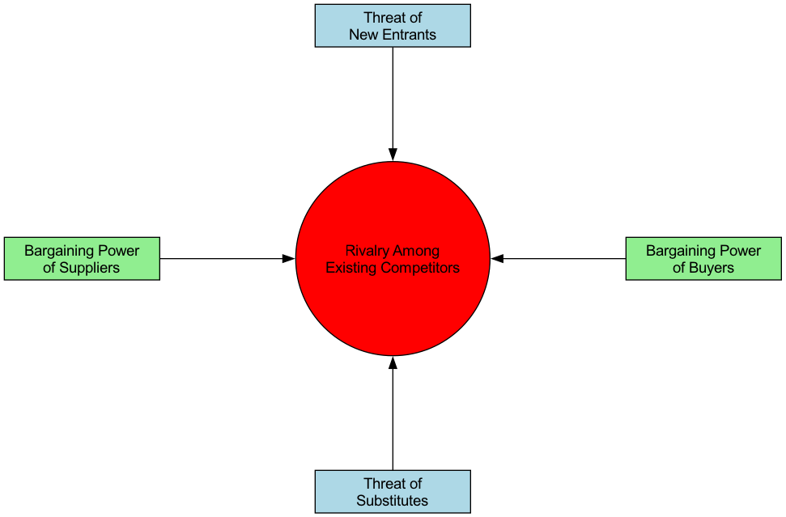

# 포터의 5 Forces 모델

격렬한 사업 경쟁 속에서 산업의 매력도와 장기적 수익성은 단일 경쟁자에 의해 결정되지 않으며, 더 넓은 경쟁 생태계에 의해 형성됩니다. **포터의 5 Forces 모델**은 하버드 비즈니스 스쿨의 전략 경영 전문가인 마이클 E. 포터(Michael E. Porter)가 제안한 획기적인 프레임워크입니다. 이 모델은 우리가 체계적으로 어떤 산업의 경쟁 구조를 분석하고, 해당 산업의 평균 수익 수준을 결정하는 5가지 기본 경쟁력을 이해하는 데 도움을 주는 강력한 도구입니다.

이 모델의 핵심 아이디어는 기업 전략가들이 단순한 직접 경쟁자를 넘어서 더 넓은 경쟁 환경을 살펴보아야 한다는 점입니다. 이 5가지 경쟁력은 산업 내 경쟁 강도와 산업 체인 내에서 가치가 창출되고 분배되는 방식을 결정합니다. 각 경쟁력의 세기를 이해함으로써 기업은 산업 내 최적의 위치를 찾고, 위험을 회피하고 강점을 살려 지속 가능한 경쟁 우위를 확보할 수 있는 전략을 수립할 수 있습니다.

## 5가지 경쟁력 분석

포터의 5 Forces 모델은 산업 경쟁을 5가지 명확한 차원으로 분해하여 산업 내 "게임의 규칙"을 결정합니다.

1.  **기존 경쟁자 간 경쟁(Rivalry Among Existing Competitors)**
    이는 5 Forces 모델의 핵심으로, 산업 내 기존 기업들 간의 직접적인 대결과 경쟁 강도를 의미합니다. 산업 내 경쟁이 치열할 경우 기업들은 가격 경쟁, 광고 경쟁, 제품 혁신 경쟁에 휘말리게 되며, 이로 인해 산업 전체의 수익 수준이 낮아지게 됩니다.
    *   **치열한 경쟁의 징후**: 산업 내 비슷한 실력의 경쟁자들이 많음; 느린 산업 성장으로 인한 "제로섬 게임"; 심한 제품 동질화, 차별화 부족; 높은 탈퇴 장벽으로 인해 적자 기업이 산업에서 빠져나가기 어려움.

2.  **신규 진입자의 위협(Threat of New Entrants)**
    이는 새로운 경쟁자가 산업에 진입할 가능성입니다. 만약 산업이 수익성이 높고 진입 장벽이 낮다면, 새로운 참가자들이 마치 자석처럼 끌려들어와 새로운 생산능력과 함께 시장 점유율을 차지하려는 의지를 가지고 산업 경쟁을 더욱 격화시킵니다.
    *   **진입 장벽의 높이**가 이 위협의 세기를 결정합니다. 일반적인 진입 장벽에는 다음과 같은 것들이 포함됩니다: 규모의 경제, 강력한 브랜드 충성도, 높은 고객 전환 비용, 막대한 자본 투자, 유통 채널에 대한 통제, 정부 정책 및 규제 제한, 핵심 기술 특허.

3.  **대체재의 위협(Threat of Substitute Products or Services)**
    이는 **다른 산업**에서 나온 대체재 또는 서비스가 동일한 고객 니즈를 충족시킬 수 있는 위협을 의미합니다. 대체재의 존재는 산업 전체의 가격 수준에 "천장"을 설정합니다.
    *   **중요한 구분**: 항공사의 경우 다른 항공사는 **경쟁자**이지만 고속철도와 화상 회의는 **대체재**입니다. 대체재의 성능 대비 가격 경쟁력이 높을수록, 그리고 고객이 대체재로 전환하는 비용이 낮을수록 그 위협은 커집니다.

4.  **공급자의 협상력(Bargaining Power of Suppliers)**
    이는 공급자(예: 원자재, 부품, 노동력 또는 서비스 제공자)가 산업 내 기업들에게 비용 부담을 전가할 수 있는 능력을 의미합니다. 강력한 공급자는 가격을 인상하거나 품질을 낮추거나 공급을 제한함으로써 산업의 수익성을 약화시킬 수 있습니다.
    *   **강력한 공급자 협상력의 징후**: 공급 산업이 고도로 집중되어 소수의 거대 기업에 의해 지배됨; 공급자의 제품이 독특하거나 차별화되어 대체가 어려움; 공급자 측 전환 비용이 매우 높음; 공급자 입장에서 귀하의 산업이 주요 고객이 아님.

5.  **구매자의 협상력(Bargaining Power of Buyers)**
    이는 고객(구매자)이 가격을 낮추거나 더 높은 품질이나 더 많은 서비스를 요구할 수 있는 능력을 의미합니다. 강력한 구매자는 산업 내 기업들 간의 경쟁을 유도함으로써 생산자로부터 구매자에게 가치를 이전시킵니다.
    *   **강력한 구매자 협상력의 징후**: 구매자가 집중된 대량 구매자임; 산업 제품이 표준화되어 차별화되지 않음; 구매자의 공급자 전환 비용이 낮음; 구매자가 "후방 통합(backward integration)"을 수행할 수 있음(즉, 필요한 제품을 직접 생산함).

## 5 Forces 모델 적용 방법

1.  **산업 경계 명확히 정의하기**
    먼저 분석하고자 하는 산업을 명확히 정의해야 합니다. 산업의 정의는 너무 광범위하거나 너무 협소해서는 안 됩니다.

2.  **5 Forces 내 주요 참여자 식별하기**
    각 경쟁력 차원에서 주요 참여자들이 누구인지 구체적으로 식별해야 합니다. 예를 들어, 주요 공급자, 구매자, 경쟁자, 잠재적 진입자, 대체재는 각각 무엇인가요?

3.  **각 경쟁력의 세기 평가하기**
    각 경쟁력을 강화하거나 약화시키는 근본 원인을 분석하고, 각 경쟁력의 세기(예: 강함, 중간, 약함)를 종합적으로 평가합니다.

4.  **산업 구조의 종합 분석**
    5 Forces의 평가 결과를 종합하여 산업의 전체적인 경쟁 구도와 장기적 수익 잠재력을 판단합니다. 산업 수익성에 결정적인 영향을 미치는 하나 또는 여러 경쟁력은 무엇인가요?

5.  **위치 개선을 위한 전략 수립**
    분석 결과를 바탕으로 기업이 산업 내 위치를 "개선"할 수 있는 전략적 조치를 고려해야 합니다. 예를 들어, 브랜드 구축을 통해 구매자의 협상력을 낮출 수 있는가? 기술 혁신을 통해 진입 장벽을 구축할 수 있는가? 공급자와의 계약을 통해 공급자의 협상력을 낮출 수 있는가?

## 적용 사례

**사례 1: 글로벌 음료 산업 (예: 코카콜라와 펩시코)**

*   **기존 경쟁자 간 경쟁**: **치열함**. 두 거대 기업의 경쟁은 브랜드, 유통, 광고 등 다양한 측면에서 나타나지만, 파괴적인 가격 경쟁은 교묘하게 피하고 있음.
*   **신규 진입자의 위협**: **약함**. 높은 브랜드 충성도, 방대한 글로벌 유통망, 막대한 광고 투자 등으로 인해 신규 진입자에게 넘기 어려운 장벽이 존재함.
*   **대체재의 위협**: **중간에서 강함**. 물, 주스, 차, 커피 등이 대체재이며, 소비자 선택지가 다양함.
*   **공급자의 협상력**: **약함**. 설탕, 물, 포장 캔 등 원자재는 상품화되어 있으며, 공급자는 분산되어 있어 협상력이 없음.
*   **구매자의 협상력**: **중간**. 개별 최종 소비자의 경우 협상력은 없음. 그러나 대형 유통업체(예: 월마트, 까르푸) 및 외식 채널의 경우 강력한 협상력을 가짐.
*   **결론**: 산업 구조는 매우 매력적이며, 두 거대 기업은 강력한 브랜드와 유통 장벽을 구축함으로써 신규 진입자와 공급자로부터의 압박을 효과적으로 막아내며 지속적으로 높은 수익을 달성하고 있음.

**사례 2: 개인용 컴퓨터(PC) 산업**

*   **기존 경쟁자 간 경쟁**: **매우 치열함**. 수많은 브랜드(레노버, HP, 델 등)의 제품이 고도로 동질화되어 있으며, 지속적인 가격 경쟁이 일어남.
*   **신규 진입자의 위협**: **중간**. 브랜드와 유통망은 축적이 필요하지만, 핵심 부품은 조달이 가능하며 진입 장벽은 극복 가능함.
*   **대체재의 위협**: **강함**. 스마트폰과 태블릿이 PC의 많은 기능을 대체하고 있음.
*   **공급자의 협상력**: **강함**. 핵심 부품(예: CPU 및 운영 체제)이 인텔, 마이크로소프트 등 소수 기업에 집중되어 있으며, 이들이 PC 산업의 대부분 수익을 통제함.
*   **구매자의 협상력**: **강함**. 개인 소비자와 기업 고객 모두 표준화된 제품으로 인해 선택지가 많고 가격 민감도가 높음.
*   **결론**: PC 산업의 거의 모든 5 Forces가 제조사에게 불리하게 작용하며, 산업 전체가 장기적으로 저수익 상태에 머물고 있음.

**사례 3: 중국의 고급 레스토랑 산업**

*   **기존 경쟁자 간 경쟁**: **치열함**. 다수의 레스토랑이 존재하며, 심한 모방과 밴드왜건 효과가 발생함.
*   **신규 진입자의 위협**: **강함**. 상대적으로 낮은 진입 장벽; 자본과 셰프만 있으면 누구나 레스토랑을 열 수 있음.
*   **대체재의 위협**: **강함**. 중저가 레스토랑, 배달 음식, 개인 셰프 등이 대안이 됨.
*   **공급자의 협상력**: **중간**. 일반 식재료의 경우 공급자가 많음. 그러나 희소하고 고급 특수 식재료의 경우 소수 공급자가 강력한 협상력을 가질 수 있음.
*   **구매자의 협상력**: **강함**. 소비자 선택지가 많고 전환 비용이 없음.
*   **결론**: 고급 레스토랑 산업의 경쟁 구조는 좋지 않으며, 수익성 확보가 매우 어려움. 성공의 핵심은 독특한 브랜드, 메뉴, 경험을 구축하여 구매자의 협상력을 낮추고 산업 내 경쟁을 줄이는 데 있음.

## 5 Forces 모델의 가치와 한계

**핵심 가치**

*   **직접 경쟁을 넘어서**: 경쟁을 단순히 경쟁자에만 국한하지 않고 더 넓은 시각에서 이해할 수 있도록 해줌.
*   **수익성 요인 파악**: 산업의 장기적 수익성을 결정하는 핵심 구조적 요인을 식별하는 데 도움을 줌.
*   **전략적 포지셔닝 안내**: 기업이 유리한 전략적 위치를 찾고 자신에게 유리한 산업 구조를 형성할 수 있도록 명확한 로드맵을 제공함.

**잠재적 한계**

*   **정적적 시각**: 모델 자체가 정적이어서 산업 구조의 동적 변화(예: 기술 혁신에 의한 구조 변화)를 충분히 반영하지 못할 수 있음.
*   **"제6의 힘" 무시**: 일부 학자들은 모델이 **보완재**의 역할을 간과한다고 주장함. 예를 들어, 소프트웨어와 하드웨어는 보완재이며, 함께 가치를 창출함.
*   **모호한 산업 경계**: 오늘날 통합된 비즈니스 생태계 속에서 산업 경계를 명확히 정의하는 것이 점점 더 어려워지고 있음.

## 확장 및 연계 분석

*   **PESTEL 분석**: 5 Forces에 영향을 주는 더 넓은 거시적 환경 요인을 분석하는 데 활용 가능함.
*   **밸류체인 분석**: 5 Forces 모델이 산업 내 "파이(pie)"가 어떻게 나뉘는지를 분석한다면, 밸류체인 분석은 기업 내 활동에서 어떻게 더 많은 "파이"를 창출할 수 있을지를 고민하게 해줌.
*   **전략 그룹 분석**: 산업 내 경쟁을 분석할 때, 전략적 유사성에 따라 산업 내 기업들을 다른 전략 그룹으로 나누어 보다 세밀한 분석을 수행할 수 있음.

---
*참고 자료: 마이클 포터는 1979년 하버드 비즈니스 리뷰에 발표된 고전적 논문 "How Competitive Forces Shape Strategy"와 이후 저서인 "Competitive Strategy"에서 5 Forces 모델을 체계적으로 설명했습니다. 이 모델은 오늘날 전략 경영 분야에서 흔들리지 않는 기반으로 자리 잡고 있습니다.*