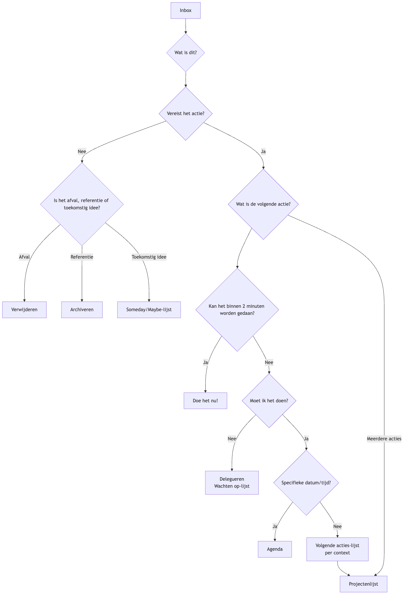

# GTD (Getting Things Done)

Ons brein is van nature een uitstekende "CPU" voor **het genereren van ideeën**, maar een zeer slechte "harde schijf" voor **het opslaan van informatie**. Wanneer we proberen ons brein te gebruiken om al onze taken, afspraken, ideeën en verplichtingen te onthouden, raakt het bezet met deze "onafgewerkte zaken", wat leidt tot stress, angst en mentale rompslomp, waardoor het onmogelijk wordt om je te concentreren op de taak die voor je ligt. **GTD (Getting Things Done)**, ontwikkeld door productiviteitsexpert David Allen, is een wereldwijd erkend **systeem voor persoonlijke productiviteit en workflowbeheer**.

De kernfilosofie van GTD is om een **"Mind Like Water"**-toestand te bereiken: stressvrij, hoogst geconcentreerd en efficiënt werken, door alle openstaande "zaken" uit je hoofd te halen en in een **externe, betrouwbare systeem** op te slaan, en vervolgens een helder, rigoureus proces te volgen om deze zaken te **organiseren en verwerken**. Het is geen eenvoudige tijdmanagementtruc, maar een compleet besturingssysteem dat je brein bevrijdt en je in staat stelt om rustig complex werk en leven te beheren.

## De Vijf Kernstappen van GTD

1.  **Vastleggen**: Verwijder direct alles wat je aandacht trekt—of het nu een werktaak is, een persoonlijke klus, een plotselinge ingeving of een toekomstige afspraak—uit je brein en voeg het toe aan je "**Inbox**". De inbox kan fysiek zijn (zoals een map, een notitieboekje) of digitaal (zoals een e-mailinbox, een takenapplicatie). Het belangrijkste is om ervoor te zorgen dat je inboxen zo min mogelijk zijn en volledig betrouwbaar en leegbaar.

2.  **Verwerken**: Leeg regelmatig (minstens één keer per dag) je "**inbox**". Volg strikt het **principe van één item tegelijk**, neem elk "item" in je inbox één voor één en stel jezelf de kernvraag: "**Wat is dit? Vereist het actie?**"
    *   Als **geen actie nodig is**: Het is ofwel **afval** (direct verwijderen), **informatie die je in de toekomst misschien nodig hebt** (opslaan in een referentiemap), of een **idee in incubatie** (toevoegen aan een "Someday/Maybe"-lijst).
    *   Als **actie nodig is**: Ga dan verder met de volgende organisatiestap.

3.  **Organiseren**: Zet items die actie vereisen in verschillende "emmers" afhankelijk van hun aard.
    *   **"Twee-minutenregel"**: Als de actie binnen **twee minuten** kan worden voltooid, **voer het dan direct uit**, zonder verdere organisatie.
    *   **Delegeer aan anderen**: Als de taak door iemand anders moet worden uitgevoerd, **delegeer** deze direct en voeg het toe aan een "**Wachten op**"-lijst voor volg-up.
    *   **Agenda**: Voor acties met een **specifieke datum of tijd** (bijvoorbeeld vergaderingen, afspraken), voeg ze toe aan je **agenda**.
    *   **Volgende Acties-lijst**: Voor acties die jouw persoonlijke aandacht vereisen, meerdere stappen omvatten en geen specifieke datum hebben, deel ze op in de **eerste concrete, zichtbare fysieke actie**, en voeg ze toe aan verschillende "Volgende Acties-lijsten" op basis van **context**. Contexten kunnen "@computer," "@kantoor," "@telefoon," "@supermarkt," etc. zijn.
    *   **Projectenlijst**: Elke uitkomst die **meer dan één actie** vereist om te voltooien, moet worden gedefinieerd als een "**Project**" en toegevoegd worden aan de "Projectenlijst." Deze lijst registreert alleen de projectnaam; de specifieke volgende acties worden opgeslagen in de bijbehorende volgende acties-lijst.

4.  **Reflecteren**: Om het vertrouwen in het systeem te behouden, moet je **regelmatige beoordelingen** uitvoeren.
    *   **Dagelijkse Beoordeling**: Bekijk dagelijks snel je agenda en volgende acties-lijst om je werk van die dag te plannen.
    *   **Wekelijkse Beoordeling**: Dit is een **essentieel onderdeel van GTD**. Een keer per week (meestal in het weekend), neem 1-2 uur vrij om een uitgebreide, grondige beoordeling, update en opruiming van het hele systeem uit te voeren, en zorg ervoor dat alle projecten onder controle zijn en alle lijsten up-to-date zijn.

5.  **Uitvoeren**: Op elk moment, wanneer je moet beslissen "Wat moet ik nu doen?", kun je een slimme en rustige keuze maken uit je actielijst op basis van de volgende criteria:
    *   **Context**: Waar ben je nu? Welke tools heb je bij de hand? (bijvoorbeeld, als je op kantoor bent, kijk dan naar de "@kantoor"-lijst)
    *   **Beschikbare tijd**: Hoeveel vrije tijd heb je nu? (bijvoorbeeld, als je maar 10 minuten hebt, kies dan een taak die snel kan worden voltooid)
    *   **Beschikbare energie**: Wat is je huidige energieniveau? (bijvoorbeeld, als je energiek bent, ga dan een taak aan die veel concentratie vereist)
    *   **Prioriteit**: Onder de bovenstaande omstandigheden, welke taak is het belangrijkst?

### GTD Workflow Verwerkingsdiagram

<!-- mermaid 源文件：GTD-Tutorial-nl-mermaid-live-1.mmd -->

## Toepassingsgevallen

**Geval 1: Een drukke afdelingsmanager**

*   **Vastleggen**: Zijn inbox kan bestaan uit: e-mailinbox, WeChat-berichten, notities genomen tijdens vergaderingen, en plotselinge ideeën die in hem opkomen.
*   **Verwerken en Organiseren**:
    *   Een e-mail "betreffende de mededeling van het volgende kwartaalsbudget" -> Geen actie nodig -> **Archiveren** naar de map "Bedrijfsfinanciën".
    *   Een idee "herinner medewerker Xiao Zhang om zijn wekelijkse rapport in te sturen" -> Kan binnen 2 minuten worden gedaan -> **Direct** een bericht sturen naar Xiao Zhang.
    *   Een taak "voorbereiding van het jaarlijks teambuildingsevent" -> Vereist meerdere stappen -> Voeg "Teambuilding" toe aan de "**Projectenlijst**"; voeg de eerste actie "Communicatie met HR om een lijst van mogelijke locaties te verkrijgen" toe aan de "**@Kantoor**"-lijst van volgende acties.
    *   Een afspraak "vergadering met klant volgende week woensdag om 15:00 uur" -> Toevoegen aan de **agenda**.
*   **Uitvoeren**: Wanneer hij op kantoor is, een uur vrije tijd heeft en zich energiek voelt, kan hij de "@Kantoor"-lijst openen en kiezen om "Communicatie met HR" uit te voeren.

**Geval 2: Projectmanagement van een freelancer**

*   **Projectenlijst**: Kan bestaan uit "Websiteontwerp voor klant A," "Redesign van persoonlijk blog," "Een nieuwe programmeertaal leren," etc.
*   **Volgende Acties-lijst**:
    *   **@Telefoon**: Bel klant A om feedback op de ontwerpschetsen te bevestigen.
    *   **@Computer-ontwerp**: Revisie van het ontwerp van de homepage op basis van feedback.
    *   **@Computer-schrijven**: Schrijf een blogpost over "responsief ontwerp."
    *   **