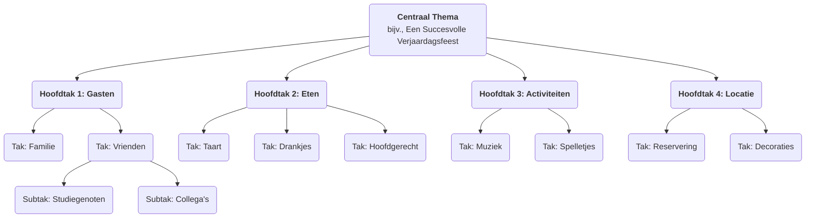

# Mindmapping

Onze hersenen denken niet lineair en rechttoe rechtaan; ze zijn juist vol sprongen, associaties en afwijkingen. **Mindmapping** is precies zo'n krachtige **visuele denktool** die goed aansluit bij de natuurlijke werkwijze van onze hersenen. In de jaren '70 ontwikkeld door de Britse wetenschapper Tony Buzan, ligt de kern van mindmapping in het verbinden van trefwoorden, ideeën, afbeeldingen en kleuren rondom een **centraal thema** in een **radiale, geleidelijk gelageerde structuur**, waardoor een complex onderwerp of een versnipperde verzameling informatie wordt georganiseerd in een duidelijke, geordende, makkelijk te onthouden en te begrijpen "hersenkaart".

De charme van mindmapping ligt in zijn **niet-lineaire** karakter. Het moedigt ons aan om vrij te associëren, plotselinge ingevingen te vangen en deze op een organische, onderling verbonden manier te ordenen. Het is niet alleen een tool om informatie vast te leggen, maar ook een krachtige denkpartner die creativiteit stimuleert, logica verduidelijkt en het geheugen versterkt. Van plannen en het maken van leesnotities tot het voorbereiden van presentaties en brainstormen – mindmapping kan onze denkefficiëntie en diepgang aanzienlijk verbeteren.

## Kerncomponenten van een mindmap

Een standaard mindmap volgt een paar eenvoudige maar cruciale tekenregels.

1.  **Centrale afbeelding/onderwerp**: In het midden van het papier gebruik je een opvallende afbeelding of trefwoord om je kernthema weer te geven. Dit is het uitgangspunt van al je denken.
2.  **Hoofdtakken**: Dikke, gebogen lijnen die vanuit het centrale thema stralen en de belangrijkste eerste niveau takken of categorieën van dat thema representeren. Elke hoofdtak moet een trefwoord bevatten.
3.  **Subtakken**: Dunne lijnen die uit de hoofdtakken voortkomen en verdere uitwerking en specificatie van de inhoud van de hoofdtakken representeren. Takken kunnen oneindig verder vertakken en zo een hiërarchische boomstructuur vormen.
4.  **Trefwoorden**: Gebruik op elke tak slechts een beknopt trefwoord of korte zin die de kernidee samenvat, in plaats van volledige zinnen. Dit helpt om meer associaties op te roepen.
5.  **Kleuren**: Gebruik verschillende kleuren voor verschillende hoofdtakken en hun subtakken. Kleuren helpen ons bij categorisatie en organisatie en versterken het visuele geheugen aanzienlijk.
6.  **Afbeeldingen**: Gebruik zoveel mogelijk kleine pictogrammen, symbolen en eenvoudige tekeningen op verschillende plaatsen in de kaart. Zoals het gezegde luidt: "Een plaatje zegt meer dan duizend woorden"; afbeeldingen verhogen het aantrekkelijkheid en de onthoudbaarheid van de kaart sterk.

### Voorbeeld van een mindmapstructuur

<!--

-->

## Hoe een mindmap te maken

1.  **Stap één: Begin in het midden**
    Neem een blanco vel papier en leg het horizontaal. In het midden teken je een afbeelding die je kernthema representeert of schrijf je het trefwoord op.

2.  **Stap twee: Teken de hoofdtakken**
    Teken vanuit het centrale thema verschillende dikke, gebogen lijnen als hoofdtakken. Elke hoofdtak stelt een kerncategorie voor. Schrijf het bijbehorende trefwoord boven de lijn.

3.  **Stap drie: Voeg takken en trefwoorden toe**
    Teken vanuit elke hoofdtak dunne takken en schrijf daarop specifiekere trefwoorden. Houd de lengte van de lijnen en de tekst consistent. Dit proces lijkt op een grote boom die nieuwe takjes voortbrengt.

4.  **Stap vier: Gebruik kleuren en afbeeldingen**
    Wijs verschillende kleuren toe aan verschillende hoofdtaksystemen. Teken eenvoudige kleine pictogrammen of symbolen op plaatsen waar je dat gepast vindt, zodat je kaart "tot leven komt".

5.  **Stap vijf: Vrije associatie, voortdurende uitbreiding**
    Laat je niet beperken door volgorde; laat je gedachten vrij springen tussen verschillende takken. Denk je aan een nieuw punt, zoek dan meteen de bijbehorende categorie en voeg een nieuwe tak toe. Het hele proces moet ontspannen en plezierig zijn.

## Toepassingsvoorbeelden

**Voorbeeld 1: Het maken van leesnotities**

*   **Situatie**: Na het lezen van een boek over "effectieve gewoontes" wil je de kerninhoud ordenen en onthouden.
*   **Toepassing**:
    *   **Centraal thema**: De boektitel "Effectieve Gewoontes".
    *   **Hoofdtakken**: Deze kunnen de hoofdstuktitels van het boek zijn, zoals "De Kracht van Gewoontes", "De Gewoontelus", "Hoe Goede Gewoontes Opbouwen", "Hoe Slechte Gewoontes Verbreken".
    *   **Subtakken**: Onder elke hoofdtak gebruik je trefwoorden om de kernargumenten, belangrijke voorbeelden en specifieke methoden van dat hoofdstuk vast te leggen. Bijvoorbeeld onder de hoofdtak "Gewoontelus" kun je takken uitwaaieren naar "Trigger", "Ritueel" en "Beloning".
    *   Op deze manier worden het logische kader en de kernpunten van het hele boek samengevat in een duidelijke afbeelding, wat zeer handig is voor het herzien en onthouden.

**Voorbeeld 2: Het voorbereiden van een presentatie of verslag**

*   **Situatie**: Je moet een 20-minuten verslag houden voor de directie over het "Jaarlijks Marketingplan van het bedrijf".
*   **Toepassing**:
    *   **Centraal thema**: "Jaarlijks Marketingplan".
    *   **Hoofdtakken**: "Marktanalyse", "Doelgroep", "Kernstrategieën", "Budgetallocatie", "Verwachte KPI's".
    *   **Subtakken**: Onder elke hoofdtak verder uitwerken van de punten die uitgelegd moeten worden. Bijvoorbeeld onder "Kernstrategieën" kun je takken uitwaaieren naar "Content Marketing", "Promotie via Sociale Media", "Offline Activiteiten", enzovoort.
    *   Deze mindmap vormt het volledige kader van je presentatie. Tijdens de presentatie kun je naar de kaart kijken om ervoor te zorgen dat je logisch blijft en geen belangrijke punten vergeet.

**Voorbeeld 3: Het organiseren van een teambrainstorm**

*   **Situatie**: Een team moet creatieve ideeën genereren over "Hoe de gebruikerservaring van een product te verbeteren".
*   **Toepassing**:
    *   **Centraal thema**: "Gebruikerservaring Verbeteren".
    *   **Hoofdtakken**: Deze kunnen van tevoren worden ingesteld als aspecten van de gebruikerservaring, zoals "Prestaties", "Gebruiksgemak", "Visueel Ontwerp", "Klantenservice".
    *   **Proces**: Teamleden geven vrijelijk ideeën rondom deze hoofdtakken, en de facilitator voegt deze ideeën in real-time toe aan de bijbehorende takken van de mindmap als trefwoorden. De visuele en onderling verbonden aard van de mindmap stimuleert teamleden sterk om op ideeën "mee te rijden", waardoor meer associaties en creativiteit ontstaan.

## Voordelen en uitdagingen van mindmapping

**Kernvoordelen**

*   **Sluit aan bij hersendenken**: De radiale structuur imiteert de verbindingen van hersenneuronen, waardoor denken en associëren natuurlijker en vloeiender verloopt.
*   **Stimuleert creativiteit**: Het niet-lineaire karakter moedigt vrij associëren aan, wat helpt om de beperkingen van lineair denken te doorbreken en meer ideeën op te roepen.
*   **Versterkt het geheugen**: Door trefwoorden, kleuren, afbeeldingen en andere elementen te combineren, worden zowel de linker- als rechterhersenhelft betrokken, wat het geheugeneffect sterk versterkt.
*   **Snel overzichtelijk**: Kan een grote hoeveelheid complexe informatie op een zeer compacte en duidelijk gestructureerde manier weergeven, waardoor het snel mogelijk is het grote plaatje te begrijpen.

**Mogelijke uitdagingen**

*   **Sterk gepersonaliseerd**: Mindmaps die individueel worden gemaakt kunnen sterk subjectief zijn in logica en keuze van trefwoorden, en anderen kunnen uitleg nodig hebben om ze in eerste instantie volledig te begrijpen.
*   **Niet geschikt voor einddocumenten**: Het is een uitstekende tool voor denken en conceptvorming, maar de handmatige, niet-lineaire stijl is meestal niet geschikt voor einddocumenten zoals formele zakelijke rapporten of academische artikelen die strikte opmaak vereisen.
*   **Beperkingen van tools**: Hoewel er veel mindmapping software beschikbaar is, wordt handmatig tekenen meestal als de meest creatieve manier beschouwd. Handmatige mindmaps zijn echter minder handig voor bewerken en delen dan elektronische versies.

## Uitbreidingen en verwante concepten

*   **Brainstormen**: Mindmapping is een ideale tool om brainstormen te organiseren en de resultaten te structureren. Verspreide ideeën die tijdens een brainstorm worden gegenereerd, kunnen in real-time worden gecategoriseerd en gestructureerd met behulp van een mindmap.
*   **Conceptmap**: Vergelijkbaar met een mindmap, maar richt zich meer op het nauwkeurig uitdrukken van **specifieke relaties** tussen verschillende concepten (bijvoorbeeld door tekst op verbindingslijnen te gebruiken om "A veroorzaakt B" of "B is onderdeel van C" uit te leggen). Het is logisch rigoureuzer, terwijl mindmaps zich meer richten op vrij associëren en brainstormen.

---
*Referentie: Tony Buzan staat bekend als de "vader van de mindmap". Zijn boek "The Mind Map Book" is de autoritatieve bijbel voor deze methode, waarin de principes, regels en brede toepassingen in verschillende vakgebieden uitvoerig worden beschreven.*