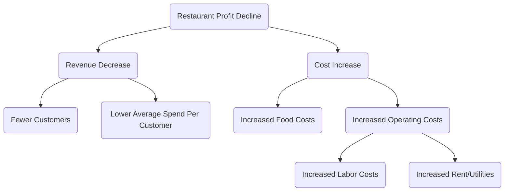

# Logische Boom Analyse Tutorial

## 1. Wat is een Logische Boom?

**Logische Boom** is een krachtig, visueel analysetool dat wordt gebruikt om complexe problemen of kwesties systematisch op te breken in kleinere, beheersbaardere delen. De kernprincipe is **MECE (Wederzijds Uitsluitend, Collectief Volledig)**, wat betekent dat de opgebroken delen elkaar niet overlappen en niets belangrijks wordt weggelaten.

Een logische boom helpt ons een duidelijk kader voor denken op te bouwen en zorgt voor nauwkeurigheid en grondigheid in de analyse.

## 2. Belangrijkste Soorten Logische Bomen

Logische bomen worden voornamelijk verdeeld in twee soorten, die worden gebruikt om problemen van verschillende aard op te lossen:

### a. Probleemboom (Diagnostische Boom)

-   **Doel**: Wordt gebruikt om te diagnosticeren en te verkennen "**waarom**" een probleem zich voordoet.

-   **Structuur**: Begint met een kernprobleem (de wortel), en breekt dit voortdurend verder op om mogelijke oorzaken van het probleem te vinden. Elke laag van takken is een dieper inzicht in het probleem van de vorige laag.

-   **Toepasbare Scenario's**: Oorzachendiagnose, prestatiedaling, probleemoplossing, enz.

### b. "Hoe" Boom (Oplossingsboom)

-   **Doel**: Wordt gebruikt om te conceptualiseren en te plannen "**hoe**" men een doel kan bereiken of een probleem kan oplossen.
-   **Structuur**: Begint met een algemeen doel (de wortel), en breekt dit op in specifieke, uitvoerbare strategieën of actieplannen.
-   **Toepasbare Scenario's**: Strategisch plannen, doelstellingen stellen, projectplanning, oplossingen vinden, enz.

## 3. Hoe Bouw Je Een Logische Boom?

### Stap Eén: Definieer Duidelijk Het Kernprobleem Of Doel

-   **Probleemboom**: Geef duidelijk het "probleem" aan dat moet worden geanalyseerd. Bijvoorbeeld: "Waarom stijgt de vlotheid van gebruikers op onze website?"
-   **"Hoe" Boom**: Geef duidelijk het "doel" aan dat moet worden behaald. Bijvoorbeeld: "Hoe kunnen we het aantal maandelijkse actieve gebruikers van de website met 20% verhogen?"
-   Gebruik dit probleem of doel als uitgangspunt (wortel) van de logische boom.

### Stap Twee: Voer de Eerste Decompositie Uit (Pas het MECE-Principe Toe)

-   **Brainstorm**: Denk rondom het kernprobleem/doel na over welke belangrijke componenten het probleem/doel kan worden opgesplitst.
-   **Pas het MECE-Principe Toe**: Zorg ervoor dat de takken van het eerste niveau wederzijds uitsluitend zijn (geen overlap) en collectief volledig (geen belangrijke aspecten worden weggelaten).
    -   **Voorbeeld (Probleemboom)**: Toenemende vlotheid van gebruikers kan worden opgesplitst in: "Vlotheid van nieuwe gebruikers" en "Vlotheid van bestaande gebruikers."
    -   **Voorbeeld ("Hoe" Boom)**: Toenemend aantal maandelijkse actieve gebruikers kan worden opgesplitst in: "Aantrekken van nieuwe gebruikers," "Verhogen van de activiteit van bestaande gebruikers," en "Terugwinnen van vertrokken gebruikers."

### Stap Drie: Decomposeer Stap Voor Stap

-   **Stel Vragen**: Voor elke tak, stel voortdurend de vraag "Waarom gebeurt dit?" (Probleemboom) of "Hoe kan dit precies worden gedaan?" ("Hoe" Boom), om dieper te decomponeren.
-   **Behoud Duidelijke Structuur**: Pas op elk niveau het MECE-principe toe totdat het probleem is opgesplitst in voldoende specifieke niveaus die met data kunnen worden geverifieerd of direct kunnen worden uitgevoerd.

### Stap Vier: Valideer Hypotheses en Prioriteer

-   **Valideer Met Data**: Voor probleembomen, verzamel data om te valideren welke takken de echte oorzaken zijn.
-   **Evalueer Oplossingen**: Voor "hoe" bomen, evalueer de haalbaarheid, kosten en verwachte effecten van elk actieplan.
-   **Bepaal de Kritieke Weg**: Identificeer de belangrijkste oorzaken of acties die het grootste effect hebben op het oplossen van het probleem of het behalen van het doel, en prioriteer deze.

## 4. Praktijkcases

### Case 1: Probleemboom - Analyseren van "Waarom dalen de winsten van het restaurant?"

<!--


-->

**Analyse**: Via deze boomstructuur kunnen managers duidelijk de belangrijkste oorzaken van de winstdaling zien en data verzamelen voor elke tak (bijvoorbeeld "Minder klanten") voor verdere analyse.

### Case 2: "Hoe" Boom - Plannen van "Hoe kan ik mijn persoonlijke werkefficiëntie verbeteren?"

```mermaid
graph TD
    A(Improve Personal Work Efficiency) --> B(Better Time Management)
    A --> C(Optimize Workflow)
    A --> D(Reduce Distractions)

    B --> E(Use Pomodoro Technique)
    B --> F(Create Daily Task List)

    C --> G(Automate Repetitive Tasks)
    C --> H(Use Templates and Tools)

    D --> I(Turn Off Unnecessary Notifications)
    D --> J(Set Fixed "Do Not Disturb" Work Hours)
```

**Analyse**: Deze boomstructuur breekt een abstract doel op in een reeks specifieke, uitvoerbare stappen, en helpt individuen om duidelijke verbeterplannen op te stellen.

Logische bomen zijn een van de kernvaardigheden die essentieel zijn voor consultants, productmanagers en strategische planners, omdat ze het diepe en brede denken aanzienlijk kunnen verbeteren.