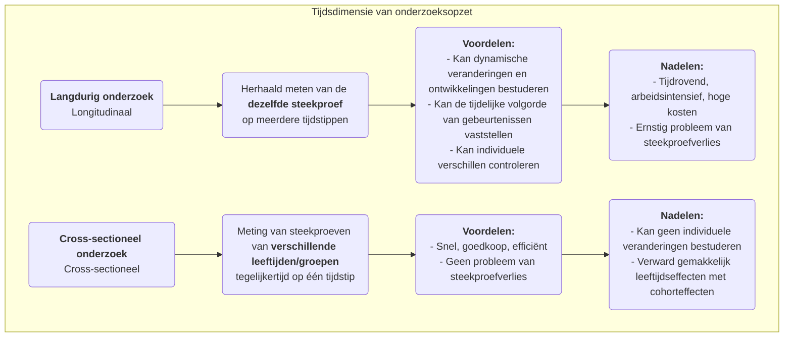

# Langdurig Onderzoek

Bij het verkennen van het lange verloop van menselijke ontwikkeling, sociale verandering en ziekte-evolutie, hebben we een onderzoeksmethode nodig die in staat is de cruciale dimensie van "tijd" vast te leggen. **Langdurig onderzoek** is precies zo’n "camera", die herhaaldelijk en continu de **dezelfde steekproef** observeert en meet gedurende een langere periode. Het kerndoel hiervan is om bloot te leggen hoe fenomenen **veranderen, zich ontwikkelen en evolueren** in de loop van de tijd, en om de langetermijninvloed van vroege gebeurtenissen op latere uitkomsten te onderzoeken.

In tegenstelling tot cross-sectioneel onderzoek, dat slechts een "snapshot" biedt op één tijdstip, levert langdurig onderzoek ons een "documentaire" op. Het stelt ons in staat om de groeitrajecten van individuen, de processen van conceptuele veranderingen en het volledige verloop van een ziekte vanaf het ontstaan tot volledige ontwikkeling te observeren. Dit maakt het mogelijk om bij het verkennen van causale relaties duidelijker de tijdelijke volgorde van gebeurtenissen vast te stellen. Wanneer je dynamische vragen wilt beantwoorden over processen en ontwikkelingen, zoals "Hoe beïnvloeden leesgewoontes in de kindertijd de inkomensniveaus van volwassenen?" of "Welk langetermijneffect heeft een beleidsverandering gehad in het volgende decennium?", dan wordt langdurig onderzoek een onmisbaar en krachtig instrument.

## Kernkenmerken en typen van langdurig onderzoek

De gemeenschappelijke factor in alle longitudinale studies is hun tracking van "tijd", maar ze kunnen hoofdzakelijk worden ingedeeld in drie typen op basis van de aard van wat wordt gevolgd:

*   **Cohortstudie**: Dit is de meest voorkomende vorm. Onderzoekers selecteren een specifieke groep mensen (een "cohort") die een gemeenschappelijk kenmerk of ervaring delen (bijvoorbeeld "alle in 2000 geboren kinderen" of "werknemers die in 2010 bij een bepaald bedrijf zijn begonnen") en volgen deze cohort gedurende meerdere decennia.
*   **Panelstudie**: Vergelijkbaar met een cohortstudie, maar volgt exact dezelfde **individuele** steekproef. Elke enquête richt zich op dezelfde groep mensen, waardoor onderzoekers de veranderingstrajecten van elk individu nauwkeurig kunnen analyseren.
*   **Trendstudie**: Dit type onderzoek richt zich op veranderingen in de kenmerken van een "populatie" in de tijd, maar de individuele steekproeven die voor elke enquête worden getrokken zijn verschillend. Bijvoorbeeld, om veranderingen in de publieke houding ten opzichte van milieukwesties te onderzoeken, zou een onderzoeksinstituut elke vijf jaar willekeurig een nieuwe steekproef landelijk kunnen selecteren voor een enquête.

### Vergelijking van longitudinaal en cross-sectioneel onderzoek

## Hoe een longitudinale studie uitvoeren

1.  **Stel langetermijndoelen vast**
    Definieer duidelijk welke veranderingen of ontwikkelingen je wilt volgen en welke mogelijke beïnvloedende factoren je interessant vindt. Langdurig onderzoek is een langetermijninvestering en moet worden ondersteund door duidelijke, belangrijke onderzoeksmotieven.

2.  **Definieer en selecteer je cohort of panelsteekproef**
    Definieer nauwkeurig je studiepopulatie en gebruik geschikte steekproefmethoden om de initiële steekproef te selecteren. De kwaliteit en representativiteit van de initiële steekproef zijn cruciaal.

3.  **Voer een basisonderzoek uit**
    Voer bij aanvang van het onderzoek de eerste uitgebreide dataverzameling (baseline-onderzoek) uit om de initiële toestand van alle relevante variabelen vast te stellen.

4.  **Ontwerp en voer vervolgonderzoeken uit**
    Bepaal de tijdsintervallen voor de vervolgonderzoeken (bijvoorbeeld jaarlijks, elke vijf jaar) en ontwerp consistente meetinstrumenten. Het in contact blijven met de steekproef en het verminderen van het verliespercentage behoren tot de grootste uitdagingen gedurende een lang onderzoekstraject.

5.  **Datamanagement en analyse**
    Langdurige datastructuren zijn complex en vereisen professionele databases voor het beheer. Voor de analyse gebruiken onderzoekers geavanceerde statistische modellen (zoals groeicurvenmodellen, overlevingsanalyse) om de trajecten van variabele veranderingen in de tijd en hun beïnvloedende factoren te analyseren.

## Klassieke toepassingscases

**Case 1: De Harvard Study of Adult Development**

*   **Situatie**: Een van de langste longitudinale studies in de geschiedenis, die in 1938 begon en 724 mannen bijna 80 jaar volgde.
*   **Toepassing**: Onderzoekers verzamelden regelmatig gegevens over hun werk, gezin, gezondheid en andere aspecten via vragenlijsten, interviews, medische dossiers, enz. De bekendste conclusie van deze studie is dat goede, warme interpersoonlijke relaties de belangrijkste factor zijn bij het voorspellen van langetermijn geluk en gezondheid, zelfs belangrijker dan rijkdom, roem en genen. Deze conclusie kon alleen worden getrokken via levenslange follow-up.

**Case 2: UK Millennium Cohort Study**

*   **Situatie**: Een nationale geboortecohortstudie die ongeveer 19.000 Britse kinderen volgt die tussen 2000 en 2002 werden geboren.
*   **Toepassing**: De studie voerde uitgebreide dataverzameling uit op verschillende leeftijden (bijvoorbeeld 9 maanden, 3, 5, 7, 11, 14, 17 jaar), waarbij gezondheid, cognitie, gedrag en gezinsomgeving werden gedekt. Deze studie leverde massale en uiterst waardevolle bewijsmateriaal voor de overheid om beleid voor kinderen en gezinnen te formuleren. Zo onthulde het bijvoorbeeld het langetermijnnegatieve effect van armoede op de vroege kinderontwikkeling.

**Case 3: Cohortanalyse van productgebruikersverlies**

*   **Situatie**: Een SaaS (Software as a Service)-bedrijf wil de retentie van nieuwe gebruikers begrijpen.
*   **Toepassing**: Zij gebruikten de **cohortanalyse**-methode. Zij beschouwden "nieuwe gebruikers die zich elke maand registreren" als een cohort (bijvoorbeeld "januaricohort", "februaricohort"). Vervolgens volgden zij de retentiegraad van elk cohort in de eerste maand, tweede maand, derde maand... na registratie. Door de retentiecurves van verschillende cohorts te vergelijken, konden zij beoordelen of hun productverbeteringen en marketingactiviteiten een positief effect hadden op de langetermijnretentie van nieuwe gebruikers.

## Voordelen en uitdagingen van langdurig onderzoek

**Kernvoordelen**

*   **Vermogen om dynamische processen te bestuderen**: De meest effectieve methode om "ontwikkeling" en "verandering" zelf te onderzoeken.
*   **Vaststellen van tijdelijke volgorde**: Kan duidelijk de tijdelijke volgorde van gebeurtenissen vaststellen, wat een belangrijk voorwaarde is voor het afleiden van causaliteit (maar men moet nog steeds oppassen voor confounders).
*   **Controle op individuele verschillen**: Aangezien dezelfde individuen worden gevolgd, kunnen inherente individuele verschillen die in de tijd niet veranderen (zoals IQ, persoonlijkheid) worden uitgesloten als storende factoren in de resultaten.

**Mogelijke uitdagingen**

*   **Hoge kosten**: Vereist langetermijnfinanciële ondersteuning, een stabiel onderzoeksteam en enorme beheerskosten.
*   **Tijdrovend**: De uitvoercyclus van onderzoeksresultaten is zeer lang, mogelijk jaren of zelfs decennia.
*   **Steekproefverlies**: Dit is de grootste "natuurlijke vijand" van langdurig onderzoek. Na verloop van tijd kunnen sommige deelnemers uit de studie stappen vanwege verhuizing, verlies van contact, overlijden of verlies van interesse, wat kan leiden tot vertekening in de uiteindelijke steekproef.
*   **Invloed van herhaalde metingen**: Herhaald dezelfde tests of vragenlijsten ondergaan kan het gedrag of de antwoorden van deelnemers beïnvloeden, ook wel het "oefeneffect" genoemd.

## Uitbreidingen en verbindingen

*   **Cross-sectioneel onderzoek**: Wordt vaak gebruikt als een goedkope en snelle alternatief voor langdurig onderzoek. Het is echter belangrijk om zich bewust te zijn van de onmogelijkheid om onderscheid te maken tussen leeftijdseffecten en cohorteffecten.
*   **Overlevingsanalyse**: Een statistische methode die vaak wordt gebruikt in langdurig onderzoek, specifiek voor de analyse van de duur tot het optreden van een gebeurtenis (bijvoorbeeld herstel, churn, overlijden) en de beïnvloedende factoren daarvan.

---
*Referentie: Het ontwerpconcept van langdurig onderzoek heeft een lange geschiedenis in de epidemiologie en sociale wetenschappen. De levenslooptheorie van Glen H. Elder Jr. levert een belangrijk theoretisch kader voor modern langdurig onderzoek.*