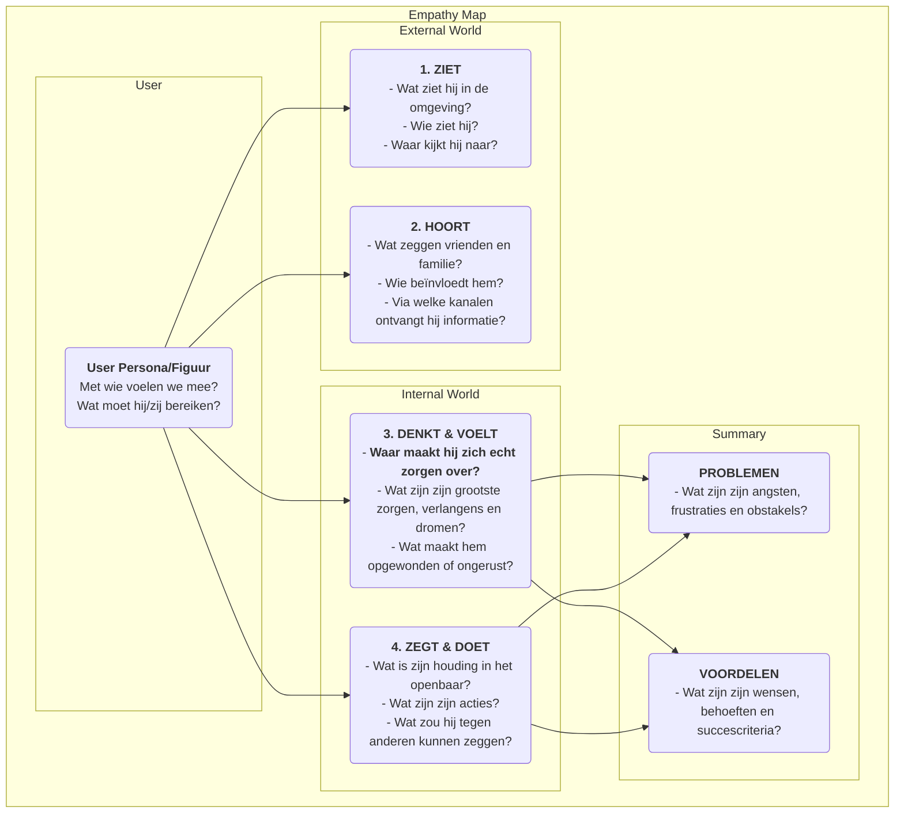

# Empathykaart

In productontwerp en gebruikersonderzoek is "empathie" een kernkwaliteit die vaak wordt genoemd, maar die moeilijk werkelijk te bereiken is. Hoe kunnen we echt "in de schoenen van de gebruiker stappen" en hun wereld vanuit hun perspectief ervaren? De **Empathykaart** is een eenvoudig, intuïtief, maar zeer krachtig **collaboratief empathieinstrument** dat speciaal voor dit doel is ontworpen. Het helpt teams om te gaan voorbij het oppervlak van gebruikersgedrag en doordringt tot de diepere wereld van **zintuigen, gedachten en emoties**, waardoor een vollere en meerdimensionale kijk op de gebruiker ontstaat.

De kern van de Empathykaart ligt in het systematisch organiseren van alle verspreide, kwalitatieve observaties en interviewgegevens over gebruikers in een visueel kader. Dit kader is meestal verdeeld in vier hoofdvakken: **Ziet, Hoort, Denkt & Voelt, en Zegt & Doet**. Door samen deze kaart in te vullen, worden teamleden gedwongen het perspectief van de gebruiker in te nemen en gezamenlijk een gedeeld begrip te vormen van de innerlijke wereld en het externe milieu van de gebruiker. Het is een spiegel die de werkelijke situatie van de gebruiker duidelijk weerspiegelt en een katalysator voor het ontwikkelen van collectieve teamempathie.

## Onderdelen van een Empathykaart

Een klassieke Empathykaart is gebruikersgericht en ontsluit vier kernvakken van externe en interne ervaringen.

<!--

*   **Ziet**: Beschrijft wat de gebruiker visueel ziet in zijn omgeving. Bijvoorbeeld: wat doen de mensen om hem heen? Welke marktinformatie komt hij dagelijks tegen?
*   **Hoort**: Beschrijft de informatie die de gebruiker uit de externe wereld ontvangt. Wat zeggen vrienden, familie en collega's? Welke opinieleiders of mediakanalen beïnvloeden hem?
*   **Denkt & Voelt**: Dit is de kern van de kaart, waarin geprobeerd wordt de innerlijke wereld van de gebruiker te verkennen. Wat is er echt belangrijk voor hem (zelfs als hij het nooit hardop zegt)? Welke zorgen, angsten, hoop en dromen heeft hij?
*   **Zegt & Doet**: Beschrijft de woorden en daden van de gebruiker in het openbaar. Wat vertelde hij ons tijdens een interview? Wat zijn zijn daadwerkelijke gedragingen bij het gebruik van het product? Hierbij moet je extra letten op mogelijke tegenstrijdigheden tussen "zegt" en "denkt".
*   **Problemen** en **voordelen**: Na het analyseren van de bovenstaande vier vakken, samenvatten wat de innerlijke worstelingen en verlangens van de gebruiker zijn. Problemen vertegenwoordigen de obstakels en negatieve emoties die hij tegenkomt, terwijl voordelen de doelen en wensen zijn die hij echt wil bereiken.

## Hoe gebruik je een Empathykaart

Een Empathykaart werkt het beste in een teamworkshop.

1.  **Stap 1: Definieer de scope en doelen**
    *   **Kies je gebruiker**: Definieer duidelijk voor welke specifieke gebruikerspersoon of figuur deze Empathykaart is. Het is het beste om hem een naam en een basisachtergrond te geven.
    *   **Duidelijke doelen**: Definieer de doelen die je met deze oefening wilt bereiken. Is het om bestaande gebruikers beter te begrijpen, of om potentiële gebruikers voor een nieuw product te verkennen?

2.  **Stap 2: Verzamel onderzoeksmateriaal**
    Een Empathykaart moet gebaseerd zijn op echt onderzoek, niet op fictie. Bereid alle relevante gebruikersonderzoeksgegevens voor, zoals: opnames en transcripties van gebruikersinterviews, video's van usabilitytests, open antwoorden op enquêtes, foto's van gebruikers, enzovoort.

3.  **Stap 3: Vul de kaart samen in**
    *   Teken een grote Empathykaart-sjabloon op een whiteboard of gebruik een online samenwerktuin.
    *   Teamleden schrijven gezamenlijk bevindingen uit het onderzoeksmateriaal op sticky notes, één voor één, en plaatsen ze in de juiste vakken van de kaart. Bijvoorbeeld, bij het beluisteren van een interviewopname kan een teamlid schrijven: "Gebruiker zegt dat hij elke week overwerkt (Zegt)", terwijl een ander teamlid schrijft: "Ik heb het gevoel dat hij moe klinkt en zijn passie voor zijn werk is kwijtgeraakt (Voelt)."
    *   Moedig teamleden aan om de inhoud van de sticky notes hardop voor te lezen en uit te leggen waarom ze ze in dat vak hebben geplaatst.

4.  **Stap 4: Ga dieper en synthetiseer**
    Als alle informatie op het bord staat, leid het team dan in een dieper gesprek.
    *   "Welke tegenstrijdigheden zien we? Bijvoorbeeld, zijn de woorden en daden van gebruikers inconsistent?"
    *   "Wat is hij echt aan het zorgen achter al deze details, zonder het hardop te zeggen?"
    *   "Wat hebben we onverwacht geleerd?"
    *   Tot slot, samenvattend: wat zijn de belangrijkste **problemen** en **voordelen** van de gebruiker?

5.  **Stap 5: Deel en toepassen**
    Organiseer en deel de voltooide Empathykaart, en gebruik deze als belangrijke input voor het verdere ontwerp- en besluitvormingsproces.

## Toepassingsvoorbeelden

**Voorbeeld 1: Ontwerp van een smartphone voor ouderen**

*   **Gebruiker**: Opa Wang, 70 jaar oud, heeft net een smartphone van zijn kinderen gekregen.
*   **Ziet**: De pictogrammen op het scherm zijn klein en talrijk, moeilijk te zien; jonge mensen gebruiken allemaal mobiel betalen en chatten.
*   **Hoort**: Kinderen zeggen: "Het is heel simpel, je leert het snel"; oude vrienden zeggen: "Dat ding is te ingewikkeld, ik kan het niet leren."
*   **Denkt & Voelt**: Voelt zich erg **frustrerend**, bang om achterop te raken bij technologie; toch **verlangend** om te leren hoe hij met zijn kleinkinderen kan videobellen.
*   **Zegt & Doet**: Zegt: "Ik heb dit niet nodig", maar probeert stiekem steeds opnieuw het scherm te ontgrendelen.
*   **Problemen**: Bang om fouten te maken en verlies te veroorzaken; het gevoel te worden verlaten door technologie.
*   **Voordelen**: Hoopt contact te houden met familie; hoopt zelfstandig dagelijkse taken te kunnen uitvoeren (bijvoorbeeld busroutes opzoeken).
*   **Ontwerpinspiratie**: Het kernontwerpprincipe van deze telefoon moet niet "veel functies" zijn, maar "geen frustratie". Er moet een "extra groot lettertype", "familiale afstandbediening" en andere functies worden geboden.

**Voorbeeld 2: Ontwerp van een sollicitatie-app voor universitaire studenten**

*   **Gebruiker**: Li Xue, 22 jaar oud, een afgestudeerde universitaire student.
*   **Ziet**: Sollicitatie-websites zijn vol met informatie, moeilijk om echte van valse te onderscheiden; klasgenoten hebben al meerdere aanbiedingen ontvangen.
*   **Hoort**: Senioren zeggen: "Je eerste baan is erg belangrijk"; ouders zeggen: "Een stabiele baan vinden is het belangrijkst."
*   **Denkt & Voelt**: Voelt zich erg **verward en ongerust** over de toekomst; weet niet welk soort baan bij haar past; **bang** om slecht te presteren in sollicitatiegesprekken.
*   **Zegt & Doet**: Heeft honderden sollicitaties verstuurd; heeft haar cv herhaaldelijk herschreven.
*   **Problemen**: Geen richting in het sollicitatieproces; asymmetrische informatie; gebrek aan zelfvertrouwen.
*   **Voordelen**: Hoopt een baan te vinden die ze echt interessant vindt en goede vooruitzichten biedt; hoopt professionele begeleiding en advies te ontvangen.
*   **Ontwerpinspiratie**: De kernfunctie van de app moet niet alleen vacatures zijn, maar ook modules zoals "loopbaanpersoonlijkheidstest", "online consultatie met branche-mentoren", "simulatie van sollicitatiegesprekken" en andere functies.

**Voorbeeld 3: Ontwerp van een schrijftool voor contentcreators**

*   **Gebruiker**: Zhang Wei, een bijbaantje blogger.
*   **Ziet**: Andere bloggers publiceren dagelijks hoogwaardige artikelen; zijn eigen artikelen krijgen weinig reacties.
*   **Hoort**: Lezers reageren: "Goed geschreven, ik zie uit naar updates"; vrienden zeggen: "Het is moeilijk om als blogger geld te verdienen."
*   **Denkt & Voelt**: Voelt zich erg pijnlijk wanneer de **inspiratie opraakt**; **verlangt** naar erkenning en resonantie van lezers; worstelt tussen het nastreven van idealen en het verdienen van geld.
*   **Zegt & Doet**: Besteedt veel tijd aan het verzamelen van materiaal en het opzetten van inhoud; schrijft vaak laat in de avond.
*   **Problemen**: Het schrijfproces wordt onderbroken, lage efficiëntie; gebrek aan motivatie voor voortdurend creëren.
*   **Voordelen**: Hoopt een tool te hebben die helpt bij het ordenen van gedachten en het opwekken van inspiratie; hoopt diepere verbindingen met lezers op te bouwen.
*   **Ontwerpinspiratie**: Naast de basiseditiefuncties moet de schrijftool ook functies bieden zoals "inspiratiekaartenverzameling", "mindmapmodus", "analyse van interactiegegevens met lezers" en andere speciale functies.

## Voordelen en uitdagingen van de Empathykaart

**Belangrijkste voordelen**

*   **Snel en efficiënt**: Een effectieve methode om snel teamempathie te ontwikkelen (meestal binnen 60 minuten).
*   **Bevordert teamwerk**: Door de samenwerkende aard breekt het de silo's tussen afdelingen en leidt tot een gedeeld, diepgaand begrip van de gebruiker binnen het hele team.
*   **Ontdekt verborgen behoeften**: Door te focussen op de innerlijke wereld van de gebruiker helpt het bij het ontdekken van potentiële behoeften en pijnpunten die gebruikers zelf mogelijk niet duidelijk kunnen uiten.

**Mogelijke uitdagingen**

*   **Geen vervanging voor gebruikerspersonas**: Een Empathykaart richt zich meestal op de toestand van een gebruiker in een specifiek scenario, terwijl een gebruikerspersona een vollere, duurzamere karakterbeschrijving geeft. Een Empathykaart is een uitstekende input voor het opstellen van gebruikerspersonas, maar kan deze niet volledig vervangen.
*   **Vraagt om echte gegevens**: Net als alle gebruikersonderzoeksinstrumenten kan een Empathykaart zonder echte onderzoeksgegevens veranderen in een "fictieve verhalensessie" gebaseerd op subjectieve aannames van teamleden.

## Uitbreidingen en verbindingen

*   **Gebruikerspersona**: De Empathykaart is een **essentiële voorbereidende stap** voor het bouwen van een levendige, emotioneel rijke gebruikerspersona. Door de analyse van de Empathykaart kan zeer levendige materiaal worden geleverd voor de onderdelen "Pijn", "Doelen" en andere modules van een gebruikerspersona.
*   **Gebruikersreis-kaart**: In elk stadium van de reiskaart kan een mini Empathykaart worden gebruikt om de gedachten, gevoelens en acties van de gebruiker in dat stadium diepgaand te analyseren, waardoor pijnpunten in elk stadium nauwkeuriger kunnen worden geïdentificeerd.

---
*Bronvermelding: De Empathykaart is oorspronkelijk voorgesteld door Dave Gray, oprichter van XPLANE (nu onderdeel van Deloitte), en wordt breed toegepast in Design Thinking en Agile ontwikkelpraktijken. Het is een fundamenteel en kern empathieinstrument in gebruikersgerichte ontwerpprocessen.*