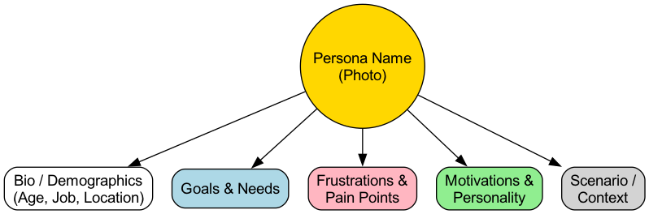

# Gebruikersprofiel

In elk gebruikersgericht ontwerpproces is een terugkerende kernuitdaging: voor wie ontwerpen we precies? Als teamleden een vaag, eenzijdig of zelfs tegenstrijdig beeld hebben van de doelgroep, kunnen productbeslissingen gemakkelijk verkeerd aflopen. Het **gebruikersprofiel** is een krachtig hulpmiddel om dit probleem op te lossen. Het is geen eenvoudige gebruikersbeschrijving, maar een geloofwaardig, fictief karaktermodel dat een specifieke gebruikersgroep vertegenwoordigt, zorgvuldig opgebouwd op basis van echte gebruikersonderzoeksgegevens.

Het fundamentele doel van een gebruikersprofiel is om abstracte, koele gebruikersgegevens te transformeren naar een "concreet persoon" met een naam, gezicht, verhaal en emoties. Dit stelt het ontwerpteam in staat om echt in de wereld van de gebruiker te stappen en op basis van empathie betere ontwerpbeslissingen te nemen.

## Onderdelen van een gebruikersprofiel

Een gedetailleerd en empathisch gebruikersprofiel bevat doorgaans de volgende sleutelonderdelen, die samen een multidimensionaal karakter schetsen.

*   **Basisinformatie & Foto**: Geef het profiel een echte naam, een geloofwaardige foto en basisdemografische informatie zoals leeftijd, beroep en locatie. Dit verhoogt aanzienlijk het realiteitsgevoel en de herkenbaarheid van het profiel.
*   **Citaat**: Gebruik een zin die dit fictieve karakter zou kunnen zeggen om hun kernbehoeften of houding samen te vatten. Bijvoorbeeld: "Ik heb een tool nodig die teaminformatie kan integreren en mij op elk moment inzicht geeft in de voortgang."
*   **Doelen**: Dit is de kern van het profiel. Het beschrijft de belangrijkste doelen die de gebruikersgroep wil bereiken bij gebruik van het product of de dienst. Doelen moeten over de gebruiker zelf gaan, niet over productfuncties.
*   **Frustraties/Probleempunten**: Beschrijft de belangrijkste obstakels, verwarring en frustraties waarmee de gebruiker momenteel te maken heeft bij het behalen van hun doelen. De kernwaarde van een product ligt vaak in de mate waarin het deze problemen effectief kan oplossen.
*   **Gedragingen**: Beschrijft de dagelijkse gedragspatronen van de gebruiker, met name in situaties die verband houden met het product. Hoe werkt hij/zij? Welke tools gebruikt hij/zij? Wat zijn zijn/zijn informatiebronnen? Dit helpt bij het begrijpen van de context waarin het product wordt gebruikt.
*   **Motivaties**: Onderzoekt de diepere psychologische factoren die het gebruikersgedrag beïnvloeden. Denk aan de behoefte aan efficiëntie, de wens om veiligheid te ervaren, de behoefte aan sociale erkenning of de ambitie tot persoonlijke groei.

### Sjabloon voor gebruikersprofiel

Hieronder volgt een typische structuur voor een gebruikersprofiel, die kan worden aangepast aan het specifieke project.

## Hoe effectieve gebruikersprofielen te maken

Het maken van gebruikersprofielen is een onderzoeksproces dat van divergentie naar convergentie gaat en zeker geen gokwerk is.

1.  **Voer gebruikersonderzoek uit**
    Dit is de basis van het hele proces. Je moet eerstelijnsinformatie over echte gebruikers verzamelen via kwalitatieve methoden (zoals diepgaande interviews, veldstudies) en kwantitatieve methoden (zoals enquêtes, analyse van productachtergronddata).

2.  **Identificeer belangrijke gedragsvariabelen**
    Zoek in de verzamelde gegevens naar sleutelvariabelen die verschillende gebruikersgroepen kunnen onderscheiden. Voor een e-commerce website kunnen bijvoorbeeld de "aankoopfrequentie", "prijsgevoeligheid" en "merkloyaliteit" van een gebruiker mogelijke variabelen zijn.

3.  **Cluster en bepaal het aantal profielen**
    Gebruik de sleutelvariabelen om gebruikers met vergelijkbaar gedrag en doelen samen te groeperen in verschillende gebruikersgroepen. Over het algemeen is het geschikt voor een product om 3-5 kerngebruikersgroepen te selecteren en corresponderende gebruikersprofielen te maken. Te veel profielen doen het team het fokken verliezen.

4.  **Schrijf het profielverhaal**
    Maak voor elke gebruikersgroep een representatief fictief karakter. Geef hen een naam, een foto en een levendig verhaal, en vul de verschillende modules van het profielsjabloon met onderzoeksgegevens en inzichten om het tot leven te laten komen.

5.  **Promoot en gebruik binnen het team**
    De waarde van gebruikersprofielen ligt in hun gebruik. Print de uiteindelijke profielen uit, hang ze op in de werkruimte van het team, en verwijzen ernaar tijdens productvergaderingen, ontwerpreviews en functiebesprekingen ("Hoe zou Li Jing deze functie gebruiken?"). Maak ze tot een gemeenschappelijke taal en een richtlijn voor besluitvorming.

## Gebruikersprofielen in de praktijk

**Case 1: Een taal leerapp**

*   **Profiel**: "Commuter Learner" Sun Yu, 28, marketing specialist. Hij wil gebruik maken van fragmenten van zijn tijd in de metro tijdens zijn dagelijkse pendelrit om Engels te leren.
*   **Probleempunten**: De metro-omgeving is luidruchtig met een instabiel netwerksignaal, waardoor het moeilijk is om te leren waarbij veel concentratie of spreek-/luisteroefeningen nodig zijn.
*   **Ontwerpbeslissing**: Op basis van dit profiel moet de app prioriteit geven aan functies zoals "offline cursus downloaden", "5-minuten kennishapjes" en "een leermodus die zich richt op lezen en woordenschat."

**Case 2: Een gezinsreceptenapp**

*   **Profiel**: "Nieuwe moeder" Chen Jie, 30. Zij moet gezonde, voedzame en eenvoudige avondmaaltijden voorbereiden voor haar gezin (met name een jong kind).
*   **Probleempunten**: Ze is druk met werk en heeft weinig tijd om complexe recepten te bestuderen, en maakt zich zorgen over voedselveiligheid en voedingsbalans.
*   **Ontwerpbeslissing**: De startpagina van de app moet secties zoals "Snelle maaltijden van 30 minuten", "Voedzame maaltijden voor kinderen" en "Seizoensgroenten" benadrukken, en moet de bereidingstijd, moeilijkheidsgraad en voedingsinformatie in de recepten duidelijk aangeven.

**Case 3: Een financiële beheerapp**

*   **Profiel**: "Zuinige planner" Oom Wang, 55, die op het punt staat met pensioen te gaan. Hij wil zijn financiële situatie duidelijk begrijpen en stabiele plannen maken voor zijn pensioenleven.
*   **Probleempunten**: Hij voelt zich verward en wantrouwend tegenover complexe financiële termen en hoge risico-investeringen, en vindt veel financiële apps te ingewikkeld om te gebruiken.
*   **Ontwerpbeslissing**: Het interfaceontwerp van de software moet uiterst eenvoudig en duidelijk zijn, gebruikmaken van begrijpelijke taal, en functies zoals "Overzicht van activa", "Vaste inkomsten/uitgaven per maand" en "Aanbevelingen voor lage risico-investeringen" benadrukken.

## Waarde en uitdagingen van gebruikersprofielen

**Kernwaarde**

*   **Bouw empathie op**: Het is het beste hulpmiddel om ontwerpers en ingenieurs uit hun eigen perspectief te halen en hen in de context van de gebruiker te plaatsen.
*   **Verenig de taal van besluitvorming**: Geeft een objectieve, gebruikersgerichte arbitrage-standaard voor het team bij meningsverschillen.
*   **Richt je op kernbehoeften**: Helpt het team om echt belangrijke functies te identificeren en prioriteit te geven aan deze functies binnen een wirwar van complexe vereisten.

**Mogelijke uitdagingen**

*   **Onderzoekskosten**: Het maken van kwalitatief hoogwaardige gebruikersprofielen vereist investeringen in echt gebruikersonderzoek, wat tijd en budget kost.
*   **Risico van stereotypering**: Als het onderzoek ontoereikend is of het begrip eenzijdig, kan dit leiden tot het maken van verkeerde, stereotiepe profielen, waardoor de productrichting verkeerd wordt geleid.
*   **Tijdigheid**: Gebruikers en de markt veranderen voortdurend, en gebruikersprofielen moeten regelmatig worden herzien en geüpdatet, anders worden ze "levende fossielen."

## Uitbreidingen en verbindingen

Gebruikersprofielen zijn een kernonderdeel van de UX-ontwerptoolkit en worden vaak nauw verbonden met andere methoden:

*   **Gebruikersreis-kaart**: Nadat "wie" (het gebruikersprofiel) is bepaald, beschrijft de gebruikersreiskaart het hele proces waarin deze persoon met het product interactie heeft om zijn doel te bereiken.
*   **Empathy Map**: Dit is een instrument dat zich meer richt op het dieper verkennen van de zintuiglijke en emotionele ervaringen van de gebruiker, vaak gebruikt voor het verzamelen van materiaal en empathie-oefeningen in het vroege stadium van het maken van gebruikersprofielen.

---
*Referentie: Alan Cooper introduceerde het gebruikersprofiel als een formele ontwerpmethode in het softwareontwikkelingsveld in zijn baanbrekende boek "About Face: The Essentials of Interaction Design."*