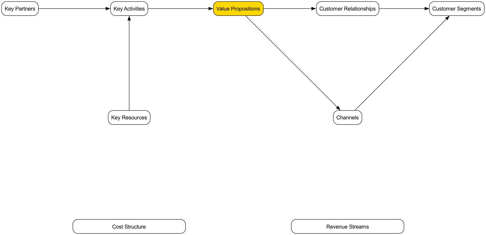

# Business Model Canvas

Een zakelijk idee, hoe spannend ook, zal slechts een kasteel in de lucht blijven als het niet kan worden omgezet in een levensvatbaar, duurzaam winstgevend systeem. De **Business Model Canvas** is een revolutionair strategisch management- en ondernemersinstrument dat is voorgesteld door Alexander Osterwalder en Yves Pigneur. Het biedt een beknopte, intuïtieve "gemeenschappelijke taal" waarmee teams duidelijk alle kernaspecten van een bedrijfsmodel kunnen beschrijven, ontwerpen, beoordelen en iteratief verbeteren op één enkel overzicht.

De kracht van de Business Model Canvas ligt in haar vermogen om een complex, dynamisch bedrijfssysteem te ontrafelen in negen onderling verbonden en logisch heldere bouwstenen. Deze negen bouwstenen beslaan vier hoofdgebieden van een bedrijf: **klanten, product/dienst, infrastructuur en financiële haalbaarheid**. Door deze bouwstenen systematisch op één canvas weer te geven, kunnen ondernemers en managers een overkoepelend beeld krijgen van het gehele bedrijfsmodel, de belangrijkste drijfveren, potentiële risico's en innovatiekansen identificeren, en zo strategische gesprekken verdiepen en sneller beslissen.

## De Negen Bouwstenen van de Canvas

De kern van de Business Model Canvas is een sjabloon met negen vakken, elk vertegenwoordigend een sleutelaspect van het bedrijfsmodel.

1.  **Waardeaanbod**: Dit is de kern van de canvas. Het beschrijft de waarde die je creëert voor specifieke klantsegmenten, welke pijnpunten je voor hen oplost, of welke behoeften je vervult. Het moet uniek en onderscheidend zijn.
2.  **Klantsegmenten**: Voor wie creëer je waarde? Wie zijn je belangrijkste klanten? Hier kunnen één of meerdere doelgroepen worden gedefinieerd.
3.  **Kanalen**: Via welke contactpunten communiceer je met je klanten en lever je je waardeaanbod? Dit omvat kanaalopties voor bewustwording, evaluatie, aankoop, levering en nasaleservice.
4.  **Klantrelaties**: Welk type relatie wil je opbouwen en onderhouden met elk klantsegment? Is het geautomatiseerd, persoonlijk of gebaseerd op een gemeenschap?
5.  **Inkomstenstromen**: Hoe genereer je inkomsten van klanten nadat je waarde succesvol hebt geleverd? Is dat via eenmalige verkopen, abonnementskosten, verhuurkosten of advertentiekosten?
6.  **Sleutelresources**: De belangrijkste middelen die je moet bezitten om je waardeaanbod te leveren, klanten te bereiken en relaties in stand te houden. Dit kunnen fysieke middelen, intellectuele eigendommen, menselijke of financiële middelen zijn.
7.  **Sleutelactiviteiten**: De belangrijkste activiteiten die je moet uitvoeren om je bedrijfsmodel effectief te laten werken. Bijvoorbeeld, voor een softwarebedrijf is het "softwareontwikkeling"; voor een consultancybureau is het "probleemoplossing".
8.  **Sleutelpartnerships**: Het netwerk van leveranciers en partners waarmee je moet samenwerken om je bedrijfsmodel te optimaliseren, risico's te verminderen of middelen te verkrijgen.
9.  **Kostenstructuur**: Alle kosten die gepaard gaan met het opereren van een bedrijfsmodel, inclusief vaste en variabele kosten.

## Hoe de Business Model Canvas te gebruiken

1.  **Print een Grote Canvas**
    Print de canvas op een groot posterformaat en zorg voor voldoende post-its en viltstiften. Het fysieke karakter van de canvas is cruciaal voor teamwerking en discussie.

2.  **Van Rechts naar Links, Eerst Klanten, Daarna Infrastructuur**
    Een aanbevolen invulvolgorde is om te starten aan de rechterkant van de canvas (klantkant), daarna naar het waardeaanbod in het midden en uiteindelijk naar de infrastructuurkant. Dat wil zeggen: **Klantsegmenten -> Waardeaanbod -> Kanalen -> Klantrelaties -> Inkomstenstromen**. Dit zorgt ervoor dat je bedrijfsmodel altijd klantgericht blijft.

3.  **Brainstorm met Post-its**
    Voor elke bouwsteen schrijven teamleden hun ideeën op post-its en plaatsen ze in het bijbehorende vak. Het voordeel van post-its is dat ideeën gemakkelijk verplaatst, gewijzigd en vervangen kunnen worden.

4.  **Verbind en Vertel een Verhaal**
    Als de canvas is ingevuld, probeer dan je bedrijfsmodel "verhaal" te vertellen. Begin met je doelklanten (CS), beschrijf hoe je hen dient via je waardeaanbod (VP) en kanalen (CH), en uiteindelijk inkomsten (R) genereert. Leg daarna uit welke middelen (KR), activiteiten (KA) en partners (KP) je nodig hebt om dit alles te realiseren, en welke kosten (C) dat met zich meebrengt. Controleer of het verhaal logisch verloopt en of de verschillende onderdelen op elkaar aansluiten.

5.  **Beoordeel en Itereer**
    Beoordeel het bedrijfsmodel op de canvas. Wat zijn de sterktes? Wat zijn de zwaktes en risico's? Vervolgens kun je via het verplaatsen of vervangen van post-its verschillende mogelijkheden verkennen en een beter bedrijfsmodel ontwerpen.

## Toepassingsvoorbeelden

**Voorbeeld 1: Nespresso Capsulekoffiemachine**

*   **Klantsegmenten**: Huishoudens en kantoren die kwaliteit en gemak zoeken.
*   **Waardeaanbod**: Snel en eenvoudig een espressokoffie van cafésniveau maken thuis.
*   **Kanalen**: Directe verkoop via de officiële website, luxe warenhuizen en eigen winkels.
*   **Klantrelaties**: Oprichting van de Nespresso Club, met ledenbetrekkingen en exclusieve ervaringen.
*   **Inkomstenstromen**: Gebruikt het "razor-and-blade"-model. De koffiemachine (razor) heeft een lage winstmarge, de hoofdinkomsten komen van de verkoop van hoge winstmarge, patentbeschermde koffiecapsules (blades).
*   **Sleutelresources**: Sterke merknaam, gepatenteerde technologie (capsulesysteem), productiefaciliteiten.
*   **Sleutelactiviteiten**: Marketing, supply chain management, productontwikkeling.
*   **Sleutelpartnerships**: Fabrikanten van koffiemachines, koffietelers.
*   **Kostenstructuur**: Hoge marketing- en merpkosten, productiekosten.

**Voorbeeld 2: Airbnb**

*   **Klantsegmenten**: Tweeledig platform, met **verhuurders** die extra ruimte hebben aan de ene kant, en **reizigers** die unieke, lokale verblijfervaringen zoeken aan de andere kant.
*   **Waardeaanbod**: Biedt verhuurders een eenvoudige manier om geld te verdienen; biedt reizigers goedkope en lokale verblijfalternatieven ten opzichte van hotels.
*   **Kanalen**: Website en mobiele app.
*   **Klantrelaties**: Opbouw van een vertrouwensgemeenschap, onderhoud van relaties via beoordelingssystemen en gebruikersondersteuning.
*   **Inkomstenstromen**: Heeft een percentage commissie van zowel verhuurders als reizigers.
*   **Sleutelresources**: Het platform zelf, een uitgebreid netwerk van gebruikers en aanbiedingen, merknaam.
*   **Sleutelactiviteiten**: Ontwikkeling en onderhoud van het platform, community management, marketing.
*   **Sleutelpartnerships**: Fotografen (voor foto's van accommodaties), betalingsplatforms, verzekeraars.
*   **Kostenstructuur**: Kosten voor platformonderhoud, marketingkosten, klantenservicekosten.

**Voorbeeld 3: Gratis mobiele games (bijv. Honor of Kings)**

*   **Klantsegmenten**: Groot aantal gamers (gratis gebruikers) en een klein aantal **betalende spelers** die bereid zijn te betalen voor extra diensten.
*   **Waardeaanbod**: Biedt een kwalitatief hoogwaardige, gratis entertainmentervaring.
*   **Kanalen**: App stores (App Store, Google Play).
*   **Klantrelaties**: Onderhoudt gemeenschapsactiviteiten via in-game sociale systemen, evenementen en esports toernooien.
*   **Inkomstenstromen**: Verdient voornamelijk geld door de verkoop van virtuele items die de spelbalans niet beïnvloeden (bijv. heldenskins, decoraties) aan betalende spelers (freemium model).
*   **Sleutelresources**: Game IP, ontwikkelteam, grote gebruikersbasis.
*   **Sleutelactiviteiten**: Gameontwikkeling en updates, community management, organisatie van esports evenementen.
*   **Sleutelpartnerships**: App store kanaalpartners, esports clubs, livestream platforms.
*   **Kostenstructuur**: Hoge R&D- en serverkosten, marketinguitgaven.

## Waarde en Beperkingen van de Business Model Canvas

**Kernwaarde**

*   **Intuïtief en Holistisch**: Visualiseert complexe bedrijfslogica en helpt teams een holistisch overzicht te krijgen.
*   **Bevordert Communicatie en Overeenstemming**: Biedt een gemeenschappelijke taal en vergemakkelijkt strategische gesprekken binnen het team.
*   **Agiel en Iteratief**: Zeer geschikt voor het verkennen en iteratief verbeteren van nieuwe bedrijfsmodellen, vooral in de onzekere beginfase.

**Mogelijke Beperkingen**

*   **Negeert Concurrentie**: De canvas heeft geen specifieke module voor het analyseren van de concurrentieomgeving.
*   **Statische Screenshot**: Het toont de structuur van het bedrijfsmodel, maar laat de dynamische evolutie niet volledig zien.
*   **Moet Gecombineerd Worden Met Andere Tools**: Voor betere besluitvorming moet het vaak gecombineerd worden met andere tools zoals de Value Proposition Canvas en SWOT-analyse.

## Uitbreidingen en Verbindingen

*   **Lean Canvas**: Een variant van de Business Model Canvas, geschikter voor vroege startupprojecten met hoge onzekerheid. Het vervangt "Sleutelpartnerships", "Sleutelactiviteiten", "Sleutelresources" en "Klantrelaties" door modules die zich richten op problemen en oplossingen.
*   **Value Proposition Canvas**: Kan worden gezien als een uitbreiding en verdieping van de modules "Waardeaanbod" en "Klantsegmenten" van de Business Model Canvas, waarmee je de product-marktfit nauwkeuriger kunt uitwerken.
*   **Blue Ocean Strategy**: Nadat je met het Four Actions Framework van Blue Ocean Strategy een nieuwe waardecurve hebt bedacht, kun je de Business Model Canvas gebruiken om het bedrijfsmodel dat deze nieuwe strategie ondersteunt, systematisch te ontwerpen.

---
*Referentie: Het boek "Business Model Generation" van Alexander Osterwalder en Yves Pigneur is de autoritatieve gids voor dit instrument, met talrijke casestudies en gedetailleerde gebruiksinstructies.*