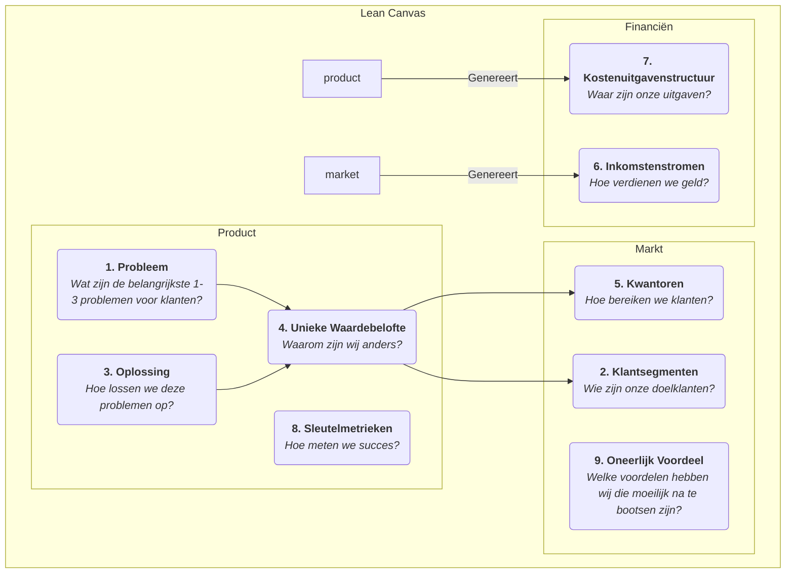

# Lean Canvas

In de vroege fase van een startup is het grootste risico vaak niet "kunnen we het product bouwen?" maar "wil iemand het product dat we bouwen werkelijk hebben?" Traditionele bedrijfsplannen en businessmodel canvassen zijn uitstekende tools voor gevestigde bedrijven, maar voor startups die opereren in een omgeving van grote onzekerheid kunnen ze te complex zijn en niet voldoende gericht zijn op de meest kritieke risico's. **Lean Canvas** is ontwikkeld om dit probleem op te lossen; het is een briljante aanpassing van het Business Model Canvas, speciaal afgestemd op **ondernemers in een vroege fase**.

Lean Canvas, voorgesteld door Ash Maurya in zijn boek *Running Lean*, behoudt de eenvoud en intuïtiviteit van het Business Model Canvas, maar verplaatst de nadruk van een "volledige beschrijving van het businessmodel" naar **"systematisch de hoogste risico's van de startup hypothetisch identificeren en valideren."** Het richt zich op **Probleem-Oplossing** en voegt aandacht toe voor sleutelmetrieken en concurrentievoordelen, en verbeeldt daarmee dieper de "bouw-meting-leer"-cyclus van Lean Startup. Het is een risicogerichte slagkaart die ondernemers door de mist leidt.

## De Negen Blokken van Lean Canvas

Lean Canvas behoudt de negen blokken van het Business Model Canvas, maar vervangt er vier van, om het meer actiegericht en risicogericht te maken.

**Verschillen met het Business Model Canvas:**

*   **Probleem** vervangt "Sleutelpartners": Dit is de belangrijkste verandering. Het dwingt ondernemers ertoe als eerste de belangrijkste 1-3 problemen helder te definiëren die hun doelklanten dringend willen oplossen.
*   **Oplossing** vervangt "Sleutelactiviteiten": Nadat het probleem is gedefinieerd, stel je vervolgens je oplossing (meestal de kernfunctionaliteiten van het product) specifiek daarvoor voor.
*   **Sleutelmetrieken** vervangt "Sleutelbronnen": Voor een startup is het belangrijkste niet welke middelen het bezit, maar hoe het de gezondheid en groei van het bedrijf meet. Sleutelmetrieken zijn de maatstaf die alle acties stuurt.
*   **Oneerlijk Voordeel** vervangt "Klantrelaties": Ook bekend als "oneerlijk voordeel" of "gracht", dit verwijst naar kerncompetenties die door concurrenten niet eenvoudig kunnen worden nagemaakt of gekocht. Dit is cruciaal voor de langetermijnoverleving van het businessmodel.

## Hoe Lean Canvas te gebruiken

Het gebruik van Lean Canvas is een continue cyclus van validatie en iteratie.

1.  **Teken je "Plan A" Canvas**
    Voordat je met klanten spreekt, vul je snel een Lean Canvas in met al je initiële ideeën en hypotheses voor het startupproject. Dit duurt meestal slechts 15-20 minuten. Dit is je "Plan A", een verzameling van alle hypotheses die gevalideerd moeten worden.

2.  **Identificeer de hoogste risico's**
    Bekijk je eerste versie van het canvas en identificeer de onderdelen met het hoogste risico en de grootste onzekerheid. Voor een nieuw project zijn de hoogste risico's meestal in volgorde:
    *   **Probleem-Klanthypothese**: Bestaat dit probleem echt? Zijn deze mensen werkelijk je doelklanten?
    *   **Probleem-Oplossingshypothese**: Kan jouw oplossing hun probleem echt oplossen?
    *   **Prijs-Waardehypothese**: Zijn klanten bereid om voor jouw oplossing te betalen?

3.  **Valideer hypotheses systematisch**
    Ontwerp en voer een reeks "minimum viable experiments" uit (meestal **probleeminterviews** en **oplossingsinterviews**) om je hoogste risico's systematisch te valideren. Bijvoorbeeld:
    *   **Voer Probleeminterviews uit**: Ga naar je doelklanten en spreek met hen, maar praat niet over je product. Je enige doel is om hun problemen, bestaande gedragingen en pijnpunten diep te begrijpen om de blokken "Probleem" en "Klantsegmenten" op het canvas te valideren.
    *   **Voer Oplossingsinterviews uit**: Nadat je hebt gevalideerd dat het probleem daadwerkelijk bestaat, laat je je oplossing (dit kan een prototype of demo zijn) aan klanten zien om je "Oplossing" en "Waardebelofte" te valideren, en test je hun bereidheid om te betalen ("Inkomstenstromen").

4.  **Itereer je Canvas**
    Werk je Lean Canvas continu bij en voer iteraties uit op basis van de inzichten verkregen uit interviews en experimenten. Sommige hypotheses worden gevalideerd, andere worden ontkracht. De canvas is als een experimentenboekje dat het volledige evolutiepad van je startupproject vastlegt, vanaf de initiële idee tot het vinden van "product-market fit".

## Toepassingsvoorbeelden

**Voorbeeld 1: Dropbox (Cloudopslagdienst) vroege Canvas**

*   **Probleem**: Bestanden synchroniseren tussen meerdere apparaten is omslachtig; het verzenden van grote bestanden via USB-sticks of e-mail is vervelend; vergeten om back-ups te maken leidt tot gegevensverlies.
*   **Klantsegmenten**: Technologie-enthousiastelingen met meerdere computers, freelancers.
*   **Unieke Waardebelofte**: "Stop je bestanden in een 'magische zak', overal toegankelijk, nooit verloren."
*   **Oplossing**: Een desktopapplicatie die naadloos op de achtergrond draait en automatisch de inhoud van een aangewezen map synchroniseert.
*   **Sleutelmetrieken**: Aantal gebruikersregistraties, **bestand upload succespercentage**, aantal actieve gebruikers.
*   **Oneerlijk Voordeel**: Netwerkeffect – hoe meer mensen het gebruiken, hoe makkelijker het is om te delen en samen te werken.
*   **Validatie**: Oprichter Drew Houston maakte een eenvoudige productdemonstratievideo en plaatste die in een technologie-enthousiastelingengemeenschap. Binnen een nacht steeg de wachtrij van 5.000 naar 75.000 mensen, wat sterk de "probleem-oplossing"-fit valideerde.

**Voorbeeld 2: Geplande "Gezonde Maaltijdenlevering" Service**

*   **Probleem**: Kantoorwerknemers vinden het moeilijk om gezonde, gebalanceerde lunches te eten; het zelf bereiden van maaltijden kost te veel tijd; afhaalmaaltijden zijn meestal vet.
*   **Klantsegmenten**: Gezondheidsbewuste jonge professionals met fitnessgewoontes.
*   **Unieke Waardebelofte**: "Door een voedingsdeskundige ontworpen, vers bereide fitnessmaaltijden, op tijd op je werk geleverd."
*   **Oplossing**: Wekelijkse lunchmaaltijdplannen aanbieden, met wekelijks bijgewerkte menu's en calorie- en voedingsinformatie.
*   **Sleutelmetrieken**: **Wekelijkse herhaalaankoopgraad**, klantlevenswaarde.
*   **Oneerlijk Voordeel**: Exclusieve samenwerkingen met kwalitatief hoogwaardige ingrediëntenleveranciers, een professioneel voedingsdeskundigenteam.
*   **Validatie**: De oprichter kon in eerste instantie vermijden een app te ontwikkelen en in plaats daarvan bestellingen accepteren via een WeChat-groep of enquêteplatform, en lunches handmatig leveren aan de eerste 20 gebruikers om het hele proces en gebruikersbehoeften te valideren.

**Voorbeeld 3: Airbnbs vroege Canvas**

*   **Probleem**: Tijdens populaire conferenties zijn stadshotels duur en volgeboekt.
*   **Klantsegmenten**: Designers met beperkt budget die deelnemen aan designconferenties.
*   **Oplossing**: Een platform bieden waar lokale inwoners (verhuurders) hun extra luchtbedden kunnen verhuren aan deze designers.
*   **Unieke Waardebelofte**: Goedkoper onderdak krijgen en de kans om met inwoners te interageren.
*   **Validatie**: De oprichters plaatsten zelf drie luchtbedden in hun huis en slaagden erin deze te verhuren aan designers die de conferentie bijwoonden, waarmee ze persoonlijk de haalbaarheid van het hele businessmodel valideerden.

## Waarde en Beperkingen van Lean Canvas

**Kernwaarde**

*   **Risicogerichtheid**: Dwingt ondernemers om vanaf het begin de hoogste risico's onder ogen te zien.
*   **Snelheid en Iteratie**: Zeer geschikt om snel businessmodellen te schetsen, te bespreken en te itereren, perfect afgestemd op de Lean Startup-cyclus.
*   **Probleemgerichtheid**: Zorgt ervoor dat het uitgangspunt van het bedrijf is om een echt waardevol klantprobleem op te lossen.

**Mogelijke Beperkingen**

*   **Onvoldoende aandacht voor de externe omgeving**: Net als het Business Model Canvas bevat het niet automatisch een analyse van concurrentie en macro-omgeving.
*   **Niet toepasbaar op alle bedrijven**: Het is het meest geschikt voor startups met hoge onzekerheid. Voor gevestigde bedrijven met gevalideerde businessmodellen kan het Business Model Canvas een uitgebreidere tool zijn.

## Uitbreidingen en Verbindingen

*   **Business Model Canvas**: Lean Canvas is een belangrijke variatie en ontwikkeling van het Business Model Canvas binnen de context van Lean Startup.
*   **Customer Development**: Een methodologie voorgesteld door Steve Blank, die benadrukt dat je "het gebouw moet verlaten" om hypotheses te valideren, wat dient als leidraad voor Lean Canvas op actieniveau.
*   **Value Proposition Canvas**: Kan dienen als een verdiepingsinstrument voor de blokken "Probleem", "Oplossing" en "Unieke Waardebelofte" in Lean Canvas, en helpt ondernemers om de product-market fit nauwkeuriger te verfijnen.

---
*Referentie: Ash Maurya's "Running Lean" is de meest autoritatieve bron voor Lean Canvas, waarin gedetailleerd wordt uitgelegd hoe je Lean Canvas stap voor stap gebruikt en iteratief verbetert in combinatie met Customer Development. Deze methode is sterk beïnvloed door Eric Ries' "The Lean Startup" en Steve Blanks Customer Development model.*