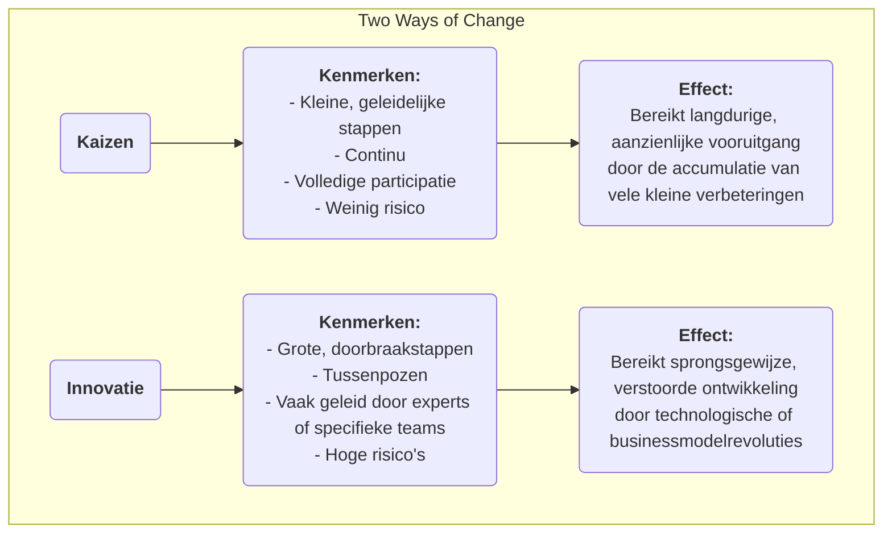

# Kaizen

In veel organisaties wordt "verbetering" vaak gezien als een groot "project" dat aanzienlijke investeringen vereist, wordt geleid door experts en van boven naar beneden wordt aangestuurd. Er is echter een managementfilosofie die gelooft dat echte, krachtige en blijvende vooruitgang voortkomt uit ogenschijnlijk onbeduidende **kleine en continue verbeteringen** die elke dag door elke medewerker worden gedaan. Dit is de kern van **Kaizen**. Kaizen is een Japanse term die "verandering ten goede" betekent, en het is zowel een culturele filosofie die streeft naar perfectie als een praktische methode die volledige participatie en bottom-up continue verbetering stimuleert.

De kerngedachte van Kaizen is **niet op zoek te gaan naar revolutionaire doorbraken in één nacht, maar eindeloze geleidelijke optimalisatie na te streven**. Het gelooft dat medewerkers op de werkvloer de experts zijn die de werkelijke situatie het beste begrijpen en dat zij oneindige wijsheid en creativiteit bezitten. Door een cultuur te creëren die probleemoplossing aanmoedigt, kleine innovaties beloont en falen toelaat, kunnen organisaties de kracht van iedereen benutten en zo een onstoppable, continue opwaartse beweging creëren. Het is geen complex managementinstrument, maar een eenvoudige, nuchtere en toch diepgravend effectieve manier van werken en denken.

## Kernprincipes van Kaizen

*   **Continu**: Kaizen is geen eenmalige activiteit, maar een eindeloos en cumulatief proces.
*   **Iedereen**: Van de CEO tot de schoonmaker op de werkvloer, wordt iedereen in de organisatie aangemoedigd en verwacht dat zij deelneemt aan verbeteractiviteiten.
*   **Lage kosten, hoge wijsheid**: Kaizen vertrouwt niet op grote kapitaalinvesteringen, maar benadrukt het gebruik van de wijsheid en creativiteit van medewerkers om problemen op te lossen en verspilling tegen laag kosten te elimineren.
*   **Procesgericht**: De focus van Kaizen ligt op het optimaliseren van werkprocessen, niet op het verwijten maken van individuen.
*   **Visueel management**: Benadrukt het zichtbaar maken van problemen, standaarden en processen, zodat afwijkingen direct opvallen.
*   **"Ga naar de Gemba"**: Managers moeten naar de werkelijke werkplek (Gemba) gaan om de situatie te observeren en met medewerkers te praten, in plaats van vanuit het kantoor dingen te verbeelden.

### Kaizen vs. Innovatie

*   **Relatie**: Kaizen en innovatie sluiten elkaar niet uit; integendeel, ze zijn twee vaardigheden die een uitstekende organisatie tegelijkertijd moet bezitten. Kaizen zorgt voor continue optimalisatie en consolidering van bestaande systemen, terwijl innovatie verantwoordelijk is voor het creëren van volledig nieuwe systemen.

## Hoe Kaizen in een organisatie toe te passen

De sleutel tot het toepassen van Kaizen is het creëren van een cultuur en mechanisme dat continue verbetering stimuleert.

1.  **Stel een Kaizen-voorstelensysteem op**
    Stel een eenvoudig en handig kanaal beschikbaar (bijv. een suggestiebus, online formulier), zodat elke medewerker op elk moment problemen of verbetervoorstellen kan indienen. Het is belangrijk om op elk voorstel te reageren en deze te volgen, en om op tijd en openbaar goede voorstellen die worden overgenomen te erkennen (beloningen hoeven niet materieel te zijn; openbare waardering, een certificaat, enz. zijn vaak effectievere spirituele stimulansen).

2.  **Organiseer "Kaizen-weken" of "Kaizen Blitzes"**
    Organiseer regelmatig interfunctionele teams die zich gedurende een beperkte periode (meestal 3-5 dagen) richten op een specifiek proces of werkgebied, waarbij lean- en kwaliteitshulpmiddelen (bijv. value stream mapping, 5S) worden gebruikt voor een snelle, intensieve verbeterstorm, en de oplossingen direct worden geïmplementeerd.

3.  **Bevorder de PDCA-cyclus als denktool**
    Maak de **PDCA-cyclus (Plan-Do-Check-Act)** tot het standaarddenkkader voor alle medewerkers bij het oplossen van problemen. Moedig medewerkers aan deze wetenschappelijke cyclus te volgen:
    *   **P**lan: Identificeer het probleem, analyseer de oorzaak en stel een klein verbeterplan op.
    *   **D**o: Probeer het plan uit te voeren.
    *   **C**heck: Controleer of de resultaten van het experiment aan de verwachtingen voldoen.
    *   **A**ct: Als het succesvol is, standaardiseer het dan als een nieuw proces; als het niet succesvol is, leer ervan en start een nieuwe PDCA-cyclus.

4.  **Verandering in de rol van de manager**
    In een Kaizen-cultuur verandert de rol van de manager van "bevelhebber" en "toezichthouder" naar "**coach**" en "**ondersteuner**". Hun belangrijkste taken zijn: medewerkers inspireren en aanmoedigen om problemen te identificeren, middelen en ondersteuning bieden voor verbeteractiviteiten van medewerkers, en hen helpen bij het wegnemen van obstakels.

## Toepassingsvoorbeelden

**Voorbeeld 1: Toyota's "Eén-centimeter verbetering"**

*   **Situatie**: Op de productielijn van Toyota is Kaizen onderdeel van de DNA.
*   **Toepassing**: Een productiemedewerker merkte op dat elke keer dat hij een schroef uit de onderdelenbak pakte, zijn pols een kleine maar onnatuurlijke draaibeweging moest maken. Hij stelde voor de onderdelenbak 15 graden te kantelen. Deze ogenschijnlijk onbeduidende verbetering bespaarde hem enkele seconden per dag en verminderde het risico op polsletsel. Toen deze "één-centimeter verbetering" werd uitgebreid naar duizenden werkstations in het bedrijf, waren de cumulatieve tijdbesparing en verbeterde veiligheid verbazingwekkend.

**Voorbeeld 2: Verpleegpost in een ziekenhuis**

*   **Probleem**: Verpleegkundigen klaagden dat ze veel tijd per dag besteedden aan het zoeken naar vaak gebruikte medische benodigdheden (bijv. gaas, pleisters).
*   **Kaizen-toepassing**: De hoofdverpleegkundige organiseerde een kleine Kaizen-activiteit. Teamleden gebruikten de **5S-methode** om de kasten van de verpleegpost grondig te **Sorteren** (overbodige items weggooien), **Orde scheppen** (vaak gebruikte items op gemakkelijk bereikbare plaatsen plaatsen en duidelijk labelen), **Schoonmaken**, **Standaardiseren** en **Vasthouden**. Deze activiteit duurde slechts één middag, maar verminderde aanzienlijk de zoektocht van de verpleegkundigen en stelde hen in staat meer energie te besteden aan directe patiëntenzorg.

**Voorbeeld 3: Toepassing in het persoonlijke leven**

*   **Probleem**: Een persoon vergeet altijd zijn sleutels mee te nemen wanneer hij het huis verlaat.
*   **Kaizen-toepassing**: In plaats van zichzelf te verwijten vanwege "slecht geheugen", dacht hij na over hoe hij het **proces kon verbeteren**. Hij besloot om alle items die hij de volgende dag nodig had (sleutels, portemonnee, werk-ID) de avond tevoren op de schoenenkast bij de voordeur te plaatsen. Deze kleine gewoonteverandering is een typisch voorbeeld van persoonlijke Kaizen, waarbij het probleem fundamenteel wordt opgelost door optimalisatie van het proces.

## Voordelen en uitdagingen van Kaizen

**Kernvoordelen**

*   **Lage kosten, laag risico**: De meeste verbeteringen komen voort uit de wijsheid van medewerkers op de werkvloer, vereisen vrijwel geen extra investering, en de kosten van proberen en falen zijn zeer laag.
*   **Vergroot betrokkenheid en gevoel van verbondenheid**: Wanneer voorstellen van medewerkers worden gehoord en overgenomen, voelen zij zich gerespecteerd en veranderen van "passieve uitvoerders" in "actieve denkers".
*   **Bevordert teamwork**: Veel Kaizen-activiteiten vereisen samenwerking tussen verschillende functies en afdelingen, wat helpt bij het doorbreken van afdelingsgeïsoleerdheid.
*   **Creëert sterke culturele traagheid**: Zodra een cultuur van continue verbetering is gevestigd, krijgt de organisatie een krachtige interne aandrijving voor zelfevolutie en continue ontwikkeling.

**Mogelijke uitdagingen**

*   **Langzaam resultaat, moeilijk waarneembaar**: In vergelijking met radicale "innovatie" zijn de effecten van Kaizen geleidelijk en cumulatief, en mogelijk op korte termijn niet duidelijk, wat vereist dat managers voldoende geduld en een langetermijnvisie hebben.
*   **Vereist echte volledige participatie**: Als het slechts een slogan blijft, of slechts enkele mensen deelnemen, kunnen Kaizen-activiteiten niet worden volgehouden.
*   **Kan vervallen in "lokale optimum"**: Te veel gericht zijn op kleine verbeteringen van bestaande processen kan soms leiden tot het over het hoofd zien van grotere kansen voor verstoorde, revolutionaire innovatie.

## Uitbreidingen en verbindingen

*   **Lean Operations**: Kaizen is een van de kernpijlers van lean denken en de fundamentele manier om het principe van "streven naar perfectie" te realiseren.
*   **Total Quality Management (TQM)**: Kaizen is de meest directe en levendige weerspiegeling van het principe van "continue verbetering" binnen TQM.
*   **PDCA-cyclus**: Het is het meest gebruikte en fundamentele wetenschappelijke denk- en handelingskader bij het toepassen van Kaizen.

---
*Bronverwijzing: Kaizen, als managementfilosofie, is diepgeworteld in de Japanse cultuur en managementpraktijken, vooral populair gemaakt binnen het Toyota Production System (TPS). Het boek "Kaizen: The Key to Japan's Competitive Success" van Masaaki Imai introduceerde dit concept voor het eerst systematisch aan de westerse wereld, met grote invloed.*