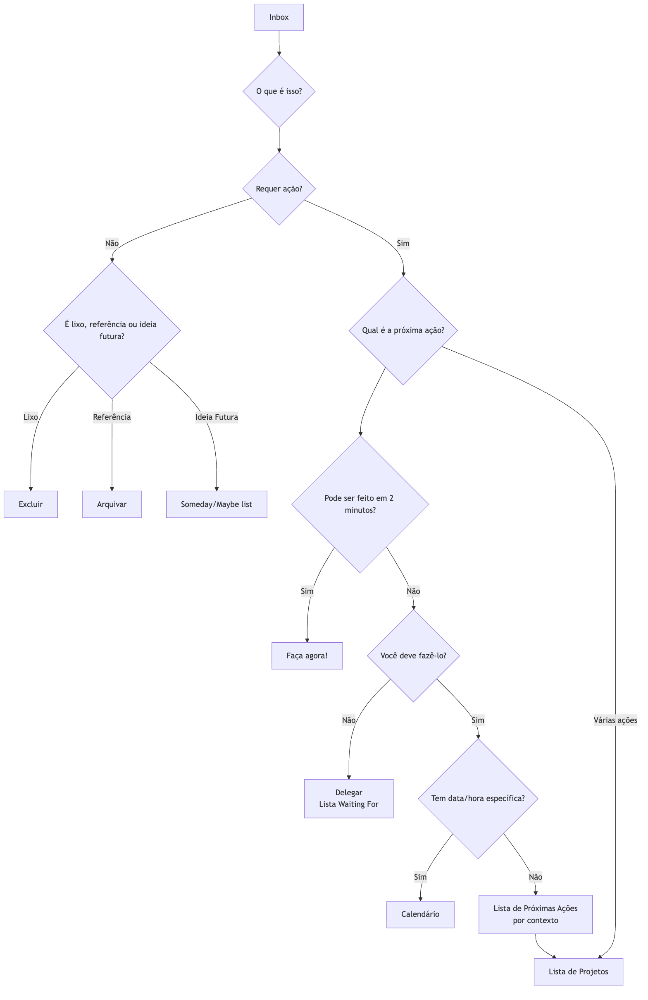

# GTD (Getting Things Done)

Nosso cérebro é inerentemente uma excelente "CPU" para **gerar ideias**, mas é um "disco rígido" extremamente pobre para **armazenar informações**. Quando tentamos usar o cérebro para lembrar todas as nossas tarefas, compromissos, ideias e obrigações, ele fica sobrecarregado com esses "assuntos inacabados", levando a estresse, ansiedade e confusão mental, tornando impossível focar na tarefa em mãos. **GTD (Getting Things Done)**, criado pelo especialista em produtividade David Allen, é um **sistema globalmente reconhecido de produtividade pessoal e gestão de fluxo de trabalho**.

A filosofia central do GTD é alcançar um estado de trabalho **"mente como a água"**, livre de estresse, altamente focado e eficiente, capturando todas as tarefas pendentes da sua mente e colocando-as em um **sistema externo e confiável**, e então seguindo um processo claro e rigoroso para **organizar e processar** essas tarefas. Não é apenas um truque de gerenciamento do tempo, mas sim um sistema operacional completo projetado para liberar sua mente e permitir que você lide com tranquilidade com o trabalho e a vida complexos.

## Os Cinco Passos Fundamentais do GTD

1.  **Capturar**: Retire imediatamente do seu cérebro qualquer coisa que chame sua atenção — seja uma tarefa de trabalho, um recado pessoal, uma inspiração repentina ou um compromisso futuro — e coloque no seu "**Inbox**". O inbox pode ser físico (como uma bandeja de documentos, um caderno) ou digital (como uma caixa de entrada de e-mails, um aplicativo de tarefas). O importante é que os inboxes sejam poucos e possam ser totalmente confiáveis e esvaziados.

2.  **Processar**: Regularmente (pelo menos uma vez por dia), "**esvazie**" seu inbox. Siga estritamente o princípio de **um item por vez**, pegue cada item do inbox um por um e pergunte a si mesmo(a) uma pergunta fundamental: "**O que é isso? Requer ação?**"
    *   Se **não houver necessidade de ação**: É lixo (exclua diretamente), **informação que pode ser necessária no futuro** (arquive em uma pasta de referência) ou uma **ideia em incubação** (coloque em uma lista "Someday/Maybe").
    *   Se **houver necessidade de ação**: Prossiga para o próximo passo de organização.

3.  **Organizar**: Para os itens que exigem ação, coloque-os em diferentes "baldes" com base na sua natureza.
    *   **Regra dos "Dois Minutos"**: Se a ação puder ser concluída **em dois minutos**, **faça-a imediatamente**, sem mais organização.
    *   **Delegar a outras pessoas**: Se a tarefa deva ser feita por outra pessoa, **delegue** imediatamente e coloque-a em uma lista "**Waiting For**" para acompanhamento.
    *   **Calendário**: Para ações com **data ou hora específica** (por exemplo, reuniões, compromissos), coloque-as no seu **calendário**.
    *   **Lista de Próximas Ações**: Para ações que exigem sua atenção pessoal, envolvem mais de uma etapa e não têm data específica, divida-as na **primeira ação concreta e visível**, e coloque-as em diferentes listas de "Próximas Ações" de acordo com o **contexto**. Os contextos podem ser "@computador", "@escritório", "@telefone", "@supermercado", etc.
    *   **Lista de Projetos**: Qualquer resultado que exija **mais de uma ação** deve ser definido como "**Projeto**" e adicionado à "Lista de Projetos". Esta lista apenas registra o nome do projeto; suas próximas ações específicas são armazenadas nas listas correspondentes de próximas ações.

4.  **Revisar**: Para manter a confiabilidade do sistema, você deve realizar **revisões regulares**.
    *   **Revisão Diária**: Revise rapidamente seu calendário e sua lista de próximas ações diariamente para planejar o trabalho do dia.
    *   **Revisão Semanal**: Esta é uma **parte crucial do GTD**. Uma vez por semana (geralmente aos finais de semana), reserve 1 a 2 horas para uma revisão completa, atualização e limpeza do sistema, garantindo que todos os projetos estejam sob controle e todas as listas estejam atualizadas.

5.  **Executar**: Em qualquer momento, ao decidir "O que devo fazer agora?", você pode fazer uma escolha sábia e calma a partir da sua lista de ações com base nos seguintes critérios:
    *   **Contexto**: Onde você está? Quais ferramentas tem disponíveis? (por exemplo, se estiver no escritório, consulte a lista "@escritório")
    *   **Tempo Disponível**: Quantos minutos livres você tem agora? (por exemplo, se tiver apenas 10 minutos, escolha uma tarefa rápida)
    *   **Energia Disponível**: Qual é seu nível atual de energia? (por exemplo, se estiver cheio(a) de energia, encare uma tarefa que exija alta concentração)
    *   **Prioridade**: Dadas as condições acima, qual tarefa é mais importante?

### Diagrama de Processamento do Fluxo de Trabalho GTD

<!-- mermaid 源文件：GTD-Tutorial-pt-mermaid-live-1.mmd -->

## Casos de Aplicação

**Caso 1: Um Gerente de Departamento Ocupado**

*   **Capturar**: Seu inbox pode incluir: caixa de entrada de e-mails, mensagens do WeChat, anotações feitas em reuniões e ideias repentinas.
*   **Processar e Organizar**:
    *   Um e-mail "sobre notificação do orçamento do próximo trimestre" -> Sem ação necessária -> **Arquivar** na pasta de referência "Finanças da Empresa".
    *   Uma ideia "lembrar o subordinado Xiao Zhang de entregar o relatório semanal" -> Pode ser feito em 2 minutos -> **Enviar imediatamente** uma mensagem para Xiao Zhang.
    *   Uma tarefa "preparar o evento anual da equipe" -> Exige várias etapas -> Adicionar "Evento da Equipe" à "**Lista de Projetos**"; colocar a primeira ação "Comunicar-se com o RH para obter uma lista de locais possíveis" na lista de "**Próximas Ações @Escritório**".
    *   Um compromisso "reunião com cliente na próxima quarta-feira às 15h" -> **Colocar no Calendário**.
*   **Executar**: Quando ele estiver no escritório, tiver 1 hora livre e se sentir energizado, poderá abrir a lista "@Escritório" e escolher trabalhar em "Comunicar-se com o RH".

**Caso 2: Gestão de Projetos por um Freelancer**

*   **Lista de Projetos**: Pode incluir "Projeto de site para o Cliente A", "Redesign do blog pessoal", "Aprender uma nova linguagem de programação", etc.
*   **Lista de Próximas Ações**:
    *   **@Telefone**: Ligar para o Cliente A para confirmar feedback sobre os rascunhos do design.
    *   **@Computador-Design**: Com base no feedback, revisar o design da página inicial do site.
    *   **@Computador-Escrita**: Escrever um artigo sobre "design responsivo".
    *   **@Leitura/Aprendizado**: Assistir ao terceiro capítulo do curso de programação.
*   **Revisão Semanal**: Na sexta-feira à tarde, ele verifica o progresso de todos os projetos, garantindo que cada projeto tenha pelo menos uma "próxima ação", e planeja as prioridades para a próxima semana.

**Caso 3: Um Estudante Gerenciando Acadêmico e Vida Pessoal**

*   **Inbox**: Notificações de grupos do WeChat das disciplinas, tarefas atribuídas pelos professores, ideias sobre atividades do clube, uma lista de compras para itens do dia a dia.
*   **Lista de Projetos**: "Finalizar o trabalho de História", "Preparar-se para as provas finais", "Planejar a festa de boas-vindas aos calouros".
*   **Lista de Próximas Ações**:
    *   **@Biblioteca**: Pegar três livros de referência sobre o tema do trabalho.
    *   **@Dormitório**: Organizar as anotações da aula de matemática.
    *   **@Supermercado**: Comprar pasta de dente e shampoo.
*   O **sistema GTD** ajuda-o a separar claramente as tarefas acadêmicas das tarefas diárias e garante que as coisas certas sejam feitas no momento certo e no lugar certo.

## Vantagens e Desafios do GTD

**Vantagens Principais**

*   **Reduz o Estresse Mental e Libera Capacidade Cerebral**: Ao externalizar todos os "assuntos inacabados", reduz significativamente a carga de memória do cérebro e a ansiedade contínua causada pelo "medo de esquecer".
*   **Aumenta o Sentimento de Controle e Calma**: Um sistema confiável garante que tudo esteja sob controle, permitindo que você encare as tarefas atuais com mais calma e foco.
*   **Garante que as "Coisas Importantes" Não Sejam Esquecidas**: A crucial "**Revisão Semanal**" garante atenção contínua e progresso em todos os projetos importantes e metas de longo prazo.
*   **Altamente Adaptável e Flexível**: O GTD em si não define previamente prioridades, mas fornece uma estrutura que permite escolher dinamicamente e com flexibilidade a ação mais apropriada com base no contexto atual.

**Desafios Potenciais**

*   **Alto Custo Inicial para Configurar o Sistema**: Na primeira vez que você "capturar" e configurar o sistema completo de listas, pode levar várias horas ou até um dia inteiro.
*   **Requer Rigorosa Autodisciplina e Formação de Hábitos**: O sucesso do GTD depende muito de você desenvolver os hábitos fundamentais de **captura contínua** e **revisão regular**. Assim que o sistema deixar de ser confiável e atualizado, ele rapidamente entra em colapso.
*   **Dilema na Escolha de Ferramentas**: Há muitos softwares e ferramentas GTD no mercado, e iniciantes podem facilmente cair na armadilha de buscar excessivamente a "ferramenta perfeita", negligenciando o próprio método.

## Extensões e Conexões

*   **Matriz de Eisenhower**: Pode ser usada no passo "Executar" do GTD como um modelo eficaz para julgar as "**prioridades**".
*   **Técnica Pomodoro**: É uma excelente tática específica para executar tarefas da lista de "**Próximas Ações**" do GTD que exigem alta concentração.

---
*Referência: O best-seller global de David Allen, "Getting Things Done: The Art of Stress-Free Productivity", é a única e mais autoritativa fonte para compreender completamente a filosofia, o processo e as melhores práticas por trás do método GTD.*