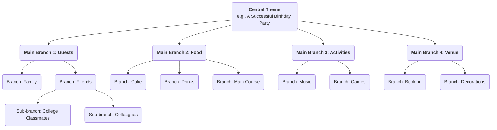

# Mapa Mental

Nossos cérebros, ao pensar, não são lineares e diretos; ao contrário, estão cheios de saltos, associações e divergências. **Mapa Mental** é exatamente uma poderosa **ferramenta de pensamento visual** que se alinha profundamente com o modo natural de funcionamento do nosso cérebro. Invented by British scholar Tony Buzan na década de 1970, seu núcleo consiste em conectar palavras-chave, ideias, imagens e cores ao redor de um **tema central** em uma estrutura **radial e progressivamente em camadas**, organizando assim um assunto complexo ou um conjunto disperso de informações em um "mapa cerebral" claro, organizado, fácil de lembrar e de compreender.

O encanto do mapa mental reside em sua característica **não linear**. Ele nos encoraja a associar livremente, capturar inspirações fugazes e organizá-las de maneira orgânica e interconectada. Não é apenas uma ferramenta para registrar informações, mas sim uma poderosa parceira de pensamento que estimula a criatividade, clarifica a lógica e aprimora a memória. Desde o planejamento e anotação de leituras até a preparação de apresentações e sessões de brainstorming, o mapa mental pode aumentar significativamente a eficiência e a profundidade do nosso pensamento.

## Componentes Principais de um Mapa Mental

Um mapa mental padrão segue algumas regras simples, porém cruciais, de desenho.

1.  **Imagem ou Tópico Central**: No centro exato da tela, use uma imagem marcante ou uma palavra-chave para representar seu tema principal. Este é o ponto de partida de todo o pensamento.
2.  **Ramos Principais**: Linhas grossas e curvas irradiando diretamente do tema central, representando os ramos ou categorias principais de primeiro nível desse tema. Cada ramo principal deve ter uma palavra-chave.
3.  **Sub-ramos**: Linhas mais finas que se estendem dos ramos principais, representando um refinamento e elaboração adicionais do conteúdo do ramo principal. Os ramos podem se estender indefinidamente, formando uma estrutura em árvore hierárquica.
4.  **Palavras-chave**: Em cada ramo, use apenas uma palavra-chave ou uma curta expressão que resuma a ideia central, ao invés de frases completas. Isso ajuda a estimular mais associações.
5.  **Cores**: Use diferentes cores para os diversos ramos principais e seus sub-ramos. As cores nos ajudam a categorizar e organizar, além de estimular fortemente a memória visual.
6.  **Imagens**: Use pequenos ícones, símbolos e desenhos simples em várias partes do mapa. Como diz o ditado, "uma imagem vale mais que mil palavras"; as imagens podem aumentar significativamente o interesse e a memorabilidade do mapa.

### Exemplo de Estrutura de Mapa Mental

<!--

-->

## Como Desenhar um Mapa Mental

1.  **Passo Um: Comece pelo Centro**
    Pegue uma folha em branco e coloque-a na horizontal. No centro exato, desenhe uma imagem que represente seu tema principal ou escreva a palavra-chave.

2.  **Passo Dois: Desenhe os Ramos Principais**
    Desenhe várias linhas grossas e curvas irradiando do tema central como ramos principais. Cada ramo principal representa uma categoria central. Escreva a palavra-chave correspondente acima da linha.

3.  **Passo Três: Adicione Ramos e Palavras-chave**
    Continue desenhando ramos mais finos a partir de cada ramo principal e escreva palavras-chave mais específicas acima das linhas. Mantenha o comprimento das linhas e do texto consistentes. Esse processo é semelhante ao de uma grande árvore crescendo novos ramos.

4.  **Passo Quatro: Use Cores e Imagens**
    Atribua cores diferentes aos diversos sistemas de ramos principais. Desenhe alguns ícones ou símbolos simples onde achar apropriado, para tornar seu mapa "vivo".

5.  **Passo Cinco: Associação Livre, Expansão Contínua**
    Não se deixe limitar pela ordem; deixe seus pensamentos saltarem livremente entre diferentes ramos. Quando pensar em um novo ponto, encontre imediatamente a categoria à qual ele pertence e adicione um novo ramo. Todo esse processo deve ser relaxante e prazeroso.

## Casos de Aplicação

**Caso 1: Tomada de Notas de Leitura**

*   **Cenário**: Após ler um livro sobre "hábitos eficientes", você deseja organizar e lembrar do conteúdo principal.
*   **Aplicação**:
    *   **Tema Central**: O título do livro "Hábitos Eficientes".
    *   **Ramos Principais**: Podem ser os títulos de cada capítulo do livro, como "O Poder dos Hábitos", "O Ciclo dos Hábitos", "Como Desenvolver Bons Hábitos", "Como Quebrar Maus Hábitos".
    *   **Sub-ramos**: Em cada ramo principal, use palavras-chave para registrar os argumentos principais, casos importantes e métodos específicos daquele capítulo. Por exemplo, sob o ramo principal "O Ciclo dos Hábitos", você pode ramificar em "Gatilho", "Rotina" e "Recompensa".
    *   Desta forma, a estrutura lógica e os pontos principais do livro inteiro são condensados em um diagrama claro, o que é muito conveniente para revisão e memorização.

**Caso 2: Preparação de uma Apresentação ou Relatório**

*   **Cenário**: Você precisa fazer um relatório de 20 minutos para a diretoria sobre o "Plano Anual de Marketing da Empresa".
*   **Aplicação**:
    *   **Tema Central**: "Plano Anual de Marketing".
    *   **Ramos Principais**: "Análise de Mercado", "Público-Alvo", "Estratégias Principais", "Alocação do Orçamento", "KPIs Esperados".
    *   **Sub-ramos**: Em cada ramo principal, refine mais os pontos a serem abordados. Por exemplo, sob "Estratégias Principais", você pode ramificar em "Marketing de Conteúdo", "Promoção em Mídias Sociais", "Eventos Presenciais", etc.
    *   Este mapa mental forma o esqueleto completo de sua apresentação. Durante a apresentação, você pode consultar o mapa para garantir que sua lógica esteja clara e que nenhum ponto importante seja esquecido.

**Caso 3: Organização de uma Sessão de Brainstorming em Equipe**

*   **Cenário**: Uma equipe precisa gerar ideias criativas para "Como melhorar a experiência do usuário do produto".
*   **Aplicação**:
    *   **Tema Central**: "Melhorar a Experiência do Usuário".
    *   **Ramos Principais**: Podem ser definidos previamente como aspectos da experiência do usuário, como "Desempenho", "Usabilidade", "Design Visual", "Suporte ao Cliente".
    *   **Processo**: Os membros da equipe propõem livremente ideias em torno desses ramos principais, e o facilitador adiciona essas ideias aos ramos correspondentes do mapa mental em tempo real, como palavras-chave. A visualização e interconexão do mapa mental podem estimular fortemente os membros da equipe a "combinar" ideias, gerando mais associações e criatividade.

## Vantagens e Desafios do Mapa Mental

**Vantagens Principais**

*   **Alinhado com o Pensamento Cerebral**: A estrutura radial imita as conexões dos neurônios cerebrais, tornando o pensamento e as associações mais naturais e fluidos.
*   **Estimula a Criatividade**: A natureza não linear encoraja associações livres, ajudando a romper as limitações do pensamento linear e gerar mais ideias.
*   **Aprimora a Memória**: Ao combinar palavras-chave, cores, imagens e outros elementos, ativa tanto o hemisfério esquerdo quanto o direito do cérebro, aumentando significativamente os efeitos da memória.
*   **Clareza à Vista**: Pode apresentar uma grande quantidade de informações complexas de maneira altamente condensada e estruturada, facilitando a compreensão rápida do panorama geral.

**Desafios Potenciais**

*   **Altamente Personalizado**: Mapas mentais desenhados por indivíduos podem ter forte subjetividade em sua lógica e seleção de palavras-chave, e outras pessoas podem precisar de alguma explicação para compreendê-los inicialmente.
*   **Não Adequado para Apresentar Documentos Finais e Formais**: É uma excelente ferramenta para pensamento e conceitualização, mas seu estilo desenhado à mão e não linear geralmente não é adequado para relatórios empresariais finais e formais ou artigos acadêmicos que exigem formatação rigorosa.
*   **Limitações de Ferramentas**: Embora existam muitas ferramentas de software para mapas mentais, o desenho manual é geralmente considerado o método mais estimulante para a criatividade. No entanto, mapas desenhados à mão são menos convenientes para edição e compartilhamento do que as versões eletrônicas.

## Extensões e Conexões

*   **Brainstorming**: O mapa mental é uma ferramenta ideal para conduzir e organizar os resultados do brainstorming. Ideias dispersas geradas durante o brainstorming podem ser categorizadas e estruturadas em tempo real usando um mapa mental.
*   **Mapa Conceitual**: Similar ao mapa mental, mas foca mais em expressar com precisão as **relações específicas** entre diferentes conceitos (por exemplo, usar texto nas linhas de conexão para explicar "A causa B" ou "B é parte de C"). É mais rigoroso logicamente, enquanto os mapas mentais se concentram mais em associações livres e brainstorming.

---
*Referência: Tony Buzan é conhecido como o "pai do mapa mental". Seu livro "The Mind Map Book" é a bíblia autoritativa deste método, detalhando seus princípios, regras e amplas aplicações em diversos campos.*