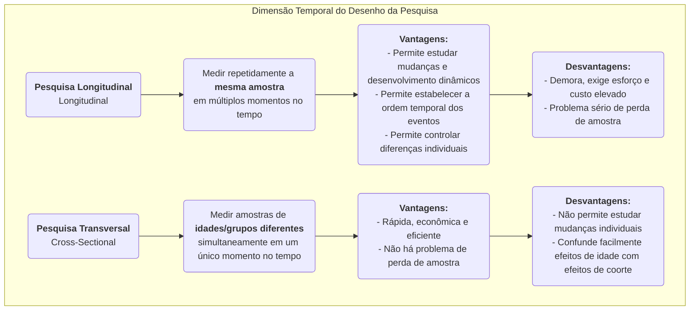

# Pesquisa Longitudinal

Ao explorar a longa tapeçaria do desenvolvimento humano, mudança social e evolução de doenças, precisamos de um método de pesquisa capaz de capturar a dimensão crucial do "tempo". A **Pesquisa Longitudinal** é exatamente essa "câmera", observando e medindo repetidamente e continuamente a **mesma amostra** ao longo de um período estendido. Seu objetivo central é revelar como fenômenos **mudam, se desenvolvem e evoluem** ao longo do tempo, bem como investigar o impacto de longo prazo de eventos iniciais sobre resultados posteriores.

Diferentemente dos estudos transversais, que oferecem apenas um "retrato" em um único momento, a pesquisa longitudinal nos fornece um "documentário". Ela nos permite observar a trajetória do crescimento individual, o processo de mudanças conceituais e todo o curso de uma doença desde seu início até seu completo desenvolvimento. Isso nos permite estabelecer com maior clareza a sequência temporal dos eventos ao explorar relações causais. Quando você deseja responder perguntas dinâmicas sobre processos e desenvolvimento, como "Como hábitos de leitura na infância afetam os níveis de renda na idade adulta?" ou "Qual impacto sustentado uma reforma de política teve na próxima década?", a pesquisa longitudinal torna-se uma ferramenta indispensável e poderosa.

## Características Principais e Tipos de Pesquisa Longitudinal

A característica comum de todos os estudos longitudinais é o acompanhamento ao longo do "tempo", mas eles podem ser divididos principalmente em três tipos com base na natureza do que está sendo acompanhado:

*   **Estudo de Coorte**: Este é o tipo mais comum. Os pesquisadores selecionam um grupo específico de pessoas (uma "coorte") que compartilham uma característica ou experiência comum (por exemplo, "todos os bebês nascidos em 2000" ou "funcionários que ingressaram em uma determinada empresa em 2010") e acompanham continuamente essa coorte por várias décadas.
*   **Estudo de Painel**: Similar ao estudo de coorte, mas acompanha exatamente a mesma amostra de **indivíduos**. Cada pesquisa visita o mesmo grupo de pessoas, permitindo que os pesquisadores analisem com precisão a trajetória de mudança de cada indivíduo.
*   **Estudo de Tendência**: Este tipo de pesquisa foca nas mudanças nas características de uma "população" ao longo do tempo, mas as amostras individuais coletadas em cada pesquisa são diferentes. Por exemplo, para estudar mudanças nas atitudes públicas em relação a questões ambientais, uma instituição de pesquisa pode selecionar aleatoriamente um novo conjunto de amostras em todo o país a cada cinco anos para uma pesquisa.

### Comparação entre Pesquisa Longitudinal e Pesquisa Transversal

## Como Realizar um Estudo Longitudinal

1.  **Estabelecer Objetivos de Pesquisa de Longo Prazo**
    Defina claramente quais mudanças ou desenvolvimentos você deseja acompanhar e quais fatores influenciadores potenciais lhe interessam. A pesquisa longitudinal é um investimento de longo prazo e deve ser sustentada por objetivos claros e significativos.

2.  **Definir e Selecionar a Amostra da Coorte ou Painel**
    Defina com precisão sua população de estudo e utilize métodos adequados de amostragem para selecionar a amostra inicial. A qualidade e representatividade da amostra inicial são cruciais.

3.  **Realizar Pesquisa Inicial (Baseline)**
    No início do estudo, realize a primeira coleta abrangente de dados (pesquisa baseline) para medir o estado inicial de todas as variáveis de interesse.

4.  **Planejar e Executar Pesquisas Subsequentes de Acompanhamento**
    Determine os intervalos de tempo para as pesquisas subsequentes de acompanhamento (por exemplo, anualmente, a cada cinco anos) e crie instrumentos de medida consistentes. Manter contato com a amostra e reduzir as taxas de desistência são alguns dos maiores desafios ao longo de um período prolongado de pesquisa.

5.  **Gestão e Análise de Dados**
    As estruturas de dados longitudinais são complexas e exigem bancos de dados profissionais para sua gestão. Para análise, os pesquisadores utilizam modelos estatísticos avançados (como modelos de curva de crescimento, análise de sobrevivência) para analisar as trajetórias das mudanças das variáveis ao longo do tempo e seus fatores influenciadores.

## Casos Clássicos de Aplicação

**Caso 1: O Estudo de Desenvolvimento Adulto da Harvard**

*   **Contexto**: Um dos estudos longitudinais mais longos da história, iniciado em 1938 e que acompanhou 724 homens por quase 80 anos.
*   **Aplicação**: Os pesquisadores coletaram regularmente dados sobre seu trabalho, família, saúde e outros aspectos por meio de questionários, entrevistas, prontuários médicos, etc. A conclusão mais famosa deste estudo é que boas e calorosas relações interpessoais são o fator mais importante para prever felicidade e saúde de longo prazo, ainda mais do que riqueza, fama e genes. Essa conclusão só pôde ser obtida por meio de acompanhamento ao longo da vida.

**Caso 2: Estudo da Coorte Britânica do Milênio**

*   **Contexto**: Um estudo nacional de coorte de nascimentos que acompanha aproximadamente 19.000 crianças britânicas nascidas entre 2000 e 2002.
*   **Aplicação**: O estudo realizou coletas abrangentes de dados em várias idades (por exemplo, 9 meses, 3, 5, 7, 11, 14, 17 anos), cobrindo todos os aspectos desde saúde, cognição e comportamento até ambiente familiar. Este estudo forneceu evidências massivas e extremamente valiosas para o governo na formulação de políticas para crianças e famílias; por exemplo, revelou o impacto negativo de longo prazo da pobreza no desenvolvimento na primeira infância.

**Caso 3: Análise de Cancelamento de Usuários de Produtos por Coorte**

*   **Contexto**: Uma empresa de SaaS (Software como Serviço) deseja entender a retenção de novos usuários.
*   **Aplicação**: Eles adotaram o método de **análise de coorte**. Trataram "novos usuários registrados a cada mês" como uma coorte (por exemplo, "coorte de janeiro", "coorte de fevereiro"). Em seguida, acompanharam a taxa de retenção de cada coorte no primeiro mês, segundo mês, terceiro mês... após o registro. Ao comparar as curvas de retenção de diferentes coortes, puderam avaliar se as melhorias no produto e as atividades de marketing tiveram impacto positivo na retenção de longo prazo de novos usuários.

## Vantagens e Desafios da Pesquisa Longitudinal

**Vantagens Principais**

*   **Capacidade de Estudar Processos Dinâmicos**: É o método mais eficaz para estudar o próprio "desenvolvimento" e a "mudança".
*   **Estabelecer Ordem Temporal**: Pode determinar claramente a sequência temporal dos eventos, um pré-requisito importante para inferir causalidade (mas ainda é necessário estar atento a variáveis de confusão).
*   **Controlar Diferenças Individuais**: Como os mesmos indivíduos são acompanhados, diferenças inatas individuais que não mudam ao longo do tempo (por exemplo, QI, personalidade) podem ser excluídas da interferência nos resultados.

**Desafios Potenciais**

*   **Custo Elevado**: Requer apoio financeiro de longo prazo, uma equipe de pesquisa estável e custos de gestão elevados.
*   **Tempo Demorado**: O ciclo de produção dos resultados da pesquisa é muito longo, potencialmente durando anos ou até décadas.
*   **Perda de Amostra**: Este é o maior "inimigo" da pesquisa longitudinal. Com o tempo, alguns participantes podem sair do estudo devido a mudança, perda de contato, morte ou perda de interesse, o que pode levar a vieses na amostra final.
*   **Impacto de Medições Repetidas**: Passar repetidamente pelos mesmos testes ou questionários pode afetar o comportamento ou as respostas dos participantes, conhecido como o "efeito prática".

## Extensões e Conexões

*   **Pesquisa Transversal**: Muitas vezes serve como uma alternativa de baixo custo e rápida à pesquisa longitudinal. No entanto, é importante estar ciente de sua incapacidade de distinguir entre efeitos de idade e efeitos de coorte.
*   **Análise de Sobrevivência**: Um método estatístico comumente usado em pesquisas longitudinais, especificamente para analisar a duração até que um evento ocorra (por exemplo, recuperação, cancelamento, morte) e seus fatores influenciadores.

---
*Referência: O conceito de design da pesquisa longitudinal tem uma longa história nas áreas de epidemiologia e ciências sociais. A Teoria do Curso de Vida (Life Course Theory) de Glen H. Elder Jr. fornece um importante arcabouço teórico para a pesquisa longitudinal moderna.*