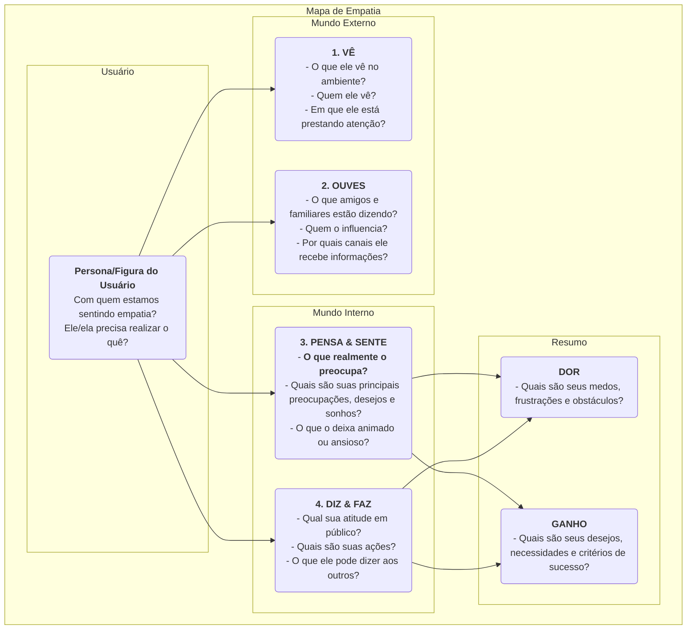

# Mapa de Empatia

Em design de produto e pesquisa com usuários, "empatia" é uma qualidade central frequentemente mencionada, mas extremamente difícil de ser verdadeiramente alcançada. Como podemos genuinamente "calçar os sapatos do usuário" e experimentar seu mundo em primeira mão? O **Mapa de Empatia** é uma ferramenta colaborativa de empatia simples, intuitiva, mas extremamente poderosa, criada exatamente para esse propósito. Ele tem como objetivo ajudar as equipes a ir além da superfície do comportamento do usuário e mergulhar no seu mundo mais profundo de **sentidos, pensamentos e emoções**, formando assim uma compreensão mais completa e multidimensional do usuário.

O núcleo do Mapa de Empatia está em organizar sistematicamente todas as observações dispersas e dados qualitativos sobre os usuários em uma estrutura visual. Essa estrutura normalmente é dividida em quatro quadrantes principais: **Vê, Ouve, Pensa & Sente, e Diz & Faz**. Ao preencher colaborativamente esse mapa, os membros da equipe são forçados a adotar a perspectiva do usuário, construindo conjuntamente um entendimento compartilhado do mundo interno e do ambiente externo do usuário. É como um espelho que reflete claramente a realidade do usuário e um catalisador para cultivar empatia coletiva na equipe.

## Componentes do Mapa de Empatia

Um Mapa de Empatia clássico é centrado no usuário e se organiza em torno de quatro quadrantes fundamentais da experiência externa e interna.

<!--

*   **Vê**: Descreve o que o usuário vê com os próprios olhos em seu ambiente. Por exemplo, o que as pessoas ao seu redor estão fazendo? Com que informações do mercado ele se depara diariamente?
*   **Ouve**: Descreve as informações que o usuário recebe do mundo externo. O que amigos, familiares e colegas estão dizendo? Quais líderes de opinião ou canais de mídia o influenciam?
*   **Pensa & Sente**: Este é o núcleo do mapa, tentando explorar o mundo interno do usuário. O que é realmente importante para ele (mesmo que ele nunca diga em voz alta)? Quais preocupações, ansiedades, esperanças e sonhos ele tem?
*   **Diz & Faz**: Descreve as palavras e ações do usuário em público. O que ele nos disse em uma entrevista? Quais são seus comportamentos reais ao usar o produto? Aqui, é necessário prestar atenção especial às possíveis contradições entre o que "diz" e o que "pensa".
*   **Dores** e **Ganhos**: Após analisar os quatro quadrantes acima, resuma as lutas internas e desejos do usuário. As Dores representam os obstáculos e emoções negativas que ele enfrenta, enquanto os Ganhos representam os objetivos e desejos que ele realmente quer alcançar.

## Como Usar um Mapa de Empatia

O Mapa de Empatia é melhor utilizado no formato de oficina em equipe.

1.  **Passo 1: Definir Escopo e Objetivos**
    *   **Escolha Seu Usuário**: Defina claramente para qual persona ou figura específica este Mapa de Empatia é destinado. É melhor dar a ele um nome e um histórico básico.
    *   **Esclareça os Objetivos**: Defina os objetivos que você espera alcançar com este exercício. É para entender melhor os usuários existentes, ou para explorar possíveis usuários para um novo produto?

2.  **Passo 2: Reunir Materiais de Pesquisa**
    Um Mapa de Empatia deve ser baseado em pesquisas reais, não em ficção. Prepare todos os materiais relevantes de pesquisa com usuários, como: gravações e transcrições de entrevistas com usuários, vídeos de testes de usabilidade, respostas abertas de pesquisas, fotos dos usuários, etc.

3.  **Passo 3: Preencher o Mapa de Forma Colaborativa**
    *   Desenhe um modelo grande do Mapa de Empatia em um quadro branco, ou use uma ferramenta online colaborativa.
    *   Os membros da equipe colaboram escrevendo descobertas dos materiais de pesquisa em post-its, um por um, e os colocando nos quadrantes correspondentes do mapa. Por exemplo, ao ouvir uma gravação de entrevista, um membro pode escrever "O usuário diz que trabalha horas extras toda semana (Diz)", enquanto outro pode escrever "Sinto que ele parece cansado e perdeu a paixão pelo trabalho (Sente)."
    *   Incentive os membros da equipe a lerem o conteúdo dos post-its em voz alta e explicarem por que os colocaram naquele quadrante.

4.  **Passo 4: Aprofundar e Sintetizar**
    Quando todas as informações estiverem no quadro, oriente a equipe em uma discussão mais profunda.
    *   "Quais contradições estamos vendo? Por exemplo, palavras e ações dos usuários são inconsistentes?"
    *   "Atrás de todos esses detalhes, o que ele realmente se preocupa, mas não expressou?"
    *   "O que aprendemos que foi inesperado?"
    *   Finalmente, sintetizem coletivamente as **Dores** e **Ganhos** mais centrais do usuário.

5.  **Passo 5: Compartilhar e Aplicar**
    Organize e compartilhe o Mapa de Empatia concluído, usando-o como uma entrada importante para o design subsequente e tomada de decisão.

## Casos de Aplicação

**Caso 1: Projetando um Smartphone para Idosos**

*   **Usuário**: Vovô Wang, 70 anos, acabou de ganhar um smartphone dos filhos.
*   **Vê**: Os ícones na tela do celular são pequenos e numerosos, difíceis de ver; os jovens estão todos usando pagamentos móveis e conversando online.
*   **Ouve**: Os filhos dizem, "É muito simples, você vai aprender rápido"; amigos mais velhos dizem, "Esse negócio é muito complicado, não consigo aprender."
*   **Pensa & Sente**: Sente-se muito **frustrado**, com medo de ser deixado para trás pela tecnologia; mas **ansioso** para aprender a fazer videochamadas com os netos no celular.
*   **Diz & Faz**: Diz "Não preciso disso", mas secretamente tenta destravar a tela repetidamente.
*   **Dores**: Medo de cometer erros e causar prejuízos; sensação de abandono pela tecnologia.
*   **Ganhos**: Espera manter contato mais próximo com a família; espera realizar de forma independente algumas tarefas diárias (por exemplo, verificar rotas de ônibus).
*   **Inspiração de Design**: O princípio central de design para esse celular não deve ser "funcionalidades poderosas", mas sim "sem frustrações". É necessário oferecer recursos como "modo de letras extra-grandes", "assistência remota da família", entre outros.

**Caso 2: Projetando um Aplicativo de Busca de Emprego para Estudantes Universitários**

*   **Usuário**: Li Xue, 22 anos, estudante universitário formando-se.
*   **Vê**: Sites de busca de emprego estão cheios de informações confusas, difíceis de distinguir o verdadeiro do falso; colegas ao seu redor já receberam várias ofertas.
*   **Ouve**: Antigos alunos dizem, "O primeiro emprego é muito importante"; os pais dizem, "Conseguir um emprego estável é o mais importante."
*   **Pensa & Sente**: Sente-se muito **confusa e ansiosa** quanto ao futuro; incerta sobre qual tipo de emprego a combina; **teme** ir mal nas entrevistas.
*   **Diz & Faz**: Enviou centenas de currículos; revisou repetidamente seu currículo.
*   **Dores**: Falta de direção na busca de emprego; assimetria de informações; falta de confiança.
*   **Ganhos**: Espera encontrar um emprego pelo qual realmente se interesse e que tenha boas perspectivas; espera receber orientação e aconselhamento profissional.
*   **Inspiração de Design**: A função central do aplicativo não deve ser apenas listagens de empregos, mas adicionar módulos como "teste de personalidade profissional", "consultoria online com mentores da área", "simulação de entrevistas", entre outros.

**Caso 3: Projetando uma Ferramenta de Escrita para Criadores de Conteúdo**

*   **Usuário**: Zhang Wei, blogueiro parcial.
*   **Vê**: Outros blogueiros estão atualizando artigos de alta qualidade diariamente; as visualizações dos seus próprios artigos estão estagnadas.
*   **Ouve**: Leitores comentam, "Bem escrito, aguardo ansiosamente as atualizações"; amigos dizem, "É difícil ganhar dinheiro como blogueiro."
*   **Pensa & Sente**: Sente muita dor quando a **inspiração se esgota**; **deseja** reconhecimento e conexão dos leitores; **luta** entre perseguir ideais e obter renda real.
*   **Diz & Faz**: Gasta muito tempo coletando materiais e organizando o conteúdo; frequentemente escreve até tarde da noite.
*   **Dores**: Processo de escrita interrompido, baixa eficiência; falta de motivação para criação contínua.
*   **Ganhos**: Espera ter uma ferramenta que ajude a organizar seus pensamentos e despertar inspiração; espera construir conexões mais profundas com os leitores.
*   **Inspiração de Design**: Além das funções básicas de edição, a ferramenta de escrita também deve oferecer recursos especiais como "coleta de cartões de inspiração", "modo de mapa mental", "análise de dados de interação com leitores", entre outros.

## Vantagens e Desafios do Mapa de Empatia

**Vantagens Principais**

*   **Rápido e Eficiente**: Um método eficaz para construir empatia na equipe rapidamente (geralmente em 60 minutos).
*   **Promove Colaboração em Equipe**: Sua natureza colaborativa pode quebrar barreiras departamentais, levando a um entendimento unificado e profundo do usuário por toda a equipe.
*   **Revela Necessidades Ocultas**: Ao focar no mundo interno do usuário, ajuda a descobrir necessidades e pontos de dor potenciais que os próprios usuários podem não ter articulado claramente.

**Desafios Potenciais**

*   **Não Substitui Personas de Usuário**: Um Mapa de Empatia geralmente se concentra no estado do usuário em um cenário específico, enquanto uma persona de usuário descreve um modelo de caráter mais completo e duradouro. Um Mapa de Empatia é uma excelente entrada para a criação de personas de usuário, mas não pode substituí-las totalmente.
*   **Requer Dados Reais**: Como todas as ferramentas de pesquisa com usuários, sem dados reais de pesquisa, o Mapa de Empatia pode se tornar uma "sessão de histórias fictícias" baseada em suposições subjetivas dos membros da equipe.

## Extensões e Conexões

*   **Persona de Usuário**: O Mapa de Empatia é um **passo fundamental e prévio** para construir uma persona de usuário com vida e riqueza emocional. Por meio da análise do Mapa de Empatia, ele pode fornecer material extremamente vívido para os módulos "Dores", "Objetivos" e outros de uma persona de usuário.
*   **Mapa da Jornada do Usuário**: Em cada etapa do mapa da jornada, pode-se usar um mini Mapa de Empatia para analisar profundamente os pensamentos, sentimentos e ações do usuário nessa etapa, identificando assim com mais precisão os pontos de dor em cada passo.

---
*Referência: O Mapa de Empatia foi originalmente proposto por Dave Gray, fundador da XPLANE (atualmente parte da Deloitte), e tem sido amplamente aplicado nas práticas de Design Thinking e desenvolvimento ágil. É uma ferramenta fundamental e central nos processos de design centrados no usuário.*