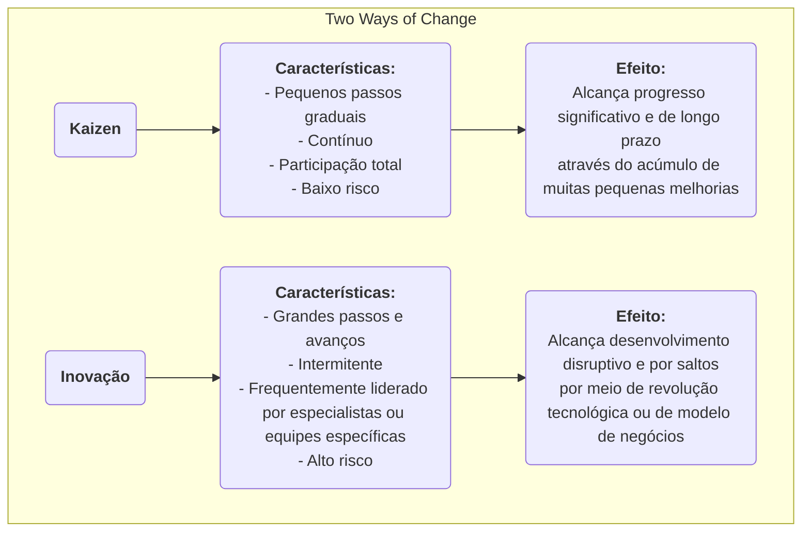

# Kaizen

Em muitas organizações, a "melhoria" é frequentemente vista como um projeto importante que requer investimento significativo, conduzido por especialistas e impulsionado de cima para baixo. No entanto, existe uma filosofia de gestão que acredita que o verdadeiro, poderoso e duradouro progresso vem das aparentemente insignificantes **melhorias pequenas e contínuas** feitas diariamente por todos os funcionários. Essa é a essência do **Kaizen**. Kaizen é uma palavra japonesa que significa "mudança para melhor", sendo ao mesmo tempo uma filosofia cultural que busca a perfeição e um método prático que incentiva a plena participação e a melhoria contínua de baixo para cima.

A ideia central do Kaizen é **não buscar avanços revolucionários da noite para o dia, mas sim perseguir uma otimização gradual infinita**. Acredita-se que os funcionários da linha de frente são os especialistas que melhor compreendem a realidade em suas posições, possuindo uma sabedoria e criatividade infinitas. Ao estabelecer uma cultura que incentive a resolução de problemas, recompense pequenas inovações e tolere falhas, as organizações podem aproveitar o poder de todos, formando um impulso contínuo e imparável para cima. Não é uma ferramenta de gestão complexa, mas sim uma maneira simples, discreta, porém profundamente eficaz de trabalhar e pensar.

## Princípios Fundamentais do Kaizen

*   **Contínuo**: O Kaizen não é uma atividade única, mas sim um processo interminável e cumulativo.
*   **Todos**: Do CEO ao funcionário que limpa a empresa, todos na organização são incentivados e esperados a participar das atividades de melhoria.
*   **Baixo custo, alta sabedoria**: O Kaizen não depende de grandes investimentos de capital, mas enfatiza o uso da sabedoria e criatividade dos funcionários para resolver problemas e eliminar desperdícios com baixo custo.
*   **Foco no processo**: O foco do Kaizen é otimizar os processos de trabalho, e não culpar indivíduos.
*   **Gestão visual**: Enfatiza tornar os problemas, padrões e processos "visíveis", de modo que as anormalidades fiquem claras à primeira vista.
*   **"Vá ao Gemba"**: Os gestores devem ir ao local real de trabalho (Gemba) para observar situações reais e conversar com os funcionários, em vez de imaginar as coisas a partir do escritório.

### Kaizen vs. Inovação

*   **Relação**: Kaizen e inovação não são mutuamente exclusivos; ao contrário, são duas capacidades que uma organização excelente deve possuir simultaneamente. O Kaizen é responsável por otimizar e consolidar continuamente os sistemas existentes, enquanto a inovação é responsável por criar sistemas totalmente novos.

## Como Praticar o Kaizen em uma Organização

A chave para praticar o Kaizen é criar uma cultura e mecanismos que incentivem a melhoria contínua.

1.  **Estabelecer um Sistema de Sugestões Kaizen**
    Criar um canal simples e conveniente (por exemplo, caixa de sugestões, formulário online) para que qualquer funcionário possa submeter problemas ou sugestões de melhoria a qualquer momento. É importante responder e acompanhar cada sugestão, além de reconhecer publicamente as sugestões excelentes que forem adotadas (os prêmios não precisam ser materiais; elogios públicos, certificados, etc., costumam ser incentivos espirituais mais eficazes).

2.  **Realizar "Semanas Kaizen" ou "Blitz Kaizen"**
    Organizar regularmente equipes multidisciplinares para se concentrarem em um processo ou área específica de trabalho por um período concentrado (geralmente 3 a 5 dias), utilizando ferramentas enxutas e de qualidade (por exemplo, mapeamento do fluxo de valor, 5S) para realizar uma tempestade de melhoria rápida e intensa e implementar imediatamente as soluções.

3.  **Promover o Ciclo PDCA como Ferramenta de Pensamento**
    Tornar o **ciclo PDCA (Planejar-Fazer-Verificar-Agir)** o quadro padrão de pensamento para todos os funcionários resolverem problemas. Incentivar os funcionários a seguir este ciclo científico:
    *   **P**lanejar: Identificar o problema, analisar a causa e desenvolver um pequeno plano de melhoria.
    *   **F**azer: Tentar executar o plano.
    *   **V**erificar: Verificar se os resultados do experimento atenderam às expectativas.
    *   **A**gir: Se bem-sucedido, padronizá-lo como um novo processo; se não, aprender com isso e iniciar um novo ciclo PDCA.

4.  **Mudança no Papel do Gestor**
    Em uma cultura Kaizen, o papel do gestor muda de "comandante" e "supervisor" para "**treinador**" e "**suporte**". Suas principais tarefas são: inspirar e encorajar os funcionários a identificar problemas, fornecer recursos e apoio às atividades de melhoria dos funcionários e ajudá-los a remover obstáculos.

## Casos de Aplicação

**Caso 1: A "Melhoria de Um Centímetro" da Toyota**

*   **Contexto**: Na linha de produção da Toyota, o Kaizen faz parte do seu DNA.
*   **Aplicação**: Um funcionário da linha de produção notou que, cada vez que pegava um parafuso do recipiente de peças, seu pulso tinha que fazer um pequeno movimento de torção, mas antinatural. Ele sugeriu inclinar o recipiente de peças em 15 graus. Essa melhoria aparentemente insignificante economizou alguns segundos por dia e reduziu o risco de lesão no pulso. Quando essa "melhoria de um centímetro" foi estendida a milhares de postos de trabalho em toda a empresa, as economias acumuladas de tempo e a melhoria na segurança foram impressionantes.

**Caso 2: Posto de Enfermagem de um Hospital**

*   **Problema**: As enfermeiras reclamavam de gastar muito tempo diariamente procurando por suprimentos médicos comuns (por exemplo, gaze, fita adesiva).
*   **Aplicação Kaizen**: A enfermeira-chefe organizou uma pequena atividade Kaizen. Os membros da equipe usaram a metodologia **5S** para **Separar** (descartar itens desnecessários), **Organizar** (colocar os itens frequentemente usados em locais de fácil acesso e rotulá-los claramente), **Limpar**, **Padronizar** e **Manter** os armários do posto de enfermagem. Essa atividade durou apenas uma tarde, mas reduziu significativamente o tempo de busca das enfermeiras, permitindo que elas dedicassem mais energia ao cuidado direto dos pacientes.

**Caso 3: Aplicação na Vida Pessoal**

*   **Problema**: Uma pessoa sempre esquecia de levar as chaves ao sair de casa.
*   **Aplicação Kaizen**: Em vez de se culpar por "má memória", ela pensou em como **melhorar o processo**. Decidiu colocar todas as coisas que precisava levar no dia seguinte (chaves, carteira, identidade de trabalho) no armário de sapatos perto da porta na noite anterior. Essa pequena mudança de hábito é um exemplo típico de Kaizen pessoal, resolvendo o problema fundamentalmente ao otimizar o processo.

## Vantagens e Desafios do Kaizen

**Vantagens Principais**

*   **Baixo custo, baixo risco**: A maioria das melhorias vem da sabedoria dos funcionários da linha de frente, exigindo quase nenhum investimento adicional, e o custo de tentativa e erro é extremamente baixo.
*   **Aumenta o envolvimento e o senso de pertencimento dos funcionários**: Quando as sugestões dos funcionários são ouvidas e adotadas, eles se sentem respeitados e passam de "executores passivos" para "pensadores ativos".
*   **Promove o trabalho em equipe**: Muitas atividades Kaizen exigem colaboração entre funções e departamentos, ajudando a quebrar silos organizacionais.
*   **Cria uma forte inércia cultural**: Uma vez estabelecida uma cultura de melhoria contínua, a organização ganha uma poderosa força interna para evolução e desenvolvimento contínuos.

**Desafios Potenciais**

*   **Lento para mostrar resultados, pouco perceptível**: Comparado à "inovação" radical, os efeitos do Kaizen são graduais e cumulativos, e podem não ser óbvios a curto prazo, exigindo que os gestores tenham paciência suficiente e visão de longo prazo.
*   **Requer verdadeira participação total**: Se permanecer apenas como um slogan ou se apenas algumas pessoas participarem, as atividades Kaizen não serão sustentáveis.
*   **Pode cair no "ótimo local"**: Focar excessivamente em pequenas melhorias nos processos existentes pode, às vezes, ignorar oportunidades maiores para inovação disruptiva e revolucionária.

## Extensões e Conexões

*   **Operações Enxutas (Lean Operations)**: O Kaizen é um dos pilares centrais do pensamento enxuto e o caminho fundamental para alcançar o princípio de "busca pela perfeição".
*   **Gestão da Qualidade Total (TQM)**: O Kaizen é a encarnação mais direta e vívida do princípio de "melhoria contínua" no TQM.
*   **Ciclo PDCA**: É o quadro de pensamento e ação científico mais comum e fundamental ao praticar o Kaizen.

---
*Referência: O Kaizen, como filosofia de gestão, está profundamente enraizado na cultura e práticas de gestão japonesas, especialmente popularizado no Sistema de Produção Toyota (TPS). O livro de Masaaki Imai, "Kaizen: A Chave para o Sucesso Competitivo do Japão", introduziu sistematicamente esse conceito ao mundo ocidental, exercendo uma influência profunda.*