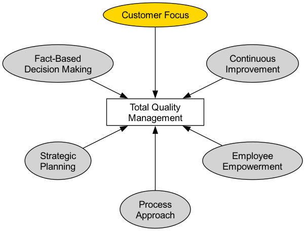

# Gestão da Qualidade Total

Nos modelos tradicionais de produção, a "qualidade" era frequentemente vista como uma etapa separada de inspeção no final da linha de produção, realizada por um departamento especializado de controle de qualidade. No entanto, essa abordagem de "remédio pós-fato" é cara e ineficiente. A **Gestão da Qualidade Total (TQM)** propõe uma filosofia de gestão revolucionária e claramente diferente. Ela defende que **a qualidade é responsabilidade de todos, deve impregnar cada canto e cada elo das operações organizacionais, e seu critério final é a satisfação do cliente**.

A TQM não é um método ou ferramenta específica, mas sim uma filosofia de gestão e uma cultura organizacional centrada na **qualidade, envolvimento total dos funcionários e melhoria contínua**. Seu objetivo é melhorar continuamente a qualidade de produtos, serviços e processos ao estabelecer um sistema sistemático e preventivo de garantia da qualidade, obtendo assim uma vantagem competitiva sustentável em um mercado altamente competitivo. Ela enfatiza que a alta qualidade não apenas não aumenta custos, mas na verdade **reduz significativamente os custos totais** e melhora a rentabilidade ao reduzir desperdícios, retrabalhos e reclamações dos clientes.

## Princípios Fundamentais da TQM

A Gestão da Qualidade Total é construída sobre uma série de princípios fundamentais interconectados que coletivamente formam a base cultural da TQM.

1.  **Foco no Cliente**: O início e o fim da TQM são os clientes. A sobrevivência e desenvolvimento de uma organização dependem, no fim das contas, da sua capacidade de atender ou até superar as expectativas dos clientes. Portanto, todos os aspectos, desde o design do produto até o serviço pós-venda, devem ser guiados pelas necessidades e satisfação do cliente.

2.  **Envolvimento Total dos Funcionários**: A qualidade não é domínio exclusivo de um departamento, mas sim responsabilidade de todos, desde o CEO até os funcionários da linha de frente. A TQM destaca a importância de capacitar, treinar e motivar todos os funcionários para participarem ativamente em atividades de melhoria da qualidade.

3.  **Foco nos Processos**: A TQM acredita que a qualidade do produto ou serviço final é determinada pelo processo que o produz. Portanto, o foco da gestão deve mudar de "inspecionar resultados" para "controlar e otimizar processos".

4.  **Sistema Integrado**: A organização é vista como um sistema complexo composto por diversos processos horizontais e verticais. A TQM busca derrubar barreiras departamentais e promover colaboração entre funções, garantindo que todas as partes da organização trabalhem harmoniosamente em direção a objetivos comuns de qualidade.

5.  **Abordagem Estratégica e Sistemática**: A qualidade deve ser considerada uma das estratégias centrais da organização. A organização precisa desenvolver uma visão clara e de longo prazo sobre qualidade e integrá-la sistematicamente a todos os planos e decisões.

6.  **Melhoria Contínua**: A TQM não visa "conformidade única", mas sim um processo contínuo e espiralado de melhoria. Ela incentiva as organizações a buscar constantemente oportunidades de pequenas, porém contínuas, otimizações de produtos, serviços e processos (ou seja, "Kaizen").

7.  **Tomada de Decisão Baseada em Fatos**: Todas as decisões e melhorias devem basear-se na coleta e análise de dados objetivos, e não na intuição ou experiência. Isso exige que a organização estabeleça sistemas eficazes de medição e análise de dados.

8.  **Comunicação**: Dentro da organização, devem ser estabelecidos canais de comunicação abertos, eficazes e multidirecionais, garantindo que estratégias, objetivos, processos e feedback sejam transmitidos e compreendidos oportunamente.

## Como Implementar a TQM

Implementar a TQM é um processo de mudança cultural de longo prazo, que geralmente pode seguir a lógica do ciclo PDCA.

1.  **Fase 1: Planejar - Estabelecendo a Base**
    *   **Compromisso da Alta Direção**: Obter apoio inabalável e compromisso da alta direção é o pré-requisito principal para o sucesso da TQM.
    *   **Criar um Comitê de Qualidade**: Formar uma equipe de liderança multidisciplinar responsável por planejar e orientar toda a implementação da TQM.
    *   **Desenvolver Visão e Estratégia de Qualidade**: Definir claramente a política de qualidade e os objetivos de longo prazo da organização.
    *   **Treinamento de Todos os Funcionários**: Oferecer treinamento sobre conceitos e ferramentas básicas da TQM a todos os funcionários.

2.  **Fase 2: Fazer - Implantação Abrangente**
    *   **Identificar Necessidades dos Clientes**: Coletar e analisar sistematicamente as necessidades e expectativas dos clientes.
    *   **Análise e Padronização de Processos**: Mapear e analisar os processos-chave do negócio, identificar gargalos e desperdícios, e estabelecer procedimentos operacionais padronizados.
    *   **Formar Equipes de Melhoria da Qualidade**: Incentivar os funcionários (especialmente de diferentes departamentos) a formar espontaneamente grupos como "Círculos da Qualidade" para resolver problemas específicos.
    *   **Empoderar os Funcionários**: Conceder aos funcionários da linha de frente a autoridade e responsabilidade para parar a linha de produção ou processo quando forem identificados problemas de qualidade.

3.  **Fase 3: Verificar - Medição e Avaliação**
    *   **Coleta e Análise de Dados**: Utilizar ferramentas de qualidade como controle estatístico de processo (CEP), gráficos de Pareto, diagramas de causa e efeito, etc., para monitorar e medir continuamente processos e resultados.
    *   **Avaliação de Desempenho**: Avaliar regularmente o progresso e eficácia da implementação da TQM e comparar com os objetivos pré-definidos.

4.  **Fase 4: Agir - Melhoria e Institucionalização**
    *   **Análise de Causa Raiz**: Realizar análises profundas das causas raiz dos problemas de qualidade identificados.
    *   **Implementar Medidas de Melhoria**: Tomar ações corretivas e preventivas com base nos resultados da análise.
    *   **Compartilhar e Padronizar**: Compartilhar experiências bem-sucedidas de melhoria e padronizá-las em novos processos, incorporando-as na base de conhecimento organizacional.
    *   **Ciclo Contínuo**: Após concluir um ciclo de melhoria, iniciar imediatamente o próximo ciclo PDCA.

## Casos de Aplicação

**Caso 1: Toyota Motor Corporation**

*   **Contexto**: O Sistema de Produção Toyota (SPT) é considerado o exemplo mais bem-sucedido e completo da aplicação prática da TQM.
*   **Aplicação**:
    *   **Envolvimento Total dos Funcionários**: O sistema "Andon" permite que qualquer funcionário da linha de produção puxe uma corda e pare toda a linha de produção ao identificar um problema de qualidade, refletindo um alto grau de confiança e empoderamento dos funcionários da linha de frente.
    *   **Melhoria Contínua**: A cultura "Kaizen" da Toyota incentiva todos os funcionários a propor pequenas, porém contínuas, sugestões de melhoria em seus processos de trabalho diariamente.
    *   **Orientação por Processos**: Princípios fundamentais como "Just-in-Time (JIT)" e "Jidoka" visam eliminar desperdícios e garantir qualidade ao otimizar processos.

**Caso 2: O Hotel Ritz-Carlton**

*   **Contexto**: Como marca líder de hotéis de luxo, sua excelente qualidade de serviço é uma vantagem competitiva central.
*   **Aplicação**:
    *   **Foco no Cliente**: Seu famoso lema é "Somos cavalheiros servindo a cavalheiros".
    *   **Envolvimento e Empoderamento Total dos Funcionários**: A empresa autoriza cada funcionário, sem necessidade de aprovação superior, a decidir usar até $2000 para resolver qualquer problema do cliente. Isso garante que os problemas dos clientes sejam resolvidos imediatamente e de forma criativa.
    *   **Tomada de Decisão Baseada em Fatos**: O hotel utiliza uma base de dados detalhada de preferências dos clientes para registrar as necessidades personalizadas de cada hóspede frequente, oferecendo serviços precisos e que superam as expectativas.

**Caso 3: Uma Empresa de Desenvolvimento de Software**

*   **Contexto**: A empresa deseja melhorar a qualidade do código e a velocidade de entrega de seus produtos de software.
*   **Aplicação**:
    *   **Orientação por Processos**: Eles introduziram processos de "Integração Contínua/Implantação Contínua (CI/CD)", garantindo a qualidade de cada commit de código por meio de testes automatizados.
    *   **Envolvimento Total dos Funcionários**: Implementaram um sistema de "Revisão de Código", exigindo que todo código seja revisado por pelo menos um colega antes da fusão, distribuindo a responsabilidade pela qualidade a todos os desenvolvedores.
    *   **Melhoria Contínua**: Realizam regularmente "dias de pagamento de dívida técnica" e "revisões pós-evento" para incentivar as equipes a identificar e resolver ativamente problemas nos processos.

## Vantagens e Desafios da TQM

**Vantagens Principais**

*   **Melhoria na satisfação e fidelidade dos clientes**: Concentra toda a organização em atender às necessidades dos clientes.
*   **Redução de custos e aumento da eficiência**: Ao "fazer certo da primeira vez", reduz significativamente custos associados a retrabalho, desperdícios e reclamações dos clientes.
*   **Aumento do senso de pertencimento e responsabilidade dos funcionários**: Capacita os funcionários, fazendo com que se sintam parte importante do sucesso da organização.
*   **Estabelecimento de uma vantagem competitiva sustentável**: A alta qualidade em si é uma vantagem competitiva poderosa e difícil de imitar.

**Desafios Potenciais**

*   **Exige mudança cultural de longo prazo**: A TQM não é um "projeto" que traz resultados rápidos, mas sim uma mudança cultural profunda e de cima para baixo que leva vários anos para realmente se consolidar.
*   **Continuidade do compromisso da alta direção**: Se o apoio da alta direção vacilar, a implementação da TQM rapidamente se tornará apenas uma formalidade.
*   **Possibilidade de burocracia**: Se houver ênfase excessiva em processos e documentação, pode surgir nova burocracia, sufocando flexibilidade e inovação.

## Extensões e Conexões

*   **Seis Sigma**: Pode ser visto como uma metodologia mais específica, orientada por dados e projetos, para implementar os princípios da TQM de "tomada de decisão baseada em fatos" e "melhoria contínua". A TQM fornece a filosofia e a cultura, enquanto o Seis Sigma fornece as ferramentas estatísticas e o caminho do projeto.
*   **Operações Enxutas (Lean)**: Compartilha fundamentos filosóficos comuns com a TQM no que diz respeito à eliminação de desperdícios, foco em processos e melhoria contínua. Frequentemente, os dois são combinados para formar o "Lean Seis Sigma".
*   **Sistema de Gestão da Qualidade ISO 9000**: Um framework padronizado internacionalmente e passível de certificação para os princípios da TQM. Uma organização pode demonstrar que estabeleceu um sistema de gestão da qualidade compatível com os princípios da TQM obtendo a certificação ISO 9001.

---
*Referência Fonte: As origens intelectuais da Gestão da Qualidade Total podem ser rastreadas até vários gurus da gestão da qualidade do meio do século XX, incluindo os "14 Pontos para a Gestão" de W. Edwards Deming, o "Trilogia da Qualidade" de Joseph M. Juran e os conceitos de "Qualidade é Grátis" de Philip B. Crosby. Essas ideias foram muito desenvolvidas durante a reconstrução pós-guerra do Japão e eventualmente formaram o sistema completo da TQM.*