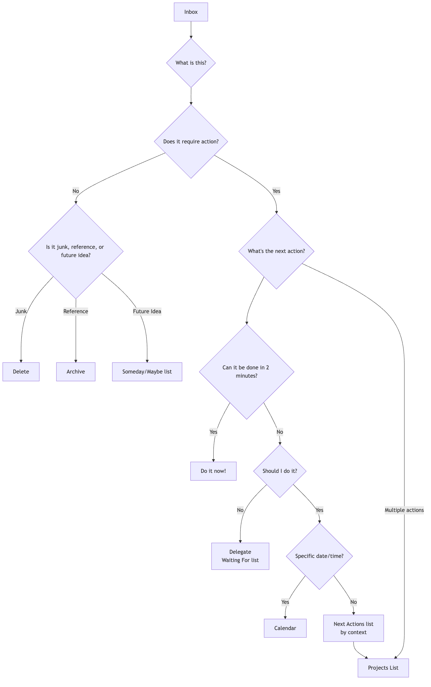

# GTD (Getting Things Done)

Мозг по своей природе является отличным "процессором" для **генерации идей**, но крайне плохим "жёстким диском" для **хранения информации**. Когда мы пытаемся использовать мозг для запоминания всех своих задач, встреч, идей и обязательств, он перегружается этими "незавершёнными делами", что приводит к стрессу, тревоге и ментальному беспорядку, и делает невозможным сосредоточиться на текущей задаче. **GTD (Getting Things Done)**, созданная экспертом по продуктивности Дэвидом Алленом, — это всемирно известная **система личной продуктивности и управления рабочими процессами**.

Основная философия GTD заключается в достижении состояния **"Мозг как вода"**, при котором работа становится спокойной, сосредоточенной и эффективной, за счёт выноса всех незавершённых задач из головы во **внешнюю, надёжную систему**, а затем следования чёткому и строгому процессу **организации и обработки** этих задач. Это не просто приём управления временем, а полноценная операционная система, разработанная для освобождения ума и позволяющая спокойно справляться со сложными задачами в работе и жизни.

## Пять основных шагов GTD

1.  **Фиксация (Capture)**: Немедленно выносите из головы всё, что привлекает ваше внимание — будь то рабочая задача, личное дело, внезапная идея или предстоящая встреча — во "входящие" (**Inbox**). "Входящие" могут быть физическими (например, папка с документами, блокнот) или цифровыми (например, почтовый ящик, приложение для задач). Ключевой момент — сделать количество входящих как можно меньшим и полностью доверять им, чтобы можно было их полностью очищать.

2.  **Обработка (Process)**: Регулярно (минимум раз в день) **очищайте** ваш ящик. Строго следуя принципу **один пункт за раз**, перебирайте каждый элемент из ящика и задавайте себе ключевой вопрос: "**Что это? Требует ли это действия?**"
    *   Если **действие не требуется**: это либо **мусор** (удалите), либо **информация, которая может понадобиться в будущем** (поместите в архив), либо **идея, которую вы хотите сохранить на потом** (поместите в список "Когда-нибудь/Может быть").
    *   Если **действие требуется**: переходите к следующему шагу организации.

3.  **Организация (Organize)**: Для задач, требующих действия, распределите их по разным категориям в зависимости от их характера.
    *   **Правило двух минут**: Если действие можно выполнить **за две минуты**, то **сделайте его сразу**, не откладывая.
    *   **Делегирование**: Если задачу должен выполнить кто-то другой, **делегируйте** её и поместите в список "**Ожидаю от кого-то**".
    *   **Календарь**: Для действий с **конкретной датой или временем** (например, встречи, назначенные дела) поместите их в **календарь**.
    *   **Список следующих действий (Next Actions List)**: Для задач, которые требуют вашего личного участия, состоят из нескольких шагов и не имеют конкретного срока, разбейте их на **первое конкретное, видимое физическое действие** и поместите в соответствующие списки действий по **контексту**. Контексты могут быть "@компьютер", "@офис", "@телефон", "@супермаркет" и т.д.
    *   **Список проектов (Projects List)**: Любая задача, для завершения которой требуется **более одного действия**, должна быть определена как "**Проект**" и добавлена в список проектов. В этом списке указывается только название проекта; конкретные следующие действия хранятся в соответствующих списках следующих действий.

4.  **Анализ (Reflect)**: Чтобы система оставалась надёжной, необходимо проводить **регулярные проверки**.
    *   **Ежедневный обзор**: Ежедневно просматривайте календарь и список следующих действий, чтобы спланировать день.
    *   **Еженедельный обзор**: Это **ключевой элемент GTD**. Раз в неделю (обычно в выходные) выделите 1–2 часа на всесторонний обзор, обновление и чистку всей системы, чтобы убедиться, что все проекты под контролем, а списки актуальны.

5.  **Действие (Engage)**: В любой момент, когда вы задаёте себе вопрос "Что мне делать сейчас?", вы можете сделать осознанный и спокойный выбор из вашего списка действий, основываясь на следующих критериях:
    *   **Контекст**: Где вы сейчас? Какие инструменты у вас есть? (например, если вы в офисе, смотрите список "@офис")
    *   **Доступное время**: Сколько у вас свободного времени? (например, если у вас есть 10 минут, выберите задачу, которую можно быстро выполнить)
    *   **Уровень энергии**: Каково ваше текущее состояние? (например, если вы полны энергии, возьмитесь за задачу, требующую концентрации)
    *   **Приоритет**: При соблюдении вышеуказанных условий, какая задача наиболее важна?

### Диаграмма рабочего процесса GTD

<!-- mermaid 源文件：GTD-Tutorial-ru-mermaid-live-1.mmd -->

## Примеры применения

**Пример 1: Занятый менеджер отдела**

*   **Фиксация**: Его входящие могут включать: почтовый ящик, сообщения в WeChat, заметки, сделанные на совещаниях, и внезапные идеи.
*   **Обработка и организация**:
    *   Письмо "уведомление о бюджете на следующий квартал" -> Не требует действия -> **Архивировать** в папку "Финансы компании".
    *   Идея "напомнить подчинённому Сяо Чжану отправить еженедельный отчёт" -> Можно выполнить за 2 минуты -> **Немедленно** отправить сообщение Сяо Чжану.
    *   Задача "подготовить корпоративное мероприятие" -> Требует нескольких шагов -> Добавить "Корпоратив" в "**Список проектов**"; поместить первое действие "Связаться с HR для получения списка возможных площадок" в список "**@Офис**".
    *   Встреча "встреча с клиентом в среду в 15:00" -> **Добавить в календарь**.
*   **Действие**: Когда он находится в офисе, у него есть 1 час свободного времени и он чувствует себя энергичным, он может открыть список "@Офис" и выбрать задачу "Связаться с HR".

**Пример 2: Управление проектами фрилансера**

*   **Список проектов**: Может включать "Проект сайта для клиента А", "Редизайн личного блога", "Изучение нового языка программирования" и т.д.
*   **Список следующих действий**:
    *   **@Телефон**: Позвонить клиенту А и уточнить обратную связь по макетам дизайна.
    *   **@Компьютер-Дизайн**: На основе обратной связи внести правки в дизайн главной страницы сайта.
    *   **@Компьютер-Письмо**: Написать статью о "адаптивном дизайне".
    *   **@Чтение/Обучение**: Посмотреть третью главу курса по программированию.
*   **Еженедельный обзор**: В пятницу днём он проверяет прогресс по всем проектам, убеждается, что у каждого проекта есть хотя бы одно "следующее действие", и планирует приоритеты на следующую неделю.

**Пример 3: Студент, управляющий учёбой и личной жизнью**

*   **Входящие**: Уведомления из чатов курсов в WeChat, домашние задания от преподавателей, идеи по организации студенческих мероприятий, список покупок.
*   **Список проектов**: "Написать историческую работу", "Подготовиться к экзаменам", "Организовать вечеринку для первокурсников".
*   **Список следующих действий**:
    *   **@Библиотека**: Взять три книги по теме работы.
    *   **@Комната**: Организовать записи с лекций по математике.
    *   **@Супермаркет**: Купить зубную пасту и шампунь.
*   **Система GTD** помогает ему чётко разделить академические задачи и повседневные дела, гарантируя, что нужные вещи делаются в нужное время и в нужном месте.

## Преимущества и трудности GTD

**Основные преимущества**

*   **Снижает ментальный стресс, освобождает ресурсы мозга**: Вынося все "незавершённые дела" из головы, значительно снижается нагрузка на память и тревога, связанная с "боем забыть".
*   **Повышает чувство контроля и спокойствия**: Надёжная система гарантирует, что всё под контролем, позволяя спокойнее и сосредоточеннее подходить к текущим задачам.
*   **Гарантирует, что важные дела не будут упущены**: Ключевой элемент "Еженедельный обзор" обеспечивает постоянное внимание и прогресс по всем важным проектам и долгосрочным целям.
*   **Высокая адаптивность и гибкость**: GTD сама по себе не задаёт приоритеты, а предоставляет структуру, позволяющую динамически и гибко выбирать наиболее подходящее действие в текущем контексте.

**Возможные трудности**

*   **Высокие начальные затраты на настройку системы**: Впервые "собрав" и настроив полную систему списков, вы можете потратить несколько часов или даже целый день.
*   **Требует строгой самодисциплины и формирования привычки**: Успех GTD зависит от того, сможете ли вы выработать ключевые привычки — **постоянную фиксацию задач** и **регулярные обзоры**. Как только система перестаёт обновляться и вызывать доверие, она быстро разрушается.
*   **Выбор инструментов**: На рынке существует множество программ и инструментов GTD, и новички легко могут попасть в ловушку излишнего увлечения поиском "идеального инструмента", забывая о самой методике.

## Расширения и связи

*   **Матрица Эйзенхауэра**: Может использоваться на этапе **"Действие" (Engage)** GTD как эффективная модель для определения **приоритетов**.
*   **Метод Pomodoro**: Отличная тактика для выполнения задач из списка **"Следующих действий" (Next Actions List)**, требующих высокой концентрации.

---
*Ссылка: Глобальный бестселлер Дэвида Аллена "Getting Things Done: Искусство продуктивности без стресса" — единственный и наиболее авторитетный источник для понимания полной философии, процессов и лучших практик метода GTD.*