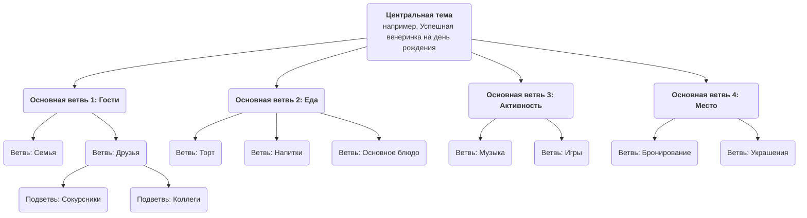

# Карты мышления (Mind Mapping)

Мозг человека, когда он думает, работает не линейно и прямо, а полон скачков, ассоциаций и отклонений. **Карты мышления** — это именно такой мощный **инструмент визуального мышления**, который глубоко соответствует естественному способу работы нашего мозга. Изобретённый британским учёным Тони Бьюзеном в 1970-х годах, он заключается в соединении ключевых слов, идей, изображений и цветов вокруг **центральной темы** в виде **радиальной, постепенно слоистой структуры**, тем самым превращая сложную тему или разрозненный набор информации в ясную, упорядоченную, легко запоминающуюся и понятную «карту мышления».

Особенность карт мышления — их **нелинейность**. Они побуждают нас свободно ассоциировать, ловить мимолётные вдохновения и организовывать их органичным, взаимосвязанным образом. Это не просто инструмент для записи информации, но и мощный партнёр в мышлении, стимулирующий креативность, уточняющий логику и улучшающий память. От планирования и записи лекций до подготовки презентаций и мозговых штурмов — карты мышления могут значительно повысить эффективность и глубину нашего мышления.

## Основные компоненты карты мышления

Стандартная карта мышления следует нескольким простым, но важным правилам рисования.

1.  **Центральное изображение/тема**: В самом центре холста используйте яркое изображение или ключевое слово, чтобы представить вашу основную тему. Это отправная точка всего мышления.
2.  **Основные ветви**: Толстые, изогнутые линии, расходящиеся прямо от центральной темы, представляют основные ветви первого уровня или категории этой темы. На каждой основной ветви должно быть ключевое слово.
3.  **Подветви**: Более тонкие линии, идущие от основных ветвей, представляют дальнейшее уточнение и детализацию содержания основной ветви. Ветви могут бесконечно разветвляться, образуя иерархическую древовидную структуру.
4.  **Ключевые слова**: На каждой ветви используйте только краткое ключевое слово или короткую фразу, резюмирующую основную идею, вместо полных предложений. Это помогает стимулировать больше ассоциаций.
5.  **Цвета**: Используйте разные цвета для разных основных ветвей и их подветвей. Цвета помогают нам классифицировать и организовывать информацию, а также значительно стимулируют визуальную память.
6.  **Изображения**: По возможности используйте небольшие значки, символы и простые рисунки в различных частях карты. Как говорится, «картинка стоит тысячи слов»; изображения значительно повышают интерес и запоминаемость карты.

### Пример структуры карты мышления

<!--

-->

## Как рисовать карту мышления

1.  **Шаг первый: Начните с центра**
    Возьмите чистый лист бумаги и положите его горизонтально. В самом центре нарисуйте изображение, представляющее вашу основную тему, или напишите ключевое слово.

2.  **Шаг второй: Нарисуйте основные ветви**
    Нарисуйте несколько толстых изогнутых линий, расходящихся от центральной темы в виде основных ветвей. Каждая основная ветвь представляет собой основную категорию. Напишите соответствующее ключевое слово над линией.

3.  **Шаг третий: Добавьте ветви и ключевые слова**
    Продолжайте рисовать более тонкие ветви от каждой основной ветви и записывайте более конкретные ключевые слова над линиями. Сохраняйте согласованность длины линий и текста. Этот процесс похож на то, как большое дерево выпускает новые веточки.

4.  **Шаг четвёртый: Используйте цвета и изображения**
    Назначьте разные цвета разным системам основных ветвей. Нарисуйте несколько простых маленьких значков или символов там, где посчитаете уместным, чтобы сделать вашу карту «ожившей».

5.  **Шаг пятый: Свободные ассоциации, непрерывное расширение**
    Не ограничивайтесь порядком; позвольте своим мыслям свободно переходить между различными ветвями. Как только приходит новая идея, сразу находите её категорию и добавляйте новую ветвь. Весь процесс должен быть расслабленным и приятным.

## Примеры применения

**Пример 1: Запись заметок при чтении**

*   **Ситуация**: После прочтения книги о «эффективных привычках» вы хотите структурировать и запомнить её основное содержание.
*   **Применение**:
    *   **Центральная тема**: Название книги «Эффективные привычки».
    *   **Основные ветви**: Могут быть названия глав книги, например, «Сила привычки», «Цикл привычки», «Как создать хорошие привычки», «Как избавиться от плохих привычек».
    *   **Подветви**: Под каждой основной ветвью используйте ключевые слова, чтобы записать основные аргументы, ключевые примеры и конкретные методы главы. Например, под ветвью «Цикл привычки» можно создать подветви «Сигнал», «Рутина» и «Награда».
    *   Таким образом, логическая структура и основные пункты всей книги концентрируются в ясной схеме, что очень удобно для повторения и запоминания.

**Пример 2: Подготовка презентации или отчёта**

*   **Ситуация**: Вам нужно сделать 20-минутный доклад руководству о «Годовом маркетинговом плане компании».
*   **Применение**:
    *   **Центральная тема**: «Годовой маркетинговый план».
    *   **Основные ветви**: «Анализ рынка», «Целевая аудитория», «Ключевые стратегии», «Распределение бюджета», «Ожидаемые KPI».
    *   **Подветви**: Под каждой основной ветвью уточните пункты, которые нужно раскрыть. Например, под ветвью «Ключевые стратегии» можно создать подветви «Контент-маркетинг», «Продвижение в социальных сетях», «Офлайн-мероприятия» и т. д.
    *   Эта карта мышления формирует полный план вашей презентации. Во время выступления вы можете смотреть на карту, чтобы убедиться, что логика изложения ясна и ни один ключевой пункт не упущен.

**Пример 3: Организация командного мозгового штурма**

*   **Ситуация**: Команда должна придумать творческие идеи по теме «Как улучшить пользовательский опыт продукта».
*   **Применение**:
    *   **Центральная тема**: «Улучшение пользовательского опыта».
    *   **Основные ветви**: Могут быть заранее заданы как аспекты пользовательского опыта, например, «Производительность», «Удобство использования», «Визуальный дизайн», «Техническая поддержка».
    *   **Процесс**: Участники команды свободно предлагают идеи вокруг этих основных ветвей, а ведущий добавляет эти идеи в соответствующие ветви карты мышления в режиме реального времени в виде ключевых слов. Визуализация и взаимосвязанность карты мышления могут значительно стимулировать участников «наращивать» идеи, порождая больше ассоциаций и креативности.

## Преимущества и трудности применения карт мышления

**Основные преимущества**

*   **Соответствует работе мозга**: Радиальная структура имитирует связи нейронов мозга, делая мышление и ассоциации более естественными и плавными.
*   **Стимулирует креативность**: Нелинейная природа поощряет свободные ассоциации, помогая преодолеть ограничения линейного мышления и порождать больше идей.
*   **Улучшает память**: Комбинация ключевых слов, цветов, изображений и других элементов задействует оба полушария мозга, значительно усиливая эффект запоминания.
*   **Наглядность**: Может представить большое количество сложной информации в сильно сжатом и чётко структурированном виде, что позволяет быстро охватить общую картину.

**Возможные трудности**

*   **Высокая персонализация**: Карты мышления, нарисованные разными людьми, могут иметь сильную субъективность в выборе логики и ключевых слов, и другим людям может потребоваться некоторое объяснение, чтобы понять их сначала.
*   **Не подходит для финальных, формальных документов**: Это отличный инструмент для мышления и концептуализации, но его ручная, нелинейная стилистика, как правило, не подходит для финальных, формальных бизнес-отчётов или академических работ, требующих строгого форматирования.
*   **Ограничения инструментов**: Хотя существует множество программных инструментов для создания карт мышления, считается, что рисование от руки лучше стимулирует креативность. Однако ручные карты менее удобны для редактирования и обмена по сравнению с электронными версиями.

## Расширения и связи

*   **Мозговой штурм**: Карта мышления — идеальный инструмент для проведения и организации результатов мозгового штурма. Разрозненные идеи, возникающие во время мозгового штурма, могут быть категоризированы и структурированы в режиме реального времени с помощью карты мышления.
*   **Концептуальная карта**: Похожа на карту мышления, но больше фокусируется на точном выражении **конкретных связей** между различными понятиями (например, с использованием текста на соединительных линиях для объяснения «A вызывает B» или «B является частью C»). Она более логически строгая, тогда как карты мышления больше сосредоточены на свободные ассоциации и мозговой штурм.

---
*Справка: Тони Бьюзен известен как «отец карт мышления». Его книга «Карта мышления» является авторитетным руководством по этому методу, в которой подробно описаны его принципы, правила и широкое применение в различных областях.*