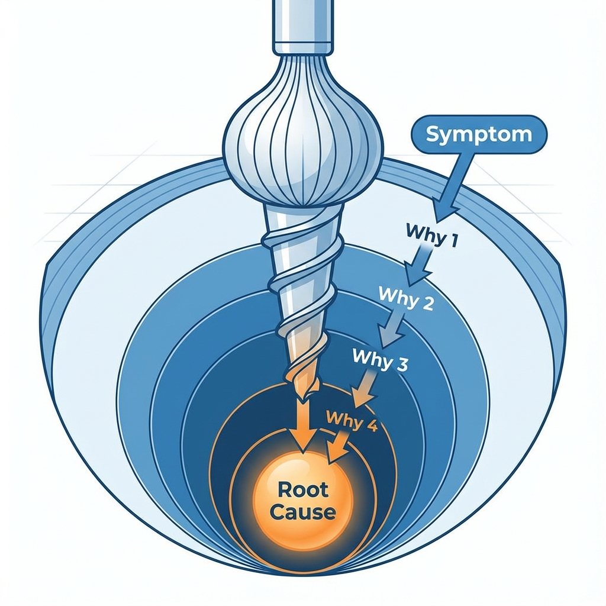

# 5 «Почему»

При решении повседневных проблем мы часто попадаем в порочный круг «лечения симптомов, но не устранения корневой причины»: мы устраняем проблему, но вскоре она снова возникает в том же или похожем виде. Обычно это происходит потому, что мы имеем дело только с **поверхностными симптомами** проблемы, не затрагивая **корневую причину**, которая к ней привела. Метод 5 «Почему» — это чрезвычайно простая, но глубоко проницательная техника **анализа корневых причин (RCA)**. Ее предложил Сакити Тойода, основатель Toyota Motor Corporation, и она является ключевым инструментом решения проблем в Toyota Production System (TPS).

Основная идея метода 5 «Почему» заключается в том, чтобы последовательно и итеративно задавать вопрос «**Почему?**» относительно существующей проблемы, постепенно углубляясь, словно очищая луковицу, пока не будет найдена фундаментальная корневая причина. Если устранить эту корневую причину, можно полностью предотвратить повторение проблемы. При этом не обязательно задавать вопрос ровно пять раз; иногда корневую причину можно найти за три «почему», а иногда потребуется больше. Суть заключается в **духе настойчивого поиска, неудовлетворенности поверхностными ответами**. Это мощный инструмент мышления, который переносит фокус команды с вопроса «Чья вина?» на вопрос «Почему это произошло?», а также с тушения пожара на предотвращение возгораний.

## Логическая цепочка 5 «Почему»

Процесс 5 «Почему» строит четкую цепочку причин и следствий от симптома до корневой причины. Ответ на каждый вопрос «Почему?» становится темой следующего вопроса «Почему?»

## Как провести анализ 5 «Почему»

1.  **Шаг 1: Создать команду, определить проблему**
    *   Собрать небольшую группу сотрудников, хорошо знакомых с проблемой и ее контекстом.
    *   Совместно сформулировать точное **описание проблемы**, используя ясный и объективный язык. Например: «26 октября 2023 года в 10:00 сервер системы заказов клиентов вышел из строя».

2.  **Шаг 2: Начать последовательно задавать вопрос «Почему?»**
    *   **Первое «Почему?»**: Задать первый вопрос «Почему?» относительно описания проблемы.
        *   *Вопрос*: «Почему сервер системы заказов клиентов вышел из строя?»
        *   *Ответ*: «Потому что загрузка процессора сервера достигла 100%.»

    *   **Второе «Почему?»**: Использовать предыдущий ответ как новую тему и продолжить задавать вопросы.
        *   *Вопрос*: «Почему загрузка процессора сервера достигла 100%?»
        *   *Ответ*: «Потому что SQL-запрос в базе данных попал в бесконечный цикл.»

    *   **Третье «Почему?»**:
        *   *Вопрос*: «Почему SQL-запрос попал в бесконечный цикл?»
        *   *Ответ*: «Потому что в запросе была логическая ошибка при обработке определенного типа пользовательских данных.»

    *   **Четвертое «Почему?»**:
        *   *Вопрос*: «Почему этот ошибочный код был развернут в боевой среде?»
        *   *Ответ*: «Потому что наш процесс код-ревью не охватывал этот конкретный тестовый случай.»

    *   **Пятое «Почему?»**:
        *   *Вопрос*: «Почему в нашем процессе код-ревью имелся такой пробел?»
        *   *Ответ*: «Потому что у нас не было стандартизированного **чек-листа код-ревью**, включающего все необходимые пункты проверки.»

3.  **Шаг 3: Определить корневую причину и разработать меры по предотвращению**
    *   **Определить корневую причину**: В приведенном выше примере корневой причиной было определено «отсутствие стандартизированного чек-листа код-ревью». Это проблема **на уровне процесса**. Если бы мы просто исправили логическую ошибку в SQL-запросе (ответ на третий вопрос «Почему?»), то в будущем, скорее всего, возникли бы другие подобные проблемы, связанные с недостаточной проверкой кода.
    *   **Разработать меры по предотвращению**: Разработать конкретные и реализуемые корректирующие действия для устранения корневой причины. Например: «Технический руководитель должен создать стандартный чек-лист код-ревью, включающий проверку производительности баз данных, безопасности и тестирование граничных условий, в течение этой недели, и все команды обязаны использовать его в дальнейшем.»

## Примеры применения

**Пример 1: Коррозия каменных стен Джефферсон-Мемориал в Вашингтоне**

*   **Проблема**: Каменные стены мемориала сильно корродировали.
*   **Почему? (1)** Потому что уборщики слишком часто использовали высокоактивные моющие средства для мытья стен.
*   **Почему? (2)** Потому что ежедневно на стенах скапливалось большое количество птичьего помета, что требовало частой уборки.
*   **Почему? (3)** Потому что большое количество ласточек собиралось вокруг мемориала, питаясь пауками, которые там размножались.
*   **Почему? (4)** Потому что большое количество пауков привлекалось светом мемориала — они любили собираться в светлых местах, чтобы плести паутину на закате.
*   **Почему? (5)** Потому что система освещения мемориала была настроена так, чтобы включаться за час до заката.
*   **Корневая причина**: Неправильная настройка времени включения системы освещения.
*   **Решение**: Скорректировать время включения освещения мемориала, установив его на время после заката. Это простое изменение, ориентированное на процесс, решило проблему коррозии каменных стен.

**Пример 2: Лужа масла на полу цеха**

*   **Проблема**: На полу цеха образовалась лужа масла.
*   **Почему? (1)** Потому что из соединения масляной трубы машины вытекало масло.
*   **Почему? (2)** Потому что прокладка в этом соединении масляной трубы была старой и растрескавшейся.
*   **Почему? (3)** Потому что компания закупила партию дешевых и низкокачественных прокладок.
*   **Почему? (4)** Потому что единственным требованием политики закупок компании было «самая низкая цена».
*   **Почему? (5)** Потому что система оценки эффективности отдела закупок была связана исключительно с тем, сколько средств они «сэкономили» компании, и никак не учитывала качество и срок службы запасных частей.
*   **Корневая причина**: Несовершенная система оценки эффективности отдела закупок.
*   **Решение**: Пересмотреть политику закупок и систему оценки, включив в нее показатели качества поставщиков, надежности и долгосрочных затрат.

**Пример 3: Студент не сдал экзамен**

*   **Проблема**: Сяомин не сдал выпускной экзамен по математике.
*   **Почему? (1)** Потому что он начал готовиться только за неделю до экзамена, и этого времени оказалось недостаточно.
*   **Почему? (2)** Потому что он плохо понимал большую часть материала, преподаваемого на занятиях.
*   **Почему? (3)** Потому что он постоянно играл в телефон на занятиях и не мог сосредоточиться.
*   **Почему? (4)** Потому что он принципиально не любил математику и не испытывал к ней интереса.
*   **Почему? (5)** Потому что в средней школе его жестко критиковали за проваленный тест по математике, что вызвало психологическую травму и страх перед математикой.
*   **Корневая причина**: Ранний негативный учебный опыт привел к психологическим барьерам.
*   **Решение**: Может потребоваться психологическое консультирование, развитие уверенности в себе и восстановление интереса к математике через изучение более простых тем, где можно испытать успех.

## Преимущества и трудности метода 5 «Почему»

**Основные преимущества**

*   **Простота и удобство использования**: Не требует сложных статистических инструментов или специальных знаний; любой команде легко начать применять метод.
*   **Выявление корневой причины**: Помогает командам проникнуть за пределы поверхностных симптомов проблемы и найти высокоэффективные решения, способные фундаментально решить проблему.
*   **Фокус на понимании, а не на обвинениях**: Переносит фокус с вопроса «Кто допустил ошибку» на вопрос «Почему процесс позволил ошибке произойти», способствуя формированию здоровой, ориентированной на решение проблем культуры.

**Возможные трудности**

*   **Может быть несколько корневых причин**: Для сложных проблем корневая причина может быть не единственной, а частью взаимосвязанной системы. В таких случаях метод 5 «Почему» может упрощать проблему.
*   **Зависит от знаний участников**: Глубина анализа сильно зависит от понимания участниками реального процесса и ситуации.
*   **Может остановиться на полпути**: Команда может прекратить задавать вопрос «Почему?», найдя кажущуюся разумной, но не самую фундаментальную причину.

## Расширения и связи

*   **Диаграмма Исикавы (рыбий скелет)**: Когда проблема может быть вызвана несколькими различными, параллельными причинами из разных областей, можно сначала использовать диаграмму Исикавы для систематического мозгового штурма и организации всех возможных потенциальных причин. Затем можно использовать метод 5 «Почему» для глубокого анализа наиболее подозрительных причин.
*   **Линейное производство (Lean Production)** и **Six Sigma**: Метод 5 «Почему» является одним из самых часто используемых и фундаментальных инструментов анализа корневых причин в этих методологиях улучшения качества и операционной эффективности.

---
*Источник: Метод 5 «Почему», как один из основополагающих элементов Toyota Production System (TPS), был разработан Сакити Тойодой и популяризирован Тайити Оно. Это ключевой элемент культуры решения проблем и непрерывного улучшения в рамках lean-мышления.*