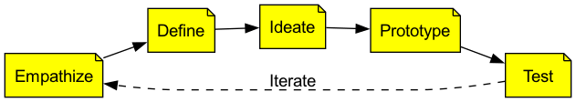

# Дизайнерское мышление

Как мы можем создавать инновационные продукты и услуги, которые действительно значимы и глубоко решают проблемы пользователей? Часто причина наших неудач кроется не в недостаточной технической оснащенности, а в том, что с самого начала мы влюбляемся в свои «решения», так и не разобравшись по-настоящему в «проблеме» пользователя. **Дизайнерское мышление** — это **ориентированная на человека** и **систематическая методология инноваций**, предназначенная для решения сложных задач. Оно не принадлежит исключительно дизайнерам, это образ мышления и рабочий процесс, который может освоить и применять любая команда в любой области.

В основе дизайнерского мышления лежит перенос фокуса инноваций с «технической осуществимости» или «бизнес-интересов» на **человеческие потребности**. Оно утверждает, что перед тем, как думать о решениях, мы должны сначала глубоко и с сочувствием понять наших пользователей через **эмпатию**, получить представление об их неудовлетворенных потребностях и желаниях. Затем, через процесс **чередования расширения и сужения**, **практического воплощения** и **быстрого тестирования**, мы исследуем, создаем и проверяем инновационные решения. Это полный путь от «понимания людей» к «обслуживанию людей».

## Пять этапов дизайнерского мышления

Стендфордский d.school классически описывает процесс дизайнерского мышления как пять нелинейных, итеративных этапов.

*   **Это итеративный, а не линейный процесс**: Обратная связь, полученная на этапе тестирования, может вернуть вас на любой предыдущий этап для углубления эмпатии, переопределения проблемы или генерации новых идей.

1.  **Эмпатия**
    *   **Цель**: Погрузиться в мир пользователя, чтобы понять, что он видит, слышит, думает и чувствует. Вам нужно временно отложить собственные предположения и предубеждения и наблюдать и слушать с открытым умом.
    *   **Распространенные инструменты**: интервью с пользователями, полевые исследования, наблюдение с участием, карты эмпатии.

2.  **Определение**
    *   **Цель**: Синтезировать и уточнить все разрозненные качественные данные, собранные на этапе эмпатии, чтобы сформировать четкое, вдохновляющее и реализуемое **утверждение точки зрения (POV)**.
    *   **Хорошее описание проблемы обычно имеет следующий формат**: "[Пользователь] нуждается в [потребность пользователя], потому что [неожиданный вывод]."

3.  **Генерация идей**
    *   **Цель**: Провести «широкий», расширяющийся этап генерации идей для определенной ключевой проблемы. На этом этапе **количество важнее качества**.
    *   **Распространенные инструменты**: мозговой штурм, обратный мозговой штурм, ментальные карты, аналоговое мышление и т. д.

4.  **Прототипирование**
    *   **Цель**: Быстро превратить абстрактные идеи, созданные на этапе генерации идей, в осязаемые, недорогие **физические модели**. Цель прототипа — не совершенство, а **воплощение идей для быстрого тестирования и обучения**.
    *   **Прототипом может быть что угодно**: интерфейс приложения, нарисованный на бумаге, модель продукта, собранная из кубиков LEGO, ролевая игра, имитирующая процесс оказания услуги, или простая последовательность рисунков.

5.  **Тестирование**
    *   **Цель**: Представить свой прототип низкой детализации реальным пользователям для взаимодействия и получения опыта, внимательно наблюдать за их реакцией и собирать обратную связь. Основной принцип тестирования — "**показывайте с намерением учиться, а не показывать уже сделанное**."
    *   Тестирование позволяет проверить, является ли ваше решение осуществимым, выявить области для улучшения и даже получить новые, более глубокие инсайты о пользователях и проблемах, что запустит следующую итерацию.

## Примеры применения

**Пример 1: IDEO перерабатывает дизайн бутылки с напитком Gatorade**

*   **Эмпатия**: Команда дизайнеров IDEO не начала сразу проектировать бутылку. Вместо этого они тренировались вместе с многими спортсменами (от профессиональных футболистов до любителей). Они заметили, что уставшие и вспотевшие спортсмены испытывают трудности с открытием традиционных круглых крышек бутылок скользкими руками.
*   **Определение**: Основная проблема: "Уставшие спортсмены нуждаются в способе открыть и выпить напиток одной рукой быстро и без усилий, потому что каждая секунда гидратации критична во время интенсивных тренировок."
*   **Генерация идей и прототипирование**: Команда создала десятки различных форм и материалов для крышек и корпусов бутылок.
*   **Тестирование**: Они вернулись с этими прототипами на поле и попросили спортсменов протестировать их в реальных условиях тренировок.
*   **Финальный продукт**: Это привело к созданию знаменитой бутылки "Gatorade Edge" с черными противоскользящими полосами и односторонним клапаном на крышке. Этот дизайн стал большим успехом, потому что он идеально решил проблему, выявленную в реальной ситуации.

**Пример 2: Ранняя трансформация Airbnb**

*   **Проблема**: На раннем этапе развития Airbnb рост бизнеса в Нью-Йорке застопорился. Они обнаружили, что хотя на сайте были объявления, количество бронирований было крайне низким.
*   **Эмпатия**: Основатели лично прилетели в Нью-Йорк и посетили своих пользователей лично. Они обнаружили, что качество фотографий, сделанных пользователями на свои телефоны, был крайне низким — плохое освещение, случайные ракурсы, совершенно не отражающие привлекательность номеров.
*   **Определение**: "Потенциальным путешественникам нужны качественные и привлекательные фотографии, чтобы доверять незнакомым объявлениям, потому что они не могут увидеть номера лично до бронирования."
*   **Генерация идей и тестирование (смелый эксперимент)**: Основатели арендовали профессиональную камеру и лично посетили всех пользователей в Нью-Йорке, чтобы бесплатно сделать набор качественных фотографий для их объявлений. Это был совершенно нерасширяемый «прототип», но он быстро подтвердил гипотезу.
*   **Результат**: В течение недели количество бронирований для объявлений с профессиональными фотографиями удвоилось. Этот подход, основанный на эмпатии и быстром экспериментировании, стал ключевым поворотным моментом в истории Airbnb.

**Пример 3: Улучшение опыта прохождения МРТ для детей**

*   **Проблема**: Дизайнеры GE Healthcare обнаружили, что многие дети плачут во время МРТ из-за страха перед большим шумным оборудованием, что делало обследование невозможным или даже требовало применения седативных средств.
*   **Эмпатия**: Дизайнеры провели много времени в больницах, наблюдая за детьми и их родителями, ощущая их тревогу и страх.
*   **Переопределение проблемы**: Проблема заключалась не в том, "как создать более красивую МРТ-машину", а в том, "как превратить пугающее медицинское обследование в увлекательное приключение?"
*   **Решение**: Они полностью переоформили комнату для МРТ в стиле «пиратского корабля» или «космического корабля». Детям говорили, что они входят в космический корабль для космического приключения, а громкий шум во время обследования — это звук корабля, входящего в режим сверхпрыжка. Этот дизайн, названный "Adventure Series", значительно снизил страх у детей и уменьшил потребность в седативах.

## Преимущества и вызовы дизайнерского мышления

**Основные преимущества**

*   **Снижает риск инноваций**: Глубокое понимание пользователей и быстрое, недорогое тестирование на ранних этапах проекта значительно снижает риск создания продуктов, которые никому не нужны.
*   **Порождает прорывные инновации**: Сосредоточившись на глубоких потребностях пользователей, а не на существующих решениях, легче генерировать разрушительные, революционные идеи.
*   **Повышает командную работу и креативность**: Его совместный, практический характер разрушает междисциплинарные барьеры, стимулируя коллективный интеллект и уверенность в творческих способностях команды.

**Возможные вызовы**

*   **Сложность в решении «несуществующих» проблем**: Дизайнерское мышление отлично подходит для улучшения существующих опытов, но его применимость может быть ограничена в случае революционных технологических прорывов, о которых пользователи сами не догадываются (например, первый iPhone).
*   **Требует культурной поддержки**: Организации должны терпеть неопределенность, поддерживать эксперименты и допускать неудачи, что противоречит культуре многих традиционных предприятий.
*   **Не является линейным процессом**: Для команд, привыкших к четким линейным процессам, «хаотичная», итеративная природа дизайнерского мышления может вызывать дискомфорт.

## Расширения и связи

*   **Lean Startup**: Дизайнерское мышление и Lean Startup очень хорошо дополняют друг друга по своей философии. Цикл «прототип-тестирование» дизайнерского мышления похож на цикл «создание-измерение-обучение» Lean Startup. Как правило, дизайнерское мышление может использоваться, чтобы убедиться, что вы "**делаете это правильно**", а Lean Startup — что вы "**делаете правильную вещь**".
*   **Agile Development**: Дизайнерское мышление — отличный партнер для фронтенда Agile-разработки — "Что мы должны разрабатывать?" Истории пользователей, созданные и проверенные с помощью дизайнерского мышления, могут напрямую попадать в бэклог Agile-команды.

---
*Ссылка: Корни дизайнерского мышления можно проследить до скандинавского движения участия в дизайне 1960-х годов. Современные методологии дизайнерского мышления в основном были продвигаемы и популяризированы Дэвидом Келли и Тимом Брауном, основателями IDEO, и d.school Стэнфордского университета. Книга Тима Брауна "Изменение с помощью дизайна" является обязательной классикой в этой области.*