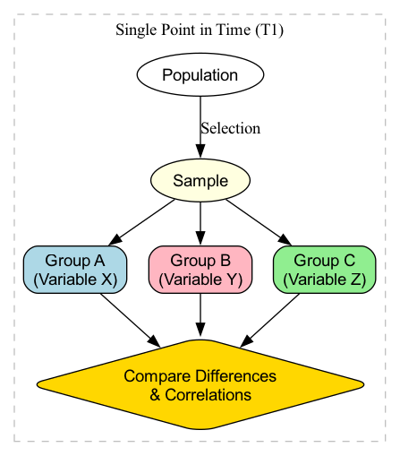

# Поперечные исследования

В стремительном темпе современного мира часто возникает необходимость быстро и эффективно получить "снимок" текущего состояния группы. **Поперечное исследование** — это метод исследования, созданный именно для этой цели. Его суть заключается в одновременном наблюдении и измерении выборок из **разных групп** (обычно разных возрастных групп) в **определенный момент времени**. Оно направлено на описание и сравнение характеристик, мнений или поведения этих различных групп в один и тот же момент, предоставляя нам панорамный обзор среза общества.

Если продольное исследование — это "документальный фильм", отслеживающий рост главного героя, то поперечное исследование — это "семейная фотография", объединяющая три поколения людей. С помощью этой фотографии мы можем четко увидеть различия во внешности, одежде и поведении людей разного возраста. Когда вы хотите быстро понять такие вопросы, как "Как различаются потребители разных возрастных групп в принятии новых технологических продуктов?" или "Каков уровень счастья среди разных доходных групп в современном обществе?", поперечное исследование предлагает чрезвычайно эффективное решение.

## Основная логика поперечного исследования

Суть поперечного исследования — это **сравнение**. Оно выявляет закономерности изменений (обычно связанных с возрастом), фиксируя состояние разных групп в один момент времени. Его основная логика и характеристики следующие:

*   **Единый момент времени**: вся сборка данных завершается в течение относительно короткого и сосредоточенного периода.
*   **Сравнение нескольких групп**: основой исследования является сравнение различий определенной переменной (например, "время использования социальных сетей") среди разных групп (например, возрастные группы 10-19 лет, 20-29 лет, 30-39 лет).
*   **Описательный и корреляционный характер**: по сути, это описательное исследование, цель которого — изобразить характеристики различных групп. В то же время оно может использоваться и для корреляционного анализа, изучая связи между различными переменными в определенный момент времени (например, связь между доходом и уровнем счастья).
*   **Отсутствие вмешательства**: исследователи только наблюдают и измеряют, не оказывая никакого влияния или вмешательства на объекты исследования.

### Поперечное исследование против продольного исследования

## Смешение "возрастного эффекта" и "когортного эффекта"

Это самое фундаментальное и критическое ограничение при понимании поперечного исследования. Когда мы обнаруживаем различия между разными возрастными группами в поперечном исследовании, трудно определить, вызваны ли эти различия **самим возрастом** (возрастной эффект) или тем, что эти люди разных возрастов выросли в **разные исторические эпохи** (когортный эффект).

**Классический пример**: поперечное исследование показало, что компьютерная грамотность 60-летних значительно ниже, чем у 20-летних. Мы не можем поспешно заключить, что "с возрастом способность людей осваивать компьютеры снижается" (возрастной эффект). Это связано с тем, что две группы выросли в совершенно разные эпохи: 20-летние — это "цифровые аборигены", выросшие вместе с компьютерами, тогда как 60-летние познакомились с компьютерами только во взрослом возрасте. Различия, вызванные разным фоном, и есть "когортный эффект". Сам дизайн поперечного исследования не позволяет четко разделить эти два эффекта.

## Как провести поперечное исследование

1.  **Определение исследовательских вопросов и групп**
    Четко определите, какие группы вы хотите сравнить, и какие переменные вы хотите измерить. Например, исследование "Есть ли различия в показателях экологического сознания среди взрослых с разным уровнем образования (среднее, бакалавриат, магистратура)?"

2.  **Определение выборки и методов отбора**
    Определите четкие рамки выборки для каждой группы (среднее, бакалавриат, магистратура) и используйте соответствующие методы отбора (например, стратифицированную или квотную выборку), чтобы убедиться, что выборка для каждой группы репрезентативна.

3.  **Разработка инструментов измерения**
    Разработайте инструмент, который может точно измерить интересующие вас переменные, чаще всего это анкета. Убедитесь, что анкета одинаково справедлива и применима ко всем группам.

4.  **Сбор данных**
    Завершите сбор данных для всех выборок в течение заранее определенного, относительно короткого периода времени.

5.  **Анализ данных**
    Используйте статистические методы для сравнения различий целевых переменных среди разных групп. Общие статистические методы включают дисперсионный анализ (ANOVA), t-тест или критерий хи-квадрат. Например, используйте ANOVA, чтобы определить, есть ли значительные различия в средних показателях экологического сознания среди трех групп по уровню образования.

## Примеры применения

**Пример 1: Исследование поведения избирателей в политологии**

*   **Ситуация**: Перед важными выборами опросная организация хочет понять предпочтения избирателей разных возрастных групп.
*   **Применение**: Организация случайным образом опросила 1000 избирателей по телефону за неделю до выборов и спросила их возраст и предпочтительного кандидата. Анализ показал, что избиратели в возрасте 18-29 лет склонны поддерживать кандидата А, тогда как избиратели старше 65 лет склонны поддерживать кандидата Б. Это исследование предоставило немедленный "снимок" для анализа выборов.

**Пример 2: Исследование рыночной сегментации**

*   **Ситуация**: Автомобильная компания планирует запустить новый внедорожник и хочет определить свою целевую аудиторию.
*   **Применение**: Они провели масштабное поперечное исследование, собирая данные о предпочтениях при покупке автомобиля среди потребителей разного возраста, дохода и размера семьи. Результаты анализа показали, что семьи в возрасте "30-40 лет, с двумя детьми и средним или высоким доходом" имеют наибольший спрос на семиместные внедорожники. Это открытие помогло компании точно определить своих клиентов и разработать соответствующие маркетинговые стратегии.

**Пример 3: Исследование способностей в психологии развития**

*   **Ситуация**: Психолог хочет изучить, как развивается логическое мышление у детей с возрастом.
*   **Применение**: Он одновременно привлек 100 детей 5 лет, 100 детей 8 лет и 100 детей 11 лет и попросил их выполнить одни и те же задачи на логическое мышление. Он обнаружил, что с увеличением возрастной группы средний балл за выполнение задач значительно возрастает. Это позволило впервые описать кривую развития логического мышления. Однако он должен учитывать, что это различие может частично быть связано с различиями в содержании образования, получаемого детьми разного возраста (когортный эффект).

## Преимущества и ограничения поперечных исследований

**Основные преимущества**

*   **Эффективность и экономичность**: По сравнению с продольными исследованиями, занимающими годы, поперечные исследования могут быть завершены за короткое время, что делает их высокоэффективными с точки зрения затрат.
*   **Простота реализации**: Процесс сбора данных относительно прост, и нет проблемы потери выборки.
*   **Предоставляет немедленный снимок**: Может быстро предоставить общий обзор текущей ситуации для принятия политических решений, рыночных стратегий и т.д.

**Потенциальные ограничения**

*   **Не может изучать индивидуальные изменения**: Не может ничего сказать о том, как индивидуумы меняются со временем.
*   **Слабая способность к причинно-следственному анализу**: Не может установить временную последовательность событий, поэтому не может использоваться для вывода причинности.
*   **Смешение когортных эффектов**: Самый фундаментальный недостаток — неспособность отличить возрастные эффекты от когортных, что может привести к неправильной интерпретации тенденций развития.

## Расширения и связи

*   **Продольные исследования**: Это лучший метод для преодоления ограничений поперечных исследований. Многие исследовательские проекты сначала проводят разведывательное поперечное исследование, и если будут найдены интересные различия, затем разрабатывают продольное исследование для более глубокого изучения процесса развития.
*   **Последовательный дизайн**: Более сложный смешанный дизайн, объединяющий характеристики поперечных и продольных исследований, который пытается разделить возрастные эффекты и когортные эффекты, отслеживая несколько возрастных когорт в разные моменты времени.

---
*Ссылка: Поперечное исследование — одно из самых распространенных и фундаментальных исследовательских дизайнов в социальных опросах и эпидемиологии. Его методология подробно описана в основных учебниках по методам исследования. Для классического обсуждения "когортных эффектов" обратитесь к исследованиям ученого К. Уорнера Шайе в области развития интеллекта.*