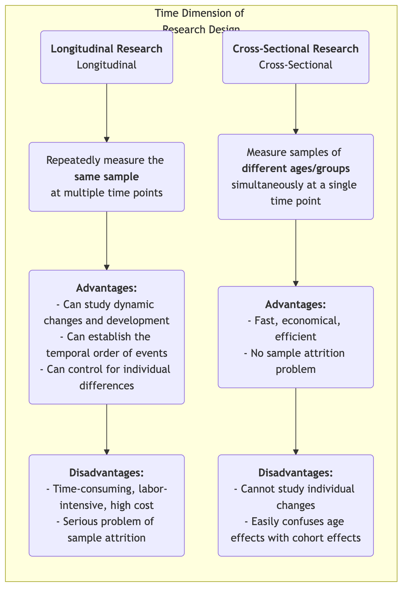

# Продольные исследования

Изучая длинную историю человеческого развития, социальных изменений и эволюции болезней, нам нужен метод исследования, способный зафиксировать важнейшее измерение — «время». **Продольные исследования** как раз и являются такой «камерой», которая многократно и непрерывно наблюдает и измеряет **одну и ту же выборку** в течение длительного периода. Их основная цель — выявить, как явления **меняются, развиваются и эволюционируют** со временем, а также изучить долгосрочное влияние ранних событий на последующие результаты.

В отличие от поперечных исследований, которые дают лишь «моментальный снимок» в одну точку времени, продольные исследования предоставляют нам «документальный фильм». Они позволяют наблюдать за траекторией индивидуального роста, процессом изменения концепций и всем ходом развития болезни — от зарождения до полного проявления. Это дает возможность более четко установить последовательность событий при изучении причинно-следственных связей. Когда вы хотите ответить на динамичные вопросы о процессах и развитии, такие как «Как детские привычки чтения влияют на уровень дохода во взрослом возрасте?» или «Какое долгосрочное влияние оказала реформа политики в течение следующего десятилетия?», продольные исследования становятся незаменимым и мощным инструментом.

## Основные характеристики и типы продольных исследований

Общим для всех продольных исследований является отслеживание «времени», но они могут быть разделены на три основные категории в зависимости от природы того, что отслеживается:

*   **Когортное исследование**: самый распространенный тип. Исследователи выбирают определенную группу людей («когорту»), которые имеют общую характеристику или опыт (например, «все младенцы, рожденные в 2000 году» или «сотрудники, принятые в определенную компанию в 2010 году»), и постоянно отслеживают эту когорту в течение нескольких десятилетий.
*   **Панельное исследование**: похоже на когортное, но отслеживает точно **одну и ту же** индивидуальную выборку. Каждый опрос включает одних и тех же людей, что позволяет исследователям точно анализировать траектории изменений для каждого индивида.
*   **Исследование трендов**: этот тип исследует изменения характеристик «популяции» со временем, но выборки, используемые в каждом опросе, различаются. Например, чтобы изучить изменения общественного отношения к экологическим проблемам, исследовательская организация может раз в пять лет случайным образом выбирать новую группу респондентов по всей стране для опроса.

### Сравнение продольных и поперечных исследований

<!-- mermaid 源文件：Longitudinal-Research-Tutorial-ru-mermaid-live-1.mmd -->

## Как провести продольное исследование

1.  **Определить долгосрочные исследовательские цели**
    Четко сформулируйте, какие изменения или развитие вы хотите отслеживать, и какие потенциальные факторы вас интересуют. Продольные исследования — это долгосрочные инвестиции, которые должны поддерживаться ясными и значимыми исследовательскими целями.

2.  **Определить и выбрать когорту или панельную выборку**
    Точно определите вашу исследуемую популяцию и используйте подходящие методы выборки для отбора начальной группы. Качество и репрезентативность начальной выборки имеют решающее значение.

3.  **Провести начальный опрос (базовый)**
    В начале исследования проведите первое всестороннее сбор данных (базовый опрос), чтобы измерить начальное состояние всех интересующих переменных.

4.  **Спроектировать и провести последующие повторные опросы**
    Определите временные интервалы для последующих опросов (например, ежегодно, раз в пять лет) и разработайте согласованные инструменты измерения. Поддержание контакта с участниками и снижение уровня оттока — одни из самых больших вызовов в ходе длительного исследования.

5.  **Управление данными и анализ**
    Структура продольных данных сложна и требует профессиональных баз данных для управления. Для анализа исследователи используют продвинутые статистические модели (например, модели роста, анализ выживаемости), чтобы изучить траектории изменений переменных со временем и их влияющие факторы.

## Классические примеры применения

**Пример 1: Исследование взрослого развития в Гарварде**

*   **Контекст**: Одно из самых продолжительных продольных исследований в истории, начавшееся в 1938 году и охватывающее 724 мужчин в течение почти 80 лет.
*   **Применение**: Исследователи регулярно собирали данные об их работе, семье, здоровье и других аспектах с помощью анкет, интервью, медицинских записей и т. д. Самый известный вывод этого исследования заключается в том, что хорошие, теплые межличностные отношения являются наиболее важным фактором, предсказывающим долгосрочное счастье и здоровье, даже более важным, чем богатство, слава и гены. Такой вывод мог быть сделан только благодаря пожизненному отслеживанию.

**Пример 2: Британское когортное исследование тысячелетия**

*   **Контекст**: Национальное когортное исследование, отслеживающее примерно 19 000 британских детей, рожденных между 2000 и 2002 годами.
*   **Применение**: Исследование проводило всесторонний сбор данных в разном возрасте (например, 9 месяцев, 3, 5, 7, 11, 14, 17 лет), охватывая все аспекты от здоровья, когнитивных способностей и поведения до семейной среды. Это исследование предоставило огромное количество чрезвычайно ценных данных для разработки государственной политики в отношении детей и семей. Например, оно выявило долгосрочное негативное влияние бедности на развитие детей в раннем возрасте.

**Пример 3: Когортный анализ оттока пользователей продукта**

*   **Контекст**: Компания SaaS (программное обеспечение как услуга) хочет понять, как удерживать новых пользователей.
*   **Применение**: Они использовали метод **когортного анализа**. «Новых пользователей, зарегистрировавшихся каждый месяц», рассматривали как когорту (например, «когорта января», «когорта февраля»). Затем они отслеживали уровень удержания каждой когорты в первый месяц, второй месяц, третий месяц... после регистрации. Сравнивая кривые удержания разных когорт, они могли оценить, оказали ли улучшения продукта и маркетинговые мероприятия положительное влияние на долгосрочное удержание новых пользователей.

## Преимущества и вызовы продольных исследований

**Основные преимущества**

*   **Возможность изучать динамические процессы**: это наиболее эффективный метод изучения самого «развития» и «изменения».
*   **Установление временной последовательности**: позволяет четко определить порядок событий, что является важным условием для установления причинно-следственных связей (хотя все еще необходимо учитывать смешивающие переменные).
*   **Контроль индивидуальных различий**: поскольку отслеживаются одни и те же люди, можно исключить влияние неизменных индивидуальных особенностей (например, интеллекта, темперамента) на результаты.

**Возможные вызовы**

*   **Высокая стоимость**: требует долгосрочной финансовой поддержки, стабильной исследовательской команды и больших управленческих затрат.
*   **Затраты времени**: цикл получения результатов очень длинный, может длиться годами или даже десятилетиями.
*   **Отток выборки**: это главный «враг» продольных исследований. Со временем некоторые участники могут выйти из исследования из-за переезда, потери контакта, смерти или потери интереса, что может привести к смещению конечной выборки.
*   **Влияние повторных измерений**: многократное прохождение одних и тех же тестов или анкет может влиять на поведение или ответы участников, что известно как «эффект практики».

## Расширения и связи

*   **Поперечные исследования**: часто служат низкозатратной и быстрой альтернативой продольным исследованиям. Однако важно помнить об их неспособности различать возрастные и когортные эффекты.
*   **Анализ выживаемости**: статистический метод, часто используемый в продольных исследованиях, специально для анализа продолжительности до наступления события (например, выздоровления, оттока, смерти) и его влияющих факторов.

---
*Ссылка: Концепция продольных исследований имеет долгую историю в эпидемиологии и социальных науках. Теория жизненного курса Дж. Х. Элдера-младшего предоставляет важную теоретическую основу для современных продольных исследований.*