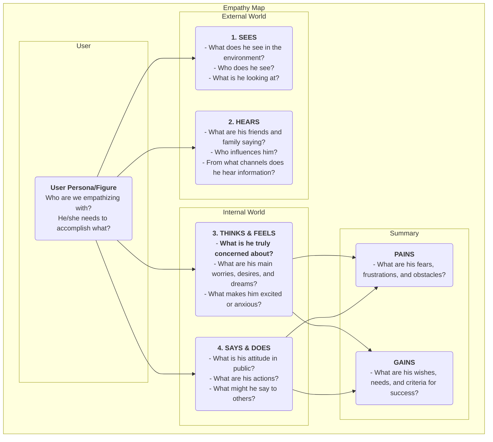

# Карта эмпатии

В проектировании продуктов и исследовании пользователей термин "эмпатия" часто упоминается как ключевое качество, но достичь его на практике крайне сложно. Как действительно "пройтись в обуви пользователя" и по-настоящему прочувствовать его мир? **Карта эмпатии** — это простой, интуитивно понятный, но чрезвычайно мощный **инструмент коллективной эмпатии**, разработанный именно для этой цели. Она помогает командам выйти за рамки поверхностного понимания поведения пользователя и погрузиться в его более глубокий мир **ощущений, мыслей и эмоций**, формируя более полное и многогранное представление о пользователе.

Суть карты эмпатии заключается в систематизации всех разрозненных качественных наблюдений и данных интервью о пользователях в визуальную структуру. Обычно эта структура делится на четыре основных квадранта: **Видит, Слышит, Думает и чувствует, Говорит и делает**. Заполняя карту совместно, члены команды вынуждены смотреть на мир глазами пользователя, создавая общее понимание его внутреннего мира и внешней среды. Это зеркало, отражающее реальное положение дел у пользователя, и катализатор формирования коллективной эмпатии в команде.

## Компоненты карты эмпатии

Классическая карта эмпатии ориентирована на пользователя и строится вокруг четырех ключевых квадрантов, описывающих внешний и внутренний опыт.

<!--

*   **Видит**: Описывает то, что пользователь видит в своей среде. Например, что делают окружающие его люди? С какой рыночной информацией он сталкивается ежедневно?
*   **Слышит**: Описывает информацию, которую пользователь получает из внешнего мира. Что говорят его друзья, семья и коллеги? Какие мнения и медиаканалы оказывают на него влияние?
*   **Думает и чувствует**: Это ядро карты, которое пытается проникнуть во внутренний мир пользователя. Что для него действительно важно (даже если он об этом никогда не говорит вслух)? Какие у него страхи, тревоги, надежды и мечты?
*   **Говорит и делает**: Описывает слова и действия пользователя на публике. Что он сказал нам на интервью? Как он ведет себя при использовании продукта? Особое внимание здесь нужно уделить возможным противоречиям между "говорит" и "думает".
*   **Проблемы** и **выгоды**: После анализа четырех квадрантов выше, подводятся итоги и выделяются внутренние переживания и желания пользователя. Проблемы отражают препятствия и негативные эмоции, с которыми он сталкивается, а Выгоды — это цели и желания, которых он хочет достичь.

## Как использовать карту эмпатии

Карта эмпатии лучше всего используется в формате командного воркшопа.

1.  **Шаг 1: Определите область и цели**
    *   **Выберите пользователя**: Четко определите, для какого конкретного пользователя или персоны вы создаете карту эмпатии. Лучше дать ему имя и краткое описание.
    *   **Определите цели**: Определите, чего вы хотите достичь с помощью этого упражнения. Хотите ли вы лучше понять существующих пользователей или исследовать потенциальных пользователей нового продукта?

2.  **Шаг 2: Соберите материалы исследования**
    Карта эмпатии должна основываться на реальных данных, а не на вымысле. Подготовьте все соответствующие материалы исследования пользователей, такие как: записи и расшифровки интервью, видео с юзабилити-тестов, открытые ответы в опросах, фотографии пользователей и т.д.

3.  **Шаг 3: Совместное заполнение карты**
    *   Нарисуйте большую карту эмпатии на доске или воспользуйтесь онлайн-инструментом для совместной работы.
    *   Члены команды совместно записывают выводы из материалов исследования на стикерах, по одному на каждый стикер, и размещают их в соответствующих квадрантах карты. Например, прослушивая запись интервью, один участник может написать "Пользователь говорит, что работает сверхурочно каждую неделю (Говорит)", а другой — "Мне кажется, что он устал и потерял интерес к работе (Чувствует)".
    *   Поощряйте участников зачитывать содержание стикеров вслух и объяснять, почему они поместили их в тот или иной квадрант.

4.  **Шаг 4: Глубинный анализ и синтез**
    Когда вся информация будет размещена на доске, проведите более глубокое обсуждение в команде.
    *   "Какие противоречия мы видим? Например, несоответствие между словами и действиями пользователей?"
    *   "Что на самом деле волнует пользователя за всеми этими деталями, но он об этом не высказался?"
    *   "Что нового и неожиданного мы узнали?"
    *   В конце коллективно выделите самые важные **Проблемы** и **Выгоды** пользователя.

5.  **Шаг 5: Обобщение и применение**
    Организуйте и поделитесь готовой картой эмпатии, используя ее как важный источник информации для дальнейшего проектирования и принятия решений.

## Примеры применения

**Пример 1: Разработка смартфона для пожилых людей**

*   **Пользователь**: Дедушка Ван, 70 лет, только что получил смартфон от своих детей.
*   **Видит**: Иконки на экране маленькие и многочисленные, плохо различимые; молодежь активно пользуется мобильными платежами и мессенджерами.
*   **Слышит**: Дети говорят: "Это очень просто, ты быстро научишься"; друзья говорят: "Эта штука слишком сложная, я не смогу разобраться".
*   **Думает и чувствует**: Чувствует себя **разочарованным**, боится отставать от технологий; при этом **стремится** научиться видеозвонкам с внуками.
*   **Говорит и делает**: Говорит: "Мне это не нужно", но тайно пытается разблокировать экран снова и снова.
*   **Проблемы**: Страх ошибиться и нанести ущерб; чувство, что его оставила технология.
*   **Выгоды**: Хочет поддерживать более тесный контакт с семьей; хочет самостоятельно выполнять некоторые повседневные задачи (например, проверять расписание автобусов).
*   **Идеи для дизайна**: Основным принципом проектирования телефона должно быть не "многофункциональность", а "отсутствие разочарования". Нужно предусмотреть такие функции, как "режим крупного шрифта", "удаленная помощь от семьи" и другие.

**Пример 2: Разработка приложения для поиска работы для студентов**

*   **Пользователь**: Ли Сюэ, 22 года, выпускница университета.
*   **Видит**: Сайты по поиску работы перегружены информацией, сложно отличить правду от вымысла; одногруппники уже получили несколько предложений.
*   **Слышит**: Студенты старших курсов говорят: "Первая работа очень важна"; родители говорят: "Самое важное — найти стабильную работу".
*   **Думает и чувствует**: Чувствует себя **растерянной и тревожной** по поводу будущего; не уверена, какая работа ей подходит; **боится** плохо выступить на собеседовании.
*   **Говорит и делает**: Отправила сотни резюме; неоднократно редактировала свое резюме.
*   **Проблемы**: Отсутствие направления в поиске работы; информационная асимметрия; нехватка уверенности в себе.
*   **Выгоды**: Хотела бы найти работу, которая ей действительно интересна и имеет хорошие перспективы; хотела бы получать профессиональные рекомендации и советы.
*   **Идеи для дизайна**: Основной функцией приложения должно быть не просто размещение вакансий, а добавление таких модулей, как "тест на профессиональную личность", "онлайн-консультация с ментором отрасли", "симуляция собеседования" и другие.

**Пример 3: Разработка инструмента для написания текстов для контент-мейкеров**

*   **Пользователь**: Чжан Вэй, блогер-фрилансер.
*   **Видит**: Другие блогеры ежедневно публикуют качественные статьи; просмотры его собственных статей застопорились.
*   **Слышит**: Читатели комментируют: "Хорошо написано, жду обновлений"; друзья говорят: "Тяжело зарабатывать на жизнь блогером".
*   **Думает и чувствует**: Чувствует себя **болезненно**, когда заканчиваются идеи; **жаждет** признания и отклика от читателей; **борется** между стремлением к идеалу и реальным доходом.
*   **Говорит и делает**: Тратит много времени на сбор материалов и структурирование текста; часто пишет допоздна.
*   **Проблемы**: Процесс написания часто прерывается, низкая эффективность; недостаток мотивации для постоянного создания.
*   **Выгоды**: Хотел бы иметь инструмент, который поможет структурировать мысли и вдохновлять на новые идеи; хотел бы установить более тесный контакт с читателями.
*   **Идеи для дизайна**: Помимо базовых функций редактирования, инструмент написания текстов должен также включать такие функции, как "коллекция вдохновляющих карточек", "режим ментальной карты", "анализ данных о взаимодействии с читателями" и другие.

## Преимущества и трудности карты эмпатии

**Основные преимущества**

*   **Быстро и эффективно**: Эффективный метод быстрого формирования эмпатии в команде (обычно занимает около 60 минут).
*   **Способствует командной работе**: Коллективный характер упражнения помогает преодолеть междепартаментские барьеры и создать единое, глубокое понимание пользователя у всей команды.
*   **Выявляет скрытые потребности**: Фокусируясь на внутреннем мире пользователя, помогает обнаружить потенциальные потребности и проблемы, которые сам пользователь мог не сформулировать.

**Возможные трудности**

*   **Не замена персонам пользователей**: Карта эмпатии обычно фокусируется на состоянии пользователя в конкретной ситуации, тогда как персона пользователя описывает более полную и устойчивую модель характера. Карта эмпатии — отличный источник данных для создания персон пользователей, но она не может полностью их заменить.
*   **Требует поддержки реальных данных**: Как и все инструменты исследования пользователей, без реальных данных карта эмпатии может превратиться в "сессию вымышленных историй", основанную на субъективных предположениях членов команды.

## Расширения и связи

*   **Персона пользователя**: Карта эмпатии — это **ключевой предварительный шаг** в создании живой, богатой эмоциями персоны пользователя. Анализ карты эмпатии может предоставить яркий материал для разделов "Проблемы", "Цели" и других модулей персоны пользователя.
*   **Карта пользовательского пути**: На каждом этапе пути пользователя можно использовать мини-карту эмпатии для глубокого анализа мыслей, чувств и действий пользователя на этом этапе, что позволяет более точно выявить проблемы на каждом шаге.

---
*Источник: Карта эмпатии была впервые предложена Дэйвом Греем (Dave Gray), основателем XPLANE (ныне часть Deloitte), и широко применяется в практике Design Thinking и Agile-разработки. Это базовый и ключевой инструмент в процессах проектирования, ориентированного на пользователя.*