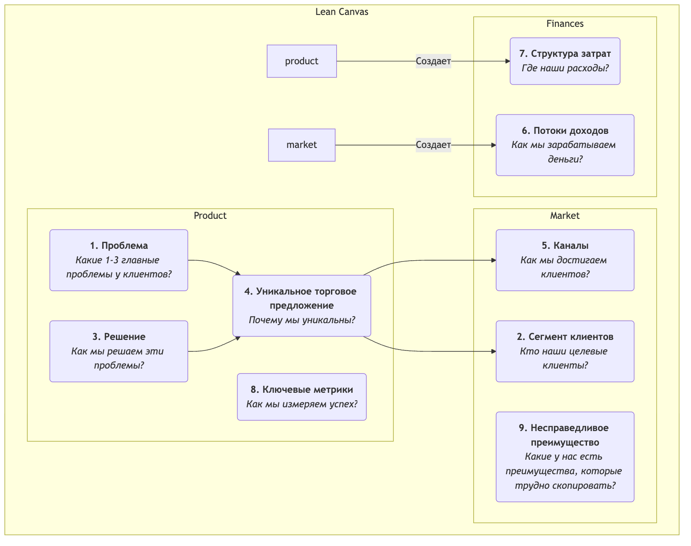

# Lean Canvas

На ранних стадиях стартапа наибольший риск зачастую заключается не в вопросе "можем ли мы создать продукт?", а в вопросе "кому-нибудь вообще будет нужен продукт, который мы создаем?". Традиционные бизнес-планы и шаблоны бизнес-моделей являются отличными инструментами для зрелых компаний, но для стартапов, действующих в условиях высокой неопределенности, они могут быть чрезмерно сложными и недостаточно сосредоточенными на наиболее критических рисках. **Lean Canvas** был создан для решения этой проблемы; это блестящая адаптация Шаблона бизнес-модели, адаптированная специально для **предпринимателей на ранних стадиях**.

Lean Canvas, предложенный Эшом Мауриа в его книге *Running Lean*, сохраняет простоту и интуитивность Шаблона бизнес-модели, но смещает фокус с "полного описания бизнес-модели" на **"систематическое выявление и проверку гипотез стартапа с наибольшими рисками"**. Он сосредоточен вокруг **Проблемы-Решения** и уделяет внимание ключевым метрикам и конкурентным преимуществам, более глубоко воплощая цикл Lean Startup "создание-измерение-обучение". Это карта боя, ориентированная на риски, которая помогает предпринимателям ориентироваться в тумане неопределенности.

## Девять блоков Lean Canvas

Lean Canvas сохраняет девять блоков Шаблона бизнес-модели, но заменяет четыре из них, чтобы сделать его более действенным и ориентированным на риски.

<!-- mermaid 源文件：Lean-Canvas-Tutorial-ru-mermaid-live-1.mmd -->

**Отличия от Шаблона бизнес-модели:**

*   **Проблема** заменяет "Ключевые партнеры": Это наиболее важное изменение. Оно заставляет предпринимателей сначала четко определить 1-3 главные проблемы, которые срочно нужно решить у их целевых клиентов.
*   **Решение** заменяет "Ключевые виды деятельности": После определения проблемы вы предлагаете свое решение (обычно основные функции продукта), специально предназначенное для нее.
*   **Ключевые метрики** заменяют "Ключевые ресурсы": Для стартапа наиболее важным является не то, какими ресурсами он обладает, а как измерять здоровье и рост бизнеса. Ключевые метрики — это метроном, задающий ритм всем действиям.
*   **Несправедливое преимущество** заменяет "Отношения с клиентами": Также известно как "несправедливое преимущество" или "река-рв", относится к ключевым компетенциям, которые конкуренты не могут легко скопировать или купить. Это критично для долгосрочного выживания бизнес-модели.

## Как использовать Lean Canvas

Процесс использования Lean Canvas представляет собой непрерывный цикл проверки и итераций.

1.  **Создайте свой "План А"**
    Перед тем, как говорить с любыми клиентами, быстро заполните Lean Canvas со всеми вашими начальными идеями и гипотезами по проекту стартапа. Обычно это занимает всего 15-20 минут. Это ваш "План А", набор всех ваших гипотез, подлежащих проверке.

2.  **Определите гипотезы с наибольшими рисками**
    Просмотрите первую версию canvas и определите части с наибольшими рисками и неопределенностью. Обычно для нового проекта гипотезы с наибольшими рисками в порядке приоритета:
    *   **Гипотеза Проблема-Клиент**: Существует ли действительно эта проблема? Действительно ли эти люди ваши целевые клиенты?
    *   **Гипотеза Проблема-Решение**: Может ли ваше решение действительно решить их проблему?
    *   **Гипотеза Ценность-Предложение**: Готовы ли клиенты платить за ваше решение?

3.  **Систематически проверьте гипотезы**
    Разработайте и проведите серию "минимально жизнеспособных экспериментов" (обычно **интервью о проблеме** и **интервью о решении**), чтобы систематически проверить свои гипотезы с наибольшими рисками. Например:
    *   **Проведите интервью о проблеме**: Выйдите и поговорите с вашими целевыми клиентами, но не говорите о своем продукте. Ваша единственная цель — глубоко понять их проблемы, существующее поведение и болевые точки, чтобы проверить блоки "Проблема" и "Сегмент клиентов" на canvas.
    *   **Проведите интервью о решении**: После проверки того, что проблема действительно существует, покажите свое решение (это может быть прототип, демо) клиентам, чтобы проверить ваше "Решение" и "Уникальное торговое предложение", и протестируйте их готовность платить ("Потоки доходов").

4.  **Итеративно обновляйте canvas**
    Непрерывно обновляйте и итерируйте свой Lean Canvas на основе знаний, полученных из интервью и экспериментов. Некоторые гипотезы подтверждаются, другие опровергаются. Canvas подобен экспериментальной тетради, в которой записан полный эволюционный путь вашего проекта стартапа от первоначальной идеи до нахождения "соответствия продукта рынку".

## Примеры применения

**Пример 1: Dropbox (сервис облачного хранения данных) ранний canvas**

*   **Проблема**: Синхронизация файлов на нескольких устройствах затруднена; отправка больших файлов через USB-накопители или электронную почту болезненна; забытые резервные копии приводят к потере данных.
*   **Сегмент клиентов**: Технически подкованные пользователи с несколькими компьютерами, фрилансеры.
*   **Уникальное торговое предложение**: "Поместите свои файлы в 'волшебный карман', доступный в любом месте, никогда не теряющийся."
*   **Решение**: Приложение для рабочего стола, бесперебойно работающее в фоновом режиме, автоматически синхронизирующее содержимое указанной папки.
*   **Ключевые метрики**: Количество регистраций пользователей, **процент успешных загрузок файлов**, количество активных пользователей.
*   **Несправедливое преимущество**: Эффект сети — чем больше людей его используют, тем легче делиться и сотрудничать.
*   **Проверка**: Основатель Дрю Хьюстон создал простое демонстрационное видео продукта и опубликовал его в сообществе технических энтузиастов. За ночь список ожидания вырос с 5000 до 75000 человек, что сильно подтвердило соответствие "проблема-решение".

**Пример 2: Планируемая служба доставки здорового питания**

*   **Проблема**: Офисным работникам трудно есть здоровую, сбалансированную пищу на обед; готовить самим слишком долго; доставка еды обычно жирная.
*   **Сегмент клиентов**: Молодые профессионалы, заботящиеся о здоровом образе жизни и занимающиеся фитнесом.
*   **Уникальное торговое предложение**: "Меню, разработанные диетологами, свежеприготовленные блюда для фитнеса, доставляемые вовремя в ваш офис."
*   **Решение**: Предлагать еженедельные планы обедов, с меню, обновляемыми еженедельно, и предоставлением информации о калорийности и питательной ценности.
*   **Ключевые метрики**: **Еженедельный уровень повторных покупок**, пожизненная ценность клиента.
*   **Несправедливое преимущество**: Эксклюзивные партнерства с поставщиками качественных ингредиентов, профессиональная команда диетологов.
*   **Проверка**: Основатель мог бы изначально избежать разработки приложения и вместо этого принимать заказы через группу WeChat или платформу опросов, вручную доставляя обеды первым 20 пользователям, чтобы проверить весь процесс и потребности пользователей.

**Пример 3: Ранний canvas Airbnb**

*   **Проблема**: Во время популярных конференций отели в городе дорогие и полностью забронированы.
*   **Сегмент клиентов**: Дизайнеры с ограниченным бюджетом, посещающие дизайнерские конференции.
*   **Решение**: Предоставить платформу для местных жителей (хостов), чтобы сдавать в аренду свои свободные надувные матрасы этим дизайнерам.
*   **Уникальное торговое предложение**: Получить жилье по более низкой цене и возможность взаимодействовать с местными жителями.
*   **Проверка**: Основатели сами поставили три надувных матраса в своем доме и успешно сдали их дизайнерам, посещающим конференцию, лично проверив жизнеспособность всей бизнес-модели.

## Ценность и ограничения Lean Canvas

**Основная ценность**

*   **Фокус на рисках**: Заставляет предпринимателей с самого начала сталкиваться с гипотезами с наибольшими рисками.
*   **Скорость и итерации**: Очень подходит для быстрого наброска, обсуждения и итераций бизнес-моделей, идеально подходя к ритму Lean Startup.
*   **Ориентация на проблему**: Обеспечивает, чтобы отправной точкой предприятия было решение реальной, значимой проблемы клиента.

**Потенциальные ограничения**

*   **Недостаточное внимание к внешней среде**: Как и Шаблон бизнес-модели, он не включает анализ конкуренции и макросреды.
*   **Не применим ко всем бизнесам**: Наиболее подходит для стартапов с высокой неопределенностью. Для зрелых компаний с проверенными бизнес-моделями Шаблон бизнес-модели может быть более всеобъемлющим инструментом.

## Расширения и связи

*   **Шаблон бизнес-модели**: Lean Canvas является важным вариантом и развитием Шаблона бизнес-модели в контексте Lean Startup.
*   **Развитие клиентов**: Методология, предложенная Стивом Бланком, подчеркивающая необходимость "выхода из офиса" для проверки гипотез, которая служит руководящим принципом для Lean Canvas на уровне действий.
*   **Шаблон ценного предложения**: Может служить углубляющим инструментом для блоков "Проблема", "Решение" и "Уникальное торговое предложение" в Lean Canvas, помогая предпринимателям более точно уточнить соответствие продукта рынку.

---
*Ссылка: Книга Эша Мауриа "Running Lean" является наиболее авторитетным источником по Lean Canvas, в ней подробно описано, как использовать и итерировать Lean Canvas шаг за шагом в сочетании с развитием клиентов. Этот метод глубоко повлиян книга Эрика Райса "Lean Startup" и модель развития клиентов Стива Бланка.*