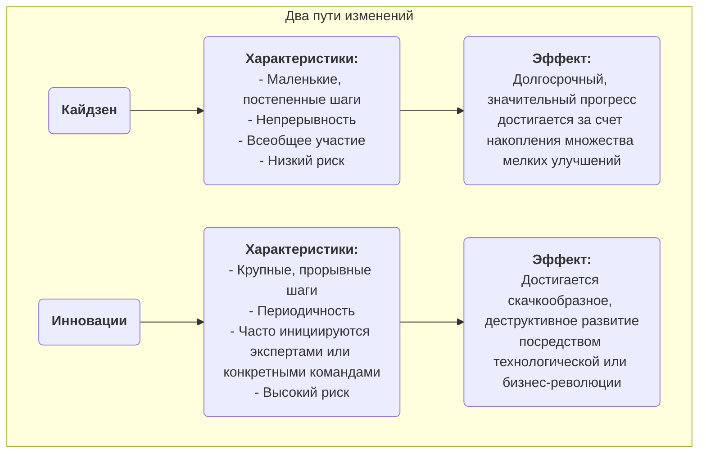

# Кайдзен

Во многих организациях "улучшение" часто воспринимается как масштабный "проект", требующий значительных инвестиций, проводимый экспертами и реализуемый сверху вниз. Однако существует философия управления, утверждающая, что настоящее, мощное и долгосрочное развитие происходит благодаря, на первый взгляд, незначительным **малым и непрерывным улучшениям**, которые каждый день реализуют все сотрудники. Это и есть суть **кайдзена**. Кайдзен — японское слово, означающее "изменение к лучшему", и оно представляет собой как культурную философию, стремящуюся к совершенству, так и практический метод, поощряющий всеобщее участие и непрерывное улучшение снизу вверх.

Основная идея кайдзена заключается в том, чтобы **не стремиться к революционным прорывам за одну ночь, а постоянно совершенствовать процессы постепенно**. Считается, что сотрудники на передовой лучше всех разбираются в реальной ситуации на своих рабочих местах и обладают неиссякаемой мудростью и креативностью. Создавая культуру, которая поощряет решение проблем, поощряет маленькие инновации и прощает неудачи, организация может использовать силу каждого сотрудника, формируя неудержимый восходящий импульс. Это не сложный управленческий инструмент, а простой, непритязательный, но чрезвычайно эффективный способ работы и мышления.

## Основные принципы кайдзена

*   **Непрерывность**: Кайдзен — это не одноразовая активность, а бесконечный, кумулятивный процесс.
*   **Все без исключения**: От генерального директора до уборщика, каждый сотрудник организации поощряется и ожидается к участию в деятельности по улучшению.
*   **Низкие затраты, высокая мудрость**: Кайдзен не зависит от крупных капиталовложений, он делает упор на использование мудрости и креативности сотрудников для решения проблем и устранения потерь при минимальных затратах.
*   **Фокус на процесс**: Кайдзен направлен на оптимизацию рабочих процессов, а не на обвинение отдельных людей.
*   **Визуальное управление**: Акцент делается на том, чтобы сделать проблемы, стандарты и процессы "визуальными", чтобы отклонения были очевидны с первого взгляда.
*   **"Идите на "Гемба" (реальное место)**: Руководители должны посещать реальное рабочее место (Гемба), чтобы наблюдать за реальной ситуацией и общаться с сотрудниками, а не воображать всё из кабинета.

### Кайдзен против инноваций

*   **Связь**: Кайдзен и инновации не исключают друг друга; скорее, они представляют собой две способности, которыми должна обладать любая выдающаяся организация. Кайдзен отвечает за постоянную оптимизацию и укрепление существующих систем, тогда как инновации отвечают за создание совершенно новых систем.

## Как внедрять кайдзен в организации

Ключ к внедрению кайдзена — создать культуру и механизмы, поощряющие непрерывное улучшение.

1.  **Создать систему предложений кайдзен**
    Организовать простой и удобный канал (например, ящик для предложений, онлайн-форму), чтобы любой сотрудник мог в любое время подать проблему или предложение по улучшению. Важно отвечать на каждое предложение, отслеживать его реализацию и своевременно и публично признавать отличные предложения (награды не обязательно должны быть материальными; публичная похвала, сертификат и т.д. часто оказываются более эффективными нематериальными стимулами).

2.  **Проведение "недель кайдзен" или "интенсивов кайдзен"**
    Регулярно организовывать межфункциональные команды, которые в течение определенного периода (обычно 3–5 дней) сосредоточятся на конкретном процессе или рабочей зоне, применяя инструменты бережливого производства и качества (например, карту потока ценности, 5S) для проведения быстрого, интенсивного улучшения и немедленной реализации решений.

3.  **Продвижение цикла PDCA как инструмента мышления**
    Сделать **цикл PDCA (Планирование-Выполнение-Проверка-Действие)** стандартной структурой мышления для всех сотрудников при решении проблем. Поощрять сотрудников следовать этому научному циклу:
    *   **П**ланирование: Определить проблему, проанализировать причину, разработать небольшой план улучшения.
    *   **В**ыполнение: Попытаться реализовать план.
    *   **П**роверка: Проверить, достигнуты ли ожидаемые результаты.
    *   **Д**ействие: Если успешно, стандартизировать как новый процесс; если нет — извлечь уроки и начать новый цикл PDCA.

4.  **Изменение роли руководителя**
    В культуре кайдзена роль руководителя меняется с "командира" и "надзирателя" на "**тренера**" и "**поддерживающего лица**". Основные задачи руководителя: вдохновлять и побуждать сотрудников выявлять проблемы, предоставлять ресурсы и поддержку для деятельности сотрудников по улучшению, помогать преодолевать препятствия.

## Примеры применения

**Пример 1: "Улучшение на один сантиметр" в Toyota**

*   **Ситуация**: На производственных линиях Toyota кайдзен является частью их генетического кода.
*   **Применение**: Рабочий производственной линии заметил, что каждый раз, когда он берет винт из ящика с деталями, ему приходится немного и неестественно поворачивать запястье. Он предложил наклонить ящик с деталями на 15 градусов. Это, казалось бы, незначительное улучшение экономило несколько секунд в день и снижало риск травмы запястья. Когда это "улучшение на один сантиметр" было внедрено на тысячи рабочих мест по всей компании, совокупная экономия времени и улучшение безопасности оказались впечатляющими.

**Пример 2: Станция медсестер в больнице**

*   **Проблема**: Медсестры жаловались, что тратят много времени ежедневно на поиски часто используемых медицинских принадлежностей (например, марли, лейкопластыря).
*   **Применение кайдзена**: Заведующая медсестра организовала небольшое мероприятие кайдзен. Участники команды применили **методологию 5S**, чтобы тщательно **отсортировать** (избавиться от ненужных предметов), **расположить в порядке** (разместить часто используемые предметы в легко доступных местах и четко их обозначить), **очистить**, **стандартизировать** и **поддерживать** шкафы на станции медсестер. Это заняло всего один вечер, но значительно сократило время поиска, позволив медсестрам сосредоточить больше внимания на уходе за пациентами.

**Пример 3: Применение в личной жизни**

*   **Проблема**: Человек постоянно забывал взять ключи, выходя из дома.
*   **Применение кайдзена**: Вместо того чтобы обвинять себя в "плохой памяти", он подумал, как можно **улучшить процесс**. Он решил накануне вечером класть все необходимые вещи на следующий день (ключи, кошелек, пропуск на работу) на обувной шкаф у двери. Это небольшое изменение привычки — типичный пример личного кайдзена, решающего проблему путем оптимизации процесса.

## Преимущества и вызовы кайдзена

**Основные преимущества**

*   **Низкие затраты, низкий риск**: Большинство улучшений исходят от мудрости сотрудников на передовой, требуют практически нулевых инвестиций, а стоимость проб и ошибок крайне мала.
*   **Повышает вовлеченность и чувство принадлежности у сотрудников**: Когда предложения сотрудников услышаны и приняты, они чувствуют уважение и превращаются из "пассивных исполнителей" в "активных мыслителей".
*   **Способствует командной работе**: Многие мероприятия кайдзена требуют межфункционального и междепартаментского сотрудничества, что помогает преодолеть внутренние барьеры между отделами.
*   **Формирует сильный культурный инерционный эффект**: Как только культура постоянного улучшения укоренилась, организация получает мощный внутренний импульс для самоэволюции и постоянного развития.

**Возможные вызовы**

*   **Медленное проявление результатов, незаметность**: По сравнению с радикальными "инновациями", эффект кайдзена постепенный и кумулятивный, и в краткосрочной перспективе он может быть незаметен, что требует от руководителей достаточного терпения и долгосрочного видения.
*   **Требует реального всеобщего участия**: Если кайдзен остается просто лозунгом или участвует лишь небольшая группа людей, мероприятия кайдзена не могут быть устойчивыми.
*   **Может привести к "локальному оптимуму"**: Слишком сильный фокус на мелких улучшениях текущих процессов иногда может привести к упущению более крупных возможностей для деструктивных, революционных инноваций.

## Расширения и связи

*   **Бережливые операции (Lean Operations)**: Кайдзен является одной из ключевых опор бережливого мышления и фундаментальным способом реализации принципа "стремления к совершенству".
*   **Обеспечение качества (TQM)**: Кайдзен — это самое прямое и яркое воплощение принципа "непрерывного улучшения" в TQM.
*   **Цикл PDCA**: Это наиболее часто используемый и фундаментальный научный подход к мышлению и действиям при внедрении кайдзена.

---
*Источник: Кайдзен, как философия управления, глубоко укоренился в японской культуре и управленческой практике, особенно популярен в Toyota Production System (TPS). В западном мире эту концепцию впервые систематически представил Масааки Имай в своей книге "Кайдзен: Ключ к конкурентоспособности Японии", оказавшей глубокое влияние.*