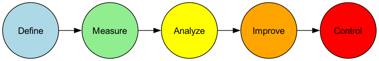

# Шесть сигм

Как бизнес может достичь почти идеального уровня качества и операционной эффективности, сведя к минимуму дефекты и вариации процессов? **Шесть сигм (6σ)** — это дисциплинированная, основанная на данных и ориентированная на клиента **методология улучшения качества и философия управления**, разработанная именно для этой цели. Ее основная цель — систематически выявлять и устранять коренные причины вариаций процессов, тем самым снижая уровень дефектов продуктов или услуг до исключительного уровня **всего 3,4 дефекта на миллион возможностей**.

"Сигма (σ)" — это статистическая мера разброса данных, представляющая стандартное отклонение. Более высокий сигма-уровень процесса означает, что он более стабилен и последователен, имеет меньшие отклонения от среднего значения и меньше дефектов. Название "Шесть сигм" само по себе представляет крайнюю степень стремления к идеалу качества. Это не просто набор статистических инструментов, а системный способ мышления, позволяющий решать сложные проблемы и достигать прорывных улучшений в производительности через структурированный проектный путь **DMAIC** (Определить-Измерить-Анализировать-Улучшить-Контролировать).

## Основные принципы Шести сигм

*   **Ориентация на клиента**: Начало и конец всех улучшений — это потребности клиента и его требования, критичные для качества (CTQ).
*   **Принятие решений на основе данных**: Все решения и выводы должны основываться на сборе объективных данных и строгом статистическом анализе, а не на интуиции или опыте.
*   **Улучшение процессов**: Считается, что любой дефект или проблема вызвана несовершенным процессом. Поэтому акцент улучшений делается на процессах, а не на обвинении отдельных людей.
*   **Снижение вариаций**: Шесть сигм утверждает, что колебания и нестабильность процессов — главный враг качества. Основная задача — понять и устранить коренные причины вариаций.
*   **Прорывные улучшения**: Цель — достижение значительных, измеримых финансовых результатов и повышения эффективности, а не просто небольшие постепенные улучшения.

## DMAIC: дорожная карта проекта Шести сигм

Проекты улучшения по Шести сигмам строго следуют пятиэтапной дорожной карте, называемой **DMAIC**. Каждый этап имеет четко определенные цели и ключевые инструменты, которые необходимо использовать.

## Как реализовать проект Шести сигм

1.  **Фаза определения (Define)**: Четко сформулируйте бизнес-проблему, которую вы хотите решить, и ее влияние на компанию, определите рамки проекта, цели и сроки, а также всех заинтересованных сторон.

2.  **Фаза измерения (Measure)**: Оцените степень проблемы с помощью данных. Вам нужно определить, какие ключевые метрики измерять, разработать план сбора данных и убедиться, что ваша система измерений точна и надежна. Результатом этой фазы являются достоверные исходные данные о текущей производительности процесса.

3.  **Фаза анализа (Analyze)**: Это ядро методологии DMAIC. Вам нужно использовать различные статистические инструменты анализа (например, диаграммы Парето, диаграммы Исикавы, проверку гипотез, регрессионный анализ и т.д.), чтобы тщательно извлечь из собранных данных **коренные причины** проблемы, подтвержденные данными.

4.  **Фаза улучшения (Improve)**: После выявления коренных причин необходимо провести мозговой штурм целевых решений и разработать и протестировать возможные решения. **Метод планирования экспериментов (Design of Experiments, DOE)** — мощный инструмент, часто используемый на этом этапе, который помогает найти оптимальную комбинацию параметров для оптимизации процесса.

5.  **Фаза контроля (Control)**: После реализации решения и достижения ожидаемых улучшений наиболее важным является сохранение результатов. Вам нужно создать систему контроля процесса (например, **контрольные карты статистического управления процессами, SPC Chart**), разработать новые стандартные рабочие процедуры и обучить соответствующий персонал, чтобы предотвратить повторение проблемы.

## Система ролей Шести сигм (пояса)

Успешная реализация Шести сигм зависит от четкой системы ролей и обязанностей, аналогичной рангам в боевых искусствах, обозначаемым разными цветами "поясов".

*   **Чемпионы (Champions)**: Обычно это старшие менеджеры, ответственные за выявление и одобрение проектов Шести сигм, а также за предоставление ресурсов и поддержки для проектов.
*   **Мастера черных поясов (Master Black Belts)**: Внутренние эксперты и коучи Шести сигм, ответственные за обучение и наставничество черных и зеленых поясов, а также за продвижение культуры Шести сигм в организации.
*   **Черные пояса (Black Belts)**: Обычно это специалисты, работающие на проектах Шести сигм на постоянной основе, ответственные за руководство сложными, межфункциональными проектами улучшения.
*   **Зеленые пояса (Green Belts)**: Участвуют в проектах улучшения или возглавляют небольшие проекты, выполняя свои обычные обязанности. Они являются основной движущей силой популяризации и применения Шести сигм в организации.

## Примеры применения

**Пример 1: General Electric (GE)**

*   **Ситуация**: Под руководством Джека Уэлча GE стала одной из первых и самых успешных компаний в мире, которая подняла Шесть сигм с уровня инструмента качества до уровня ключевой бизнес-стратегии.
*   **Применение**: GE применяла Шесть сигм во всех областях бизнеса — от производства авиационных двигателей до финансовых услуг. Например, в одном случае ее подразделение здравоохранения, реализовав проект DMAIC, проанализировало процесс проверки компьютерных томографов и успешно сократило среднее время проверки на пациента на 30%, значительно повысив эффективность использования оборудования и удовлетворенность пациентов. Сообщается, что Шесть сигм принесла GE миллиарды долларов экономии в первые годы.

**Пример 2: Оптимизация процесса подачи заявки на кредитную карту в банке**

*   **Проблема**: Среднее время от подачи клиентом заявки на кредитную карту до получения карты было слишком большим, что приводило к низкой удовлетворенности клиентов.
*   **Применение DMAIC**:
    *   **D**: Цель проекта была определена как "сокращение цикла подачи заявки с 15 до 7 дней в течение 6 месяцев".
    *   **M**: Измерялось время, затраченное на каждый этап (например, "ввод данных", "кредитный анализ", "производство карты", "отправка") для сотен заявок за последние три месяца.
    *   **A**: Анализ данных показал, что этап "кредитный анализ" занимал больше всего времени и имел наибольшую вариацию, являясь основным узким местом процесса.
    *   **I**: Команда переработала процесс кредитного анализа, внедрила автоматизированную систему предварительного анализа и дала больше полномочий сотрудникам, проводящим анализ.
    *   **C**: Была создана новая система мониторинга процесса и обновлены руководства по эксплуатации. В конечном итоге средний цикл был успешно сокращен до 6,5 дней.

**Пример 3: Снижение процента брака на производственном предприятии**

*   **Проблема**: Процент брака деталей на определенной производственной линии, где размеры деталей превышали стандарты, составлял до 5%.
*   **Применение DMAIC**: Команда проекта с помощью диаграммы Исикавы и проверки гипотез проанализировала все возможные причины (человек, машина, материал, метод, окружающая среда), которые могли привести к отклонениям размеров. В конечном итоге, с помощью метода планирования экспериментов (DOE) было установлено, что взаимодействие между параметрами "температура охлаждения" и "скорость резания" машины было наиболее критической коренной причиной вариаций размеров. Настройка новых, оптимизированных комбинаций параметров позволила команде успешно снизить уровень брака до менее чем 0,1%.

## Преимущества и вызовы Шести сигм

**Основные преимущества**

*   **Ориентация на результаты, значительная финансовая выгода**: Каждый проект связан с четкими, измеримыми финансовыми целями.
*   **Дисциплинированность, четкая логика**: Фреймворк DMAIC предоставляет очень структурированную, воспроизводимую дорожную карту для решения сложных проблем.
*   **Опора на данные, высокая объективность**: Акцент на данные снижает субъективность и произвол в принятии решений.
*   **Развитие навыков решения проблем**: Формируется группа специалистов (черные пояса, зеленые пояса) внутри организации, которые понимают бизнес, умеют работать с данными и использовать научные инструменты для решения проблем.

**Возможные вызовы**

*   **Может подавлять инновации**: Слишком сильный акцент на контроле и оптимизации существующих процессов иногда может противоречить радикальным инновациям, требующим исследования и проб и ошибок.
*   **Риск бюрократизации**: Если внедрять неправильно, это может превратиться в бюрократический процесс, наполненный сложными статистическими инструментами и отчетами, "выполняя проекты" ради самих проектов.
*   **Требует значительных инвестиций**: Успешное внедрение Шести сигм требует значительных первоначальных инвестиций со стороны компании в обучение, ресурсы проектов и персонал.

## Расширения и связи

*   **Lean-производство (Lean Manufacturing)**: Ядро Шести сигм — **снижение вариаций и улучшение качества**; ядро Lean — **устранение потерь и повышение скорости**. У них разные акценты, но они хорошо дополняют друг друга. На практике их часто комбинируют, создавая более мощный **Lean Six Sigma**, направленный на одновременное достижение высокого качества, высокой эффективности и низкой стоимости.
*   **Общее управление качеством (Total Quality Management, TQM)**: TQM предоставляет макроуровневую управленческую философию, ориентированную на клиента и вовлекающую всех сотрудников, тогда как Шесть сигм предоставляет более конкретные, проектные и основанные на данных микрооперационные методы достижения целей TQM.

---
*Источник: Шесть сигм была впервые предложена инженером Motorola Биллом Смитом в 1980-х годах и стала широко известной благодаря успешному внедрению в компаниях, таких как General Electric (GE) и AlliedSignal. Классическим трудом в этой области является книга Майкла Харри и Ричарда Шрёдера "Шесть сигм: прорывная стратегия управления, революционизирующая управление в ведущих корпорациях мира".*