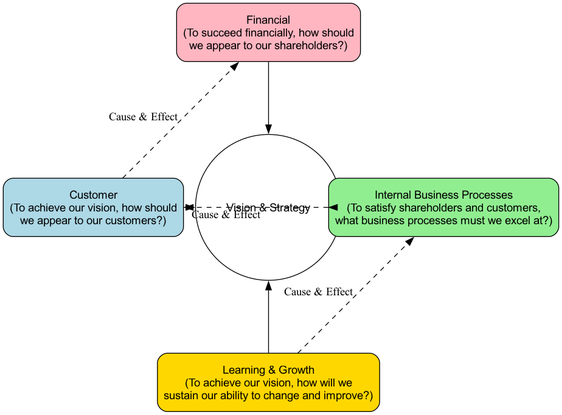

# Сбалансированная система показателей (ССП)

В традиционном управлении бизнесом финансовыми показателями (такими как выручка, прибыль, рентабельность инвестиций) часто ограничивалась мера успеха. Однако эти показатели по сути являются «запаздывающими»; они отражают результаты прошлой деятельности, но не могут эффективно направлять будущие действия. Для решения этой проблемы появилась **сбалансированная система показателей (ССП)**. Это не просто инструмент измерения эффективности, а мощная и комплексная система стратегического управления, основная идея которой заключается в переводе видения и стратегии организации в согласованную и измеримую систему показателей, охватывающих четыре ключевые измерения.

Основная идея ССП — «баланс». Она достигает тонкого равновесия между финансовыми и нефинансовыми показателями, между запаздывающими и опережающими индикаторами, между внутренними и внешними аспектами, а также между краткосрочными и долгосрочными целями. Таким образом, она предоставляет менеджерам комплексный обзор, подобно панели приборов в кабине самолета, позволяя не только видеть текущую высоту и скорость, но и понимать состояние двигателей и направление в будущее, обеспечивая движение всей организации в направлении стратегических целей.

## Четыре перспективы Сбалансированной системы показателей

ССП систематически преобразует абстрактные стратегии в конкретные действия и измеримые стандарты через четыре взаимосвязанные и причинно связанные перспективы.

1.  **Финансовая перспектива**
    *   **Ключевой вопрос**: "Чтобы добиться финансового успеха, как мы должны выглядеть в глазах акционеров?"
    *   Это конечный результат стратегии. Он измеряет рентабельность, рост и ценность для акционеров. Обычные показатели включают: **темп роста выручки, чистую прибыль, рентабельность инвестиций (ROI), экономическую добавленную стоимость (EVA)** и т. д.

2.  **Перспектива клиентов**
    *   **Ключевой вопрос**: "Чтобы достичь финансовых целей, как мы должны выглядеть в глазах клиентов?"
    *   Она фокусируется на деятельности компании в целевых сегментах клиентов. Компании необходимо определить свои целевые рынки и предложить уникальные ценовые предложения. Обычные показатели включают: **долю рынка, уровень удовлетворенности клиентов, уровень удержания клиентов, стоимость привлечения клиентов, лояльность к бренду** и т. д.

3.  **Перспектива внутренних бизнес-процессов**
    *   **Ключевой вопрос**: "Чтобы удовлетворить клиентов и акционеров, какие бизнес-процессы мы должны выполнять на высшем уровне?"
    *   Она фокусируется на внутренних операционных процессах, которые оказывают наибольшее влияние на реализацию ценовых предложений для клиентов и достижение финансовых целей. Обычно включает **процессы инноваций** (например, цикл разработки нового продукта), **операционные процессы** (например, эффективность производства, контроль качества) и **процессы послепродажного обслуживания** (например, время решения проблем клиентов).

4.  **Перспектива обучения и развития**
    *   **Ключевой вопрос**: "Чтобы достичь нашей миссии, как мы сохраним способность к изменениям и улучшению?"
    *   Это основа успеха всех других перспектив. Она фокусируется на нематериальных активах организации, а именно на человеческом капитале, информационном капитале и организационном капитале, необходимых для будущего развития. Обычные показатели включают: **удовлетворенность и вовлеченность сотрудников, уровень удержания ключевых специалистов, покрытие навыков сотрудников, возможности информационных систем, формирование организационной культуры** и т. д.

## Как построить и внедрить Сбалансированную систему показателей

1.  **Шаг 1: Достижение консенсуса и уточнение стратегии**
    Исходной точкой ССП должна быть четкая, явно выраженная стратегия организации, которая получила согласие руководства. Например: "Стать лидером в обеспечении клиентского опыта в отрасли."

2.  **Шаг 2: Построение карты стратегии**
    Перед тем как формально определять показатели, рекомендуется сначала нарисовать **карту стратегии**. Это визуальная диаграмма, которая наглядно описывает, как стратегические цели формируют причинно-следственные связи между четырьмя перспективами. Она ясно рассказывает «историю создания ценности» для организации.

3.  **Шаг 3: Определение стратегических целей, показателей, целевых значений и инициатив для каждой перспективы**
    Это систематический процесс декомпозиции:
    *   **Стратегические цели**: Разбить абстрактные стратегии на конкретные цели, которые необходимо достичь в рамках каждой перспективы. Например, в перспективе клиентов цель — "повысить лояльность клиентов".
    *   **Показатели/KPI**: Найти один или несколько количественных показателей для каждой цели. Например, показатель для "повышения лояльности клиентов" — "доля повторных покупок".
    *   **Целевые значения**: Установить конкретные, сложные и ограниченные по времени целевые значения для каждого показателя. Например: "Увеличить долю повторных покупок с 60% до 70% к концу года".
    *   **Инициативы**: Запланировать ключевые проекты или действия, необходимые для достижения этих целевых значений. Например: "Запустить новую программу лояльности для VIP-клиентов".

## Примеры применения

**Пример 1: Авиакомпания Southwest Airlines**

*   **Ситуация**: Southwest Airlines известна своей моделью низких затрат и высокой эффективности.
*   **Применение ССП**:
    *   **Финансовая**: Высокая рентабельность, низкие операционные расходы.
    *   **Клиенты**: Высокая пунктуальность, дружелюбное обслуживание, низкие тарифы.
    *   **Внутренние процессы**: Быстрая смена рейсов, эффективная обработка багажа, стандартизированный парк самолетов (только Boeing 737).
    *   **Обучение и развитие**: Обучение сотрудников, высокая удовлетворенность персонала, сильная корпоративная культура.
    Успех Southwest Airlines является классическим примером того, как четыре перспективы ССП взаимосвязаны и взаимно усиливают друг друга.

**Пример 2: Больница**

*   **Ситуация**: Больница стремится улучшить качество медицинского обслуживания и операционную эффективность.
*   **Применение ССП**:
    *   **Финансовая**: Увеличение доходов, контроль расходов.
    *   **Клиенты (пациенты)**: Повышение удовлетворенности пациентов, снижение уровня повторных госпитализаций.
    *   **Внутренние процессы**: Сокращение времени ожидания пациентов, снижение количества медицинских ошибок, оптимизация хирургических процедур.
    *   **Обучение и развитие**: Повышение квалификации медицинского персонала, поддержка непрерывного обучения, улучшение информационных систем.
    Внедрив ССП, больница может систематически отслеживать прогресс по различным направлениям и обеспечивать, чтобы улучшения в одной области не происходили за счет других.

**Пример 3: Компания по разработке программного обеспечения**

*   **Ситуация**: Компания хочет ускорить разработку продуктов и повысить удовлетворенность клиентов.
*   **Применение ССП**:
    *   **Финансовая**: Увеличение доходов от подписки, улучшение маржинальности.
    *   **Клиенты**: Увеличение удержания клиентов, повышение оценок продукта.
    *   **Внутренние процессы**: Сокращение циклов разработки, снижение количества ошибок, улучшение качества кода.
    *   **Обучение и развитие**: Развитие навыков разработчиков, формирование культуры инноваций, улучшение инструментов разработки.
    ССП помогает компании согласовать усилия по разработке с стратегическими целями, обеспечивая, чтобы технические улучшения приводили к бизнес-успеху.

## Преимущества и вызовы Сбалансированной системы показателей

**Основные преимущества**

*   **Комплексный взгляд**: Предоставляет всесторонний обзор эффективности организации, избегая чрезмерной зависимости от одних только финансовых показателей.
*   **Стратегическое согласование**: Четко связывает повседневные операции с долгосрочными стратегическими целями, обеспечивая согласованность действий всех сотрудников.
*   **Улучшение коммуникации**: Карта стратегии и четкие показатели облегчают коммуникацию и понимание стратегии по всей организации.
*   **Поддержка обучения и развития**: Подчеркивает важность нематериальных активов и постоянного совершенствования для будущего успеха.

**Возможные вызовы**

*   **Сложность внедрения**: Требует значительных времени и усилий для проектирования, внедрения и поддержания, особенно в крупных организациях.
*   **Сложность определения показателей**: Может быть трудно найти подходящие и измеримые показатели для всех стратегических целей, особенно для нематериальных активов.
*   **Риск превращения в "инструмент отчетности"**: Если ССП не интегрирована должным образом в стратегическое управление, она может превратиться в простую систему отчетности, не стимулирующую реальные изменения.
*   **Необходимость поддержки высшего руководства**: Долгосрочный успех зависит от постоянной поддержки и приверженности высшего руководства.

## Расширения и связи

*   **Карта стратегии**: Неотъемлемая часть ССП, визуально отображающая причинно-следственные связи между целями по четырем перспективам.
*   **Ключевые показатели эффективности (KPI)**: ССП предоставляет структуру для выбора и организации KPI, согласованных со стратегическими целями.
*   **Управление по целям (MBO)**: В то время как MBO сосредоточено на постановке индивидуальных целей, ССП обеспечивает более широкий стратегический контекст для этих целей, гарантируя, что они способствуют общему успеху организации.

---
*Источник: Сбалансированная система показателей была разработана Робертом С. Капланом и Дэвидом П. Нортоном. Впервые она была представлена в их статье 1992 года "Сбалансированная система показателей: показатели, которые определяют эффективность", опубликованной в Harvard Business Review, и подробно изложена в их последующих книгах, включая "Сбалансированная система показателей: перевод стратегии в действие".*