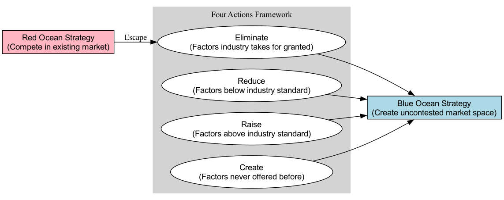

# Стратегия голубого океана

В бизнесе подавляющее большинство компаний борются в "**красном океане**". Красный океан представляет собой всё известное рыночное пространство, где границы отрасли четко определены, правила игры установлены, а компании пытаются захватить большую долю ограниченного рынка, побеждая конкурентов. По мере увеличения числа конкурентов рынок становится чрезвычайно перенасыщенным, а пространство для прибыли и роста сокращается, и океан "закрашивается" в красный цвет из-за жесткой конкуренции. **Стратегия голубого океана** предлагает совершенно иной путь; она не призывает вступать в жестокую лобовую конкуренцию с соперниками в красном океане, а направлена на **создание нового, неосвоенного "голубого океана" — рыночного пространства, где конкуренция становится неактуальной**.

Суть стратегии голубого океана заключается не в технологических инновациях, а в стратегической логике, которая называется **ценовая инновация**. Ценовая инновация — это точка пересечения, где компании достигают эффекта "и пирожное съесть, и его не потерять", одновременно преследуя, казалось бы, противоречивые цели — **дифференциацию** и **низкие затраты**. Речь идет не о компромиссе между существующими ценностью и затратами, а о преодолении этого компромисса, чтобы создать скачок ценности как для клиентов, так и для самой компании. Перестраивая элементы отрасли, стратегия голубого океана направлена на предоставление клиентам новой, уникальной ценности, открывая тем самым неизведанное пространство рынка.

## Основные аналитические инструменты стратегии голубого океана

Стратегия голубого океана предоставляет набор систематических аналитических инструментов, которые помогают компаниям систематически думать о том, как вырваться из красного океана и создать голубой океан.

1.  **Стратегическое полотно (Strategy Canvas)**
    Это мощная диагностическая и действенная структура. Оно визуализирует с помощью одного графика, на какие конкурентные факторы инвестируют все участники известного рыночного пространства и что получают от этого клиенты. Горизонтальная ось перечисляет ключевые факторы конкуренции и инвестиций в отрасли, а вертикальная ось отражает уровень ценности, которую компании предоставляют клиентам по каждому из факторов. Начертив "кривые ценности" конкурентов и собственную, компании могут ясно увидеть конкурентный ландшафт отрасли и собственный стратегический профиль.

2.  **Четыре действия (Four Actions Framework)**
    Это основной инструмент мышления, позволяющий преодолеть "компромисс между дифференциацией и стоимостью" и перестроить кривую ценности. Он ставит под сомнение давно укоренившуюся стратегическую логику и бизнес-модель отрасли, задавая четыре ключевых вопроса:

    

    *   "Устранить" и "Снизить" помогают компаниям сократить структуру затрат.
    *   "Повысить" и "Создать" направлены на повышение ценности для клиентов и создание нового спроса.

## Как создать голубой океан

1.  **Изучите текущий конкурентный ландшафт**
    Нарисуйте стратегическое полотно вашей отрасли. Четко перечислите основные конкурентные элементы текущей отрасли и объективно оцените уровень инвестиций в них ключевых конкурентов и ваш собственный, сформировав их соответствующие кривые ценности.

2.  **Используйте структуру "Четыре действия" для оспаривания статус-кво**
    Систематически применяйте структуру "Устранить-Снизить-Повысить-Создать" для деконструкции и перестройки существующих конкурентных элементов и ценности для клиентов. На этом этапе ключевое значение имеет смелость оспаривать "принятые как должное" правила и допущения отрасли.

3.  **Создайте новую кривую ценности**
    На основе выводов, полученных с помощью структуры "Четыре действия", постройте новую, уникальную кривую ценности. Эффективная кривая ценности стратегии голубого океана обычно обладает тремя характерными чертами:
    *   **Фокус**: Стратегия четко сосредоточена на нескольких ключевых элементах.
    *   **Различимость**: Форма кривой ценности явно отличается от кривых конкурентов в отрасли.
    *   **Запоминающийся слоган**: Способность донести уникальное предложение ценности до рынка простым и сильным языком.

4.  **Коммерциализируйте идею голубого океана**
    Убедитесь, что ваша идея голубого океана может быть превращена в жизнеспособную и прибыльную бизнес-модель. Это включает рассмотрение вопросов ценообразования, структуры затрат и партнеров, чтобы обеспечить устойчивость стратегии.

## Классические примеры применения

**Пример 1: Cirque du Soleil**

*   **Контекст**: Традиционная индустрия цирка (красный океан) сталкивалась с множеством проблем, таких как старение аудитории, рост движения за права животных и диверсификация развлекательных предложений, что привело к упадку отрасли.
*   **Стратегия голубого океана**: Cirque du Soleil не конкурировал в рамках традиционного цирка, а создал новое рыночное пространство через ценовую инновацию.
    *   **Устранить**: Высокозатратные элементы, такие как выступления с животными, звездные артисты и трехаренное цирковое шоу.
    *   **Снизить**: Продажи в киосках и некоторые низкопробные шутки.
    *   **Повысить**: Уникальность единой темы, комфорт и художественность оформления площадки.
    *   **Создать**: Новую повествовательную форму выступления, объединяющую театр, танец, музыку и цирковое искусство.
*   **Результат**: Cirque du Soleil создал новое рыночное пространство, привлекая взрослую аудиторию, которая обычно посещает оперу или балет, а его цены на билеты были намного выше, чем у традиционных цирков, что позволило достичь и дифференциации, и низких затрат.

**Пример 2: Консоль Nintendo Wii**

*   **Контекст**: На рынке консолей начала XXI века Sony (PlayStation) и Microsoft (Xbox) вели напряженную "гонку вооружений" за мощность графической обработки, скорость вычислений и сложность игр.
*   **Стратегия голубого океана**: Nintendo не присоединился к этой конкуренции в красном океане, а нашел другой путь.
    *   **Устранить/Снизить**: Стремление к топовым HD-графикам и скорости вычислений, сложным конструкциям контроллеров.
    *   **Повысить/Создать**: Создал новый, интуитивно понятный способ игры, основанный на сенсорах движения и захвате движений, а также простые, легкие в освоении контроллеры. Акцент был сделан на социальное удовольствие семейного развлечения и движения всего тела.
*   **Результат**: Wii привлек огромное количество пользователей, ранее не игравших в игры, включая детей, женщин и пожилых людей, став одним из самых успешных продаж в истории консолей.

**Пример 3: Вино Yellow Tail**

*   **Контекст**: Американский рынок вина делился на два лагеря: с одной стороны, дешевые, но низкокачественные столовые вина, с другой — дорогие, сложные вина, чья сложная терминология и правила дегустации пугали обычных потребителей.
*   **Стратегия голубого океана**: Yellow Tail стремился создать веселое, простое вино, которое обычные люди могли бы легко наслаждаться.
    *   **Устранить/Снизить**: Сложную терминологию виноделия, потенциал выдержки, ароматы дубовых бочек и другие пугающие традиционные элементы маркетинга вина.
    *   **Повысить/Создать**: Создал легкое, фруктовое вкусовое ощущение, легко узнаваемую упаковку (логотип с кенгуру) и удобство покупки в обычных супермаркетах.
*   **Результат**: Yellow Tail быстро стал самым популярным импортным брендом вина в США, привлекая потребителей, которые обычно пили пиво или коктейли, и успешно превратил "непьющих вино" в своих клиентов.

## Ценность и вызовы стратегии голубого океана

**Основная ценность**

*   **Выход из игры с нулевой суммой**: Создавая новый спрос, компании могут расти быстро, без прямой конкуренции в течение определенного времени.
*   **Переопределение границ отрасли**: Успешная стратегия голубого океана может изменить правила конкуренции в отрасли или даже создать новую отрасль.
*   **Создание сильных брендов**: Как первопроходцы новых рынков, компании легко создают сильное распознавание бренда и лояльность клиентов.

**Возможные вызовы**

*   **Высокая сложность реализации**: Требует глубокого понимания, необычайной креативности и смелости для оспаривания традиций отрасли.
*   **Организационное сопротивление**: Реализация стратегии голубого океана часто требует значительных изменений в существующих операциях, культуре и мышлении компании, что может вызвать внутреннее сопротивление.
*   **Голубой океан может стать красным**: Любой успешный голубой океан в конечном итоге привлечет подражателей и последователей, и голубой океан постепенно станет красным. Поэтому компании необходимо обладать способностью к постоянной ценовой инновации.

## Расширения и связи

*   **Бизнес-модель Canvas**: Отличный инструмент для проектирования и планирования превращения идеи стратегии голубого океана в жизнеспособную и прибыльную бизнес-модель.
*   **Canvas ценности**: Помогает глубоко подумать о том, как ваш новый продукт или услуга создают ценность для клиентов, решают их проблемы и приносят выгоды.
*   **Деструктивная инновация**: Связана, но отличается от стратегии голубого океана. Деструктивная инновация обычно подразумевает выход на рынок с нижнего уровня или новой точки опоры, предлагая более простые и дешевые решения, и в конечном итоге разрушая существующих лидеров рынка. Стратегия голубого океана не ограничивается этим; она может происходить на любом уровне рынка.

---
*Источник: Основополагающая работа В. Чана Кима и Рене Моборгне "Стратегия голубого океана: Как создать незанятое рыночное пространство и сделать конкуренцию неактуальной" является фундаментом этой теории, содержащей множество кейсов и подробных аналитических моделей.*