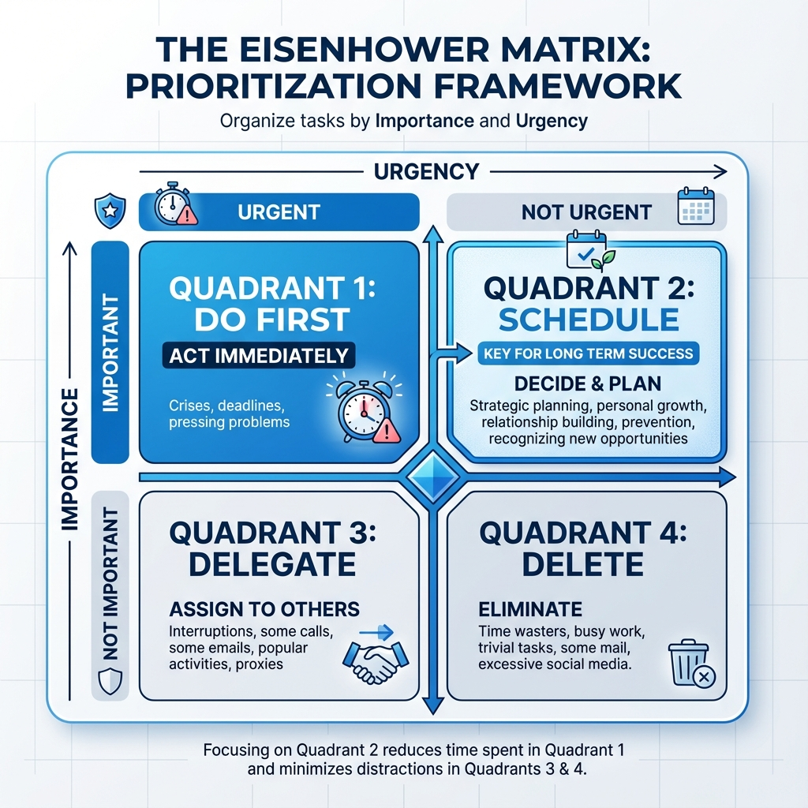

# Eisenhower-matrisen

I vardagen och arbetet känner vi ofta att vi drabbas av en oändlig mängd att-göra-listor, känner oss väldigt upptagna men uppnår ändå inget. Roten till detta tillstånd av "att vara upptagen men oproduktiv" ligger ofta i vår förvirring mellan **"brådskande"** och **"viktiga"** frågor, och att vi automatiskt prioriterar de ständigt "skrikande" brådskande uppgifterna, samtidigt som vi försummmer de som verkligen är viktiga för långsiktiga mål. **Eisenhower-matrisen**, även känd som **Brådskande/Viktiga-matrisen**, är ett extremt enkelt men djupgående **verktyg för personlig prioritering**, som är utformat för att lösa denna vanliga dilemma.

Metoden tillskrivs Dwight D. Eisenhower, den 34:e presidenten i USA, som en gång sade: "**Jag har två slags problem: de brådskande och de viktiga. De brådskande är inte viktiga, och de viktiga är aldrig brådskande.**" Kärnan i Eisenhower-matrisen är att tydligt dela upp alla uppgifter i fyra kvadranter baserat på två dimensioner: "**viktighet**" och "**brådskande**", vilket hjälper oss att identifiera vad som verkligen förtjänar vår tid och ansträngning, och formulera olika hanteringsstrategier för olika uppgifter. Det är ett kraftfullt tänkande ramverk som gör att vi kan gå från "reaktiv släckning av bränder" till "proaktiv planering".

## Matrisens fyra kvadranter

Eisenhower-matrisen delar upp alla uppgifter i fyra logiskt tydliga kvadranter och erbjuder tydliga handlingsriktlinjer för varje.

1.  **Kvadrant I: Viktigt & Brådskande (Krisernas kvadrant)**
    *   **Innehåll**: Dessa är "kriser" och "pressande frågor" som måste hanteras omedelbart. De är både avgörande för dina mål och har snar deadline.
    *   **Strategi**: **Gör först (Gör omedelbart)**. Du måste fokusera din energi och prioritera att lösa dessa uppgifter.
    *   **Mål**: En effektiv person bör **minimera antalet uppgifter i kvadrant I** genom insatser i kvadrant II.

2.  **Kvadrant II: Viktigt men inte brådskande (Kvalitetens och ledarskapets kvadrant)**
    *   **Innehåll**: Detta är den **mest värdefulla** kvadranten. Dessa frågor har en djupgående påverkan på dina långsiktiga mål, personlig utveckling och livskvalitet, men de har vanligtvis ingen brådskande deadline. Exempel inkluderar lärande, planering, byggande av relationer, träning, förbättring av processer, etc.
    *   **Strategi**: **Planera (Schemalägg att göra)**. Du måste aktivt och medvetet sätta av särskild tid i din kalender för att hantera dessa frågor.
    *   **Mål**: Framgångsrika personer **investera mest av sin tid (60%-80%) i denna kvadrant**, eftersom det är här de verkliga långsiktiga avkastningarna skapas.

3.  **Kvadrant III: Brådskande men inte viktigt (Bedrägeriets kvadrant)**
    *   **Innehåll**: Detta är den mest bedragande kvadranten. Dessa frågor påstår ofta att de är "brådskande" för att fånga din uppmärksamhet (t.ex. ett plötsligt telefonsamtal, de flesta möten, begäranden från andra), men de bidrar lite till dina egna kärnamål.
    *   **Strategi**: **Delegera (Låt någon annan göra)**. Fundera över om dessa uppgifter kan artigt avböjas? Kan de delegeras till andra? Kan de lösas mer effektivt (t.ex. med ett mejl istället för ett möte)?
    *   **Mål**: Att lära sig säga "nej" till uppgifter i denna kvadrant är nyckeln till att förbättra personlig effektivitet.

4.  **Kvadrant IV: Inte viktigt & Inte brådskande (Slöseriets kvadrant)**
    *   **Innehåll**: Dessa är rent tidsförbrukande aktiviteter som inte bidrar till något av dina mål.
    *   **Strategi**: **Ta bort/Eliminera (Undvik att göra)**. Du måste medvetet identifiera och minska tiden du spenderar på dessa saker.
    *   **Mål**: Alla behöver lämplig vila och avkoppling, men var noga med att inte omedvetet spendera mycket tid i denna kvadrant.

## Hur man använder Eisenhower-matrisen

1.  **Steg ett: Töm tankarna, lista alla uppgifter**
    Skriv ner allt du behöver göra, stora eller små, på en enda lista.

2.  **Steg två: Utvärdera varje uppgifts viktighet och brådskande**
    *   **Utvärdera viktighet**: Ställ dig frågan, "Kommer detta att ta mig närmare mina långsiktiga mål (årsplaner, livsmål)?"
    *   **Utvärdera brådskande**: Ställ dig frågan, "Har detta en tydlig, snar deadline? Kräver det mitt omedelbara svar?"

3.  **Steg tre: Placera uppgifterna i de fyra kvadranterna**
    Baserat på din utvärdering, placera varje uppgift från din lista i den motsvarande kvadranten i matrisen.

4.  **Steg fyra: Planera dina handlingar baserat på kvadrantstrategin**
    *   Börja med att hantera kriserna i kvadrant I.
    *   **Satsa sedan aktivt din huvudsakliga tid och energi på kvadrant II-uppgifter**.
    *   Hitta sätt att minska, delegera eller avvisa uppgifter i kvadrant III.
    *   Undvik medvetet att hamna i kvadrant IV.

5.  **Steg fem: Regelbundna granskningar och justeringar**
    Granska och justera din uppgiftsmatris veckovis eller dagligen. En effektiv tidsplanerare bör ha en relativt tom kvadrant I eftersom de har förebyggit de flesta kriserna genom att flitigt arbeta i kvadrant II.

## Användningsfall

**Fall 1: En projektledares dag**

*   **Kvadrant I**: Hantera ett onlinefel som blockerar projektet; rapportera viktiga projektframsteg till VD:n före deadline.
*   **Kvadrant II**: Planera kärnafunktioner för nästa iteration; hålla enskilda möten med nyckelpersoner i teamet för att förstå deras utveckling och utmaningar; lära sig ett nytt projektledningsverktyg.
*   **Kvadrant III**: Svara på vissa mejl med låg information som han är kopierad på; delta i ett avdelningsmöte som inte är direkt relaterat till hans projekt.
*   **Kvadrant IV**: Slumpvis surfa på nyhetswebbplatser inom branschen.
*   **Åtgärd**: Han kommer först att fokusera på att åtgärda felet, och sedan aktivt sätta av 2 timmars "stör ej"-tid på eftermiddagen för att fokusera på planeringsarbete i kvadrant II.

**Fall 2: En student som förbereder sig inför tentor**

*   **Kvadrant I**: En kursrapport som ska lämnas in imorgon.
*   **Kvadrant II**: Utveckla en detaljerad studieplan för en viktig tenta om tre veckor; organisera och repetera viktiga kunskapsmoment från detta läsår.
*   **Kvadrant III**: En icke-brådskande förfrågan från studentkåren om att hjälpa till att designa en affisch.
*   **Kvadrant IV**: Slumpvis spela spel hela natten.
*   **Åtgärd**: En utmärkt student kommer att prioritera att färdigställa rapporten, och sedan lägga mest av sin tid på den systematiska studieplanen, och artigt tacka nej till studentkårens förfrågan eller rekommendera en mer lämplig person.

**Fall 3: VD för ett startupföretag**

*   **Kvadrant I**: Hantera en ekonomisk kris som hotar att tömma företagets kassaflöde.
*   **Kvadrant II**: Bygga kontakter med potentiella strategiska investerare; fundera över företagets strategiska riktning för nästa generations produkter; bygga och utveckla en kärnlagkultur.
*   **Kvadrant III**: Acceptera en tidskrävande intervju förfrågan från en mindre viktig mediekanal.
*   **Kvadrant IV**: Engagera sig i debatter om triviala ämnen på sociala medier.
*   **Åtgärd**: En utmärkt VD, även när han hanterar dagliga kriser, måste medvetet och fast beslutet lägga sin mest värdefulla veckotid (t.ex. onsdagsmorgon) på kvadrant II-frågor som avgör företagets framtid.

## Fördelar och utmaningar med Eisenhower-matrisen

**Kärnafördelar**

*   **Enkel, intuitiv, lätt att komma igång**: Ramverket är mycket tydligt, och alla kan snabbt tillämpa det på sin dagliga uppgiftshantering.
*   **Skiftar fokus till viktiga saker**: Den mest centrala värdet är att det tvingar oss att skilja mellan "brådskande" och "viktiga", och flyttar vårt fokus från "passiv reaktion" till "proaktiv planering".
*   **Förbättrar långsiktig effektivitet och känsla av prestation**: Genom att kontinuerligt investera i kvadrant II kan vi ständigt förbättra våra färdigheter och minska framtida kriser, och därmed komma in i en positiv spiral och uppnå verklig, långsiktig framgång.

**Potentiella utmaningar**

*   **Subjektiv bedömning av "viktighet"**: Om en person saknar tydliga långsiktiga mål kommer det vara svårt att korrekt bedöma om något är "viktigt", vilket kan leda till att de felbedömer många kvadrant III-uppgifter som kvadrant I.
*   **Att underskatta svårigheten i att exekvera kvadrant II**: Att veta att kvadrant II är viktig är en sak, men i vardagen krävs det stor självdisciplin och viljestyrka för att motstå frestelsen från kvadrant I och III och verkligen investera tid och energi i kvadrant II.

## Utökningar och kopplingar

*   **GTD (Getting Things Done)**: GTD erbjuder ett mer omfattande och systematiskt arbetsflödesverktyg för att organisera och hantera all din "göra-lista". Eisenhower-matrisen kan däremot fungera som ett kraftfullt tänkande verktyg för att prioritera i GTD:s "Engage"-steg.
*   **Pareto-analys (80/20-regeln)**: Högst överensstämmande med filosofin bakom Eisenhower-matrisen. Vanligtvis är de 20% nyckelaktiviteter som ger 80% av avkastningen placerade i kvadrant II.

---
*Referens: Även om denna metod ofta tillskrivs Dwight D. Eisenhower, så var det den erkände managementexperterna Stephen R. Covey som systematiskt förfinade och populariserade den. I hans globala bästsäljare "De sju vanorna hos högeffektiva människor" förklarar han matrisen i detalj och presenterar den som ett praktiskt verktyg för den centrala vanan "Sätt först det som är först."*